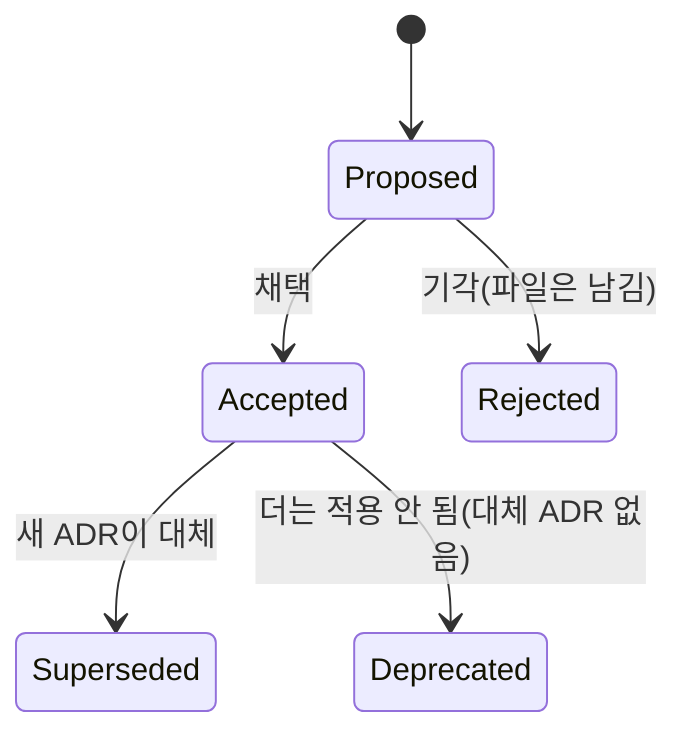

# ADR + 문서 정합성 규칙 (claude-usage-widget)

아키텍처 **결정(decision)** 은 ADR(Architecture Decision Record)로 남기고,
결정이 바뀌면 ADR과 **그 결정을 언급하는 모든 문서·코드 주석**을 같은 변경에서
함께 최신화해 전체가 어긋나지 않게 한다. 이 파일은 그 절차를 정의한다.

## 1. ADR을 언제 쓰나

미래의 독자가 **"왜 이렇게 돼 있지?"** 라고 물을 만한, 대안이 있었던 선택을 ADR로 남긴다.

- ✅ 남긴다: 레이어 경계·의존성 방향, 데이터 흐름(누가 쓰고 누가 읽나), 외부 경계 처리
  방식(Keychain/네트워크/서브프로세스), 빌드 토폴로지, 에러 처리 정책, 보안 불변식.
- ❌ 안 남긴다: 변수명·포맷팅 같은 사소한 코딩 취향, 되돌리기 쉬운 일시적 구현 디테일,
  외부에서 강제돼 선택의 여지가 없는 것(단, "왜 그 제약을 받아들였나"가 비자명하면 남긴다).

판단 기준: **"대안이 있었고, 하나를 골랐고, 그 이유가 비자명한가."** 셋 다 yes면 ADR.

## 2. 위치·이름·형식

- 위치: `docs/adr/`. 파일명 `NNNN-kebab-case-title.md` (4자리 0패딩, 순차 증가).
  번호는 재사용하지 않는다 — superseded 된 ADR도 파일은 남긴다(이력이 가치다).
- 템플릿: `docs/adr/0000-template.md`. 새 ADR은 이걸 복사해 시작한다.
- 색인: `docs/adr/README.md` 표에 한 줄 추가(번호·제목·상태·날짜).
- 형식: **MADR-lite** — 필수 섹션 `Status / Context / Decision / Consequences`,
  선택 `Alternatives considered`. 날짜는 절대일(`YYYY-MM-DD`).
- ADR은 전역 `documents-tldr` 규칙의 **예외**(자체 템플릿 우선) — TL;DR 안 붙인다.
  다이어그램이 필요하면 전역 `diagrams-mermaid` 규칙대로 ```mermaid``` 블록을 쓴다.

## 3. 상태(Status) lifecycle



- **결정을 바꿀 때 기존 ADR 본문을 덮어쓰지 않는다.** 새 ADR(`NNNN`)을 만들고,
  기존 ADR의 Status를 `Superseded by ADR-NNNN`으로 바꾸고 **양방향 링크**를 건다
  (새 ADR엔 `Supersedes ADR-MMMM`). 이력이 보존돼야 "왜 바꿨나"를 추적할 수 있다.
- 단순 오타·표현 수정은 in-place로 고쳐도 된다(결정 자체가 안 바뀌므로).

## 4. 문서 정합성 (이 규칙의 핵심)

결정이 바뀌면 ADR만 고치고 끝내지 않는다. **같은 작업 안에서** 그 결정을 언급하는
아래 산출물을 모두 훑어 최신화하고, 서로 모순이 없는지 확인한다.

| 산출물 | 무엇을 담나 | ADR이 바뀌면 |
|---|---|---|
| `docs/adr/*` | 결정 자체 + 이유 | supersede/갱신, 색인 갱신 |
| `CLAUDE.md` | "지켜야 할 아키텍처 규칙" | 규칙 문구·명령어 동기화 |
| `ARCHITECTURE.md` | 큰 그림·다이어그램·결정 교차링크 | 다이어그램·설명·ADR 링크 동기화 |
| `README.md` | 사용자 대상 개요 | 동작/스코프 변동 반영 |
| `docs/adr/0010-*` (배포) | 배포·서명·네이밍 계획 | App Group/번들ID/이름 변동 반영 |
| `CHANGELOG.md` | 변경 이력 | 결정 변경을 한 줄로 기록 |
| 코드 주석 (`Sources/`) | 불변식을 설명하는 주석 | 주석이 옛 결정을 설명하지 않게 |

**양방향 원칙:**
- ADR → 문서: 결정을 바꿨으면 위 표를 체크리스트로 훑는다.
- 코드/문서 → ADR: 아키텍처 동작(레이어 경계, 데이터 흐름, 외부 경계, 보안 불변식)을
  **바꾸기 전에** 이를 규율하는 ADR이 있는지 먼저 확인한다. 있으면 코드와 함께 ADR도
  갱신/supersede 한다. ADR 없이 그런 동작을 바꾸려 하면, 먼저 ADR을 만든다.

**교차 링크:** ADR이 규율하는 코드/문서 지점에는 `(ADR-0003 참고)`처럼 번호를 적어
둔다. `ARCHITECTURE.md`의 결정 지점들은 해당 ADR로 링크한다.

## 5. 정합성 점검을 언제 하나

- ADR을 새로 만들거나 supersede 할 때 → §4 표 전체를 훑는다.
- 아키텍처에 영향 있는 코드 변경(경계/흐름/보안/빌드) → 관련 ADR·문서 동기화 확인.
- 문서를 크게 손볼 때 → 그 내용이 살아있는 ADR과 모순되지 않는지 확인.
- 커밋/PR 직전 → 이번 변경이 결정을 바꿨다면 ADR·문서가 함께 갱신됐는지 마지막 확인.
