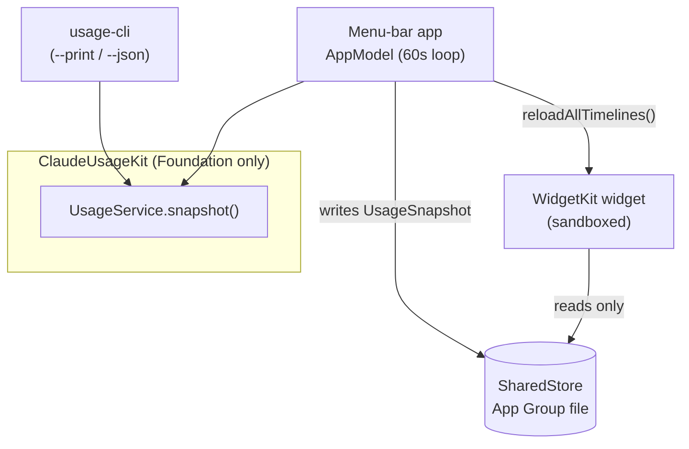
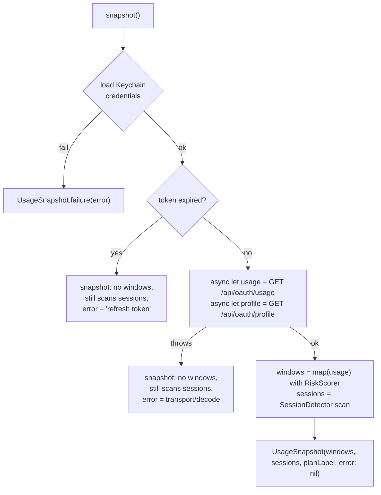
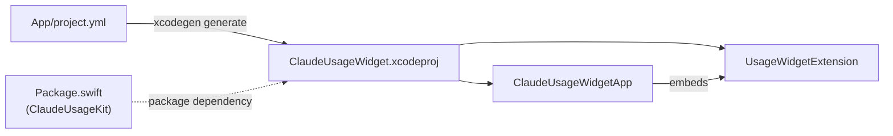

# Architecture

> **TL;DR:** All logic lives in one Foundation-only Swift package, `ClaudeUsageKit`, so it's
> fully unit-testable; the menu-bar app and the WidgetKit widget are thin UI shells over it.
> One orchestrator — `UsageService.snapshot()` — runs Keychain → OAuth API → session scan
> and returns a single `UsageSnapshot` that *never throws* (failures become
> `snapshot.error`). The **app** runs that live pipeline and writes the snapshot to a shared
> App Group file; the **widget** only ever reads it (it never touches Keychain or network).
> Every system/network boundary is behind an injectable protocol for testing.

## 1. Layers

> Decision: [ADR-0001 — Foundation-only core package](docs/adr/0001-foundation-only-core-package.md)

```
claude-usage-widget/
├── Package.swift                 # SPM: ClaudeUsageKit (lib) + usage-cli (exec) + tests
├── Sources/
│   ├── ClaudeUsageKit/           # PURE LOGIC — imports only Foundation
│   └── usage-cli/                # headless --print / --json pipeline runner
├── Tests/ClaudeUsageKitTests/    # 21 XCTest cases + Fixtures/
└── App/                          # XcodeGen-generated app + widget (UI only)
    ├── project.yml               # source of truth → ClaudeUsageWidget.xcodeproj
    ├── ClaudeUsageWidgetApp/      # SwiftUI MenuBarExtra app
    ├── UsageWidgetExtension/      # WidgetKit widget (systemSmall + systemMedium)
    └── Shared/                    # UI-only helpers used by both targets
```

The defining rule: **`ClaudeUsageKit` has no UI-framework dependency.** Three consumers
sit on top of it — `usage-cli`, the app, and the widget — and none of them re-implement
any logic. The widget gets its data indirectly (via a file the app writes), not by
running the pipeline itself.



## 2. The pipeline — `UsageService.snapshot()`

> Decision: [ADR-0004 — snapshot() never throws](docs/adr/0004-usageservice-never-throws.md)

The orchestrator is dependency-injected (`CredentialProviding`, `UsageFetching`,
`SessionDetector`, and a `now` clock) so it runs in tests/previews without real
credentials. It **never throws** — each failure becomes `UsageSnapshot.error`, and the
UI shows partial data where it can.



Usage and profile are fetched concurrently (`async let`). Sessions are scanned even when
the token is expired or the network fails, because they're derived locally and remain
useful.

## 3. Boundaries & injection seams

> Decisions: [ADR-0006 — inject system boundaries](docs/adr/0006-inject-system-boundaries-behind-protocols.md) · [ADR-0002 — Keychain via `security` CLI](docs/adr/0002-keychain-via-security-cli.md)

Everything that touches the OS or the network is behind a `Sendable` protocol so tests
substitute a fake:

| Concern | Protocol | Live impl | What it shells to / calls |
|---|---|---|---|
| Subprocess | `ProcessRunning` | `SystemProcessRunner` | `Process` |
| Keychain creds | `CredentialProviding` | `SecurityCLICredentialStore` | `security find-generic-password` (read-only) |
| HTTP | `HTTPTransport` | `URLSessionTransport` | `URLSession` |
| OAuth API | `UsageFetching` | `ClaudeUsageClient` | `GET /api/oauth/{usage,profile}` |
| Sessions | (concrete, injects `ProcessRunning`) | `SessionDetector` | `ps` + `lsof` |
| Terminal focus | (concrete, injects `ProcessRunning`) | `TerminalFocus` | `osascript` |

`ClaudeUsageKit` module map:

- **`Keychain/Credentials.swift`** — reads the `Claude Code-credentials` Keychain item
  (top-level `claudeAiOauth`); models `OAuthCredentials` with `isExpired(asOf:)`.
- **`API/UsageClient.swift`** — OAuth client; sends `Authorization: Bearer` +
  `anthropic-beta: oauth-2025-04-20`. Maps HTTP/transport/decode failures to `UsageAPIError`.
- **`Models/`** — `Usage` + `RateLimitWindow` + `UsageWindowKind` (the four display
  windows), `Profile` (plan label), and `ClaudeJSON` (fractional-second ISO-8601 decoder).
- **`Sessions/`** — `SessionDetector` (running `claude` procs → cwd → newest transcript)
  and `ContextFraction` (last assistant `usage` block → 0…1 window fill).
- **`Risk/RiskScore.swift`** — pacing-aware 0…1 score → 4-level `RiskLevel` + hex color.
- **`Focus/TerminalFocus.swift`** — TTY → Terminal.app/iTerm2 tab via AppleScript; always
  best-effort, every failure swallowed.
- **`SharedStore.swift`** — App↔widget snapshot bridge (App Group container, Application
  Support fallback).
- **`UsageSnapshot.swift`** — the Codable DTO the UI renders; `headlineWindow` (max
  utilization) drives the menu-bar/widget headline.
- **`UsageService.swift`** — the orchestrator above.
- **`Support/`** — `ProcessRunner`, `Formatting` (bars, percents, countdowns).

## 4. App ↔ widget data flow

> Decision: [ADR-0003 — app writes, widget reads](docs/adr/0003-app-writes-widget-reads-snapshot.md)

The widget extension is **sandboxed** and cannot read the Keychain or reach the network.
The contract that makes the widget work:

1. `AppModel` runs a 60s loop calling `UsageService.snapshot()`.
2. It publishes the snapshot to the SwiftUI menu UI **and** `SharedStore.write(_:)`s it
   as JSON into the App Group container.
3. It calls `WidgetCenter.shared.reloadAllTimelines()`.
4. The widget's timeline provider calls `SharedStore.read()` — pure file read, offline-safe.

So the **App Group ID must match exactly** across `App/project.yml` (both targets) and
`SharedStore.appGroupID`. If it drifts, `SharedStore` falls back to Application Support and
the widget reads a different (stale/empty) file. The app is intentionally **not
sandboxed** (it shells out to `security`/`ps`/`lsof`/`osascript`); only the widget is.

## 5. Build topology

> Decision: [ADR-0005 — XcodeGen as project source of truth](docs/adr/0005-xcodegen-as-project-source-of-truth.md)

- **`ClaudeUsageKit` + `usage-cli` + tests** are plain SPM (`Package.swift`), buildable
  with Command Line Tools — except `swift test`, which needs the Xcode toolchain for XCTest.
- **The app + widget** are not in SPM. `App/project.yml` is the XcodeGen source of truth;
  `xcodegen generate` produces `App/ClaudeUsageWidget.xcodeproj`, which references the
  root SPM package for `ClaudeUsageKit`. The widget extension is embedded in the app.



See [ADR-0010 — sign + notarize + Homebrew Cask distribution](docs/adr/0010-sign-notarize-homebrew-cask-distribution.md)
for the release plan (and the pending `ClaudeUsageWidget` → `TokenMukbang` rename). The
product concept is [ADR-0009](docs/adr/0009-mukbang-product-concept.md).
