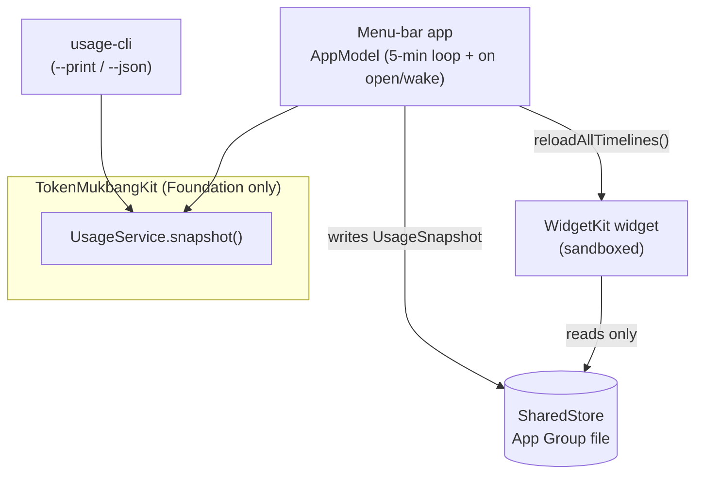
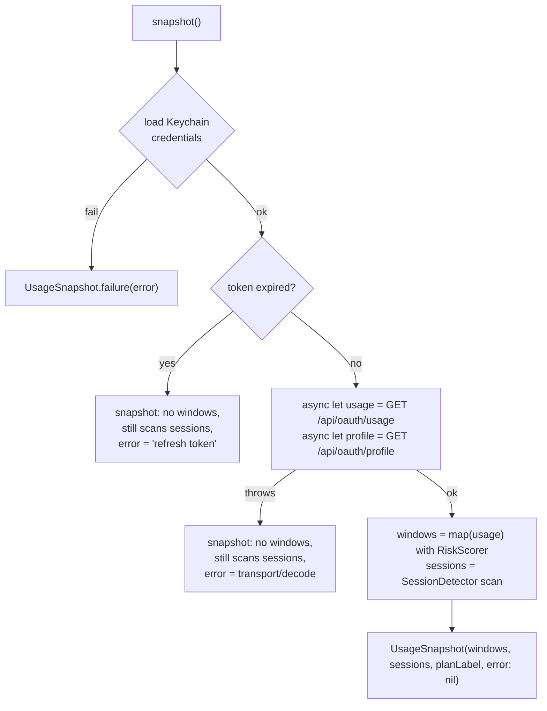
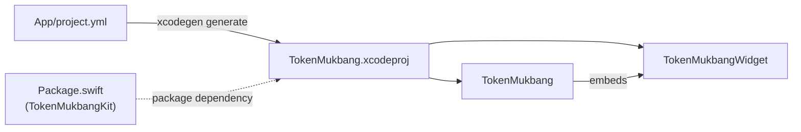

# Architecture

> **TL;DR:** All logic lives in one Foundation-only Swift package, `TokenMukbangKit`, so it's
> fully unit-testable; the menu-bar app and the WidgetKit widget are thin UI shells over it.
> One orchestrator — `UsageService.snapshot()` — runs Keychain → OAuth API → session scan
> and returns a single `UsageSnapshot` that *never throws* (failures become
> `snapshot.error`). The **app** runs that live pipeline and writes the snapshot to a shared
> App Group file; the **widget** only ever reads it (it never touches Keychain or network).
> Every system/network boundary is behind an injectable protocol for testing.

## 1. Layers

> Decision: [ADR-0001 — Foundation-only core package](docs/adr/0001-foundation-only-core-package.md)

```
claude-usage-widget/
├── Package.swift                 # SPM: TokenMukbangKit (lib) + usage-cli (exec) + tests
├── Sources/
│   ├── TokenMukbangKit/           # PURE LOGIC — imports only Foundation
│   └── usage-cli/                # headless --print / --json pipeline runner
├── Tests/TokenMukbangKitTests/    # 21 XCTest cases + Fixtures/
└── App/                          # XcodeGen-generated app + widget (UI only)
    ├── project.yml               # source of truth → TokenMukbang.xcodeproj
    ├── TokenMukbang/      # menu-bar app: NSStatusItem + normal glass NSWindow (ADR-0019)
    ├── TokenMukbangWidget/      # WidgetKit widget (systemSmall + systemMedium)
    └── Shared/                    # UI-only helpers used by both targets
```

The defining rule: **`TokenMukbangKit` has no UI-framework dependency.** Three consumers
sit on top of it — `usage-cli`, the app, and the widget — and none of them re-implement
any logic. The widget gets its data indirectly (via a file the app writes), not by
running the pipeline itself.



## 2. The pipeline — `UsageService.snapshot()`

> Decision: [ADR-0004 — snapshot() never throws](docs/adr/0004-usageservice-never-throws.md)

The orchestrator is dependency-injected (`CredentialProviding`, `UsageFetching`,
`SessionDetector`, and a `now` clock) so it runs in tests/previews without real
credentials. It **never throws** — each failure becomes `UsageSnapshot.error`, and the
UI shows partial data where it can.



Usage and profile are fetched concurrently (`async let`). Sessions are scanned even when
the token is expired or the network fails, because they're derived locally and remain
useful.

## 3. Boundaries & injection seams

> Decisions: [ADR-0006 — inject system boundaries](docs/adr/0006-inject-system-boundaries-behind-protocols.md) · [ADR-0002 — Keychain via `security` CLI](docs/adr/0002-keychain-via-security-cli.md)

Everything that touches the OS or the network is behind a `Sendable` protocol so tests
substitute a fake:

| Concern | Protocol | Live impl | What it shells to / calls |
|---|---|---|---|
| Subprocess | `ProcessRunning` | `SystemProcessRunner` | `Process` |
| Keychain creds | `CredentialProviding` | `SecurityCLICredentialStore` | `security find-generic-password` (read-only) |
| HTTP | `HTTPTransport` | `URLSessionTransport` | `URLSession` |
| OAuth API | `UsageFetching` | `ClaudeAPIClient` | `GET /api/oauth/{usage,profile}` |
| Sessions | (concrete, injects `ProcessRunning`) | `SessionDetector` | `ps` + `lsof` |
| Terminal focus | (concrete, injects `ProcessRunning`) | `TerminalFocus` | `osascript` |
| Retrospective summary | `RetrospectiveSummarizing` | `ClaudeCLISummarizer` | local `claude` CLI (`claude -p`) — ADR-0020 |

`TokenMukbangKit` module map:

- **`Keychain/Credentials.swift`** — reads the `Claude Code-credentials` Keychain item
  (top-level `claudeAiOauth`); models `OAuthCredentials` with `isExpired(asOf:)`.
- **`API/UsageClient.swift`** — OAuth client; sends `Authorization: Bearer` +
  `anthropic-beta: oauth-2025-04-20`. Maps HTTP/transport/decode failures to `UsageAPIError`.
- **`Models/`** — `Usage` + `RateLimitWindow` + `UsageWindowKind` (the four display
  windows), `Profile` (plan label), and `ClaudeJSON` (fractional-second ISO-8601 decoder).
- **`Sessions/`** — `SessionDetector` (running `claude` procs → cwd → newest transcript)
  and `ContextFraction` (last assistant `usage` block → 0…1 window fill).
- **`Risk/RiskScore.swift`** — pacing-aware 0…1 score → 4-level `RiskLevel`. Kit emits the
  level only; color is resolved app-side, scheme-branched, by `RiskTone` (ADR-0015).
- **`Focus/TerminalFocus.swift`** — TTY → terminal tab, best-effort across Terminal.app/iTerm2
  (AppleScript) + WezTerm (`wezterm cli` pane match) + kitty + tmux; `SupportedTerminal` enum;
  every failure swallowed.

> The app layer (`App/TokenMukbang/Overlay/`) adds a floating `NSPanel` **Agent Watchers**
> overlay (`OverlayController`, Frost/Neon styles, 2-second session scan, dock-like hover) that
> calls `TerminalFocus.focus(_:)` to jump to a session's terminal.
- **`SharedStore.swift`** — App↔widget snapshot bridge (App Group container, Application
  Support fallback).
- **`UsageSnapshot.swift`** — the Codable DTO the UI renders; `headlineWindow` (max
  utilization) drives the menu-bar/widget headline.
- **`UsageService.swift`** — the orchestrator above.
- **`Mukbang/`** — `MukbangZone`/`MukbangFace` (pacing zones, faces, chew frames),
  `MukbangCopy` (완식 POV copy + event lines), `ModelCast` (대식가/평균인/소식좌/미식가 =
  Opus/Sonnet/Haiku/Fable; unmapped → 기타). See ADR-0009.
- **`Risk/`** — `RiskScorer` (absolute + pacing → color), `PaceForecast` ("N시간 뒤 완식"),
  `PacingCalculator` (equilibrium line = elapsed%, delta = actual − equilibrium, isAheadOfPace),
  `Temperament` (Confident/Balanced/Suspicious — projection weight + early-window damping).
- **`History/`** — `HistoryStore` (`HistorySample` append/prune/load, 7-day rolling JSON,
  injectable dir; ADR-0011) + `HistoryAnalytics` (`Sparkline.series` bucketing, `HistoryFilter`
  by ModelCast + timeframe; `Timeframe` 24h/7d/30d/90d + `HistoryFilter.tokenEvents`)
  + `JSONLParser`/`TokenHistory` (절대 토큰 소비량을
  `~/.claude/projects/*.jsonl`에서 파싱·집계 — by day/model/project/**cast**, `byDayCast`(일별 모델
  세그먼트), `summary`(신선/재가열·캐시적중·전기간 대비 Δ), heaviest day, top project; ADR-0012)
  + `EventCache` (파일별 `(size, mtime)` 키 파싱 캐시 — 안 바뀐 transcript는 재파싱 안 함; >1GB
  통째 재파싱 회피, App Support의 파생·삭제가능 `event-cache.json`).
  History는 **CLI 토큰**만 다룬다 — API 사용률%는 계정 전체(웹 포함) 메트릭이라 섞지 않는다.
- **`Retrospective/`** — "yesterday's you" reflection (ADR-0020): `RetrospectiveBuilder` (layer A
  metadata, reuses `TokenHistory`/`HistoryStore`); `RetrospectiveMetrics` (per-project usage-pattern
  signals: per-project **drain = output+fresh-input+cache-write**·prompts·tokens/prompt·model — the coach
  input; cache-*read* is near-free and excluded from drain, ADR-0020); `RetrospectiveSummarizing`
  seam + `ClaudeCLISummarizer` + `TranscriptDigest` (layer B **coaching** via the local `claude` CLI,
  on-demand); `RetrospectiveStore` (app-only cache, **never** `SharedStore`); `RetrospectiveSummary`/`RetroTopics` DTOs.
- **`Value/`** — "what would this cost at API rates?" (ADR-0021): `ModelPricing` (raw model id → API
  list price + cache multipliers — write 1.25×, read 0.1×) + `ValueEstimate` (period `TokenEvent`
  aggregation → `apiEquivalent` incl. cache-read + `costExclCacheRead` "fresh work" + per-model split).
  Drives the Now-tab Value/Savings card vs `AppSettings.subscriptionMonthlyCost`. Local-only, app-only.
- **`Settings/`** — `AppSettings` (Codable: `Theme` 4 presets + custom `ThemePalette`,
  `RiskThresholds`, `NotificationSettings`, `subscriptionMonthlyCost`/`billingCycleDay` for the Value
  card) + `SettingsStore` (JSON persistence, injectable dir).
- **`Notifications/`** — `NotificationDecider` (edge-triggered: compares previous vs current
  snapshot → escalation/recovery/pacing/reset/expiry alerts, gated by per-surface + per-event
  settings; pure & tested). The app delivers them via `UNUserNotificationCenter`.
- **`Update/`** — `UpdateChecker` (parse GitHub `/releases/latest` tag + semver compare;
  delivery is ADR-0010). The `Casks/token-mukbang.rb` Homebrew cask ships the release.
- **`Support/`** — `ProcessRunner`, `Formatting` (bars/percents/countdowns), `FileWatcher`
  (`FileWatching` seam + `DispatchSource` reactive refresh when the credential file changes; ADR-0014).

> Decision: [ADR-0011 — local history persistence](docs/adr/0011-local-history-persistence.md)
> The app calls `history.record(snap)` each poll, then attaches the headline window's
> 7-day sparkline to `UsageSnapshot.headlineSparkline` before caching so the widget can
> draw it without history access.

> Decision: [ADR-0020 — retrospective via local `claude` CLI](docs/adr/0020-retrospective-via-local-claude-cli.md) · Direction: [`docs/VISION.md`](docs/VISION.md)
> **"usage meter → reflection mirror".** The retrospective (`Retrospective/`:
> `RetrospectiveBuilder` + `RetrospectiveSummarizing` seam / `ClaudeCLISummarizer` + `TranscriptDigest`
> + app-only `RetrospectiveStore`) reflects "yesterday's you" in two layers: **(A) metadata** reusing
> `TokenHistory`/`HistoryStore` (ADR-0011/0012, no duplication), and **(B) usage-pattern coaching**
> ("how to use tokens better" — from `RetrospectiveMetrics`, not a raw prompt dump) by shelling
> the local `claude` CLI (behind `ProcessRunning`). B is the one place app-initiated network carries
> user *content* — justified by unchanged recipient, and bounded by: no OAuth-token reuse (ADR-0002),
> on-demand only (먹방 paradox — `AppModel.generateRetrospectiveTopics()`, never the poll), and app-only
> storage — content-derived summaries never reach the widget-readable `SharedStore` (extends ADR-0003).
> UI is the **Retro** rail item in the single glass window (ADR-0019). Plan: [`docs/RETROSPECTIVE_PLAN.md`](docs/RETROSPECTIVE_PLAN.md).

## 4. App ↔ widget data flow

> Decision: [ADR-0003 — app writes, widget reads](docs/adr/0003-app-writes-widget-reads-snapshot.md)

The widget extension is **sandboxed** and cannot read the Keychain or reach the network.
The contract that makes the widget work:

1. `AppModel` runs a 5-min loop calling `UsageService.snapshot()` (also on window-open, on
   system wake, and on credential change; an App-Nap-opt-out activity keeps the loop alive).
2. It publishes the snapshot to the SwiftUI menu UI **and** `SharedStore.write(_:)`s it
   as JSON into the App Group container.
3. It calls `WidgetCenter.shared.reloadAllTimelines()`.
4. The widget's timeline provider calls `SharedStore.read()` — pure file read, offline-safe.

So the **App Group ID must match exactly** across `App/project.yml` (both targets) and
`SharedStore.appGroupID`. If it drifts, `SharedStore` falls back to Application Support and
the widget reads a different (stale/empty) file. The app is intentionally **not
sandboxed** (it shells out to `security`/`ps`/`lsof`/`osascript`); only the widget is.

## 5. Build topology

> Decision: [ADR-0005 — XcodeGen as project source of truth](docs/adr/0005-xcodegen-as-project-source-of-truth.md)

- **`TokenMukbangKit` + `usage-cli` + tests** are plain SPM (`Package.swift`), buildable
  with Command Line Tools — except `swift test`, which needs the Xcode toolchain for XCTest.
- **The app + widget** are not in SPM. `App/project.yml` is the XcodeGen source of truth;
  `xcodegen generate` produces `App/TokenMukbang.xcodeproj`, which references the
  root SPM package for `TokenMukbangKit`. The widget extension is embedded in the app.



See [ADR-0010 — sign + notarize + Homebrew Cask distribution](docs/adr/0010-sign-notarize-homebrew-cask-distribution.md)
for the release plan (and the pending `TokenMukbang` → `TokenMukbang` rename). The
product concept is [ADR-0009](docs/adr/0009-mukbang-product-concept.md).
