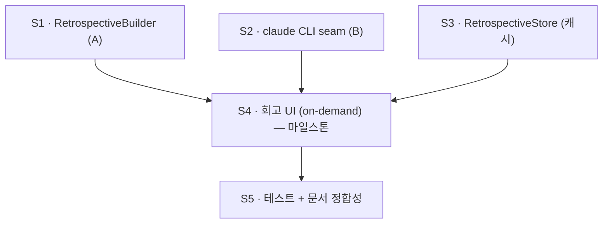

# Retrospective — Implementation Plan

> **TL;DR:** 회고(Retrospective) 기능을 5개 슬라이스로 구현한다. 마일스톤은 **S4(end-to-end
> on-demand 회고)**. A층(메타데이터)은 기존 `TokenHistory`/`HistoryStore`(ADR-0011/0012)를
> 재사용하고, B층(콘텐츠 의미)은 `ProcessRunning` seam 뒤의 로컬 `claude` CLI로 만든다
> ([ADR-0020](adr/0020-retrospective-via-local-claude-cli.md)). 첫 작업은 S1 — Kit
> `RetrospectiveBuilder` + `RetrospectiveSummary`(A층, 순수 로직·테스트). **이 계획은 설계
> 문서이며, 코드 구현은 별도 사이클이다.**

## 0. 범위·전제

- 결정 근거: [ADR-0020](adr/0020-retrospective-via-local-claude-cli.md) · 방향: [VISION](VISION.md).
- 불변식(모든 슬라이스가 준수): 토큰 재활용 금지(ADR-0002) · 콘텐츠 요약 앱전용 저장,
  위젯 노출 금지(ADR-0003) · 서브프로세스는 seam 뒤(ADR-0006) · 로직은 Foundation-only Kit
  (ADR-0001) · on-demand 전용(먹방 역설) · A/B 인프라 중복 금지(ADR-0011/0012).
- **DESIGN ONLY (이 문서)**: 슬라이스·인터페이스·성공기준을 정의한다. 코드는 안 쓴다.

## 1. 슬라이스

### S1 — Kit `RetrospectiveBuilder` (A층, 메타데이터 거울)
- **무엇**: 기간(기본 "어제")의 트랜스크립트를 프로젝트 디렉터리 전체에서 훑어 메타데이터
  회고를 만든다. `JSONLParser`/`TokenHistory`(ADR-0012)를 **재사용**해 집계하고,
  `HistoryStore`(ADR-0011)로 "평소의 나" 기준선을 얻는다.
- **산출**: `RetrospectiveSummary`(Codable) — 프로젝트별 토큰, 시간대 분포, tool 믹스(있으면),
  세션당 평균 턴, 평균 context 채움, **기준선 대비 델타**(예: "세션당 18턴 ↑ 평소 11").
- **위치**: `Sources/TokenMukbangKit/Retrospective/{RetrospectiveBuilder,RetrospectiveSummary}.swift`.
- **테스트**: fixture 트랜스크립트로 결정론적 단위 테스트(집계·기준선 델타).
- **성공기준**: fixture 입력 → 기대 `RetrospectiveSummary`(A 필드) 일치; 새 파싱 코드 0줄
  (전부 기존 History API 경유); `swift test` green.

### S2 — `RetrospectiveSummarizing` seam + `ClaudeCLISummarizer` (B층, 콘텐츠 의미)
- **무엇**: 기간의 트랜스크립트 콘텐츠로 프롬프트를 구성해 로컬 `claude` CLI를
  **`ProcessRunning` 경유**(ADR-0006)로 호출, 주제/스타일 요약을 방어적으로 파싱.
- **인터페이스**: `protocol RetrospectiveSummarizing { func summarize(_ period:) async -> RetroTopics? }`
  + 라이브 `ClaudeCLISummarizer`(injects `ProcessRunning`). `claude` 부재/실패 시 `nil` →
  graceful degrade. (옵션) `KeywordSummarizer` B1 폴백.
- **불변식**: OAuth 토큰 미사용(CLI 자기 인증) · `Process` 직접 호출 금지 · 결과는 절대
  `SharedStore`로 안 감.
- **위치**: `Sources/TokenMukbangKit/Retrospective/{RetrospectiveSummarizing,ClaudeCLISummarizer}.swift`.
- **테스트**: 가짜 `ProcessRunning`으로 (1) 정상 출력 파싱, (2) CLI 부재 → nil, (3) malformed
  출력 → nil. 토큰이 인자/프롬프트에 안 들어감을 단언.
- **성공기준**: 위 3 케이스 통과; 실제 네트워크·CLI 없이 테스트; `swift test` green.

### S3 — 앱 전용 `RetrospectiveStore` (캐시)
- **무엇**: 완성된 `RetrospectiveSummary`를 Application Support(`HistoryStore` 패턴, ADR-0011·
  주입 가능 디렉터리)에 **일자 키로 캐시**. 같은 날 재요청은 캐시 반환(먹방 역설 완화).
- **불변식**: `SharedStore`(App Group) **아님** — 위젯이 콘텐츠를 못 보게 앱 전용(ADR-0003 확장).
- **위치**: `Sources/TokenMukbangKit/Retrospective/RetrospectiveStore.swift`.
- **테스트**: save→load 왕복, 일자 키 캐시 적중/미스, 주입 디렉터리.
- **성공기준**: 왕복·캐시 동작 테스트 통과; SharedStore 경로 미사용 확인; `swift test` green.

### S4 — 회고 UI (on-demand) · **마일스톤**
- **무엇**: 단일 유리 창(ADR-0019, Now/History/Settings 옆)에 회고 뷰. **A는 즉시 표시**(캐시/
  로컬), **B는 "회고 생성" 버튼**으로 on-demand. 생성 시 토큰 소비를 명시("회고 생성은 토큰을
  씁니다"). 먹방 보이스("식습관 회고 / 주간 식단 결산", ADR-0009 POV).
- **위치**: `App/TokenMukbang/Views/` + `AppModel` on-demand 액션. **위젯 무변경**.
- **성공기준**: 버튼 누르기 전 A만, 누르면 B 채워짐(가짜 summarizer로 렌더 검증); 자동 폴링이
  B를 호출하지 않음을 코드로 확인; `xcodebuild` green.

### S5 — 테스트 + 문서 정합성
- Kit 테스트 합산 green, 앱/위젯 빌드 green.
- 문서 동기화 확인: ADR-0020·색인·CLAUDE.md·ARCHITECTURE.md·README §Privacy·CHANGELOG가
  구현과 일치(`.claude/rules/adr.md §4`).

## 2. 의존 관계

S1·S2·S3는 서로 독립이라 병렬 가능. S4가 셋을 합친다.

## 3. 마일스톤·성공 정의

- **M1 달성 = S4 통과**: 사용자가 회고 창을 열면 A가 즉시 보이고, "회고 생성"을 누르면 로컬
  `claude` CLI로 B(주제/스타일)가 채워져 앱 전용으로 캐시되며, 위젯엔 콘텐츠가 전혀 노출되지
  않고, 자동 폴링은 토큰을 소비하지 않는다. Kit/앱 테스트·빌드 green + 문서 정합.
