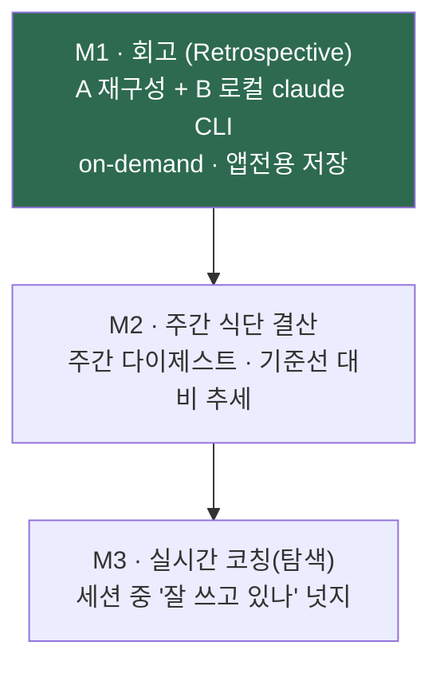

# TokenMukbang — Product Vision

> **TL;DR:** TokenMukbang을 "토큰 사용량 미터"에서 **"사용 습관의 거울(reflection
> mirror)"** 로 확장한다. 출발점은 POSIWID — *the purpose of a system is what it does*.
> 이 앱이 실제로 *하게 만드는 일*은 "내가 토큰을 잘 쓰고 있나?"라는 성찰이고, 그게 진짜
> 목적이다. 첫 마일스톤은 **회고(Retrospective)**: 어제까지의 나를 (A) 메타데이터 거울 +
> (B) 콘텐츠 회고로 비춘다. B는 로컬 `claude` CLI로 분석한다([ADR-0020](adr/0020-retrospective-via-local-claude-cli.md)).

## 1. 왜 — POSIWID 렌즈

> **시스템의 목적은 그것이 *의도한다고 말하는 것*이 아니라, 실제로 *반복해서 만들어내는
> 결과*다.** (Stafford Beer)

TokenMukbang이 *선언하는* 목적은 "Claude Code 사용량을 보여준다"이다. 그러나 이 앱을
재귀적으로 POSIWID에 비추면, 실제로 *하게 만드는 일*은 **"내가 토큰을 게걸스럽게 먹고 있나,
잘 쓰고 있나"를 사용자가 끊임없이 의식하게 만드는 것**이다. 이름이 '먹방'인 것도, 게이지를
"비워지는 상"으로 읽는 것도(ADR-0009) 전부 그 방향을 가리킨다.

그렇다면 다음 단계는 분명하다 — **미터(meter)에서 거울(mirror)로.** 숫자를 보여주는 걸
넘어, 사용자가 *자기 사용 습관*을 돌아보게 한다.

## 2. 무엇 — 세 층위의 거울

| 층 | 무엇을 비추나 | 데이터 | 상태 |
|---|---|---|---|
| **A. 메타데이터 거울** | 무엇에/언제/얼마나 — 프로젝트별 토큰, 시간대, 세션당 턴, 기준선 대비 | `TokenHistory`/`HistoryStore` (ADR-0011/0012) | **구현됨** |
| **B. 사용 패턴 코치** | 토큰을 *얼마나 효율적으로* 쓰는지 분석 → **더 잘 쓰는 법 가이드**(모델 선택·컨텍스트 위생·자동화 균형·페이싱) | 패턴 지표(`RetrospectiveMetrics`)를 로컬 `claude` CLI로 분석 (ADR-0020) | **구현됨** |
| **C. (미래) 실시간 코칭** | 지금 이 세션을 잘 쓰고 있나 (실시간) | A/B 누적 + 라이브 pacing | 로드맵 |

A는 "활동 로그"(무엇을 했나), **B는 코칭("어떻게 하면 더 잘 쓸까")** 이다 — 단순 주제 나열이
아니라 사용 *패턴을 진단하고 개선 액션을 제안*한다. 그래서 B에는 raw 프롬프트가 아니라
**패턴 지표**(프로젝트별 토큰·프롬프트수·프롬프트당 토큰·turn당 cache-read·모델·시간)를 준다
— turn 수 많은 자동 세션(ralph 등)에 편향되지 않고, 오히려 "토큰은 큰데 프롬프트는 적은"
자동/롱컨텍스트 패턴을 *짚어내기* 위함이다. **"토큰 양"은 "잘 씀"의 나쁜 대리지표**임을 항상
경계한다 — 거울의 목적은 *절약 강요*가 아니라 *자각과 개선*이다.

## 3. 먹방 컨셉과의 정합 (ADR-0009)

거울은 먹방 컨셉의 *확장*이지 이탈이 아니다. ADR-0009의 통계 네이밍 표엔 이미
**"주간 식단 결산"**(주간 리포트)이 예고돼 있다 — 회고는 그 약속의 실현이다.

- 미터 = "Claude가 먹는 걸 실시간 관전" → 거울 = **"오늘의 식단을 돌아보는 식습관 회고"**
- 카피는 POV 유지: ❌ "어제 토큰 1.2M 사용" → ⭕ **"어제 1.2M 완식 · 주간 식단 결산"**
- 정확함 > 귀여움 원칙도 유지: 회고 *데이터*는 담백하게, 먹방 보이스는 제목·빈 상태 같은
  가장자리에서만.

## 4. 로드맵

- **M1 — 회고 (이번 사이클의 설계 대상).** 구현 계획: [RETROSPECTIVE_PLAN](RETROSPECTIVE_PLAN.md).
  경계 결정: [ADR-0020](adr/0020-retrospective-via-local-claude-cli.md).
- **M2 — 주간 식단 결산.** 회고를 주간으로 묶고 기준선("평소의 나") 대비를 강조.
- **M3 — 실시간 코칭(탐색적).** "지금 이 세션"을 찔러주는 넛지. 콘텐츠를 더 자주 읽어야 하므로
  프라이버시·비용(먹방 역설) 재검토가 선행. 확정 아님.

## 5. 프라이버시 자세 (확장의 전제)

거울로 가더라도 다음은 불변이다:

- **토큰 미사용·미출력** — OAuth 토큰은 usage API 읽기 전용, 추론에 전용 안 함 (ADR-0002).
  회고의 B도 토큰이 아니라 `claude` CLI 자기 인증을 쓴다.
- **위젯은 콘텐츠를 못 본다** — 콘텐츠 파생 요약은 앱 전용 저장, `SharedStore` 금지 (ADR-0003 확장).
- **콘텐츠 egress는 정직·명시** — B는 콘텐츠를 클라우드로 보낸다. 정당화는 *수신자 불변*
  (그 대화들은 이미 Anthropic을 거쳤다)이며, 한계(교차 세션·민감 코드)는 고지하고 기능은
  명시적이다. 자세한 결정·대안은 [ADR-0020](adr/0020-retrospective-via-local-claude-cli.md).
