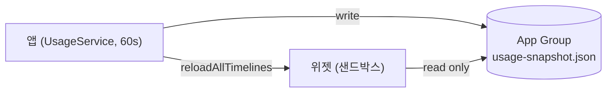

# ADR-0003: 앱이 스냅샷을 쓰고, 위젯은 App Group 파일을 읽기만 한다

- **Status:** Accepted
- **Date:** 2026-06-11

## Context

WidgetKit 위젯 extension은 **샌드박스**에서 돌고, Keychain 접근과 네트워크가 사실상
막혀 있다(ADR-0002의 `security` 서브프로세스도 불가). 그런데 위젯도 메뉴바 앱과 같은
usage/세션 데이터를 보여줘야 한다. 두 프로세스가 같은 데이터를 어떻게 공유할지 정해야 한다.

## Decision

**앱만** 라이브 파이프라인(Keychain→API→세션, `UsageService`)을 실행한다. 앱은 60초마다
결과 `UsageSnapshot`을 App Group 컨테이너(`group.com.claudeusagewidget`)의 JSON 파일로
쓰고(`SharedStore.write`) `WidgetCenter.reloadAllTimelines()`를 호출한다. **위젯은
`SharedStore.read()`로 그 파일을 읽기만** 한다 — Keychain·네트워크를 절대 건드리지 않는다.
`SharedStore`는 App Group 컨테이너를 우선 쓰고, 실패 시(미서명/dev) Application Support로
폴백한다. 앱은 서브프로세스 실행 때문에 **비샌드박스**, 위젯은 **샌드박스**다.

## Consequences

- ➕ 위젯이 오프라인·무자격으로도 마지막 스냅샷을 안전하게 렌더.
- ➕ 권한이 필요한 일(Keychain/네트워크/서브프로세스)이 앱 한 곳에 모인다.
- ➖ 위젯 데이터는 최대 약 60초(+timeline 갱신) 지연될 수 있다.
- ⚠️ **불변식: App Group ID가 세 곳에서 정확히 일치해야 한다** — `App/project.yml`(두
  타겟 entitlements)와 `SharedStore.appGroupID`. 어긋나면 폴백 경로로 갈려 위젯이 다른
  (오래된/빈) 파일을 읽는다. 배포 시 ID 변경은 ADR-0010 §0 참고.

## Alternatives considered

- **위젯이 자체 파이프라인 실행** — 샌드박스에서 Keychain·네트워크 불가. 기각.
- **앱↔위젯 IPC/XPC** — 위젯 timeline 모델에 과하고 복잡. 파일 스냅샷이 단순·견고. 기각.

## Affects

- `Sources/ClaudeUsageKit/SharedStore.swift`, `App/ClaudeUsageWidgetApp/AppModel.swift`,
  `App/UsageWidgetExtension/`, `App/project.yml`(entitlements)
- `CLAUDE.md`(App Group 일치 규칙), `ARCHITECTURE.md` §4, ADR-0010 §0
