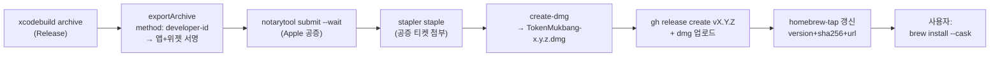
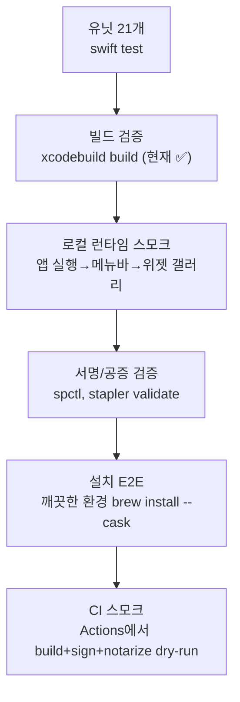

# ADR-0010: 서명+공증된 .dmg를 Homebrew Cask로 배포한다

- **Status:** Accepted
- **Date:** 2026-06-11

> 이 ADR은 구 `DISTRIBUTION.md`를 유실 없이 흡수한 것이다 — 결정 근거 + 실행 가능한 런북을 함께 담는다.

## Context

서명+공증된 메뉴바 앱+위젯을 사람들이 경고 없이 한 줄로 설치하게 하고 싶다. brew 자체는 쉽지만,
진짜 난관은 **코드사인(Developer ID) + 공증(notarization)** — 이게 돼야 Gatekeeper 경고 0,
위젯 extension 정상 로드가 된다. 배포 범위는 **GUI 앱 위주(Homebrew Cask)**, Apple Developer
계정은 보유/지불 의향 있음(서명+공증 경로).

## Decision

`.dmg`로 패키징해 GitHub Releases에 올리고, 개인 탭(`94wogus/homebrew-tap`)의 **Homebrew Cask**로
`brew install --cask 94wogus/tap/token-mukbang` 한 줄 설치를 제공한다. 먼저 **수동으로 1회 릴리즈**해
전 과정을 검증한 뒤 **GitHub Actions로 자동화**한다.

### 0. 이름 정렬

레포는 `TokenMukbang`인데 내부 product/번들은 `ClaudeUsageWidget`이다. 공개 배포 전에 정리한다.

| 레이어 | 현재 | 배포 시 권장 |
|--------|------|--------------|
| 앱 표시 이름 (메뉴바/Finder) | Claude Usage Widget | **Token Mukbang** 🍚 |
| `.app` 번들 / xcodebuild scheme | ClaudeUsageWidget | 유지 가능 (내부 이름) 또는 TokenMukbang |
| Cask 토큰 | — | `token-mukbang` |
| Bundle ID | com.claudeusagewidget.app | `com.94wogus.tokenmukbang` (팀 도메인 기반 권장) |
| App Group | group.com.claudeusagewidget | `group.<TEAMID>.tokenmukbang` (Developer ID는 팀ID 프리픽스) |

> Bundle ID / App Group을 바꾸면 `App/project.yml`·entitlements·`SharedStore.appGroupID`를 함께
> 수정해야 한다. 양쪽 App Group ID가 일치해야 위젯이 스냅샷을 읽는다(ADR-0003 불변식, ADR-0005).

### 1. 큰 그림 (릴리즈 파이프라인)



핵심: **서명은 안쪽부터 바깥쪽으로**(위젯 `.appex` → 앱 `.app`). `xcodebuild archive` + `exportArchive`에
맡기면 중첩 서명 순서·hardened runtime·entitlements를 Xcode가 알아서 처리하므로 수동 `codesign`보다 안전.

### Phase 0 — 사전 준비 (1회성, 사람 손 필요)
- [ ] **Apple Developer Program 가입** ($99/년) — 이미 있으면 스킵.
- [ ] **Developer ID Application 인증서** 발급 (Xcode → Settings → Accounts → Manage Certificates, 또는 개발자 포털). 로컬 키체인에 설치.
- [ ] **App ID + App Group 등록** (개발자 포털 → Identifiers): App ID `com.94wogus.tokenmukbang`, 위젯 App ID `...tokenmukbang.widget`, App Group `group.<TEAMID>.tokenmukbang`.
- [ ] **App Store Connect API Key** (.p8) 또는 **App-Specific Password** 발급 — notarytool 인증용. (CI 자동화엔 API Key 권장.)
- [ ] `TEAMID` 확인: `security find-identity -v -p codesigning` 또는 개발자 포털 Membership.

### Phase 1 — Release 빌드용 프로젝트 설정 변경
현재는 `CODE_SIGNING_ALLOWED=NO`로 빌드만 검증 중. 배포용으로 추가 필요:
- [ ] `App/project.yml`에 **Release 설정** + `DEVELOPMENT_TEAM=<TEAMID>`, `CODE_SIGN_IDENTITY="Developer ID Application"`, `CODE_SIGN_STYLE=Manual`, `ENABLE_HARDENED_RUNTIME=YES`(이미 설정됨).
- [ ] Bundle ID / App Group / 앱 표시 이름 정렬(섹션 0).
- [ ] `ExportOptions.plist` 작성 (`method: developer-id`, `teamID`, signing 설정).

### Phase 2 — 아카이브 + 서명 export
```bash
export DEVELOPER_DIR=/Applications/Xcode.app/Contents/Developer
cd App && xcodegen generate && cd ..
xcodebuild archive \
  -project App/ClaudeUsageWidget.xcodeproj \
  -scheme ClaudeUsageWidgetApp \
  -destination 'generic/platform=macOS' \
  -archivePath build/TokenMukbang.xcarchive
xcodebuild -exportArchive \
  -archivePath build/TokenMukbang.xcarchive \
  -exportOptionsPlist ExportOptions.plist \
  -exportPath build/export
# → build/export/TokenMukbang.app (위젯 extension 임베드 + 서명됨)
codesign --verify --deep --strict --verbose=2 build/export/TokenMukbang.app   # 검증
```

### Phase 3 — 공증 + staple
```bash
# .app을 zip으로 묶어 제출(또는 dmg를 먼저 만들어 dmg를 제출)
ditto -c -k --keepParent build/export/TokenMukbang.app build/TokenMukbang.zip
xcrun notarytool submit build/TokenMukbang.zip \
  --key AuthKey_XXX.p8 --key-id <KEY_ID> --issuer <ISSUER_ID> --wait
xcrun stapler staple build/export/TokenMukbang.app
xcrun stapler validate build/export/TokenMukbang.app
spctl -a -t exec -vvv build/export/TokenMukbang.app   # "accepted, source=Notarized Developer ID"
```

### Phase 4 — .dmg 패키징
```bash
brew install create-dmg   # 또는 hdiutil 직접
create-dmg \
  --volname "Token Mukbang" \
  --app-drop-link 450 150 \
  --window-size 600 350 \
  "build/TokenMukbang-0.1.0.dmg" "build/export/TokenMukbang.app"
xcrun stapler staple "build/TokenMukbang-0.1.0.dmg"   # dmg에도 티켓 첨부(권장)
```

### Phase 5 — GitHub Release
```bash
VERSION=0.1.0
gh release create "v$VERSION" \
  "build/TokenMukbang-$VERSION.dmg" \
  --repo 94wogus/TokenMukbang \
  --title "v$VERSION" --notes-file CHANGELOG.md
shasum -a 256 "build/TokenMukbang-$VERSION.dmg"   # cask에 넣을 sha256
```

### Phase 6 — Homebrew Cask (개인 탭)
```bash
gh repo create 94wogus/homebrew-tap --public   # 1회성
```
`homebrew-tap/Casks/token-mukbang.rb`:
```ruby
cask "token-mukbang" do
  version "0.1.0"
  sha256 "<Phase 5의 sha256>"

  url "https://github.com/94wogus/TokenMukbang/releases/download/v#{version}/TokenMukbang-#{version}.dmg"
  name "Token Mukbang"
  desc "Menu-bar widget for monitoring Claude usage limits and active sessions"
  homepage "https://github.com/94wogus/TokenMukbang"

  depends_on macos: ">= :sonoma"   # macOS 14+
  app "TokenMukbang.app"

  zap trash: [
    "~/Library/Application Support/ClaudeUsageWidget",
    "~/Library/Containers/com.94wogus.tokenmukbang.widget",
  ]
end
```
설치/테스트:
```bash
brew tap 94wogus/tap
brew install --cask 94wogus/tap/token-mukbang
# 또는 한 줄: brew install --cask 94wogus/tap/token-mukbang
```

### Phase 7 — GitHub Actions 자동화 (수동 1회 성공 후)
`tag push (v*)` → macOS 러너에서 build → sign → notarize → dmg → release → tap의 cask 자동 bump.
필요한 **Secrets**:
| Secret | 용도 |
|--------|------|
| `BUILD_CERTIFICATE_BASE64` + `P12_PASSWORD` | Developer ID 인증서 import |
| `KEYCHAIN_PASSWORD` | CI 임시 키체인 |
| `AC_API_KEY` (.p8) + `AC_API_KEY_ID` + `AC_API_ISSUER_ID` | notarytool 공증 |
| `TAP_REPO_TOKEN` (PAT) | homebrew-tap 레포에 cask push |

> 표준 레퍼런스: `apple-actions/import-codesign-certs`, `xcodebuild archive`, `notarytool`, 그리고
> 릴리즈 후 `Homebrew/actions/setup-homebrew` + 스크립트로 cask `version`/`sha256` 치환.

### 테스트 전략 (계층별)



- **로컬 런타임 스모크** (지금 바로 가능, 서명 전): Xcode에서 `Run` 하거나 `xcodebuild ... build`
  산출물 `.app`을 `open` → ① 메뉴바에 `5h NN%` 뜨는지 ② 클릭하면 드롭다운에 사용량+세션 나오는지
  ③ 세션 클릭 시 해당 터미널 포커스되는지 ④ 위젯 갤러리(데스크탑 우클릭 → 위젯 편집)에 "Claude Usage"
  뜨고 추가되는지.
  - ⚠️ **위젯은 컨테이닝 앱이 `/Applications`에 있고 한 번 실행돼 extension이 등록돼야** 갤러리에 노출됨.
    서명 안 된 빌드에선 위젯이 안 뜰 수 있음 → 위젯 실동작 확인은 **공증된 빌드에서** 하는 게 확실.
- **설치 E2E**: 별도 유저 계정 또는 깨끗한 머신에서 `brew install --cask` → Gatekeeper 통과(더블클릭만으로
  실행) → Keychain 읽기 동의 → 위젯 추가까지 확인. 경고 뜨면 공증 실패 신호.
- **CI 스모크**: PR마다 `swift test` + `xcodebuild build`(서명 없이), 태그 시에만 풀 sign+notarize.

### 앞으로 추가해야 할 코드/설정 (작업 목록)

- [ ] **이름/식별자 정렬** — Bundle ID, App Group, 앱 표시 이름 (섹션 0). `SharedStore.appGroupID` 포함.
- [ ] **`ExportOptions.plist`** (developer-id export).
- [ ] **`scripts/`** — `build.sh`/`sign-notarize.sh`/`package-dmg.sh`/`release.sh` (또는 `Makefile` 타깃). 멱등·재실행 가능하게.
- [ ] **`.github/workflows/`** — `ci.yml`(PR: test+build), `release.yml`(tag: full pipeline).
- [ ] **버전 단일 소스** — `MARKETING_VERSION`을 git tag와 동기화(릴리즈 스크립트가 주입).
- [ ] **(옵션) LaunchAgent** — 로그인 시 자동 실행 plist + 앱 내 토글.
- [ ] **`homebrew-tap` 레포** + `Casks/token-mukbang.rb`.
- [ ] **README 설치 섹션** — `brew install --cask ...` 안내 추가.

## Consequences

- ➕ 사용자가 `brew install --cask` 한 줄로 경고 없이 설치(서명+공증).
- ➕ 수동 1회 → CI 자동화의 단계적 경로 — 첫 릴리즈에서 전 과정을 검증한 뒤 재현 자동화.
- ➕ 개인 탭이라 Homebrew core 등록 절차/충돌 없이 즉시 배포 가능.
- ➖ Apple Developer Program 연 $99 비용 + 인증서/키 관리 부담.
- ➖ 공증 실패(hardened runtime/entitlements 누락) 시 "손상됨" 경고 — `notarytool log`로 사유 확인.
- ⚠️ 위젯이 갤러리에 뜨려면 앱이 `/Applications`에 있고 1회 실행돼 extension 등록 필요.

### 리스크 / 주의

| 리스크 | 영향 | 완화 |
|--------|------|------|
| 공증 실패(hardened runtime/entitlements 누락) | 설치 시 "손상됨" 경고 | `--options runtime` + 올바른 entitlements, `notarytool log`로 사유 확인 |
| App Group 미스매치 | 위젯이 빈 화면/구데이터 | 양쪽 ID 정확히 일치, 폴백(App Support)도 양쪽 같은 경로 (ADR-0003) |
| 위젯이 갤러리에 안 뜸 | 핵심 기능 미노출 | 앱을 `/Applications`로 옮기고 1회 실행, 서명된 빌드로 검증 |
| 비샌드박스 앱 + 공증 | `security`/`ps`/`osascript` 실행은 OK지만 자동화/AppleScript 권한 동의 필요 | 첫 실행 시 Automation 권한 안내 UX 추가 고려 (ADR-0008) |
| Cask 이름 충돌 | 개인 탭이라 무방 | core 등록 전까진 `94wogus/tap/` 네임스페이스 |

### 권장 순서 & 마일스톤

1. **M1 — 로컬 런타임 스모크** (오늘 가능): 서명 전 `.app` 실행해 메뉴바/드롭다운/세션 포커스 눈으로 확인. 위젯은 한계 인지.
2. **M2 — 수동 1회 릴리즈**: Phase 0~6을 손으로 끝까지. 공증된 `.dmg` + cask로 **본인 머신에서 `brew install --cask` 성공**이 진짜 완료 신호.
3. **M3 — 자동화**: M2 절차를 `scripts/` + `release.yml`로 옮기고 태그 푸시 한 번으로 재현.

## Alternatives considered

- **미서명 ad-hoc 배포** — 비용 0이지만 사용자가 첫 실행 시 Gatekeeper 우회(우클릭→열기/quarantine 해제)
  필요, 위젯 extension 로드도 불안정. UX 저하로 기각.
- **Homebrew Formula(소스 빌드)** — `usage-cli`엔 맞지만 GUI 앱/위젯 번들 배포에 부적합. cask가 정석.
- **Mac App Store** — 샌드박스 강제라 `security`/`ps`/`osascript` 의존(ADR-0002)과 충돌. 기각.

## Affects

- `App/project.yml`(Release/서명 설정), 신규 `ExportOptions.plist`·`scripts/`·`.github/workflows/`
- 이름 정렬: Bundle ID/App Group → `SharedStore.appGroupID`(ADR-0003), 브랜딩(ADR-0009)
- `README.md` 설치 섹션, `CHANGELOG.md` 릴리즈 노트
