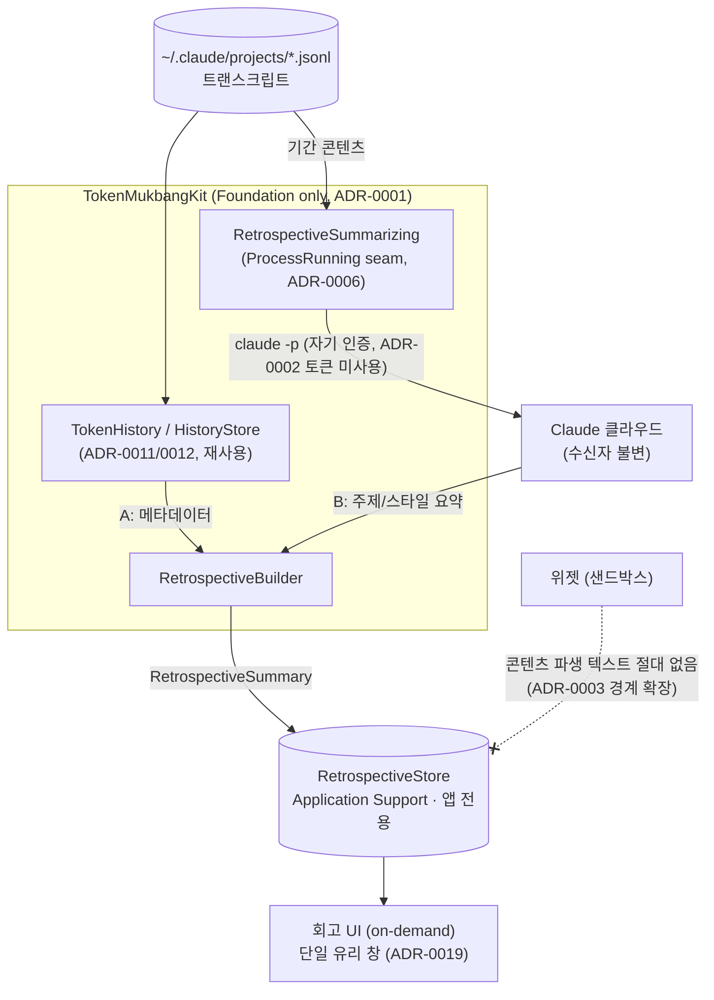

# ADR-0020: 회고(Retrospective)는 로컬 `claude` CLI로 트랜스크립트 콘텐츠를 분석한다

- **Status:** Accepted
- **Date:** 2026-06-17
- **Supersedes:** 없음 (ADR-0003의 결정은 유효 — 본 ADR은 "앱의 네트워크 egress"
  불변식을 *개정*하고 콘텐츠-파생 저장 경계를 *확장*한다)

## Context

제품 방향을 "토큰 사용량 미터"에서 **"사용 습관의 거울(reflection mirror)"**(POSIWID:
*the purpose of a system is what it does*)로 확장한다([VISION](../VISION.md)). 그 첫
기능이 **회고(Retrospective)** — 사용자가 "어제까지 내가 토큰을 잘 쓰고 있었나"를 돌아보게
한다. 회고는 두 층위다:

- **(A) 메타데이터 거울** — 무엇에/언제/얼마나 썼나(프로젝트별 토큰, 시간대, tool 믹스,
  세션당 턴 수, context 채움, 기준선 대비). **이미 인프라가 있다**: ADR-0012
  (`JSONLParser`→`TokenEvent`, `TokenHistory` 집계) + ADR-0011(`HistoryStore` 로컬 영속).
  A는 *재구성*만 하면 되고 파싱/집계를 새로 만들지 않는다.
- **(B) 사용 패턴 코치** — "토큰을 *얼마나 효율적으로* 쓰고 있나, 어떻게 하면 더 잘 쓸까"의
  코칭 층위(모델 선택·컨텍스트 위생·자동화 균형·페이싱). 단순 "무슨 주제였나" 나열이 아니라
  사용 *패턴을 진단하고 개선 액션을 제안*한다.

지금까지의 프라이버시 자세는 **로컬-우선**이다:

- 토큰은 `security`로 읽기 전용, 어디에도 출력·로깅 안 함 (ADR-0002).
- 위젯은 샌드박스라 Keychain·네트워크 불가 (ADR-0003).
- 앱의 네트워크는 사실상 usage/profile OAuth API뿐 — *"Nothing is sent anywhere else"*
  (README §Privacy).

B는 이 자세를 정면으로 건드린다. 결정적 관찰은 이것이다: **그 트랜스크립트들은 대화가
발생할 당시 이미 Anthropic 서버를 거쳤다.** 따라서 요약을 위해 다시 보내는 것은 *처리
(processing)* 를 바꾸는 것이지 *수신자(recipient)* 를 바꾸는 것이 아니다. 이 비대칭이 B를
일반적인 "클라우드 LLM 도입"보다 훨씬 낮은 스테이크로 만든다.

## Decision

회고의 **B층(의미 분석)은 로컬에 설치된 `claude` CLI를 서브프로세스로 호출**해 만든다.
구체 불변식:

1. **`ProcessRunning` seam 경유 (ADR-0006).** 새 `RetrospectiveSummarizing` 프로토콜 +
   라이브 구현 `ClaudeCLISummarizer`가 `claude -p …`(비대화 모드)를 호출해 코치 평가+권고를
   방어적으로 파싱한다. `Process`를 직접 부르지 않는다(테스트는 가짜 `ProcessRunning`).
   **입력은 raw 프롬프트 덤프가 아니라 사용 패턴 지표**(`RetrospectiveMetrics`: 프로젝트별
   토큰·프롬프트수·프롬프트당 토큰·turn당 cache-read·모델·시간분포) + 소량의 균형 잡힌
   프롬프트 샘플이다 — turn 수 많은 자동 세션(ralph 등)에 편향되지 않게 하기 위함(코치는
   "토큰은 큰데 프롬프트 적은" 자동/롱컨텍스트 패턴을 오히려 짚어준다).
2. **OAuth 토큰을 재활용하지 않는다 (ADR-0002 보존).** `claude` CLI는 *자기* 인증/세션을
   쓴다. 우리가 Keychain에서 읽는 access token은 여전히 usage/profile API 읽기에만 쓰이고
   추론에 전용되지 않는다 — ADR-0002의 "읽기 전용·미출력" 불변식은 그대로다.
3. **콘텐츠가 기기를 떠난다(개정점).** B는 앱이 주도하는 *최초의 사용자 콘텐츠 off-device
   egress*다. 정당화는 위 Context의 **수신자 불변**이며, 그 한계(아래 Consequences)를 정직히
   문서화·고지한다. README §Privacy의 "nothing is sent anywhere else"를 이 사실에 맞게 개정한다.
4. **on-demand 전용 (먹방 역설).** 회고는 *사용자 자신의 토큰 예산*을 소비한다 — 이 앱이
   감시하는 바로 그 자원이다. 따라서 60초 자동 폴링이 아니라 **사용자가 명시적으로 트리거**할
   때만 실행하고, 결과를 앱 측에 캐시(예: 하루 1회)해 재소비를 막는다.
5. **콘텐츠 파생 요약은 앱 전용 저장 (ADR-0003 경계 확장).** 회고 결과는 Application
   Support의 `RetrospectiveStore`(ADR-0011 `HistoryStore` 패턴, 주입 가능 디렉터리)에만
   저장한다. **위젯이 읽는 `SharedStore` 스냅샷에는 콘텐츠 파생 텍스트를 절대 넣지 않는다** —
   샌드박스 위젯은 콘텐츠를 영원히 못 본다.
6. **A는 기존 인프라 재사용 (ADR-0011/0012).** 메타데이터 층은 `TokenHistory`/`HistoryStore`를
   조합하고 파싱/집계를 **중복 구현하지 않는다**. `claude` CLI가 없으면 B는 비활성(또는 B1
   키워드 폴백, Alternatives 참고)되고 **A만으로 우아하게 degrade** 한다.
7. **로직은 Foundation-only Kit (ADR-0001).** 오케스트레이션(`RetrospectiveBuilder`,
   `RetrospectiveSummary` 모델, 기준선 계산)은 `TokenMukbangKit`에 두고 단위 테스트한다.
   서브프로세스만 seam 뒤에 둔다.

## Consequences

- ➕ "무엇을 중점적으로 봤나 / 어떻게 대화했나"의 **의미 있는 회고**가 가능해진다 — A 단독의
  "활동 로그"를 넘어선다.
- ➕ 토큰 재활용·새 Keychain·새 인증 표면이 **없다**(이미 깔린 `claude` CLI 재사용).
- ➕ A는 기존 0011/0012 인프라 재사용이라 신규 파싱 코드가 거의 없다.
- ➖ **먹방 역설**: 사용량 모니터가 토큰을 *소비*한다. on-demand + 캐시로 완화하되, 이 비용을
  UI에서 정직히 보여준다("회고 생성은 토큰을 씁니다").
- ➖ **콘텐츠 egress**: 수신자가 불변이어도 앱의 기존 "아무 데도 안 보냄" 선을 넘는다 → 기능은
  **명시적/opt-in**이어야 하고 README §Privacy는 정직해야 한다.
- ⚠️ **교차 세션·타 코드베이스**: 회고는 여러 세션을 *묶어* 보내고, 트랜스크립트엔 회사
  코드 등 민감 내용이 있을 수 있다. 수신자는 불변이나 "묶음 뷰"는 새로우므로 사용자에게 고지.
- ⚠️ **CLI 의존**: `claude` 존재 여부·출력 포맷은 외부 구현 디테일 → 방어적 파싱 + 부재 시
  graceful degrade(A만/또는 B1 폴백).
- ⚠️ **위젯 누수면**: 콘텐츠 파생 텍스트가 `SharedStore`로 새지 않게 하는 것이 영구 불변식.
- ⚠️ **수신자 불변 가정의 한계**: "이미 Anthropic을 거쳤다"는 논거는 `claude` CLI가 *기본
  Anthropic 백엔드*로 간다고 가정한다. 사용자가 CLI를 커스텀 게이트웨이/프록시로 설정하면
  수신자가 달라질 수 있다 — 회고는 그 경우 사용자의 기존 CLI 설정을 그대로 따를 뿐 새 경로를
  만들지 않으나, 정당화의 전제임을 명시해 둔다.

## Alternatives considered

- **B1 — 로컬 키워드/TF-IDF(모델 없음)**: 프롬프트·파일경로·빈출 식별자로 주제 *유추*.
  프라이버시 가장 깨끗(완전 로컬), 하지만 "이게 무슨 작업이었나"의 의미는 거칠다. → `claude`
  CLI 부재 시 **폴백**으로 유지.
- **B2 — 로컬 LLM(Ollama/MLX)**: 콘텐츠가 기기를 안 떠남(불변식의 정신 보존). 하지만 무거운
  런타임 의존 + 다수 사용자에게 로컬 모델이 없다. → 기본값으로는 기각, 추후 opt-in 여지.
- **B3-raw — OAuth 토큰으로 Claude API 직접 호출**: 제일 쉽지만 토큰을 추론에 *전용*해
  ADR-0002의 정신을 깨고 인증을 직접 관리해야 한다. → 기각(CLI 경로가 토큰 재활용을 피함).
- **B 안 함(A만)**: A는 활동 로그에 그쳐 "잘 쓰고 있나"에 답을 못 한다 → 기각.

## Affects

- 신규 `Sources/TokenMukbangKit/Retrospective/`: `RetrospectiveBuilder`,
  `RetrospectiveSummary`, `RetrospectiveSummarizing`(seam) + `ClaudeCLISummarizer`,
  `RetrospectiveStore`(앱 전용). 재사용: `History/`(ADR-0011/0012), `Support/ProcessRunner`(ADR-0006).
- `App/` 회고 UI(단일 유리 창, ADR-0019) — on-demand 트리거. 위젯 **무변경**(콘텐츠 못 봄).
- 문서: `CLAUDE.md`(네트워크/egress 불변식 + 회고), `ARCHITECTURE.md`(§3 seam 표 + 회고 흐름),
  `README.md` §Privacy, `CHANGELOG.md`, ADR 색인.
- 교차링크(양방향): [ADR-0002](0002-keychain-via-security-cli.md)(토큰 미재활용으로 보존) ·
  [ADR-0003](0003-app-writes-widget-reads-snapshot.md)(콘텐츠 앱전용 저장으로 경계 확장) ·
  [ADR-0006](0006-inject-system-boundaries-behind-protocols.md)(seam) ·
  [ADR-0011](0011-local-history-persistence.md)/[ADR-0012](0012-jsonl-transcript-as-token-source.md)(재사용) ·
  [ADR-0009](0009-mukbang-product-concept.md)(먹방 "주간 식단 결산" 실현) · [VISION](../VISION.md).
