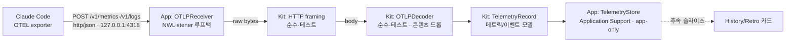

# ADR-0023: Claude Code 텔레메트리는 로컬 루프백 OTLP receiver로 받는다

- **Status:** Accepted
- **Date:** 2026-06-30
- **Refined by:** ADR-0024 (앱이 settings.json 자동 배선 + 동의 하 회사 forward — "egress 없음"을 "무동의 egress 없음"으로 정밀화)

## Context

TokenMukbang은 지금 Claude Code 사용량을 두 경로로 *역설계*한다: OAuth usage API(윈도우
사용률·리셋)와 트랜스크립트 `.jsonl` 파싱(ContextFraction, TokenHistory, 세션 활성). 그런데
**Claude Code 자신이 표준 OpenTelemetry(OTLP)로 구조화된 텔레메트리를 내보낸다**
(`CLAUDE_CODE_ENABLE_TELEMETRY=1`). 거기엔 트랜스크립트로는 못 얻는 권위 있는 신호가 있다:

- 메트릭 8종 — `claude_code.token.usage`·`cost.usage`·`session.count`·`lines_of_code.count`·
  `code_edit_tool.decision`(accept/reject)·`commit.count`·`pull_request.count`·`active_time.total`.
- 이벤트 로그 23종 — `api_request`·`tool_result`·`tool_decision`·`compaction` 등.

이 데이터는 우리 비전("사용량 미터 → 반성의 거울", `docs/VISION.md`)을 키운다 — 편집 수락률,
작성 라인 수, 커밋/PR 수, 실제 active time 같은 카드. 문제는 Claude Code가 이 텔레메트리를
**OTLP 엔드포인트로만** 보낸다는 것 — 파일로 떨구지 않는다. 받으려면 **로컬 HTTP 엔드포인트**가
있어야 한다. 이는 앱에 **첫 inbound 네트워크 경계**를 추가하는 결정이다(지금까지 네트워크는 전부
outbound: usage API + 회고용 `claude` CLI egress, ADR-0020).

## Decision

**TokenMukbang이 `127.0.0.1`에 작은 OTLP/HTTP receiver를 띄워, Claude Code의 텔레메트리를
로컬에서 직접 ingest 한다.** 보안·프라이버시 불변식을 단단히 건다:

- **루프백 전용.** `NWListener`는 `127.0.0.1`(IPv4 루프백)에만 바인딩한다 — 외부 인터페이스에
  절대 노출하지 않는다. 프로토콜은 **`http/json`**(protobuf 불필요), 기본 포트 **4318**(OTLP HTTP
  표준), 경로 `/v1/metrics`·`/v1/logs`.
- **Opt-in.** 기본 off(`AppSettings.telemetry.enabled = false`). 사용자가 켤 때만 receiver가
  뜨고, 이때 우리가 `~/.claude/settings.json`의 `env`에 OTLP 변수를 (동의 하에) 써준다 — 셸
  `.zshrc`가 아니라 settings.json에(변수가 Claude Code 프로세스에만 적용되도록).
- **콘텐츠는 디코더가 아예 안 담는다(서버 강제 redaction).** `prompt`·`body`(api_request/
  response_body)·`tool_input`·`tool_output`·`category`(refusal) 등 텍스트성 필드는 OTLP JSON을
  파싱할 때 **모델에 매핑하지 않는다**. 설령 사용자가 `OTEL_LOG_USER_PROMPTS`/`OTEL_LOG_TOOL_*`를
  켜도 우리 저장소엔 한 글자도 안 남는다(hilala 사내 수집기와 같은 이중 안전장치 철학).
- **레이어 분리(ADR-0001).** OTLP/HTTP 와이어 파싱(HTTP framing + OTLP JSON 디코딩 → 도메인
  모델)은 **Kit의 순수 함수**로 두어 픽스처로 유닛 테스트한다. 소켓(`NWListener`/`Network`
  framework)은 **App**에만 둔다(Kit은 Foundation만). 디코딩된 레코드는 **앱 전용 store**
  (Application Support, `HistoryStore`/`RetrospectiveStore` 패턴)에 보관 — **위젯이 읽는
  `SharedStore` 스냅샷에는 절대 안 넣는다**(ADR-0003 유지).
- **사용량 미터에 영향 없음.** ingest는 순수 로컬 수신·저장이라 추가 LLM 토큰·비용·rate limit이
  없다(Claude Code 텔레메트리는 비동기 배치 전송, 체감 지연 <1ms).

이번 슬라이스(첫 PR)는 **"받아서 디코딩해 저장 + 검증"**까지다. 받은 데이터를 사용자 카드(수락률·
LoC·커밋 등)로 그리는 것과 settings.json 자동 배선 UI는 **후속 슬라이스**로 분리한다.

## Consequences

- ➕ 트랜스크립트 휴리스틱보다 **정확하고 풍부한** 신호 획득(수락률·LoC·커밋/PR·active time).
- ➕ 100% 로컬·루프백 → 신규 egress 없음, 프라이버시는 수집 지점에서 보장(콘텐츠 미매핑).
- ➕ 와이어 파싱이 순수·결정론적으로 테스트됨. 소켓 글루만 App에 얇게.
- ➖ **첫 inbound 경계** — 새 공격 표면. 루프백 바인딩·opt-in·콘텐츠 미매핑으로 좁힌다.
- ➖ 사용자가 settings.json을 손대야 함(후속 슬라이스에서 동의 기반 자동 배선으로 완화).
- ➖ 트랜스크립트 파이프라인과 데이터가 일부 겹침 — 장기적으로 OTEL이 더 권위 있는 소스가 되며
  휴리스틱을 점진 대체할 수 있다(이번엔 병행, 교체는 후속 결정).
- ➖ 포트 4318이 다른 로컬 collector와 충돌 가능 — 포트는 설정 가능하게 두고 양쪽을 우리가 배선.

## Alternatives considered

- **트랜스크립트 파싱만 유지** — 신규 경계 없음. 그러나 수락률·LoC·커밋 같은 신호를 영영 못 얻고,
  토큰/세션도 휴리스틱 추정에 머문다. 기각(가치가 분명).
- **gRPC OTLP(4317) 수신** — Claude Code 기본이지만 protobuf 디코딩 필요 → 의존성·복잡도↑.
  `http/json`이 사람이 읽기 쉽고 순수 JSON 디코더로 끝나 채택.
- **OTEL exporter(반대 방향) / 팀 대시보드** — 우리 사용량을 *내보내* 여러 머신을 한 곳에. 별도
  제품 스코프 + egress 결정. 이번 결정과 직교 — 후일 별도 ADR 여지.
- **`console`/`OTEL_LOG_RAW_API_BODIES=file:` 파일 수집** — console은 stderr 텍스트, file은 API
  body(콘텐츠)만. 구조화된 메트릭을 얻지 못함. 기각.

## Affects

- `Sources/TokenMukbangKit/Telemetry/`(신규) — `OTLPDecoder`, HTTP framing, `TelemetryRecord`/
  `ClaudeCodeMetric`/`ClaudeCodeEvent`, `TelemetryStore`.
- `App/TokenMukbang/OTLPReceiver.swift`(신규) — `NWListener` 루프백 글루.
- `App/TokenMukbang/AppModel.swift` — receiver 소유·opt-in 시작.
- `Sources/TokenMukbangKit/Settings/AppSettings.swift` — `telemetry` 설정(기본 off).
- `App/TokenMukbang/TokenMukbangApp.swift` — `TMK_OTLP_TEST` 헤드리스 검증 브랜치.
- `CLAUDE.md`(네트워크 경계 규칙), `ARCHITECTURE.md`, `CHANGELOG.md`, `docs/adr/README.md`.
