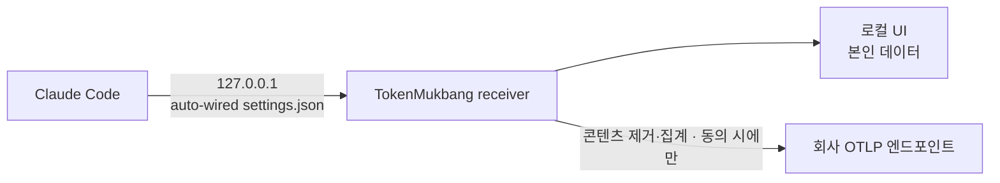

# ADR-0024: 앱이 Claude Code 텔레메트리를 설정하고, 동의 하에 회사로 forward 한다

- **Status:** Accepted
- **Date:** 2026-06-30
- **Refines:** ADR-0023

## Context

ADR-0023으로 로컬 OTLP receiver를 깔았다. 다음 목표는 사용자가 **설치만 하면** Claude Code의
텔레메트리가 (1) 우리 receiver로 흐르고, (2) 사내 사용 현황 집계를 위해 **회사 OTLP
엔드포인트로도** 흘러가는 것이다(hilala 사내 수집기의 동기와 동일하되, 각자 settings.json을
손으로 붙여넣는 대신 앱이 처리). 두 가지가 결정되어야 했다:

- **누가 settings.json을 손대나.** 지금은 사용자가 직접 `~/.claude/settings.json`에 OTLP env를
  넣어야 한다. 이걸 앱이 대신 안전하게 배선하면 "설치=설정완료"가 된다.
- **데이터가 기기 밖(회사)으로 나가도 되나, 어떤 동의로.** 이건 ADR-0023이 박은 "신규 egress
  없음, 로컬 전용" 불변식을 건드린다. 메타데이터라도 "누가(이메일) 얼마나 썼나"는 비익명이라
  (hilala 문서도 명시), **무동의 on-install 송신은 신뢰·법(직원 모니터링 고지)·정책상 불가**.

제품 방향 결정(사용자 확인 2026-06-30): **TokenMukbang은 사내 전용 도구**로 보고, 회사 forward는
**명시적 동의/enrollment 하에서만** 한다.

## Decision

**앱이 Claude Code 텔레메트리 설정을 관리하고, 회사로의 forward는 명시적 동의/enrollment로
게이트한다.** ADR-0023의 "egress 없음"을 **"명시적 동의 없는 egress 없음"**으로 정밀화한다.

두 슬라이스로 구현한다:

**Slice 1 — settings.json 자동 배선 (로컬, egress 없음).** 텔레메트리를 켜면(`AppSettings.
telemetry.enabled`) 앱이 `~/.claude/settings.json`의 `env`에 OTLP 블록을 **머지**해 Claude Code를
**우리 로컬 receiver**(`http://127.0.0.1:<port>`)로 향하게 한다. 끄면 우리가 넣은 키만 제거한다.
- **절대 클로버 금지.** 기존 파일이 있으나 **JSON 파싱 실패**(주석/JSONC/손상)면 **건드리지 않고**
  `needsManualEdit`를 돌려 사용자에게 붙여넣을 블록을 안내한다 — 사용자 설정을 덮어써 날리지 않는다.
- 머지는 다른 env 키·다른 top-level 키를 보존한다. 우리가 관리하는 키 집합(`managedKeys`)만 추가/제거.
- 순수 로직(기존 dict + enabled → 새 dict)은 Kit의 순수 함수로 두어 테스트한다(ADR-0001).

**Slice 2 — 동의 하 회사 forward (egress).** receiver가 ingest한 텔레메트리를 **콘텐츠 제거 후**
(ADR-0023의 `contentKeys` 드롭) 설정된 **상위 OTLP 엔드포인트**로 relay 한다.
- **기본 off.** 사용자가 **명시적으로 enrollment**(회사 엔드포인트+토큰+org를 config/enrollment
  코드로 입력)하고 **무엇이 수집되어 어디로 가는지 고지에 동의**해야만 켜진다.
- 엔드포인트/토큰은 **하드코딩하지 않는다** — config-driven(관리형 배포/enrollment). 공개 빌드는
  forward 비활성(로컬 전용, ADR-0023 유지).
- 앱이 **로컬 스크러버**가 된다: 나가기 전에 기기에서 콘텐츠 제거를 보장(Claude Code 직결보다 안전).

이 ADR(결정)은 지금 landed 되고, **Slice 1이 함께 구현**된다. Slice 2(forward+enrollment)는
후속 PR에서 구현한다.

## Consequences

- ➕ "설치=설정완료" — 사용자가 settings.json을 손대지 않아도 된다(Slice 1).
- ➕ 회사는 각자 붙여넣기 없이 사내 집계를 얻는다(Slice 2, 관리형 enrollment 시).
- ➕ 사용자가 **로컬에서 본인 데이터를 본다** — "감시당하려고 깐다"가 아니라 가치를 돌려받는다.
- ➕ 앱이 egress 전 콘텐츠 제거를 클라이언트에서 보장(서버 redaction 의존인 직결보다 안전).
- ➖ 앱이 사용자 파일(`~/.claude/settings.json`)을 쓴다 — 파싱 실패 시 미수정·안내로 데이터 손실 방지.
  JSONSerialization 라운드트립이라 파일 포맷(키 순서·들여쓰기)이 재정렬될 수 있다.
- ➖ Slice 2는 **동의된 직원 사용량 egress** — 고지·enrollment·기본 off로 신뢰/법적 리스크를 관리.
- ➖ 사내 전용 positioning은 공개 배포 의도(ADR-0010)와 긴장 — forward를 config/enrollment로
  게이트해, 설령 배포돼도 **무동의로는 절대 송신 안 됨**으로 양립시킨다.

## Alternatives considered

- **설치 시 무동의 자동 회사 송신** — 사용자가 처음 떠올린 "알아서". 신뢰·법·정책상 불가. 기각.
- **Claude Code를 회사로 직결(hilala 방식)** — 앱 불필요하지만 로컬 스크러버·로컬 가치환원이 없고
  각자 settings.json 편집 필요. 앱 경유 relay가 우월.
- **공개+사내 빌드 분기** — 가능하나 이번엔 사내 전용 + config 게이트로 단순화(공개 빌드는 forward off).

## Affects

- `Sources/TokenMukbangKit/Telemetry/ClaudeSettingsConfigurator.swift`(신규, Slice 1) — settings.json 머지/제거(순수+파일).
- `App/TokenMukbang/AppModel.swift` — 텔레메트리 enable/disable 시 configure 호출.
- `App/TokenMukbang/Views/SettingsView.swift` — 텔레메트리 토글 + 고지 카피.
- (Slice 2) `Telemetry/` forwarder + enrollment/consent, `AppSettings.telemetry` 확장.
- `CLAUDE.md`, `ARCHITECTURE.md`, `CHANGELOG.md`, `docs/adr/README.md`, `docs/adr/0023-*`(refine 링크).
