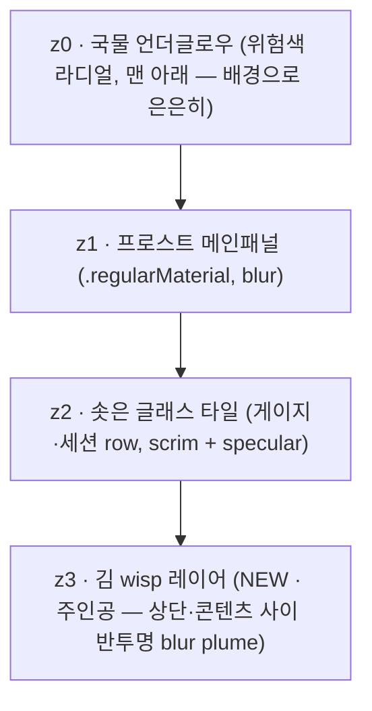

# STEAM_DESIGN — TokenMukbang 김 서림 디자인 시스템 (정본)

> **TL;DR:** TokenMukbang의 채택된 비주얼 방향은 **김 서림(Steam)**이다 — 03 유리국밥(프로스트 글래스 +
> 바닥 국물 언더글로우 + "숫자는 항상 불투명 scrim 위")을 상속하되, 시그니처를 **위로 솟는 김(steam wisp)
> + 응결**로 바꿔 **위험을 hue가 아니라 "김의 밀도·높이·빛깔"로** 읽게 한다. 이 문서가 컬러/타이포/컴포넌트의
> 단일 정본이며, 기존 `DESIGN_SYSTEM.md`("Liquid Vitals")를 **대체(supersede)**한다(결정: [ADR-0016](adr/0016-steam-visual-direction.md)).
> 컨셉 원본: [`concepts/04-steam.md`](concepts/04-steam.md).

## 원칙 (불변식)

1. **숫자·게이지는 항상 불투명 scrim 위.** 김·응결·언더글로우·글래스가 아무리 짙어도 값의 가독·정렬은 불변.
2. **위험은 "김"으로 말한다 — 글자색이 아니라.** 텍스트는 luminance-pinned 중립색 유지. 위험 신호는 김의
   밀도/높이/빛깔 + 바닥 언더글로우로만(이중 인코딩: 면적 + hue → 색각 이상 대응).
3. **calm = 잠잠.** 평상시 김 alpha ≤ 8% — atmospheric 노이즈 없이 깔끔, 위험할 때만 분위기가 짙어진다.
4. **김은 콘텐츠 *위*가 아니라 콘텐츠 *사이·상단 빈 공간*에만.** 게이지/숫자 영역을 마스킹으로 침범 금지.
5. **정확함 > 귀여움 (ADR-0009).** 게이지·%·리셋·ctx%가 1순위 위계, 김/응결/글래스는 그 뒤 atmosphere.

## 컬러 토큰

유리/프로스트/응결은 **쿨 뉴트럴(채도 ~0)** 고정 — 채도는 *김의 빛깔*에만. **다크 우선**(김의 atmospheric
효과는 어두운 배경에서 가장 산다). 라이트=화이트스모크 프로스트(~91%L), 다크=그래파이트 글래스(~13%L).

| role | light | dark | 용도 |
|---|---|---|---|
| `frost.panel` | `#E8EAED` | `#1C1E22` | z1 메인패널 베이스 |
| `frost.tile` | `#F4F5F7` | `#282B31` | z2 솟은 글래스 타일(게이지·세션 row) |
| `scrim.number` | `#DADCE0` | `#131519` | 숫자 밑 불투명 스크림(가독 보장) |
| `ink.primary` | `#1A1C1F` | `#F2F3F5` | 히어로 %·값 숫자 |
| `ink.secondary` | `#5B606A` | `#A7ACB5` | 라벨·상태·캡션 |
| `edge.lens` | `#FFFFFF` @ 70% | `#FFFFFF` @ 20% | 외곽 림 굴절 엣지(2px) |
| `hairline` | `#00000014` | `#FFFFFF18` | 타일 구분선 |
| `condensation` | `#FFFFFF` @ 30% | `#FFFFFF` @ 26% | 응결 물방울(하이라이트+미세 그림자) |
| `glow.broth` | 위험색 @ light(alpha↓) | 위험색 @ dark(alpha↓) | z0 국물 언더글로우(배경으로 후퇴) |
| `steam` | *위험 4단계 가변* | *동일, 밀도·alpha↑* | z3 김 plume(주인공) |

### 위험 4단계 매핑 (`RiskLevel`: calm/watch/warning/critical)

위험은 **김 plume의 밀도·높이·빛깔 + 언더글로우**가 결정한다. 텍스트 색이 아니다. (dark 기준 hex)

위험은 **김 plume의 밀도·높이·빛깔 + 언더글로우**가 결정한다. 텍스트 색이 아니다. (dark 기준 hex)

> **디자인 크리틱 r2 반영 (2026-06-12)**: 김/국물 alpha가 유리를 덮어버린다는 지적 →
> 김 plume alpha **≤ 0.22로 캡**, 국물 언더글로우 천장을 0.62→0.40으로 낮추고 *바닥 그라디언트*로
> 가둠(전체 fill 금지). 적응은 **hue가 아니라 alpha**로만(단일 웜앰버 계열, dark가 light보다 약간 진함).

| level | 김 빛깔(steam, dark) | 밀도 / 높이 | 응결 | 언더글로우(glow.broth) |
|---|---|---|---|---|
| **calm** | `#E9D8C4` @ 6% | 가는 한 줄기, 짧게 | 거의 없음 | 웜앰버 `#E8A957` @ 10% |
| **watch** | `#E8B770` @ 12% | 두 줄기, 중간 높이 | 모서리 1~2방울 | 허니 `#E8A030` @ 18% |
| **warning** | `#E5944A` @ 17% | 넓은 plume, 상단 절반 | 상단 유리 응결 번짐 | 파프리카 `#E27B2C` @ 28% |
| **critical** | `#DC6A4A` @ 22% | 상단 가득, 두꺼운 plume | 상단 전체 응결+흘러내림 | 엠버레드 `#D85436` @ 40% |

> light 모드 김 빛깔은 **동일 hue, alpha만 한 단계 낮춤**(calm 5% / watch 10% / warning 15% / critical 20%).
> **메뉴바 색은 별도 정의(§4.1)** — 반투명 메뉴바에서 김이 거의 안 보이므로 메뉴바는 김보다 *김-틴트된 숫자 색*에 의존.
>
> **위험 4단계 텍스트/게이지 색(`RiskTone.color`)** 도 크리틱 r2에서 desaturate + L\*-밴딩으로 통일:
> calm 틸그린 `#5BA88A` · watch 앰버골드 `#C9A227` · warning 오커 `#D08A3E` · **critical 쿨 크림슨 `#C23B4E`**
> (기존 토마토수프 오렌지레드 폐기) · over `#D94E63`. (dark 기준; light은 동일 hue·저명도 형제.)

## 타이포그래피

(03 상속 — 변경 없음)

| 역할 | 스펙 |
|---|---|
| 히어로 % | `SF Pro Rounded` `.largeTitle` semibold, **tabular figures** |
| 값 숫자(7d/Sonnet/ctx%) | `SF Pro Rounded` `.title3`/`.body` medium, tabular |
| 라벨·상태·캡션 | `SF Pro Text` `.caption` medium, `ink.secondary` |
| 메뉴바 | `SF Pro` `.system(size:13, weight:.medium)` **monospacedDigit**(폭 흔들림 방지) |

- 라운드는 **숫자에만**, 라벨은 SF Pro Text. 모든 숫자는 `scrim.number` 플레이트 위.

## 스팀 & 응결 시그니처

### z-stack (4겹) — 03의 3겹 + z3 김 레이어

### 규칙
- **언제 강해지나:** 김의 밀도·높이·빛깔은 **위험 레벨**(절대 %)이 1차 구동. (선택) 페이스(연소율)가 높으면
  김의 *움직임/맥동*을 살짝 더(절제) — 단 정적 위젯은 제외.
- **어디에:** 게이지·히어로 % *위쪽 공간* + 타일 *사이* 빈 영역. 상단으로 갈수록 `LinearGradient` 마스크로
  fade-out. **콘텐츠(숫자·게이지) 영역은 마스킹으로 침범 금지.**
- **응결:** 패널 상단 내측 엣지의 작은 흰 물방울(하이라이트 + 미세 그림자). warning↑ 증가, critical은 세로 streak.
- **정적 vs 애니(WidgetKit 제약):** 동적 모락모락은 **팝오버 critical에서만**(`TimelineView`, 반경/opacity
  미세 변조, 반경 캡). 위젯은 **현재 레벨의 김 한 프레임만** 정적 렌더(ADR-0003: 위젯은 스냅샷만 읽음).

## 컴포넌트 규칙

### 4.1 메뉴바 라벨
- 형식: `▓ 85%  ·  3 ◐` (불투명 scrim 캡슐 위) + 텍스트 *바로 위 3~5px* 미세 김 plume.
- `85%` = 가장 임박한 윈도우(5h/7d max). `3 ◐` = 활성 세션 수.
- 김 높이 여유가 거의 없으므로(메뉴바 ~22px) **높이보다 밀도·색**으로 위험 표현: calm 김 0 → critical 자욱·붉음.
- 숫자 색은 김-틴트(현재 `RiskTone.menuBarColor` 자리) — muted·luminance-pinned 유지(가독 불변, ADR-0015).
- 기술: 메뉴바는 비-template color `NSImage` 렌더(현 `MenuBarLabel`) — 김 plume도 그 이미지에 합성.

### 4.2 팝오버 (320pt)
- 히어로 윈도우(5h/7d max): 솟은 scrim 타일 위 히어로 %(SF Rounded) + 게이지 + reset. 타일 *위*로 김.
- 2차 윈도우(7d/Sonnet): 컴팩트 row(라벨 · 게이지 · 값) — 우측 값 컬럼 정렬(현 `WindowRow` 계승).
- SESSIONS: risk dot + project + 중립 ctx% + tty(현 `SessionRowView` 계승, dot=`RiskTone.contextColor`).
- MODEL HISTORY: 모델별 스택 막대 + 레전드. (※ `StackedTokenBarChart`/`DS.modelColor`는 별도 오픈
  브랜치 `feat/per-model-breakdown`(PR #2)에서 도입 — 그 머지 후 Steam 토큰을 입힌다. 이 브랜치 기준
  현 히스토리는 `MonitoringViews`/`HistoryViews`의 막대.)
- 김(z3)은 히어로 타일 위 + 타일 사이 빈 공간에만. critical이면 상단 자욱·응결.

### 4.3 게이지
- 6pt 트랙(현 `GaugeBar` 계승) — 채움은 위험색이되 **여기서는 김/언더글로우가 주 위험 채널**이므로 게이지
  채움은 한 단계 차분하게(over-tick은 유지). 게이지는 정확한 % 판독용, 분위기는 김이 담당.

### 4.4 위젯
- 위에서 본 그릇 + 정지 김 plume. 히어로 % 중심, 상단 정적 김(현재 레벨 한 프레임). 동적 금지.

## 먹방 정체성 + "정확함 > 귀여움"

- **먹방(ADR-0009):** "막 끓여 김 나는 한 그릇" — 김·응결·언더글로우가 *음식의 뜨거움*을 빛·안개로 직역.
- **위험 채널은 형태·빛으로만:** **데이터 플레인(게이지·숫자·위험 신호)** 에는 일러스트·이모지를 얹지 않고
  김·응결·언더글로우(형태·빛)로만 위험을 표현한다. 김 = 가장 본능적 "뜨겁다 = 많이 쓰는 중" 신호.
- **마스코트는 그대로 공존(데이터 플레인 밖):** ADR-0009 §personality rule("마스코트 = 팝오버 헤더 칩 +
  위젯 + 빈 상태 + 이벤트 토스트 only, 데이터 플레인엔 절대 X")는 **변경 없이 유효**하다. 카오모지 마스코트는
  그 지정된 채널에 그대로 살고, 김 서림(위험 채널)과 **역할이 겹치지 않아 공존**한다. 즉 "이모지 없이"는
  *위험 신호 채널*에 한정된 규칙이지 마스코트 폐지가 아니다. (현 코드도 Liquid Vitals 재디자인에서 이미
  마스코트를 메뉴바에서 빼고 헤더 칩·위젯으로 옮겨둔 상태 — 그 스코핑을 김 서림이 그대로 잇는다.)
- **정확함 우선:** §원칙 불변식 1·2·4가 강제. 김은 콘텐츠 사이/상단에만, 숫자는 scrim 격리, calm은 김 0.
  위험은 데이터를 가리지 않고 *주변 공기*로만 전달된다.

## 가독성 불변식 (체크리스트)

- [ ] 메뉴바 텍스트는 반투명 벽지 위에서도 항상 가독(불투명 scrim 캡슐 + luminance-pinned 색).
- [ ] 김 plume이 어떤 위험 레벨에서도 숫자/게이지 영역을 덮지 않는다(마스킹 검증).
- [ ] calm에서 김 alpha ≤ 8% — 평상시 화면이 깔끔.
- [ ] 위험은 김 밀도(면적) + hue 이중 인코딩 → 그레이스케일/색각 이상에서도 위험 판별 가능.
- [ ] 다겹 blur(z0+z1+z3)에도 60fps 유지(김 정적 캐싱, 동적은 critical 팝오버 한정).

## 기존 시스템과의 관계

이 문서는 `docs/design/DESIGN_SYSTEM.md`("Liquid Vitals, Instrument-Grade")를 **대체**한다 — 결정·근거·대안은
[ADR-0016](adr/0016-steam-visual-direction.md). 단, Liquid Vitals의 **하부 메커니즘은 상속**한다:
- **ADR-0015**(위험색 앱-측 scheme-branched 해석, `RiskTone`) — 유지. 김 빛깔·언더글로우·메뉴바 틴트가
  모두 `RiskTone` 계열 resolver를 거친다(Kit은 여전히 color-free, level만 emit).
- 6pt `GaugeBar`, scrim 타일, 우측 값 컬럼(`WindowRow`), `DSSegmented` 등 컴포넌트 자산 재사용.
  (모델별 스택 히스토리는 PR #2 머지 후 합류.)
- 바뀌는 것: 팔레트(쿨 뉴트럴 글래스 + 김 위험색), **시그니처(메뉴바 colored % → 김 plume + scrim 캡슐)**,
  z-stack(+z3 김), 응결. 구체 적용 순서는 [STEAM_IMPLEMENTATION_PLAN.md](STEAM_IMPLEMENTATION_PLAN.md).
