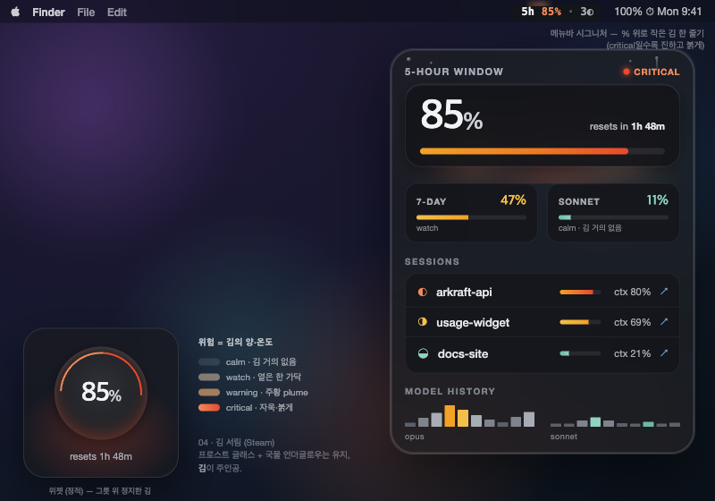
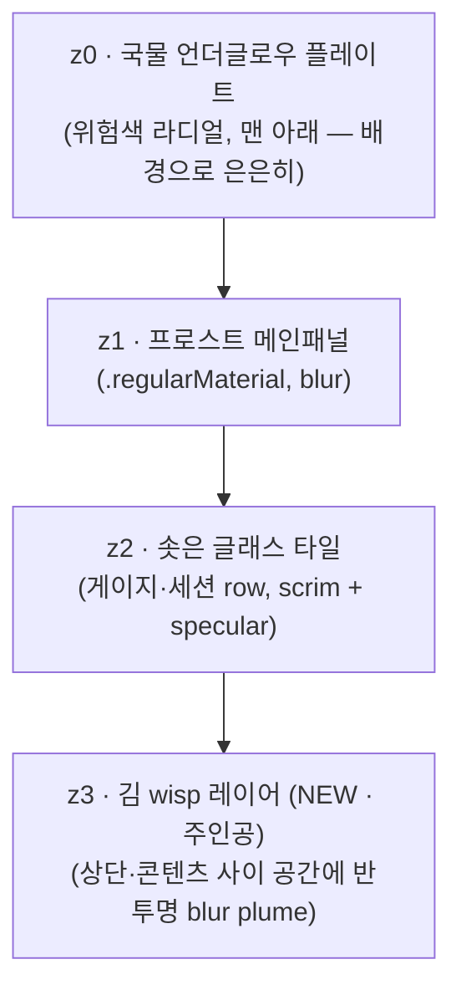

# 04. 김 서림 (Steam)

> **한 줄 컨셉:** 뜨거운 국 위로 *김이 모락모락* — 위험은 hue가 아니라 **김의 양과 온도**로 읽힌다. calm은 김이 거의 없이 잠잠하고, critical은 김이 자욱하게 차오르며 붉게 달궈진다. 유리와 국물 언더글로우는 배경으로 남고, 이번엔 *김(steam)이 주인공*이다.



> **베이스:** 03 유리국밥(Glass Gukbap)의 DNA — 프로스트 글래스 + 바닥에서 차오르는 국물 언더글로우 + "숫자는 항상 불투명 스크림 위" — 를 그대로 상속하되, 시그니처를 **국물 메니스커스 → 김 서림(steam wisp + 응결)** 으로 교체한다.

## 무드보드 / 톤

- **막 뚜껑을 연 뚝배기**: 김이 한 줄기 위로 솟아 흐트러지고, 차가운 유리 안쪽 면에 닿아 응결되어 물방울로 맺히는 그 순간. 따뜻함이 *공기 중으로 번지는* 찰나.
- **Atmospheric / 안개 낀 창**: 김은 단단한 형태가 아니라 *반투명 blur wisp* — 가장자리가 흐트러지고, 위로 갈수록 옅어진다. 정보 위가 아니라 정보 *사이·뒤*로 피어오른다.
- **온도 = 김의 밀도와 빛깔**: calm은 거의 보이지 않는 옅은 흰 김 한 가닥, critical은 자욱한 김이 붉은 엠버 빛을 머금고 패널 상단을 가득 채운다. 색이 시끄러운 게 아니라 *김이 짙어지고 데워진다*.
- 키워드: steam wisp, condensation, fogged glass, rising plume, warm haze, breath on cold glass, ember-lit vapor.

## 컬러 토큰

유리/프로스트/응결은 **쿨 뉴트럴**(채도 ~0)로 고정 — 위험은 *김의 빛깔*에만 채도를 준다. 라이트는 화이트스모크 프로스트(~91%L), 다크는 그래파이트 글래스(~13%L). **다크 우선**(김의 atmospheric 효과는 어두운 배경에서 가장 살아난다).

| role | light | dark |
|---|---|---|
| frost.panel (z1 메인패널 베이스) | `#E8EAED` (~91%L) | `#1C1E22` (~12%L) |
| frost.tile (z2 솟은 글래스 타일) | `#F4F5F7` (~96%L) | `#282B31` (~17%L) |
| scrim.number (숫자 밑 스크림) | `#DADCE0` (~87%L) | `#131519` (~8%L) |
| ink.primary (히어로 %·숫자) | `#1A1C1F` | `#F2F3F5` |
| ink.secondary (라벨·캡션) | `#5B606A` | `#A7ACB5` |
| edge.lens (외곽 림 굴절 엣지 2px) | `#FFFFFF` @ 70% | `#FFFFFF` @ 20% |
| hairline (타일 구분선) | `#00000014` | `#FFFFFF18` |
| condensation (응결 물방울) | `#FFFFFF` @ 30% (하이라이트+그림자) | `#FFFFFF` @ 26% |
| glow.broth (z0 국물 언더글로우 — 베이스 상속, 은은하게) | 위험색 @ light, alpha↓ (배경) | 위험색 @ dark, alpha↓ |
| **steam (z3 김 wisp — 신규 주인공)** | *위험 4단계로 가변, 아래 표* | *동일, 밀도·alpha↑* |

`steam`은 단일 색이 아니라 **위험 레벨이 결정하는 김 plume의 밀도·높이·빛깔**이다. 게이지/히어로 % *위쪽 공간*에 반투명 blur 형태로 피어오르고, 위로 갈수록 흩어진다(상단 fade-out).

**위험 4단계 매핑:** (`RiskLevel` calm/watch/warning/critical — 김 plume의 밀도·높이·hue. 텍스트 색이 아니라 *증기의 빛깔*이다.)

| level | 김 빛깔 (dark 기준) | 밀도 / 높이 | 응결 | 언더글로우 |
|---|---|---|---|---|
| **calm** | `#FFFFFF` @ 8% (거의 무색 흰 김) | 가는 한 줄기, 짧게 | 물방울 거의 없음 | 미지근한 웜앰버 `#F0A93C` @ 12% |
| **watch** | `#FFE3B8` @ 16% (따뜻한 미색) | 두 줄기, 중간 높이 | 게이지 모서리 1~2방울 | 허니 `#F2A226` @ 22% |
| **warning** | `#FFB877` @ 24% (주황빛 김) | 넓게 퍼진 plume, 패널 상단 절반 | 상단 유리에 응결 번짐 | 파프리카 `#F07A22` @ 34% |
| **critical** | `#F08A5A`→`#E84A2C` @ 36% (붉게 달궈진 자욱한 김) | 패널 상단을 가득 채운 두꺼운 plume | 상단 유리 전체 응결+흘러내림 | 엠버레드 `#E84A2C` @ 46% (낮게 맥동) |

> **불변식 유지(03에서 상속):** luminance-pinned 라벨색은 그대로. 김(steam)은 **콘텐츠 위가 아니라 콘텐츠 *사이의 빈 공간·상단*에만** 피어오르고, 숫자/게이지는 항상 불투명 scrim 위에 있어 김이 아무리 자욱해도 값을 가리지 않는다. 위험은 "글자가 빨개짐"이 아니라 "김이 자욱하고 붉게 데워짐"으로 읽힌다.

## 타이포그래피

(03 상속 — 변경 없음, 김 컨셉과도 합이 맞음)

- **숫자/히어로 %**: `SF Pro Rounded` — 둥근 글래스 타일·국밥의 따뜻함과 합. 히어로 % `.largeTitle` semibold, tabular figures.
- **라벨/상태/캡션**: `SF Pro Text` — 라운드는 숫자에만. 라벨 `.caption` medium, `ink.secondary`.
- **메뉴바**: `SF Pro` `.system(size:13, weight:.medium)` monospaced-digit(폭 흔들림 방지).
- 모든 숫자는 **scrim.number 플레이트 위** — 김/응결/글로우가 번져도 숫자 대비는 스크림이 보장.

## 레이아웃 & 셰이프 언어

**4겹 평면 (z-stack)** — 03의 3겹에 **z3 김 레이어**를 최상단에 추가:



- **z0 국물 언더글로우**: 03에서 상속하되 alpha를 낮춰 *배경*으로 후퇴 — 이번 변주의 무게중심은 위(김)에 있다.
- **z1 프로스트 패널 / z2 글래스 타일**: 03과 동일(`.regularMaterial`, scrim, 가는 specular, soft shadow, 연속 코너 22~28pt).
- **z3 김 wisp (신규)**: 게이지·히어로 % *위쪽*과 타일 *사이* 빈 공간에 떠 있는 반투명 흰/붉은 blur 형태. 아래는 진하고 위로 갈수록 fade-out(상단 마스크). 위험 레벨이 밀도·높이·hue 결정.
- **응결(condensation)**: 패널 상단 내측 엣지에 작은 물방울 하이라이트(흰 점 + 미세 그림자). warning↑일수록 늘고, critical은 흘러내린 자국(세로 streak).
- **코너**: 패널 28, 타일 22 (`.continuous`).

## 화면 목업

### 메뉴바

작고, 반투명 벽지 위에서도 읽혀야 한다. 텍스트는 **불투명 스크림 캡슐** 위, 그 *위로* 작은 김 한 줄기.

```
        ╷ ╷                 ← 김 wisp: % 위로 피어오름 (critical일수록 진하고 붉음)
       ░ ░ ░
┌─────────────────────┐
│  ▓ 85%  ·  3 ◐       │   ← 텍스트: 불투명 scrim 캡슐 위 (항상 가독)
└─────────────────────┘
```

- `85%` = 가장 임박한 윈도우(5h/7d 중 max), `3 ◐` = 활성 세션 수.
- 텍스트 **위로 솟는 작은 김 한 줄기** = 시그니처. calm=김 거의 없음(잠잠), watch=옅은 한 가닥, warning=두 가닥 주황빛, critical=자욱하고 붉게. (아래 시그니처 무브)
- 03의 "밑 3px 메니스커스"가 **"위로 솟는 김 줄기"** 로 뒤집힌 것 — 같은 그릇 은유의 정반대 방향(아래 찰랑 ↔ 위로 모락).

### 팝오버 (320pt)

```
╔══════════════════════════════════════════╗   ← edge.lens 굴절 림 (2px) + 상단 응결 물방울
║ ˚ ∘  ░▒▓ 김 plume ▓▒░  ∘ ˚  · ∘ ˚          ║   ← z3 김: critical이면 상단 가득, 붉게 자욱
║   ░▒▒░    ░▓▓▒░    ░▒░                     ║
║   5-HOUR WINDOW                  ◉ crit    ║
║   ┌────────────────────────────────────┐ ║   ← z2 타일 (scrim, 김은 타일 '위'로만)
║   │            ███████  85%            │ ║   ← 히어로 %: SF Rounded, scrim 위 (가독 불변)
║   │   ▁▂▃▄▅▆▇█▇▆▅▄▃ resets in 1h 48m   │ ║
║   └────────────────────────────────────┘ ║
║      ∘   ░ 김 한 가닥 ░   ∘                ║   ← 타일 사이 빈 공간으로도 김
║   7-DAY · 47%        SONNET · 11%         ║
║   ▓▓▓▓▓░░░░░░░░░     ▓▓░░░░░░░░░░░░░       ║
║                                          ║
║   ── SESSIONS ──────────────────────────  ║
║   ┌────────────────────────────────────┐ ║
║   │ ◐ arkraft-api      ctx 80%  ↗ focus│ ║
║   │ ◑ usage-widget     ctx 69%  ↗ focus│ ║
║   │ ◒ docs-site        ctx 21%  ↗ focus│ ║
║   └────────────────────────────────────┘ ║
║   ── MODEL HISTORY ─────────────────────  ║
║   opus    ▁▃▅▇▆▄▂▁▃▅   sonnet  ▁▁▂▃▂▁▁   ║
║▒░░░░░░░░░░░░░░░░░░░░░░░░░░░░░░░░░░░░░░░░░░▒║   ← z0 언더글로우: critical이면 바닥 붉게 (은은히)
╚══════════════════════════════════════════╝
```

- 히어로 %·게이지·세션 모두 솟은 scrim 타일 위(03 상속). **김(z3)은 타일 *위 공간*과 *타일 사이* 빈 영역으로만** 피어오른다 — 숫자를 가리지 않는다.
- critical이면 상단이 붉은 김으로 자욱하고, 상단 유리 내측에 응결 물방울이 맺힌다. 바닥 언더글로우(z0)는 03보다 옅게 — 무게중심은 위.

### 위젯

**위에서 내려다본 그릇 + 솟는 김** — 프로스트 디스크, % 림, 그릇 *위쪽으로 정지한 김 plume*.

```
small (그릇 + 솟는 김)        medium (그릇 + 김 + 사이드)
┌──────────────┐            ┌────────────────────────────┐
│   ░▒ 김 ▒░   │            │  ░▒ 김 ▒░     5H   85% ▓▓▓▓ │
│   ╭──────╮   │            │   ╭──────╮    7D   47% ▓▓░░ │
│  ╱        ╲  │            │  ╱        ╲   SON  11% ▓░░░ │
│ │  ◜85%◝  │ │            │ │  ◜85%◝  │  sessions: 3   │
│  ╲        ╱  │            │  ╲        ╱   resets 1h48m │
│   ╰──────╯   │            │   ╰──────╯                 │
│  resets 1h48 │            │                            │
└──────────────┘            └────────────────────────────┘
  상단 ░▒김▒░ = 정지한 김 plume (위험색·밀도)
  중심 ◜85%◝ = 히어로 %
```

- 위젯은 **정적**(App이 쓴 스냅샷만 읽음, ADR-0003). 맥동·애니메이션 없이 *현재* 위험 레벨의 김 한 프레임만 — blur gradient plume으로 정지 렌더. 동적 모락모락은 팝오버에서만(절제).

## 시그니처 무브

**김 한 줄기 (Steam Wisp)** — 메뉴바 % 텍스트 *위로* 솟는 작은 반투명 blur 김 줄기. 위험이 오를수록 *짙어지고 높아지고 붉어진다*:
- **calm**: 거의 안 보임(잠잠한 그릇 — 김 한 점) — 평상시엔 메뉴바가 깔끔.
- **watch**: 옅은 흰 김 한 가닥.
- **warning**: 두 가닥, 주황빛.
- **critical**: 자욱하고 붉게 달궈진 plume — 멀리서도 "지금 그릇이 펄펄 끓는다"가 읽힌다.

03의 시그니처(밑 3px 국물 메니스커스, 아래로 찰랑)를 **180° 뒤집어** 위로 솟게 한 것. 같은 그릇 은유의 정반대 벡터 — *국물은 가라앉고, 김은 피어오른다*. 팝오버에선 같은 언어가 z3 plume + 상단 응결로 확장되어 "뚜껑을 연 뚝배기"의 atmospheric 버전이 된다.

## 먹방 정체성 반영 + "정확함 > 귀여움" 준수 방식

- **먹방(ADR-0009) 반영**: "막 끓여 김 나는 한 그릇" — 김·응결·솟는 plume·언더글로우가 *음식의 뜨거움*을 빛과 안개로 직역. 일러스트·캐릭터·이모지 없이 형태·빛으로만. 김은 가장 본능적인 "뜨겁다=많이 쓰고 있다" 신호.
- **"정확함 > 귀여움" 준수**:
  - 김은 **콘텐츠 위가 아니라 사이·상단 빈 공간에만** 피어오르고, 숫자/게이지는 항상 불투명 scrim 위 — 김이 자욱해도 값의 가독·정렬 불변.
  - 위험은 *김(콘텐츠 뒤·사이)·언더글로우*로만, 텍스트 색은 luminance-pinned 유지 → 위험 신호가 데이터를 가리지 않는다.
  - calm은 김을 거의 0으로 → 평상시 atmospheric 노이즈 없이 깔끔, 위험할 때만 분위기가 짙어진다(절제).
  - 게이지·%·리셋시각·ctx%가 **1순위 위계**, 김/응결/글래스는 그 뒤 atmosphere.

## 장점 / 리스크

**장점**
- 위험을 **김의 밀도·높이·빛깔**로 인코딩 → 색각 이상이어도 "김의 양"(밀도/면적)으로 위험을 읽을 수 있다(이중 인코딩: 밀도+hue).
- 메뉴바의 "위로 솟는 김 줄기"는 03 메니스커스보다 **시선을 위로 끌어** 더 즉각적인 "끓고 있다" 신호 — 작은 공간에서 강한 정체성.
- atmospheric·감성적 무드가 다크 모드에서 매우 매력적 — "막 끓인 한 그릇"의 정서가 살아난다.
- 03의 글래스+언더글로우 자산을 그대로 재사용하고 김 레이어만 추가 → 베이스와 일관, 구현 증분 작음.

**리스크 (정직하게)**
- **김이 정보를 가릴 위험**: 김 plume이 콘텐츠 위로 번지면 가독성 훼손 → 김은 *상단·타일 사이 빈 공간*으로만 제한하고, 숫자는 scrim으로 격리(불변식). critical에서도 김이 게이지/숫자 영역을 침범하지 않게 마스킹.
- **메뉴바 세로 공간**: 메뉴바는 높이가 고정(~22px)이라 "위로 솟는 김"의 세로 여유가 거의 없다 → 김은 텍스트 *바로 위 3~5px*의 미세 plume으로 타협(높이보다 밀도·색으로 위험 표현). 03 메니스커스(아래 3px)와 대칭.
- **blur 합성 비용**: z0 언더글로우 + z1 material + z3 김 blur 다겹 → GPU 부담이 03보다 큼. 김 plume은 정적 blur gradient로 캐싱, 동적 모락모락은 critical 팝오버에서만(반경 캡).
- **위젯 정적 처리**: 김의 매력은 "모락모락 피어오름"인데 WidgetKit은 정적 → 한 프레임 plume으로 타협(동적 손실 03과 동일).
- **atmospheric ↔ 정확함 긴장**: "안개·감성"이 과하면 "정확함>귀여움" 룰과 긴장 → calm 김 alpha를 충분히 낮춰(≤8%) 평상시 거의 안 보이게.

## 구현 난이도 (SwiftUI — 상/중/하)

- **하**: z1 프로스트 패널, scrim 타일, 연속 코너, tabular digit, z0 언더글로우(03에서 재사용) — 표준 SwiftUI / 상속 자산.
- **중**: z3 김 plume(여러 `RadialGradient`/`Ellipse` + `.blur(radius:)` + 상단 `.mask(LinearGradient fade)` 합성), 응결 물방울(작은 흰 `Circle` 하이라이트 + 미세 shadow), 메뉴바 미세 김(텍스트 위 작은 blur gradient bar). 레이어·마스크·alpha 튜닝이 핵심.
- **상**: critical "자욱한 김 + 낮은 맥동"(`TimelineView`로 plume opacity/offset 미세 변조), 김이 콘텐츠를 침범하지 않게 하는 정밀 마스킹, 다겹 blur 성능 최적화(plume 정적 캐싱). 위젯은 정적 근사로 난이도↓.

> 종합 **중** — 03 글래스/언더글로우는 상속해 거의 무료, 난이도는 "김 레이어 마스킹 + 다겹 blur 성능"에 몰려 있다(03의 "글로우 합성"과 동질, plume 마스킹이 추가 +α).

## 트렌드 레퍼런스

1. **Apple — "Apple introduces a delightful and elegant new software design" (Newsroom, 2025)** — https://www.apple.com/newsroom/2025/06/apple-introduces-a-delightful-and-elegant-new-software-design/ — Liquid Glass 공식 발표. 프로스트 글래스 + 깊이 토대(03 공유).
2. **Apple HIG — "Materials"** — https://developer.apple.com/design/human-interface-guidelines/materials — blur·vibrancy로 유리 아래 구조를 드러내는 spec. z-stack/scrim/타일 근거. 김 plume도 vibrancy 위에 얹는다.
3. **9to5Mac — "iOS 26.1 beta 4 adds new setting to tone down Liquid Glass transparency" (2025-10)** — https://9to5mac.com/2025/10/20/ios-26-1-beta-4-adds-new-setting-to-tone-down-liquid-glass-transparency/ — 가독성 walk-back → "숫자는 불투명 scrim 위, 김은 빈 공간에만" 룰의 근거.
4. **Atmospheric / volumetric haze UI (일반 트렌드)** — 다크 모드 fog·mist·god-ray·volumetric light 그라데이션이 2024~26 앱 배경 모티프로 부상. 본 변주의 "반투명 blur wisp로 표현한 김"은 이 흐름을 음식(증기)으로 번역한 것.

## 베이스(03 유리국밥) 대비 차별점

| 축 | 03 유리국밥 (베이스) | 04 김 서림 (이 변주) |
|---|---|---|
| **시그니처 위치/방향** | 콘텐츠 *밑* — 국물 메니스커스가 아래로 찰랑 | 콘텐츠 *위* — 김이 위로 모락모락 (180° 반전) |
| **주인공 레이어** | z0 국물 언더글로우(바닥에서 차오름) | z3 김 plume(상단으로 피어오름) — 언더글로우는 배경으로 후퇴 |
| **위험 인코딩** | 글로우의 hue·번짐 범위(바닥→가장자리) | 김의 **밀도·높이·빛깔**(이중 인코딩: 면적+hue) |
| **메뉴바 시그니처** | 텍스트 밑 3px 메니스커스 글로우 | 텍스트 위 작은 김 줄기(calm 거의 0 → critical 자욱·붉음) |
| **무드** | submerged glow, 차분히 데워지는 그릇 | atmospheric haze, 막 뚜껑 연 뚝배기의 김·응결 |
| **신규 요소** | — | 응결 물방울(condensation), 상단 fade 마스크된 plume |
| **calm 평상시** | 옅은 웜글로우 바닥에 살짝 | 김 거의 0 — 메뉴바/팝오버가 깔끔(위험할 때만 짙어짐) |
| **공유 자산** | 프로스트 글래스, scrim 타일, 언더글로우, 가독성 불변식, 타이포 — 모두 04로 상속 | |
