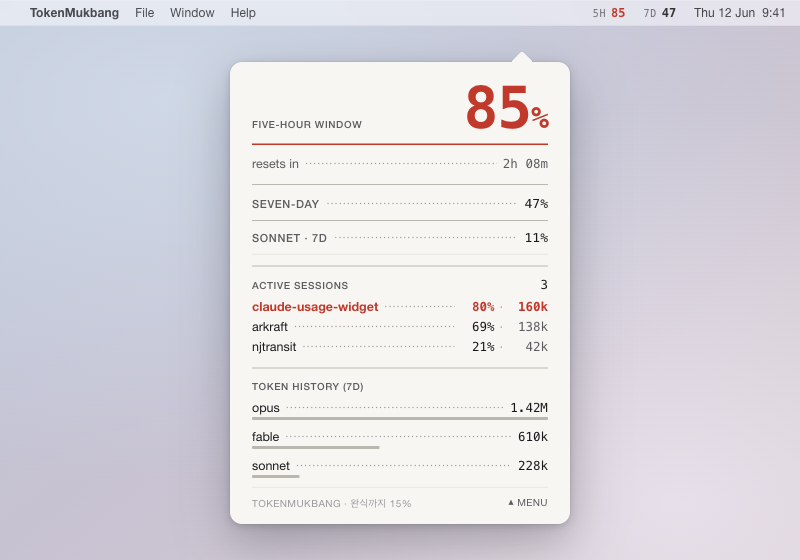

# 01. Grotesk Gauge (그로테스크 게이지)

> **한 줄 컨셉:** 주머니 속 스위스 연차보고서 — 토큰 예산을 재무표처럼 룰(rule)로 긋고 숫자를 우측 정렬로 컬럼에 고정한다. 색은 거의 쓰지 않고 위험은 **타입 두께 + 단 하나의 버밀리언 룰**로만 말한다.



---

## 무드보드 / 톤

**형용사:** 절제된(austere) · 사무적(clerical) · 정밀한(precise) · 활자중심(typographic) · 무표정한(deadpan)

페이퍼화이트 위에 0.5pt 헤어라인만으로 칸을 나눈, 손바닥만 한 연차보고서를 상상한다. 박스도 그림자도 둥근 모서리도 없다 — 구조는 오직 **룰(가로선)** 과 **베이스라인 그리드**, 그리고 **flush-left 라벨 / flush-right 숫자**의 긴장으로만 선다. 회계장부가 흑자에 색을 쓰지 않고 적자에만 빨강을 쓰듯, 이 화면도 평상시엔 차콜과 회색의 무채(無彩) 세계이고 버밀리언 레드는 "예산이 위험하다"는 단 하나의 신호로만 등장한다. 성격은 숫자가 아니라 가장자리(리더 닷·소문자 캡스 라벨·먹방식 카피)에 숨어 있어, 담백한 본문을 해치지 않는다.

## 컬러 토큰

거의 무채색이다. accent는 *예외적으로만* 칠해지는 위험 색이라, 일상 상태에선 화면에 등장하지 않는다.

| role | light | dark |
|---|---|---|
| `surface` (배경) | `#F7F6F2` 페이퍼화이트 | `#161618` 차콜 잉크 |
| `surface.raised` (섹션 음영, 선택적) | `#FFFFFF` | `#1E1E21` |
| `text.primary` (숫자·헤드라인) | `#1A1A1D` 차콜 | `#F3F1EC` |
| `text.secondary` (라벨·캡션) | `#5C5C60` | `#A7A7AD` |
| `text.tertiary` (리더 닷·마이크로타입) | `#9A9A9E` | `#6C6C72` |
| `hairline` (0.5pt 룰) | `#D8D6CF` | `#34343A` |
| `hairline.strong` (구획 룰) | `#B9B7AE` | `#4A4A52` |
| `accent.vermilion` (위험 전용) | `#C0392B` | `#E05A4A` |

> 다크 모드 버밀리언은 차콜 위 대비 확보를 위해 한 단계 밝힌 `#E05A4A`. light는 `#C0392B` 원색 유지. 그 외 모든 토큰은 채도 0에 가깝다.

**위험 4단계 매핑** — 핵심은 *색이 아니라 타입 두께 + 룰의 무게*다. 색은 critical/warning의 숫자에만 번진다.

| 단계 | 룰(행 구분선) | 숫자 두께·색 | 라벨 | 신호 hex |
|---|---|---|---|---|
| `calm` | 얇은 회색 헤어라인 0.5pt | Regular, `text.primary` `#1A1A1D` | secondary 회색 | `#D8D6CF` (룰) |
| `watch` | 중간 잉크 룰 0.75pt | Medium, `text.primary` `#1A1A1D` | primary | `#B9B7AE` (룰) |
| `warning` | 볼드 룰 1pt, 잉크 | **Bold**, 숫자만 버밀리언 `#C0392B` | primary, 캡스 | `#C0392B` (숫자) |
| `critical` | **행 전체를 가로지르는 버밀리언 솔리드 룰** 1pt | **Bold**, 버밀리언 `#C0392B` | primary, 캡스 | `#C0392B` (룰+숫자) |

이렇게 하면 흑백 출력·색각 이상·반투명 벽지 위에서도 위험이 **두께**로 먼저 읽히고, 색은 보너스 신호로 얹힌다.

## 타이포그래피

그로테스크(neo-grotesque) 한 패밀리로 통일한다. 성격은 글자꼴이 아니라 *조판*에서 나온다.

- **본문/라벨 그로테스크:** **Suisse Int'l** 성격(라이선스 회피 시 **Inter**, 시스템 폴백 **Helvetica Now / SF Pro**). 라벨은 소문자 캡스(small caps 느낌의 uppercase) + 트래킹 `+0.06em`, `text.secondary`.
- **숫자(주인공):** **tabular lining figures** 필수 — `monospacedDigit()`. 히어로 %는 거대한 사이즈(팝오버 56–64pt, 위젯 small은 타일을 꽉 채우는 ~96pt). 모든 숫자는 **flush-right**로 컬럼을 락(lock)한다.
- **위계:** 라벨은 작고 조용한 캡스, 숫자는 크고 무표정. 단계가 오를수록 라벨이 아니라 **숫자의 weight**가 올라간다 (Regular→Medium→Bold).
- **리더 닷:** 라벨과 숫자 사이를 목차식 점선(`········`)으로 잇는다. `text.tertiary` 색, tabular 폭이라 점 간격이 줄마다 흔들리지 않는다.

SwiftUI: `Font.system(size:, weight:, design: .default)` + `.monospacedDigit()`. 캡스 라벨은 `.textCase(.uppercase)` + `.tracking(_:)`.

## 레이아웃 & 셰이프 언어

- **셰이프 제로 정책:** 박스 없음, 그림자 없음, 코너 라운딩 없음, 채움(fill) 거의 없음. **모든 구조는 0.5pt 헤어라인 룰**로만 만든다.
- **4컬럼 베이스라인 그리드:** 라벨은 col 1–2에 flush-left, 숫자는 col 4에 flush-right. 행 높이는 베이스라인 그리드(8pt 배수)에 스냅.
- **정렬 규칙:** 라벨 = 소문자 캡스 + 트래킹, flush-left. 숫자 = tabular, flush-right. 둘을 리더 닷이 잇는다. 이 3요소가 모든 행의 골격.
- **여백이 구획:** 섹션 구분은 굵은 룰 + 넉넉한 상단 여백. 카드가 아니라 *문단*처럼 끊는다.

## 화면 목업

### 메뉴바

순수 타입, 글리프 없음, tabular. 반투명 벽지 위 가독성을 위해 **숫자만 Semibold**, 라벨은 Regular 캡스. 위험 시 해당 숫자만 버밀리언.

```
5H 05  7D 50
```

- `5H`/`7D` = 캡스 라벨(`text.secondary`), `05`/`50` = tabular 숫자(`text.primary`). 두 자리 zero-pad로 폭 고정 → 갱신 시 라벨이 안 흔들린다.
- critical이면 그 숫자만 `#C0392B` Bold. 예: `5H 05  7D 98` 에서 `98`만 빨강.
- 반투명 가독성 보강: 메뉴바 텍스트는 시스템 vibrancy(`NSColor.labelColor` 계열)를 따르되, 위험 숫자는 vibrancy를 끄고 solid 버밀리언으로 그려 벽지에 안 묻히게 한다.

### 팝오버

약 320pt 폭. 히어로 % → 상태줄 → 세션 리스트 → 모델별 토큰 히스토리(타이포 테이블). 막대 차트 없음 — 길이는 *밑줄*로 인코딩.

```
┌────────────────────────────────────────┐   ← 실제 테두리 없음(헤어라인만)
│                                        │
│  five-hour window                      │   라벨: 소문자 캡스, secondary
│                                  50%   │   히어로 숫자: 64pt tabular, flush-right
│  ──────────────────────────────────    │   calm = 얇은 회색 룰 0.5pt
│  resets in ········· 2h 14m            │   리더 닷 + tabular 시간
│                                        │
│  SEVEN-DAY ························ 50% │   watch = 중간 잉크 룰, 숫자 Medium
│  ════════════════════════════════════  │   강한 구획 룰(섹션 경계)
│                                        │
│  active sessions                  3    │   캡스 라벨 + tabular 카운트
│  arkraft-api ·············· 41%  ·145k │   ctx% + tabular 토큰
│  arkraft-web ·············· 12%  · 38k │
│  claude-widget ··········· 78%  ·160k  │   ← warning: 78%·160k Bold + 버밀리언
│  ──────────────────────────────────    │
│                                        │
│  token history (7d)                    │   캡스 섹션 라벨
│  opus ······················  1.42M    │   이름 flush-left + tabular 숫자 flush-right
│  ▔▔▔▔▔▔▔▔▔▔▔▔▔▔▔▔▔▔▔▔▔                  │   밑줄 길이 = 크기 인코딩(막대 대체)
│  sonnet ····················   880k     │
│  ▔▔▔▔▔▔▔▔▔▔▔▔                           │
│  haiku ·····················    47k     │
│  ▔▔                                     │
│                                        │
│  ────────────────────────────────────  │
│  TOKENMUKBANG · 완식까지 50%      ⏶ menu │   먹방 카피(가장자리) + 마이크로타입
└────────────────────────────────────────┘
```

- **히어로 %**: 윈도우 라벨은 작은 캡스, 숫자는 64pt tabular flush-right. 아래 룰의 무게가 곧 위험 단계.
- **세션 행**: `프로젝트 ··· ctx% · 토큰`. critical 세션은 행 전체 룰이 버밀리언 솔리드.
- **히스토리**: 막대 차트 대신 **이름(flush-left) + tabular 숫자(flush-right) + 길이로 크기를 인코딩하는 밑줄**(`▔▔▔`). 우측 숫자 컬럼이 정답, 밑줄은 한눈 비교용 보조.

### 위젯

**small** — 타일을 꽉 채우는 거대 숫자 하나 + 9pt 캡스 라벨 + 리셋 마이크로타입.

```
┌──────────────┐
│ 5H           │  ← 9pt 캡스 라벨, flush-left, secondary
│              │
│       50     │  ← 타일 채우는 ~96pt tabular 숫자, flush-right
│        %     │  ← % 글리프는 한 단 작게
│ ──────────── │  ← 위험 단계 = 룰 무게
│ resets 2h14m │  ← 마이크로타입, tertiary
└──────────────┘
```

**medium** — 좌측 히어로 숫자(5H), 우측 미니 테이블(7D % + 상위 세션 2줄 + 히스토리 1줄). 헤어라인 한 줄로 좌/우 컬럼 분할.

```
┌───────────────────────────────────────┐
│ FIVE-HOUR        │ 7D ········· 50%     │
│                  │ ─────────────────    │
│        50        │ arkraft-api ··· 41%  │
│         %        │ claude-widget · 78%  │  ← warning 숫자 버밀리언
│ ──────────────── │ ─────────────────    │
│ resets 2h 14m    │ opus 1.42M ▔▔▔▔▔     │
└───────────────────────────────────────┘
```

## 시그니처 무브

1. **리더 닷 (목차식 점선):** `claude-widget ········ 50%`. 라벨과 숫자를 잇는 점선이 이 컨셉의 지문(fingerprint). 모든 행·세션·히스토리에 일관 적용.
2. **메뉴바 all-type:** `5H 05  7D 50` — 아이콘 한 톨 없이 활자만으로. zero-pad tabular라 폭이 절대 안 흔들린다.
3. **버밀리언 룰 = 위험:** 색은 평소 0회 등장하다 critical에서만 행을 가로질러 솔리드로 그어진다. "적자에만 빨강."
4. **밑줄 길이 인코딩:** 차트 대신 `▔▔▔▔` 밑줄로 토큰 크기를 보여줘 활자 테이블의 결을 안 깬다.

## 먹방 정체성 반영 + "정확함 > 귀여움" 준수 방식

- **숫자/게이지는 100% 담백:** tabular 숫자·헤어라인·우측 정렬은 회계장부 그 자체. 먹방의 과장이 절대 숫자를 건드리지 않는다 — 위험은 색이 아니라 *읽히는 사실*(두께)로 전달.
- **성격은 가장자리에만:** 먹방 정체성("완식"=소진, 출연진=모델)은 본문이 아니라 **푸터 마이크로카피**와 라벨 어휘에서만 드러난다. 예: 팝오버 푸터 `TOKENMUKBANG · 완식까지 50%`, 히스토리 섹션의 출연진(opus/sonnet/haiku)이 "오늘 누가 제일 많이 먹었나"를 tabular 숫자로 정직하게 랭킹.
- **완식(소진) = critical:** 100%에 다다르면 행 전체 버밀리언 솔리드 룰 + Bold 레드 숫자. 귀여운 일러스트 없이 "장부가 적자로 넘어가는" 순간을 활자로만 표현 → 정확함이 컨셉을 압도.

## 장점 / 리스크

**장점**
- 반투명 벽지·다양한 배경에서 **타입 두께**가 1차 신호라 색에 의존 안 함 → 접근성·가독성 강함.
- SwiftUI 네이티브 프리미티브(`Text` + `.monospacedDigit()` + `Divider`/얇은 `Rectangle`)만으로 구현 → 저비용·고정밀.
- 정보 밀도 높고 노이즈 낮음. 데이터 위주 앱의 신뢰감.

**리스크**
- **메뉴바 all-type이 작게 묻힐 위험:** 반투명 벽지·작은 폰트에서 `5H 05`가 안 읽힐 수 있다 → 숫자 Semibold + 위험 시 solid 버밀리언 + 라벨/숫자 대비 충분히 확보로 완화. 최악의 경우 1px outline/shadow 미세 적용은 컨셉 위반이라 지양, 대신 weight로 해결.
- **헤어라인 1x 셰이밍:** 0.5pt 룰은 비레티나/저배율·반투명 위에서 사라질 수 있다 → Retina 가정, `hairline.strong` 변형 보유, 1pt로 폴백.
- **단조로움:** 색을 거의 안 써 "심심하다"는 인상 가능 → 리더 닷·밑줄 인코딩·먹방 카피로 결을 살림.
- **숫자 폭발 시 컬럼 깨짐:** `1.42M` 같은 단위 혼용. tabular + 통일 포맷(항상 1자리 소수 + 단위)으로 우측 정렬 컬럼 유지.

## 구현 난이도

**하(낮음) ~ 중.**

- **하:** 핵심이 전부 표준 SwiftUI 텍스트 조판이다. 히어로 %·라벨·세션 행·리더 닷·밑줄 인코딩 모두 `Text` + `.monospacedDigit()` + `.tracking()` + 얇은 `Rectangle(height: 0.5)`로 충분. 박스/그림자/애니메이션이 없어 레이아웃 버그 표면이 작다. 위험 4단계는 weight/색 토큰 분기 한 줄.
- **중(부분):** ① 리더 닷을 컨테이너 폭에 맞춰 동적으로 채우는 처리(`GeometryReader` 또는 가변폭 dot string + `Spacer` 트릭). ② 위젯 small의 타일-채우기 숫자는 `minimumScaleFactor` + `lineLimit(1)`로 안전하게. ③ 메뉴바 반투명 대비는 vibrancy on/off 분기 테스트 필요.

핵심 로직(% / 위험 단계 / 토큰 합계)은 모두 `TokenMukbangKit`이 이미 제공 → UI는 **순수 표현**만 담당(ADR-0001 준수). 새 데이터 경로 불필요.

## 트렌드 레퍼런스

1. **Suisse Int'l (Swiss Typefaces)** — "best Swiss Grotesk available in digital form", Hairline~Black 9웨이트 + **Suisse Int'l Mono**. 이 컨셉의 그로테스크+tabular 골격의 직접 레퍼런스. [swisstypefaces.com/fonts/suisse](https://www.swisstypefaces.com/fonts/suisse/)
2. **Inter (UI #1 typeface, 2026)** — 테이블·대시보드·데이터 비주얼에서 숫자 수직정렬이 핵심일 때 최적, tabular figures 지원. 라이선스-세이프 폴백. [madegooddesigns.com/inter-font](https://madegooddesigns.com/inter-font/)
3. **Swiss Style (모듈러 그리드 · 비대칭 · sans-serif · Akzidenz-Grotesk/Univers)** — 헤어라인 룰·flush 정렬·무채 + 단일 강조색 회계 미학의 출처. [Swiss Style — Wikipedia](https://en.wikipedia.org/wiki/Swiss_Style_(design)) · [2026 design trends — It's Nice That](https://www.itsnicethat.com/features/forward-thinking-graphic-trends-2026-graphic-design-120126)
