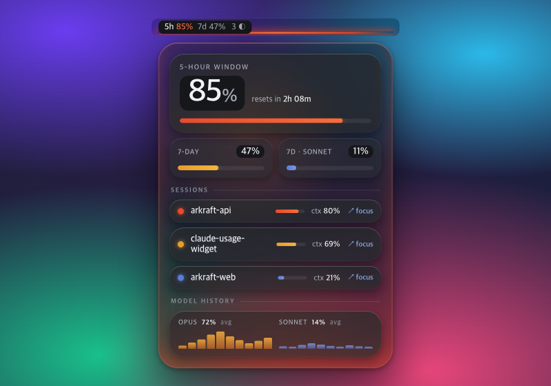
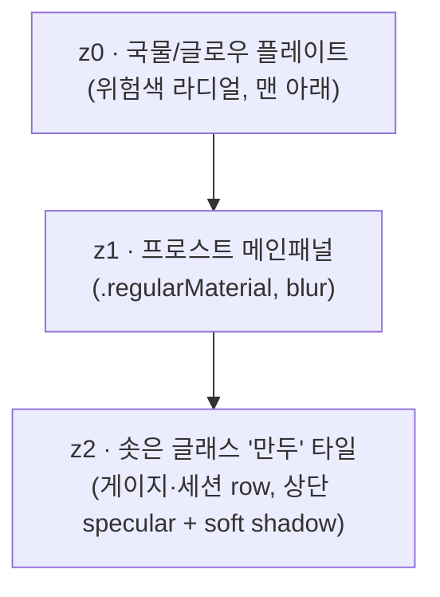

# 03. 유리국밥 (Glass Gukbap)

> **한 줄 컨셉:** 김 서린 유리 뚜껑 너머로 보는 데이터 한 그릇 — 위험 상태는 hue가 아니라 *프로스트 아래에서 밑에서 솟아오르는 국물의 발광(glow)* 으로 읽힌다. 유리는 차갑게 가라앉아 있고, 위험이 오를수록 국물이 데워져 패널 바닥을 물들인다.



## 무드보드 / 톤

- **김 서린 창문 / 뚝배기 뚜껑**: 차가운 유리 표면 너머로 안쪽의 뜨거운 것이 흐릿하게 번져 보이는 그 순간. 유리는 정적·차분·뉴트럴, 그 *아래*가 살아있다.
- **Apple Liquid Glass / visionOS material**: 반투명 + vibrancy + specular highlight로 "깊이"를 만든다. 하지만 우리는 2026년 가독성 walk-back을 의식해 — 유리는 장식, **숫자는 항상 불투명 스크림 위**.
- **온도(temperature)로서의 위험**: calm은 미지근한 잔열, critical은 낮게 끓는 엠버레드. 색이 시끄러운 게 아니라 *데워진다*. "국물이 끓어오른다"는 은유를 빛의 명도·번짐으로 직역.
- 키워드: frosted, submerged glow, meniscus, specular rim, graphite glass, low simmer.

## 컬러 토큰

유리/프로스트는 **쿨 뉴트럴**(채도 거의 0)로 고정 — 위험색이 유일하게 채도를 갖는 요소가 되도록. 라이트는 화이트스모크 프로스트(~88%L), 다크는 그래파이트 글래스(~16%L)에 위험 채도를 더 강하게.

| role | light | dark |
|---|---|---|
| frost.panel (z1 메인패널 베이스) | `#E8EAED` (~91%L) | `#1E2024` (~13%L) |
| frost.tile (z2 솟은 글래스 타일) | `#F4F5F7` (~96%L, 스페큘러 상단) | `#2A2D33` (~18%L) |
| scrim.number (숫자 밑 스크림, 1px↓) | `#DADCE0` (~87%L) | `#15171A` (~9%L) |
| ink.primary (히어로 %·숫자) | `#1A1C1F` | `#F2F3F5` |
| ink.secondary (라벨·캡션) | `#5B606A` | `#A7ACB5` |
| edge.lens (외곽 림 굴절 엣지 2px) | `#FFFFFF` @ 70% | `#FFFFFF` @ 22% |
| hairline (타일 구분선) | `#00000014` | `#FFFFFF1A` |
| glow.broth (z0 국물 플레이트 — 위험색 주입) | *위험 4단계로 가변, 아래 표* | *동일, 채도·alpha↑* |

`glow.broth`는 단일 색이 아니라 **위험 레벨이 주입하는 라디얼 글로우의 hue**다. z0 플레이트에만 칠하고 z1/z2는 프로스트 그대로 — 글로우가 *유리를 통과해 비쳐* 보이게 한다.

**위험 4단계 매핑:** (`RiskLevel` calm/watch/warning/critical — z0 국물 플레이트 라디얼 글로우 중심색. 라벨/텍스트 색이 아니라 *발광색*이다.)

| level | light glow | dark glow | 번짐 범위 |
|---|---|---|---|
| **calm** | `#E8A33D` @ 14% (희미한 웜앰버) | `#F0A93C` @ 22% | 게이지 밑 작은 라디얼만 |
| **watch** | `#E89B2E` @ 22% (허니) | `#F2A226` @ 32% | 게이지 + 타일 하단 |
| **warning** | `#E5742A` @ 34% (파프리카 오렌지) | `#F07A22` @ 46% | 팝오버 **바닥 전체**를 데움 |
| **critical** | `#D8472E` @ 44% (엠버레드, 낮게 맥동) | `#E84A2C` @ 58% | 패널 **가장자리까지** 번짐 + edge.lens 워밍 |

> **불변식 유지:** 기존 luminance-pinned 라벨색(텍스트가 어떤 배경에서도 대비 확보)은 그대로 둔다. 글로우는 **콘텐츠 뒤(z0)에만** 깔리고 텍스트 자체는 절대 칠하지 않는다. 위험은 "글자가 빨개짐"이 아니라 "그릇이 데워짐"으로 읽힌다.

## 타이포그래피

- **숫자/히어로 %**: `SF Pro Rounded` — 둥근 글래스 타일·국밥의 따뜻함과 합이 맞고, 작은 크기에서도 읽기 쉽다. 히어로 % `.largeTitle` semibold, tabular figures(자리 흔들림 방지).
- **라벨/상태/캡션**: `SF Pro Text` — 라운드는 숫자에만 한정해 정보 위계를 만든다. 라벨 `.caption` medium, `ink.secondary`.
- **메뉴바**: `SF Pro` `.system(size:13, weight:.medium)` monospaced-digit. 메뉴바는 폭이 흔들리면 거슬리므로 monospaced digit 강제.
- 모든 숫자는 **scrim.number 플레이트 위**에 올린다 — 프로스트/글로우가 아무리 번져도 숫자 대비는 스크림이 보장(가독성 룰).

## 레이아웃 & 셰이프 언어

**3겹 글래스 평면 (z-stack):**



- **z0 국물 플레이트**: 패널 bounds를 채우는 `RadialGradient` 레이어. 중심은 게이지 아래쪽, 위험 레벨이 색·alpha·반경을 결정. blur로 부드럽게 퍼뜨림.
- **z1 프로스트 메인패널**: `.regularMaterial` (라이트=ultraThin 쪽, 다크=regular). 국물이 *통과해 비치되* 형태는 흐려지는 정도.
- **z2 글래스 "만두" 타일**: 게이지·세션 row·모델 히스토리 각 항목이 살짝 솟은 타일. 상단에 가는 specular highlight(`edge.lens` 1px), 아래에 soft drop shadow. 떠 있는 만두처럼.
- **코너**: 연속 곡률(`.continuous`) **22~28pt** — 패널 28, 타일 22. 뚝배기의 둥근 입.
- **엣지 렌징**: 팝오버 **외곽 림에만** 2px 굴절 밝은 엣지(`edge.lens`). 내부 타일엔 안 줌(과하면 시끄럽다).
- **간격**: 16pt 패널 패딩, 타일 간 8pt, 타일 내부 12pt.

## 화면 목업

### 메뉴바

작고, 반투명 벽지 위에서도 읽혀야 한다. 텍스트는 **불투명 스크림 캡슐** 위, 그 밑 3px만 반투명 메니스커스 글로우.

```
┌─────────────────────┐
│  ▓ 42%  ·  3 ◐       │   ← 텍스트: 불투명 scrim 캡슐 위 (항상 가독)
│ ░░░░░░░░░░░░░░░░░░░░ │   ← 메니스커스: 3px 글로우 라인 (반투명, 위험색)
└─────────────────────┘
```

- `42%` = 가장 임박한 윈도우(5h/7d 중 max), `3 ◐` = 활성 세션 수.
- 밑 3px **국물 메니스커스** = 위험 레벨 색. calm=거의 안 보이는 웜, warning=주황, critical=레드. (시그니처, 아래)

### 팝오버 (320pt)

```
╔══════════════════════════════════════════╗   ← edge.lens 굴절 림 (2px)
║                                          ║
║   5-HOUR WINDOW                          ║
║   ┌────────────────────────────────────┐ ║   ← z2 타일 (specular 상단)
║   │            ███████  72%            │ ║   ← 히어로 %: SF Rounded, scrim 위
║   │   ▁▂▃▄▅▆▇█▇▆▅▄▃ resets in 1h 48m   │ ║
║   └────────────────────────────────────┘ ║
║                                          ║
║   7-DAY · 38%        OPUS 7D · 61%       ║
║   ▓▓▓▓▓░░░░░░░░░     ▓▓▓▓▓▓▓▓▓▓▓░░░░     ║
║                                          ║
║   ── SESSIONS ──────────────────────────  ║
║   ┌────────────────────────────────────┐ ║   ← z2 타일
║   │ ◐ arkraft-api      ctx 47%  ↗ focus│ ║
║   └────────────────────────────────────┘ ║
║   ┌────────────────────────────────────┐ ║
║   │ ◑ usage-widget     ctx 12%  ↗ focus│ ║
║   └────────────────────────────────────┘ ║
║                                          ║
║   ── MODEL HISTORY ─────────────────────  ║
║   opus    ▁▃▅▇▆▄▂▁▃▅   sonnet  ▁▁▂▃▂▁▁   ║
║                                          ║
║░░░░░░░░░░░░░░░░░░░░░░░░░░░░░░░░░░░░░░░░░░░░║   ← z0 국물 글로우: warning이면
╚══════════════════════════════════════════╝     바닥 전체가 주황으로 데워짐
```

- 히어로 %·게이지가 솟은 타일에. 세션 row·히스토리도 타일 스택.
- 위험이 warning/critical이면 z0 글로우가 **바닥에서 위로** 차오르듯 패널을 물들인다(텍스트는 스크림이 막아 안 칠해짐).

### 위젯

**위에서 내려다본 그릇** — 프로스트 디스크, 중심에서 국물이 발광, % 림 주변에 스팀라이트 아크.

```
small (위에서 본 그릇)        medium (그릇 + 사이드)
┌──────────────┐            ┌────────────────────────────┐
│   ╭──────╮   │            │   ╭──────╮    5H   72% ▓▓▓▓ │
│  ╱  ⌣⌣⌣  ╲  │            │  ╱  ⌣⌣⌣  ╲   7D   38% ▓▓░░ │
│ │  ◜72%◝  │ │            │ │  ◜72%◝  │  OPUS 61% ▓▓▓░ │
│  ╲  ◟◞   ╱  │            │  ╲  ◟◞   ╱   sessions: 3   │
│   ╰──────╯   │            │   ╰──────╯    resets 1h48m │
│  resets 1h48 │            │                            │
└──────────────┘            └────────────────────────────┘
  ⌣ = 스팀라이트 아크 (림 주변, 위험색)
  중심 ◜72%◝ = 국물 글로우 위 히어로 %
```

- 위젯은 **정적** — App이 쓴 스냅샷을 읽기만(ADR-0003). 맥동·애니메이션 없이 *현재* 위험색 한 프레임만. 스팀 아크는 정지 이미지.

## 시그니처 무브

**국물 메니스커스 (Broth Meniscus)** — 메뉴바 텍스트 바로 밑 **3px 글로우 라인**. 위험이 오를수록 웜앰버 → 허니 → 파프리카 → 엠버레드로 *데워진다*. 텍스트는 불투명 스크림 캡슐 위에 있고, **메니스커스만 반투명** — 벽지 위에 국물이 살짝 찰랑이는 느낌. 메뉴바에서 픽셀 3개로 "지금 그릇이 얼마나 끓는지"를 전한다.

부가: 팝오버에선 같은 언어가 z0 국물 플레이트로 확장되어 "바닥부터 차오르는 글로우"가 된다 — 메뉴바 메니스커스와 팝오버 글로우가 같은 은유의 small/large 버전.

## 먹방 정체성 반영 + "정확함 > 귀여움" 준수 방식

- **먹방(ADR-0009) 반영**: "데이터 한 그릇", 국물=상태, 만두 타일, 그릇 위젯, 스팀라이트 — 음식 은유가 *구조에 녹아* 있되 일러스트·캐릭터·이모지 떡칠이 아니다. 은유는 형태·빛으로만 표현(귀여운 그림 0개).
- **"정확함 > 귀여움" 준수**:
  - 숫자는 **언제나 불투명 스크림 위**, tabular/monospaced digit — 글로우가 아무리 번져도 값의 가독·정렬은 불변.
  - 위험은 *글로우(콘텐츠 뒤)* 로만 표현, 텍스트 색은 luminance-pinned 유지 → 위험 신호가 데이터를 가리지 않는다.
  - 애니메이션은 critical의 "낮은 맥동" 하나로 절제, 위젯은 완전 정적. 분위기를 위해 정보를 흐리지 않는다.
  - 게이지·%·리셋시각·ctx% 등 **수치가 1순위 위계**, 유리/글로우는 그 뒤 배경.

## 장점 / 리스크

**장점**
- 위험을 hue가 아닌 **명도·온도·번짐**으로 인코딩 → 색각 이상·반투명 벽지에서도 "데워짐"이 읽힌다.
- Apple Liquid Glass와 자연스럽게 정렬되어 native macOS에 이질감 없음.
- 메니스커스 시그니처가 메뉴바라는 극소 공간에서도 강한 정체성을 준다.
- 텍스트/글로우 레이어 분리로 "예쁨"과 "정확함"이 충돌 없이 공존.

**리스크 (정직하게)**
- **글로우 비용**: z0 라디얼 + z1 material blur 다겹 합성은 GPU 부담. 팝오버는 괜찮지만 60s 갱신·다중 위젯에서 점검 필요(blur 반경 캡, 정적 캐싱).
- **위젯 정적 처리**: WidgetKit은 실시간 맥동 불가 → "끓는 국물"의 동적 매력이 위젯에선 약해진다(한 프레임 스냅샷으로 타협).
- **웜글로우 ↔ 정확함 긴장**: 따뜻한 발광이 "cozy/감성적"으로 읽혀 "정확함>귀여움" 룰과 미세한 긴장. calm 글로우 alpha를 충분히 낮춰(≤14%) 평상시엔 거의 안 보이게 해야 "장식이 정보를 압도" 인상을 피함.
- **벽지 위 메니스커스 오독**: 반투명 메니스커스가 화려한 벽지와 겹쳐 위험색이 왜곡될 수 있음 → 메니스커스 뒤에 아주 옅은 뉴트럴 스크림 1px를 깔아 hue 보존 권장.

## 구현 난이도 (SwiftUI — 상/중/하)

- **하**: z1 프로스트 패널(`.regularMaterial`), 연속 코너, 스크림 캡슐, tabular digit — 표준 SwiftUI.
- **중**: z0 위험 라디얼 글로우(`RadialGradient` + `.blur`), z2 specular 타일(linear highlight + shadow), 메뉴바 메니스커스(3px 글로우 바). 레이어 합성·alpha 튜닝이 핵심.
- **상**: 외곽 edge.lens 굴절 림(2px 그라데이션 stroke로 근사), critical 저속 맥동(`.animation` 또는 `TimelineView`), 글로우 합성 성능 최적화(blur 캐싱). 위젯은 동적 불가라 정적 근사로 내려 난이도↓.

> 종합 **중** — Liquid Glass 자체는 SwiftUI material로 거의 무료, 난이도는 "글로우 레이어 합성 + 성능"에 몰려 있다.

## 트렌드 레퍼런스

1. **Apple — "Apple introduces a delightful and elegant new software design" (Newsroom, 2025)** — https://www.apple.com/newsroom/2025/06/apple-introduces-a-delightful-and-elegant-new-software-design/ — Liquid Glass 공식 발표(iOS 26 / macOS Tahoe / visionOS 26 전반). 본 컨셉의 "반투명 유리 + 깊이" 토대.
2. **Apple HIG — "Materials"** — https://developer.apple.com/design/human-interface-guidelines/materials — blur·vibrancy·blending·specular highlight로 *유리 아래 구조*를 드러내는 material 스펙. z-stack/specular 타일·vibrancy 설계의 직접 근거.
3. **9to5Mac — "iOS 26.1 beta 4 adds new setting to tone down Liquid Glass transparency" (2025-10)** — https://9to5mac.com/2025/10/20/ios-26-1-beta-4-adds-new-setting-to-tone-down-liquid-glass-transparency/ — 가독성 불만 이후 Apple의 "Tinted"(불투명↑) 옵션 추가 = 2026 walk-back. **"숫자는 불투명 스크림 위" 룰의 근거** — 유리를 멋으로 쓰되 가독성은 타협 안 함.
