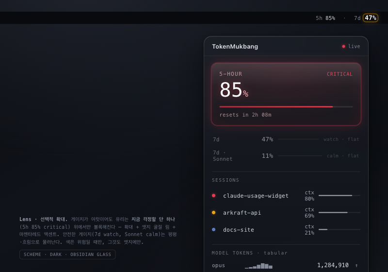

# 04. Lens (렌즈)

> **한 줄 컨셉:** 차갑고 정밀한 계기(instrument) 유리 — 모든 사용량이 한 장의 클리어 글래스 *아래*에 놓이고, 그 유리가 위험한 지표 위에서만 실제로 *볼록하게 굴절·확대*된다(게이지 위에 얹힌 루페처럼). 색으로 외치지 않고, *유리가 변형되는 것*으로 위험을 먼저 지각시킨다.



---

## 무드보드 / 톤

- **계기판 유리 / 측정 장비 (instrument glass).** 정밀 저울, 항공 계기, 카메라 뷰파인더, 현미경 슬라이드 위의 커버글래스. 따뜻하지 않다 — 차갑고, 조용하고, 신뢰감 있다.
- **광학 루페 (jeweler's loupe).** 보석상이 한 점만 들여다보는 확대경. 시야 전체가 아니라 *단 하나의 결함*에 유리를 갖다 댄다. 이게 시그니처 메타포.
- **near-monochrome graphite + clear glass.** 거의 흑백에 가까운 그래파이트 필드. 라이트 모드는 near-white 스크림 위 페일 클리어 글래스, 다크 모드는 스모크드 옵시디언(smoked obsidian). Apple의 `glassEffect` 스펙트럼 중 **"tinted, low-translucency"** 끝 — 일부러 어둡고 채도 낮은 쪽에 위치시켜 generic-bright-glass 룩을 피한다.
- **깊이는 blur가 아니라 lensing.** 흐림으로 레이어를 만들지 않는다. 빛을 *굴절(refraction)* 시켜 "유리 한 장이 떠 있다"를 전달한다. 2겹 max(다크 베이스 스크림 1장 + 클리어 렌즈글래스 1장).
- 레퍼런스 감각어: *cold, optical, surgical, quiet, precise, "the only color in the room".*

## 컬러 토큰

near-monochrome 필드. 위험 액센트는 *방 안의 유일한 색* — 채움(fill)이 아니라 **굴절 엣지(refractive edge)** 로만 등장한다. 모노크롬 베이스라 작은 액센트도 크게 읽힌다.

| role | light | dark |
|---|---|---|
| `bg.scrim` (베이스 스크림) | `#F4F5F7` | `#0C0D10` |
| `glass.lens` (렌즈 글래스, 반투명) | `#FFFFFF` @ 38% | `#1A1C22` @ 46% |
| `glass.hairline` (1px 헤어라인 림) | `#11131A` @ 12% | `#FFFFFF` @ 14% |
| `text.primary` (히어로 숫자) | `#15171C` | `#F2F3F6` |
| `text.secondary` (라벨·캡션) | `#5B606B` | `#9AA0AD` |
| `text.tabular` (모노 숫자) | `#22262F` | `#D7DBE3` |
| `accent.refraction` (현재 위험 색) | *상태별, 아래 매핑* | *상태별, 아래 매핑* |

> 액센트는 게이지 *내부*를 칠하지 않는다. 위험 게이지의 렌즈 엣지·굴절 림·확대된 숫자의 외곽선에만 입혀, 모노크롬 필드 위에서 "딱 하나의 색이 빛난다"가 되게 한다.

**위험 4단계 매핑:** (`RiskLevel` calm/watch/warning/critical — `RiskScorer`가 산출하는 4-레벨에 1:1)

| level | hue 의도 | hex | 렌즈 왜곡 강도 |
|---|---|---|---|
| `calm` | slate-blue (조용·중립) | `#5B7CC4` | **평평한 유리** — 굴절 거의 0, 림만 희미 |
| `watch` | teal | `#1FA6A0` | 살짝 볼록, 미세 굴절 |
| `warning` | amber | `#E8A317` | 눈에 띄게 볼록, 엣지 굴절 + 숫자 ~10% 확대 |
| `critical` | magenta-red | `#E5394E` | 강하게 볼록, 빛 굴절 림 또렷, 최대 확대 |

핵심: **위험 hue가 색뿐 아니라 렌즈 왜곡 강도(distortion intensity)를 함께 구동**한다. calm은 평평한 유리, critical은 눈에 띄게 볼록한 루페. 사용자는 색을 읽기 *전에* "유리가 부풀었다"를 먼저 지각한다.

## 타이포그래피

- **숫자(히어로 %, 게이지 값, 토큰 카운트): SF Mono, tabular figures.** 계기판 정체성의 핵심. 자리수가 흔들리지 않아 측정값처럼 읽힌다. 모델 토큰 히스토리 스택에서 특히 tabular가 정렬을 잡아준다.
- **라벨·상태 텍스트: SF Pro Text.** 작고 조용하게. 라벨은 `text.secondary`, 약한 트래킹(+0.3).
- 위계: 히어로 % `34pt / SF Mono Medium`, 게이지 값 `15pt SF Mono`, 라벨 `11pt SF Pro`, 모델 히스토리 행 `12pt SF Mono`.
- 메뉴바는 폭 절약을 위해 `SF Mono 11pt`, 위험 숫자만 확대 시 ~`12pt`로.

## 레이아웃 & 셰이프 언어

- **얇은 1px 헤어라인.** 두꺼운 보더 금지. 유리의 가장자리는 머리카락 같은 한 줄로만.
- **작은 곡률 12~16pt.** 둥글둥글하지 않다 — 샤프하고 인스트루먼트한 코너. 위젯 타일은 16pt, 팝오버 내부 게이지 카드는 12pt.
- **깊이 = 렌징/굴절, 그림자 최소.** 떠 있음을 drop-shadow가 아니라 글래스 굴절 + 헤어라인 하이라이트로 표현.
- **레이어 2겹 max:** `bg.scrim`(불투명에 가까운 베이스) + `glass.lens`(클리어 1장). 그 이상 쌓지 않아 평면적·정밀하게.
- 게이지는 가는 트랙(2pt) + 가는 진행 림. 채움 면적이 아니라 *엣지*로 값을 표현해 모노크롬을 유지.

## 화면 목업

### 메뉴바

near-불투명 다크 마이크로스크림 위에 모노 텍스트 — **가독성 최우선**(반투명이라도 글자는 또렷해야 함). 7d가 warning 임계를 넘으면 그 % 숫자만 *작은 확대경 아래*처럼 ~10% 커지고 굴절 림이 생긴다. 건강한 숫자는 평평·조용.

```
정상:    5h 05%   7d 50%
warning: 5h 05%   7d ⌖74%      ← 74% 숫자만 ~10% 확대 + amber 굴절 림
```

(`⌖` = 그 숫자 위에 볼록 렌즈가 얹힌 상태를 표기. 실제로는 글자만 살짝 크고 가장자리에 amber 헤어라인.)

### 팝오버 (320pt)

옵시디언 글래스 카드. 가장 위험한 게이지가 *보이는 루페 아래*(확대 + 엣지렌즈 + 액센트 림), 안전한 게이지는 평평·흐림으로 뒤로 물러난다.

```
┌──────────────────────────────────────────────┐
│  TokenMukbang                          ●live  │  ← 1px 헤어라인 헤더
│  ────────────────────────────────────────────  │
│                                                │
│        ╭───────────────────────────╮          │
│        │ ╱                       ╲  │          │  ← critical 게이지가
│        │     7-DAY        ⌖89%      │          │     볼록 루페 아래:
│        │ ╲   ▓▓▓▓▓▓▓▓▓▓▓▓▓▓░░    ╱  │          │     숫자 확대 +
│        │   resets in 2d 4h          │          │     magenta 굴절 림
│        ╰───────────────────────────╯          │     (방 안 유일한 색)
│                                                │
│   5-HOUR        05%   ░░░░░░░░░░░░░  · flat    │  ← 평평·흐림(calm)
│   7d · Opus     32%   ▓▓▓▓░░░░░░░░░  · flat    │
│   7d · Sonnet   18%   ▓▓░░░░░░░░░░░  · flat    │
│  ────────────────────────────────────────────  │
│   SESSIONS                                     │
│   ● my-api      ctx 41%   ▓▓▓▓░░░░░░           │
│   ● docs-site   ctx 12%   ▓░░░░░░░░░           │
│  ────────────────────────────────────────────  │
│   MODEL TOKENS (SF Mono, tabular)              │
│   opus      1,284,910   ▁▂▃▅▇▆▄  ↑              │
│   sonnet      412,330   ▁▁▂▂▃▂▂                 │
│   haiku        38,002   ▁▁▁▁▂▁▁                 │
└──────────────────────────────────────────────┘
   ↑ critical 게이지 하나만 루페 아래. 나머지는 전부
     평평하고 흐려 시선이 자동으로 "걱정할 하나"에 꽂힌다.
```

### 위젯

다크 글래스 타일. small/medium 모두 **한도에 가장 가까운 윈도우 한 숫자만 확대**(pre-baked 정적 루페 — 위젯은 셰이더를 못 쓰므로 미리 렌더된 확대 이미지로 fake).

```
small (눈에 가장 가까운 1개만 루페):     medium (확대 1 + 평평 리스트):
┌───────────────┐                     ┌─────────────────────────────┐
│ TokenMukbang  │                     │ TokenMukbang        ●live    │
│               │                     │   ╭─────────╮                │
│    ⌖89%       │  ← 7d critical      │   │  ⌖89%   │  7-DAY         │
│    7-DAY      │     숫자만 볼록·     │   ╰─────────╯  resets 2d 4h  │
│  resets 2d 4h │     magenta 림      │   5h 05%  · 7d-opus 32% · flat│
└───────────────┘                     │   3 sessions active          │
                                      └─────────────────────────────┘
```

## 시그니처 무브

**선택적 확대 (selective magnification).** 화면에 게이지가 여럿이어도, 유리는 *지금 걱정해야 할 단 하나의 지표* 위에서만 볼록해지고 굴절한다. 나머지는 평평·흐림으로 뒤로 물러난다. 색으로 소리치지 않고 **초점(focus)** 으로 말한다 — "여기를 봐"가 아니라 "여기만 유리가 부풀었네"가 되도록. 위험이 올라갈수록(calm→critical) 그 한 게이지의 볼록함·굴절 강도가 단계적으로 커진다.

## 먹방 정체성 반영 + "정확함 > 귀여움" 준수 방식

- **먹방(ADR-0009) = "토큰을 먹어 치운다"의 시각화.** Lens는 이걸 *과식 경고를 들여다보는 검사관의 유리*로 번역한다 — 음식(토큰)을 게걸스럽게 먹는 연출 대신, 접시가 얼마나 비었는지를 *루페로 정밀하게 들여다보는* 쪽. 굶주림/포만의 위급함은 "위험할수록 유리가 부푼다"로 은유된다. 한 입씩 사라지는 모델 토큰 히스토리(sparkline)가 "먹는 중"의 기록.
- **"정확함 > 귀여움" 준수:**
  - 확대는 *장식이 아니라 정보*다. 볼록함의 정도 = 위험의 정도이므로, 확대 자체가 데이터를 전달한다(가짜 모션이 아님).
  - 숫자는 항상 SF Mono tabular — 측정값처럼 정확히. 확대돼도 자릿수·정렬이 흔들리지 않는다.
  - 모노크롬 + 단일 액센트라 "귀여운 색잔치"가 원천 차단된다. 색은 위험일 때만, 그것도 엣지에만.
  - 확대 모션은 위험 상태가 *바뀔 때 한 번* 부드럽게(≤250ms ease) 일어나고 멈춘다. 상시 출렁이는 애니메이션 금지 → gimmick·정확함 룰 위반 회피.

## 장점 / 리스크

**장점**
- 정보 위계가 시각 메타포와 1:1. "걱정할 하나"가 물리적으로 튀어나와 인지 부하가 낮다.
- 모노크롬이라 위험 색이 압도적으로 잘 읽힌다(시그널 대 노이즈 최고).
- Liquid Glass / lensing이라는 2025~2026 Apple 디자인 언어와 정확히 동조 — 네이티브하게 보인다.
- 메뉴바·위젯의 좁은 공간에서도 "한 숫자만 확대"가 깔끔하게 작동.

**리스크**
- **실시간 렌징 비용.** 굴절 셰이더는 GPU를 쓴다 — 팝오버는 OK지만 상시 60fps로 돌리면 배터리·발열. → 상태 전환 시에만, 그리고 위험 게이지에만 적용해 비용 억제.
- **위젯 한계.** 위젯은 Metal 셰이더/실시간 굴절 불가 → pre-baked 정적 확대 이미지로 fake. 라이브 렌징과 룩이 미세하게 다를 수 있음(허용 가능한 trade-off로 명시).
- **확대 모션 과용 = gimmick.** 출렁임이 잦으면 "귀여움"으로 미끄러져 정확함 룰 위반. 모션은 드물고 짧게.
- **모노크롬의 함정.** 잘못하면 generic-Apple-glass거나 차갑다 못해 스테릴(무미)해 보일 수 있음. → tinted obsidian 톤 + 위험 시 한 점의 강렬한 색 + SF Mono의 계기판 캐릭터로 "정밀한 도구" 인격을 부여해 방어.

## 구현 난이도 (SwiftUI)

| 영역 | 난이도 | 근거 |
|---|---|---|
| 모노크롬 글래스 카드 (`glassEffect`, tinted/low-translucency) | **하** | iOS26/Tahoe 네이티브 API로 직행 |
| 1px 헤어라인 / 12~16pt 곡률 / 게이지 트랙 | **하** | 표준 Shape/stroke |
| 메뉴바 선택적 숫자 확대 + 굴절 림 | **중** | 텍스트 scale + 조건부 림은 쉽지만, 위험 임계 연동·가독 보장 튜닝 필요 |
| 팝오버 실시간 굴절 루페 (위험 게이지 볼록) | **상** | Metal/`layerEffect` 셰이더로 실제 lensing. 성능·상태전환 제어가 까다로움 |
| 위젯 pre-baked 정적 확대 | **중** | 셰이더 불가 → 확대 이미지/레이아웃을 미리 구성, 라이브 룩과 정합 맞추기 |

핵심 위험은 **팝오버 굴절 셰이더(상)** 하나에 집중 — 나머지는 네이티브 API로 하~중.

## 트렌드 레퍼런스 (Liquid Glass lensing/refraction)

1. **Apple — *Meet Liquid Glass* (WWDC25 / Newsroom, 2025).** Liquid Glass는 단순 블러가 아니라 주변을 *반사·굴절*하는 재질이며, "lensing(빛을 휘게·집중시켜 레이어와 존재를 전달)"을 핵심 원리로 명시. 본 컨셉의 "blur가 아니라 lensing으로 깊이" 원칙의 1차 근거. — [apple.com/newsroom](https://www.apple.com/newsroom/2025/06/apple-introduces-a-delightful-and-elegant-new-software-design/), [developer.apple.com/videos WWDC25-219](https://developer.apple.com/videos/play/wwdc2025/219/)
2. **Victor Baro — *Implementing a Refractive Glass Shader in Metal* (Medium).** Metal로 굴절 글래스를 구현하며 *"full distortion along the surface + tight edge"의 확대경(magnifying glass) 효과*를 직접 다룸 — Lens의 "위험 게이지 위 볼록 루페 + 또렷한 굴절 엣지"를 SwiftUI/Metal `layerEffect`로 실현하는 레시피의 직접 레퍼런스. — [medium.com/@victorbaro](https://medium.com/@victorbaro/implementing-a-refractive-glass-shader-in-metal-3f97974fbc24)
3. **macOS Tahoe Liquid Glass 굴절 거동 (OWC / AppleInsider 리뷰, 2025).** Tahoe에서 슬라이더·다이얼로그가 다른 요소 위로 지날 때 발생하는 *liquid refraction*이 "지금 조작 중인 것을 강조"하는 데 쓰임 — Lens의 "선택적 확대로 걱정할 하나를 강조" 패턴이 OS 차원에서 검증된 거동임을 뒷받침. + 접근성(Reduce Transparency) 고려도 여기서 가져옴. — [eshop.macsales.com/blog](https://eshop.macsales.com/blog/97650-blurry-or-beautiful-the-tweaks-and-tenets-of-apples-controversial-liquid-glass-design-in-macos-tahoe/), [appleinsider.com](https://appleinsider.com/articles/25/09/15/macos-tahoe-with-liquid-glass-clipboard-history-and-more-is-now-available)
