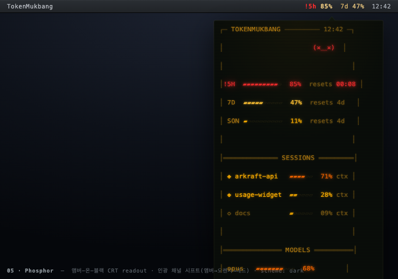

# 05. Phosphor (인광)

> **한 줄 컨셉:** 토큰 한도에 켜놓은 `htop` — 앰버-온-블랙 CRT readout. 평소엔 앰버 #FFB000 인광으로 조용히 타다가, 한도가 차오르면 화면 자체가 *인광 채널 시프트*로 오렌지→레드로 발광하며 점멸한다. 차트정크 색을 더하는 게 아니라, 화면이 달궈진다.



## 무드보드 / 톤

- **레퍼런스 이미지:** VT220/Wyse 앰버 단색 터미널, `htop`·`btop` TUI, IBM 3270 그린스크린의 앰버 변종, Cool Retro Term의 스캔라인·비네팅.
- **감각어:** 달궈진(warm), 단색(monochrome), 박스드로잉(box-drawing), 인광 잔광(phosphor afterglow), 진단 readout(diagnostic), 정직한 계기판(honest gauge).
- **톤:** 향수가 아니라 **계측**. 1983년 인광을 흉내내되 2026년 가독성으로 — "예쁜 레트로 스킨"이 아니라 "토큰을 감시하는 계기판"이다. 장식은 박스드로잉 룰과 블록 미터가 전부이고, 모든 픽셀은 수치를 읽게 만드는 데 복무한다.
- **단색 원칙:** 색을 *추가*하지 않는다. 단 하나의 인광 채널(앰버)이 위험에 따라 색온도를 올린다(앰버→핫골드→오렌지→레드). 그래서 화면 어디를 봐도 "지금 얼마나 뜨거운가"가 한눈에 읽힌다.

## 컬러 토큰

다크가 주 모드(near-black CRT). 라이트는 메뉴바 흰 바·밝은 환경 가독성을 위한 "종이 터미널 반전".

| role | light (종이 터미널) | dark (CRT, 주 모드) |
|---|---|---|
| `bg` (캔버스) | `#F4F0E4` 크림 | `#0A0E0A` near-black |
| `bg.vignette` (모서리 감쇠) | `#ECE7D6` | `#050705` |
| `ink` / `text.primary` | `#1A1A1A` 잉크 | `#FFB000` 앰버 인광 |
| `text.secondary` (라벨·캡스) | `#6B6452` | `#B07A12` 감쇠 앰버 |
| `text.dim` (메타·resets) | `#9A9484` | `#7A5A14` 잔광 |
| `rule` (박스드로잉 룰 `┌─┐`) | `#C9B98E` 다크앰버 | `#5A4410` 앰버 룰 |
| `meter.fill` (블록 채움 `▰`) | `#B5781A` 다크앰버 | `#FFB000` 앰버 |
| `meter.track` (빈 블록 `▱`) | `#D8D0BC` | `#23200F` |
| `accent.cursor` (블록 커서 `█`) | `#1A1A1A` | `#FFB000` |
| `scanline` (1px, dark 전용) | — (안 씀) | `#000000` @ 8% alpha |

**위험 4단계 매핑** — 인광 채널 시프트(같은 채널이 달궈짐):

| level | dark hex | light hex | 동작 |
|---|---|---|---|
| `calm` | `#FFB000` 앰버 | `#B5781A` 다크앰버 | 정상 인광. 텍스트·채움 블록 기본색 |
| `watch` | `#FFC233` 핫 앰버골드 | `#A8761A` | 살짝 달궈진 골드. 점멸 없음 |
| `warning` | `#FF6A00` 인광 오렌지 | `#C2520A` | 오렌지로 시프트. 해당 미터만 |
| `critical` | `#FF2E2E` 레드 인광 | `#C42020` | 미터가 레드로 *뒤집히고* 미세 플리커(0.9↔1.0 opacity, ~1.2s), `!` 프리픽스 |

> 색맹 안전: 색만으로 신호하지 않는다. 블록 채움 레벨(`▰` 개수)이 1차 신호, `!` 프리픽스가 critical의 2차 신호. 색은 보조다.

## 타이포그래피

- **서체:** Berkeley Mono (TX-02) 전반 — 본문 13px, 헤더·대형 수치 동일 패밀리. TX-02는 70년대 기계 판독 서체의 객관성 + 휴머니스트 가독성을 의도해 만든 터미널 폰트로, 작은 13px와 대형 글리프 양쪽에서 깨끗하다. (번들 라이선스 필요 → 폴백: SF Mono → Menlo)
- **위계:**
  - `H / 헤더 캡스`: `SESSIONS` `MODELS` 처럼 전부 대문자 + 와이드 트래킹(+8%), `text.secondary`.
  - `수치(미터 %)`: 13px regular, 인광색. 큰 수치 없음 — TUI는 모든 행이 같은 무게다.
  - `메타(resets 02:11)`: 13px, `text.dim`.
- **금지:** 가변 자간·프로포셔널 폰트·이탤릭 강조 금지. 모든 정렬은 모노스페이스 그리드(셀 정렬)로 잡는다.

## 레이아웃 & 셰이프 언어

- **그리드:** 문자 셀 그리드(monospace cell grid). 모든 요소는 N칸 폭 박스에 정렬된다. 픽셀 패딩이 아니라 *글자 칸* 단위로 레이아웃.
- **셰이프:** 둥근 모서리·드롭섀도 **전면 금지**. 경계는 박스드로잉 룰 `┌─┐ │ └─┘`, 디바이더 `═══════`, 미터는 블록 글리프 `▰▰▰▰▰▱▱▱▱▱`.
- **CRT 질감:**
  - `다크`: 1px 스캔라인 오버레이(8% alpha) + 모서리 비네팅. 팝오버에 한해 *거의 0에 가까운* CRT 곡률(시각적 암시만, 텍스트 왜곡 없는 수준).
  - `메뉴바`: 스캔라인·글로우·비네팅 전부 **없음**. 평면 텍스트 + 색만.
  - `라이트`: 스캔라인 없음(크림 위에서 더럽기만 함). 비네팅만 아주 옅게.
- **블록 커서:** 팝오버 헤더/입력 위치에 깜빡이는 `█` (앰버, ~1.0s blink) — "켜져 있다"는 살아있음 신호.

## 화면 목업

### 메뉴바

평면 텍스트, **글로우·스캔라인 없음**(작은 크기에서 illegible). 색 시프트만 위험을 표현.

```
calm     5h 05%  7d 50%
compact  5h▕▎ 7d▕▋
critical !5h 96%  7d 50%        ← '5h 96%' 가 레드 인광 #FF2E2E
```

- 기본형 `5h 05%  7d 50%` — 두 윈도우 퍼센트 평면 표기.
- 초소형 `5h▕▎ 7d▕▋` — 1칸 블록 게이지(공간 부족 시).
- critical: `!` 프리픽스 + 해당 토큰만 레드 시프트. 메뉴바 라벨엔 플리커도 안 줌(흰 바에서 산만·가독성).

### 팝오버 (~320pt — 터미널 창처럼)

```
┌─ TOKENMUKBANG ──────────── 12:42 ─┐
│                          ( ˘ ³˘)  │
│                                   │
│ 5H  ▰▰▱▱▱▱▱▱▱▱  05%  resets 02:11 │
│ 7D  ▰▰▰▰▰▱▱▱▱▱  50%  resets 4d   │
│ 7D OPUS  ▰▰▰▰▰▰▰▱▱▱  68%  resets 4d│
│                                   │
│═══════════════ SESSIONS ══════════│
│ ◆ arkraft-api    ▰▰▰▰▱▱  41% ctx  │
│ ◆ usage-widget   ▰▰▱▱▱▱  22% ctx  │
│ ◇ docs           ▰▱▱▱▱▱  09% ctx  │
│                                   │
│═══════════════ MODELS ════════════│
│ opus     ▰▰▰▰▰▰▰▱▱▱  68%           │
│ sonnet   ▰▰▰▱▱▱▱▱▱▱  31%           │
│ haiku    ▰▱▱▱▱▱▱▱▱▱  04%           │
│                                   │
│ > _█                              │
└───────────────────────────────────┘
```

critical 상태(예: 5H 96%)에서는 같은 창이 이렇게 발광·시프트한다:

```
┌─ TOKENMUKBANG ──────────── 12:42 ─┐   ← 룰·텍스트가 오렌지→레드로 시프트
│                          (×﹏×)   │
│!5H  ▰▰▰▰▰▰▰▰▰▱  96%  resets 00:08 │   ← 이 행 레드 인광 #FF2E2E + 미세 플리커
│ 7D  ▰▰▰▰▰▱▱▱▱▱  50%  resets 4d   │
└───────────────────────────────────┘
```

- 타이틀바: 창 이름 + 시계 + **먹방 eater 카오모지**(우측). 헤더 `═══` 디바이더로 섹션 분리.
- 윈도우 게이지: `5H ▰▰▱▱▱▱▱▱▱▱ 05% resets 02:11` — 블록 미터 + 퍼센트 + 리셋 카운트다운.
- SESSIONS: 활성 세션 + 컨텍스트 채움(`◆`=활성 `◇`=유휴, 클릭 시 터미널 포커스).
- MODELS: 모델별 토큰 히스토리 ASCII 스택 바.
- 하단 `> _█`: 깜빡이는 블록 커서 — 살아있는 readout 시그널.

### 위젯

WidgetKit(읽기 전용 스냅샷). 곡률·커서 점멸 없음(타임라인 정적), 스캔라인은 다크에서 옅게.

```
small (단일 윈도우 + eater)        medium (두 윈도우 + 세션 1줄)
┌─ 5H ──────────┐                 ┌─ TOKENMUKBANG ─────────────┐
│  ( ˘ ³˘)      │                 │ 5H ▰▰▱▱▱▱▱▱ 05%  r 02:11    │
│ ▰▰▱▱▱▱▱▱      │                 │ 7D ▰▰▰▰▰▱▱▱ 50%  r 4d       │
│ 05%           │                 │ ─────────────────────────  │
│ resets 02:11  │                 │ ◆ arkraft-api  ▰▰▰▰▱▱ 41%   │
└───────────────┘                 └────────────────────────────┘
```

- small: 가장 임박한 윈도우 1개 + eater. critical이면 전체 레드 시프트.
- medium: 5h/7d 두 게이지 + 가장 뜨거운 세션 1줄.

## 시그니처 무브

1. **인광 발광(phosphor heat-up):** 화면 전체(룰·텍스트·미터)가 위험에 따라 한 채널 안에서 색온도를 올린다 — 앰버→핫골드→오렌지→레드. critical에서 미세 플리커(opacity 0.9↔1.0). "화면이 달궈진다"가 핵심 정체성.
2. **블록 커서 `█`:** 팝오버 하단에서 깜빡이며 "이 readout은 살아있다"를 말한다.
3. **박스드로잉 TUI 창:** 팝오버가 둥근 카드가 아니라 `┌─┐`로 그려진 터미널 창. 이 셰이프 언어가 컨셉의 골격.

## 먹방 정체성 반영 + "정확함 > 귀여움" 준수 방식

- **마스코트 = 순수 텍스트 카오모지 eater**(ADR-0009 모노스페이스 카오모지 준수). 타이틀바 한 칸에만 존재하며 위험 상태를 표정으로 미러링:
  - calm `( ˘ ³˘)` — 느긋하게 먹는 중
  - climbing(watch/warning) `(っ˘ ÷ ˘)っ` — 손 뻗어 더 먹는 중
  - critical `(×﹏×)` — 과식, 레드 인광
- **정확함 > 귀여움:** 카오모지는 *수치를 가리지 않는다* — 타이틀바 우측 한 칸짜리 장식이고, 미터·퍼센트·리셋 카운트다운이 화면 면적의 대부분을 차지한다. 표정은 색 시프트와 *같은 방향*으로만 움직여(중복 신호) 산만함이 아니라 보강이 된다. Berkeley Mono의 엄격한 셀 그리드가 "할로윈 스킨"으로 흐르는 걸 막는다 — 모든 글리프가 계기판 칸에 정렬돼 있어 장식조차 진단처럼 읽힌다.

## 장점 / 리스크

**장점**
- 컨셉이 제품과 완벽히 동형: "토큰 한도를 켜놓은 htop"은 이 앱이 실제로 하는 일 그 자체.
- 단색 인광 시프트는 **색맹 친화적**(채움 레벨+`!`이 색과 독립 신호)이고, 위험을 한 축(색온도)으로 일원화해 인지 부하가 낮다.
- 모노스페이스 그리드 + ASCII 미터는 SwiftUI에서 `Text` 합성만으로 대부분 구현 가능 — 픽셀 정렬 고생이 적다.

**리스크**
- "레트로 스킨"으로 받아들여질 위험 → Berkeley Mono + 엄격 그리드 + 곡률≈0으로 방어.
- 앰버 단색은 호불호 — 7d 여러 윈도우를 색 없이 구분해야 하므로 라벨 캡스 의존도가 높다.
- 라이트 모드(종이 터미널)는 다크의 발광 정체성이 약해진다 → 위험은 다크앰버 시프트로만 표현, 메뉴바 가독성을 우선.
- 플리커는 접근성 위험(광과민) → critical 플리커는 미세 진폭(0.9↔1.0)·저빈도(~1.2s)로 제한하고, 시스템 "동작 줄이기(Reduce Motion)" 시 정적 레드로 폴백.

## 구현 난이도 (SwiftUI — 상/중/하)

- **하:** 박스드로잉 룰·블록 미터·캡스 헤더·카오모지 eater — 전부 `Text` + 모노스페이스 폰트 합성. 색 시프트는 `foregroundStyle` 토큰 스왑.
- **중:** 블록 커서 점멸·critical 플리커(`withAnimation` repeat + Reduce Motion 분기), 스캔라인 오버레이(1px 반복 `LinearGradient`/`Canvas`).
- **상:** 팝오버 미세 CRT 곡률(`distortionEffect`/Metal shader) — *선택적*. 가독성 위험 크므로 거의 0 또는 생략 권장. 비네팅은 `RadialGradient` 오버레이로 중난이도.
- **종합: 중하.** 핵심(그리드·미터·색 시프트)은 하, 곡률만 빼면 전체 난이도가 낮은 편.

## 트렌드 레퍼런스

- **[TX-02 Berkeley Mono (U.S. Graphics Company)](https://usgraphics.com/products/berkeley-mono)** — 70년대 기계 판독 서체의 객관성 + 휴머니스트 가독성을 의도한 터미널 폰트. 이 컨셉의 전체 서체 기반. 작은 본문과 대형 글리프 양쪽에서 깨끗하다는 평.
- **[Amber Monochrome CRT Phosphor theme for Zed](https://github.com/davccavalcante/amber-monochrome-monitor-crt-phosphor-theme-for-zed)** — 다크=블랙 위 앰버, 라이트=소프트 앰버 배경. 본 컨셉의 다크/라이트 반전 구조와 정확히 같은 발상의 검증된 선례.
- **[Cool Retro Term](https://coolretroterminal.com/) / [Retro-Futurism 2026 트렌드](https://lucky.graphics/learn/retro-futurism-2026-style-guide/)** — 인광 단색·스캔라인·다이얼 가능한 글로우·옵션 CRT 곡률. 2026 retro-futurism 트렌드(CRT 스캔라인 + 모던 가독성 결합)의 맥락. 단, 본 컨셉은 글로우/곡률을 *가독성 우선으로 의도적으로 절제*해 차별화한다.

> Sources: [Berkeley Mono](https://usgraphics.com/products/berkeley-mono), [Zed amber CRT theme](https://github.com/davccavalcante/amber-monochrome-monitor-crt-phosphor-theme-for-zed), [Cool Retro Term](https://coolretroterminal.com/), [Retro-Futurism 2026](https://lucky.graphics/learn/retro-futurism-2026-style-guide/)
