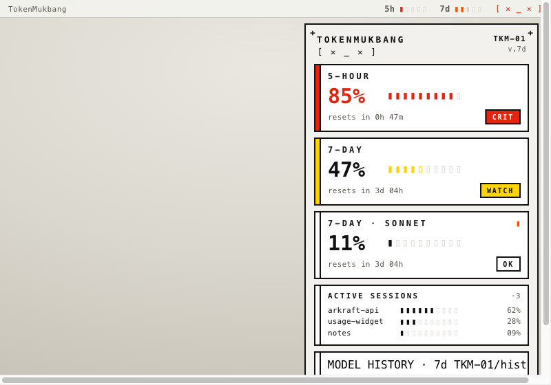

# 06. OP-1 / Token Console (토큰 콘솔)

> **한 줄 컨셉:** Teenage-Engineering급 하드웨어 페이스플레이트 — 웜 페이퍼-브루탈리스트 패널 위에 하드 2px 보더 모듈 셀과 세그먼트 LED 미터를 깔고, **딱 한 개의 시그널 오렌지 액센트**만 상태에 따라 점등하는 "데스크톱 위에 놓인 작은 측정 장비". 사용량은 읽는 게 아니라 *계기판으로 본다*.



## 무드보드 / 톤

- **하드웨어 측정기 / 신스 모듈.** OP-1, 포켓 오퍼레이터, 모듈러 신스 프론트패널. 화면이 아니라 "기계 앞면"처럼 보이게 한다 — 곡률 0, 그림자 0, 한 개의 큰 액센트.
- **페이퍼-브루탈리즘(paper-brutalism).** 차가운 다크 IDE가 아니라 *웜 오프화이트 종이 + 검은 잉크 실크스크린*. 라벨은 인쇄된 것처럼, 미터는 LED처럼.
- **계측기의 정직함.** 모든 데이텀이 라벨 붙은 셀에 들어가고, 부품번호(`TKM-01`)·등록마크(`+`)·function 스트라이프 같은 "장비 메타"가 톤을 만든다. 장식이 아니라 *엔지니어링을 노출*해서 신뢰감을 준다.
- **금욕적이지만 따뜻함.** 미니멀하되 차갑지 않다. 종이 질감의 웜톤과 한 점의 강렬한 오렌지가 "playful, warm, human" 한 브루탈리즘(TE의 핵심)을 만든다.
- 레퍼런스 톤 키워드: *exposed structure / monospaced-only / five-color discipline / segment LED / silkscreen label*.

## 컬러 토큰

라이트(주력) = 웜 페이퍼 패널 + 블랙 잉크. 다크 = 차콜 패널 + 오프화이트 잉크, **같은 액센트가 차콜에서 더 팝**. 한 개 액센트 원칙은 양쪽 공통.

| role | light | dark |
|---|---|---|
| panel / bg (패널) | `#F2F1ED` (warm off-white paper) | `#161513` (charcoal) |
| ink / border (잉크·2px 하드보더) | `#111111` | `#EDEAE2` (off-white ink) |
| ink-muted (보조 라벨/리셋) | `#5C584F` | `#9B968B` |
| cell-fill (모듈 셀 기본 채움) | `#FFFFFF` | `#1F1D1A` |
| accent / brand (시그널 오렌지, calm 틱) | `#FF4D00` | `#FF4D00` |
| segment-off (LED 꺼진 노치 `▯`) | `#D8D6CF` | `#312E2A` |
| segment-on (LED 켜진 노치 `▮`, 상태색 상속) | role별 | role별 |
| registration-mark (`+` 코너) | `#111111` | `#EDEAE2` |

> 액센트는 **정확히 하나**(`#FF4D00`). watch의 옐로/critical의 레드는 *위험 신호 색*으로 별도 취급하며, "브랜드 액센트"로 쓰지 않는다 — 평상시 화면엔 오렌지 한 점만 살아 있고, 노란/빨간 블록은 위험이 올라올 때만 등장해 의미가 또렷하다.

**위험 4단계 매핑:** loud 플랫 색 *채움*(그라디언트 없음). hue 단독으로 구분하지 않고 **채움 + 위치 + 텍스트 라벨**을 함께 쓴다.

- **calm** — 잉크-온-페이퍼(셀은 기본 `#FFFFFF`/`#1F1D1A`) + 오렌지 `#FF4D00` 틱 1개. 칩 라벨 `OK`.
- **watch** — 옐로 블록 `#FFD400`가 미터 채움/상태칩에. 칩 라벨 `WATCH`.
- **warning** — 오렌지 `#FF4D00`(= 액센트와 동일 hue, 의도적: "주의는 브랜드색의 강세") 블록. 칩 라벨 `WARN`.
- **critical** — 레드 `#E5240E`가 미터셀 *전체*를 채우고 하드 블랙보더(`#111111`, 다크에선 `#EDEAE2`). 칩 라벨 `CRIT`. 마스코트는 `[ ✕ _ ✕ ]`.

> 색맹/저시력 안전장치: 각 미터 셀 우측에 항상 `OK/WATCH/WARN/CRIT` 텍스트 칩이 박혀 있어, 색을 못 봐도 라벨·세그먼트 개수·셀 위치로 위험을 읽는다.

## 타이포그래피

- **Commit Mono 전반.** 프로그래밍 심볼 커닝 덕에 `5h 05% · 7d 50%` 처럼 숫자·기호 섞인 작은 텍스트도 균등하게 정렬돼 메뉴바·세그먼트 라벨에 강하다. 모노스페이스의 고정 그리드가 "engineered / exposed structure" 톤을 그대로 만든다.
- **위계 (3단):**
  - *데이텀 % (히어로 숫자)* — Commit Mono, 큰 사이즈, 잉크색. 팝오버 모듈 셀에서 `05%`/`50%`.
  - *거대 트래킹 캡스 라벨* — `5-HOUR` `7-DAY` `ACTIVE SESSIONS` `TOKENMUKBANG`. 글자 간격 크게(letter-spacing) 준 올캡스, 실크스크린 인쇄 느낌. 320pt 폭이 부족하면 `5H`/`7D`로 축약(아래 §리스크).
  - *모노 메타 (부품번호·리셋)* — `TKM-01`, `v.7d`, `resets 2h13m`. ink-muted, 소문자/숫자.
- 폰트 대체: Commit Mono 미탑재 시 `SF Mono` → `Menlo` 순. 모노 그리드만 유지되면 톤은 보존된다.

## 레이아웃 & 셰이프 언어

- **하드웨어 페이스플레이트 그리드.** 각 데이텀은 하드보더 "모듈" 셀에 산다 — **2px 블랙 보더, border-radius 0, shadow 0**. 셀끼리 1~2px 거터로 붙여 "패널에 나사로 박힌 모듈" 느낌.
- **세그먼트 LED 바가 유일한 미터 표현.** 연속 progress bar 금지. 노치 분절된 `▮▮▮▮▮▯▯▯▯▯` (켜진 `▮` = 상태색, 꺼진 `▯` = segment-off). 보통 10세그먼트, 좁은 곳은 5세그먼트.
- **장비 메타 디테일:**
  - 코너 등록마크 `+` (4모서리 또는 좌상단).
  - 모노 부품번호 `TKM-01 / v.7d` (모듈 우하단 또는 헤더).
  - 한쪽 엣지에 컬러블록 "function" 스트라이프(좌측 세로 바) = 그 모듈의 최악 상태색.
- **셰이프 어휘 한정:** 직사각형 셀, 1px/2px 하드 룰, 세그먼트 노치, `+` 마크, 단색 채움. 곡선·그라디언트·그림자·아이콘 일러스트 전부 배제(마스코트 대괄호 입은 예외 — 그 자체가 LED-페이스라 톤에 맞음).

## 화면 목업

### 메뉴바

작고 반투명 위에서도 읽혀야 하므로 **두 모드**를 둔다. 액센트(오렌지)는 평상시 끄고, **warn/crit 진입 시에만 1세그먼트/1글자 점등**해 메뉴바의 "한 점 신호" 규율을 지킨다.

```
세그먼트 모드:   5h ▮▮▯▯▯  7d ▮▮▮▮▯
plain fallback:  5h 05 · 7d 50
warn 진입:       5h ▮▮▯▯▯  7d ▮▮▮▮▮   ← 마지막 세그먼트만 오렌지 점등
crit:            5h 05 · 7d ▮▮▮▮▮      ← 레드 1세그먼트 + (선택) 마스코트 [✕_✕]
```

- 기본은 `5h 05 · 7d 50` **plain 텍스트 fallback** — 반투명 메뉴바·작은 폭·다크/라이트 자동 대응에서 가장 안전(세그먼트 앨리어싱 위험 회피).
- 여유 폭이 있을 때만 세그먼트 모드. 세그먼트는 메뉴바 높이에서 뭉개지기 쉬우니 **5세그먼트 고정**(10은 메뉴바에서 앨리어싱).

### 팝오버 (320pt — 하드웨어 페이스플레이트처럼)

```
┌──────────────────────────────────────────────┐
│ +                                          +  │
│  TOKENMUKBANG                      TKM-01     │
│  [• ◡ •]                           v.7d       │
│ ┌──────────────────────────┐ ──────────────  │
│ ▌ 5-HOUR                    │   ▌= function   │
│ ▌                          │   stripe(좌엣지)│
│ ▌  05%      ▮▮▯▯▯▯▯▯▯▯      │                 │
│ ▌  resets in 2h 13m        │      [ OK ]     │
│ └──────────────────────────┘                 │
│ ┌──────────────────────────┐                 │
│ ▐ 7-DAY                     │  ▐= warn(오렌지)│
│ ▐                          │                 │
│ ▐  50%      ▮▮▮▮▮▮▮▮▯▯      │                 │
│ ▐  resets in 3d 04h        │      [ WARN ]   │
│ └──────────────────────────┘                 │
│ ┌──────────────────────────────────────────┐ │
│ │ ACTIVE SESSIONS                      ·3   │ │
│ │  arkraft-api    ▮▮▮▮▮▮▯▯▯▯  62%  ctx       │ │
│ │  usage-widget   ▮▮▮▯▯▯▯▯▯▯  28%  ctx       │ │
│ │  notes          ▮▯▯▯▯▯▯▯▯▯  09%  ctx       │ │
│ └──────────────────────────────────────────┘ │
│ ┌──────────────────────────────────────────┐ │
│ │ MODEL HISTORY · 7d        TKM-01/hist     │ │
│ │  opus    ▮▮▮▮▮▮▮▮▮▮▮▮▮▮▮▮▮▮▮▮▯▯▯▯▯▯▯▯      │ │
│ │  sonnet  ▮▮▮▮▮▮▮▯▯▯▯▯▯▯▯▯▯▯▯▯▯▯▯▯▯▯▯▯      │ │
│ │  (세그먼트 스택 = 모델별 토큰 비중)        │ │
│ └──────────────────────────────────────────┘ │
│ +                                          +  │
└──────────────────────────────────────────────┘
```

- **헤더:** 좌 `TOKENMUKBANG` + 대괄호 마스코트, 우 부품번호 `TKM-01 / v.7d`. 4코너 `+` 등록마크.
- **5-HOUR / 7-DAY 모듈셀:** 거대 캡스 라벨 + 큰 `%` + 세그먼트바 + `resets in …` + 우측 상태칩(`OK`/`WARN`). **좌측 세로 function 스트라이프 = 그 모듈의 최악 상태색**(calm=오렌지 틱, warn=오렌지, crit=레드 풀셀).
- **ACTIVE SESSIONS 모듈:** repo명 + ctx 세그먼트바 + `%`. 클릭 → 터미널 포커스(ADR-0008).
- **MODEL HISTORY 모듈:** 모델별 토큰 비중을 **세그먼트 스택 바** 한 줄로(opus/sonnet 길이 = 비중).

### 위젯

**small = 한 히어로 모듈** (가장 위험한 윈도우 하나만), **medium = 히어로 + 보조 모듈**.

```
small (1 hero module)              medium (hero + secondary)
┌─────────────────────┐           ┌───────────────────────────────────┐
│ + 7-DAY      TKM-01 │           │ +  TOKENMUKBANG          TKM-01    │
│                     │           │ ┌─────────────┐ ┌───────────────┐ │
│   50%               │           │ │ 5-HOUR  [OK]│ │ 7-DAY   [WARN]│ │
│   ▮▮▮▮▮▮▮▮▯▯        │           │ │ 05%         │ │ 50%           │ │
│                     │           │ │ ▮▮▯▯▯▯▯▯▯▯  │ │ ▮▮▮▮▮▮▮▮▯▯    │ │
│   resets 3d 04h     │           │ │ 2h 13m      │ │ 3d 04h        │ │
│        [ WARN ]     │           │ └─────────────┘ └───────────────┘ │
│ [• ◡ •]           + │           │ [• ◡ •]                        +  │
└─────────────────────┘           └───────────────────────────────────┘
```

- 위젯은 sandbox라 **읽기 전용**(ADR-0003): 앱이 쓴 스냅샷만 렌더. 네트워크/Keychain 접근 없음.
- small은 라벨이 좁으니 `7-DAY`만, 더 좁으면 `7D`. 마스코트는 하단 한 줄.

## 시그니처 무브

> **라벨 붙은 하드웨어 모듈 + 세그먼트 LED 미터 + 부품번호** — 그리고 *한 액센트만 상태에 점등*.

1. **세그먼트 LED 미터** `▮▮▮▮▮▯▯▯▯▯` — 연속 바 대신 노치 분절. 이 앱의 "측정기" 정체성의 핵심 시각 요소.
2. **function 스트라이프** — 각 모듈 좌측 엣지의 컬러 세로바가 그 모듈 최악 상태색을 표시. 색을 패널에 흩뿌리지 않고 *한 줄로* 모아 규율 유지.
3. **장비 메타** — `TKM-01 / v.7d` 부품번호 + 코너 `+` 등록마크 + 거대 트래킹 캡스 라벨. "이건 화면이 아니라 기계 앞면" 느낌을 완성.
4. **대괄호 마스코트** `[• ◡ •]` → 챔프 `[ ◡⌣◡ ]` → critical `[ ✕ _ ✕ ]` — LED-페이스 그 자체라 하드웨어 톤을 깨지 않고 먹방 정체성을 싣는다.

## 먹방 정체성 반영 + "정확함 > 귀여움" 준수 방식

- **먹방 = "토큰을 먹어 치운다"** 라는 컨셉(ADR-0009)을, *그림 일러스트가 아니라* **대괄호 LED 마스코트**로 표현한다. `[• ◡ •]`(평온)·`[ ◡⌣◡ ]`(많이 먹는 중/챔프)·`[ ✕ _ ✕ ]`(과식=critical). 모노 글자라 페이스플레이트 톤과 1mm도 안 어긋난다.
- **세그먼트 바 = "한 입씩 줄어드는 접시"** 메타포로도 읽히지만, 그 전에 **정확한 계기판**으로 먼저 기능한다.
- **"정확함 > 귀여움" 준수:**
  - 마스코트·라벨은 **데이터를 가리지 않는다.** %·세그먼트 개수·리셋 시각이 항상 1순위로 크고 또렷하다. 마스코트는 헤더/하단의 작은 한 줄.
  - 위험은 **귀여움이 아니라 측정값으로** 전한다 — 채움 + 위치 + `OK/WATCH/WARN/CRIT` 텍스트. 색만으로 장난치지 않는다.
  - 평상시 화면은 거의 흑백(잉크-온-페이퍼) — 귀여운 색잔치 없이 *읽힌다*. 색은 위험할 때만 loud해진다 = 신호 대 잡음 최대.

## 장점 / 리스크

**장점**
- 메뉴바·320pt·위젯 모두 **모노 + 세그먼트 + 하드보더** 한 어휘로 일관 — 작은 화면에서 가장 안 깨진다.
- 위험 표현이 정직(채움+위치+라벨) → 색맹/반투명/다크 모드에서도 안전.
- 한 액센트 규율 = 신호가 또렷, 브랜드(오렌지)와 위험 신호가 명확히 분리.
- TE/neo-brutalism은 2026 트렌드와 정합 → "made by engineers" 신뢰 톤이 개발자 타깃과 맞다.

**리스크**
- **거대 캡스 라벨이 320pt/위젯에서 폭 부족** → `5-HOUR`→`5H` 축약 규칙 없으면 잘림. (해결: 폭 임계값 기반 라벨 단계 축약.)
- **세그먼트 개수 앨리어싱** — 메뉴바·small 위젯에서 10세그먼트는 뭉갬. (해결: 메뉴바/small=5세그, 팝오버=10세그 고정.)
- **한 액센트 rare 유지 실패 시 노이즈** — 평상시에도 오렌지 남발하면 신호가 죽음. (해결: 메뉴바 액센트는 warn/crit에서만 점등.)
- **generic 브루탈리스트 템플릿화 위험** — 그냥 "검은 보더 + 모노"는 흔하다. (차별점 = 세그먼트 LED + 부품번호 + function 스트라이프 + 대괄호 마스코트를 반드시 유지.)

## 구현 난이도 (SwiftUI — 상/중/하)

- **하 (쉬움):** 모듈 셀(`RoundedRectangle(cornerRadius:0)` + 2px `stroke`), 모노 라벨, 컬러 토큰, plain 메뉴바 텍스트 fallback, 대괄호 마스코트(텍스트라 상태별 문자열 스왑만).
- **중:** 세그먼트 LED 바(켜짐/꺼짐 세그를 `HStack`의 작은 `Rectangle` 배열로; 켜진 개수 = `round(pct*n)`), function 스트라이프, 4코너 `+` 등록마크 배치, 라벨 폭 기반 축약(`ViewThatFits` / `GeometryReader`).
- **상 (까다로움):** 위젯 small/medium 양쪽에서 모듈 비례 깨짐 없이 맞추기(WidgetKit 고정 사이즈 클래스), 메뉴바 세그먼트 모드의 반투명 앨리어싱 튜닝, 모델 히스토리 세그먼트 스택의 비중→세그먼트 매핑(반올림 누적 오차 보정).
- 전체적으로 **중** — 곡선/그림자/애니메이션이 없어 렌더는 단순하나, *세그먼트 매핑의 정수 반올림*과 *반응형 라벨 축약*이 품질을 가른다. ContextFraction·RiskScorer 등 수치는 전부 `TokenMukbangKit`에서 오므로(ADR-0001) UI는 *표현*만 책임진다.

## 트렌드 레퍼런스

1. **Teenage Engineering — OP-1 / 디자인 철학** ("if it doesn't look good, it doesn't sound good"; exposed engineering·monospaced·five-color discipline·warm brutalism). 본 컨셉의 페이스플레이트·세그먼트·한 액센트 규율의 직접 원천. — [teenage.engineering/designs](https://teenage.engineering/designs), [Constraints as Aesthetic (Blake Crosley)](https://blakecrosley.com/guides/design/teenage-engineering)
2. **Neo-Brutalism 2026 웹 트렌드** (hard-edged geometry·thick black borders·flat high-contrast·no soft shadow/gradient; Figma·Gumroad 채택). 모듈 셀·2px 하드보더·flat 위험색 채움의 근거. — [Neo-Brutalism 2026 (brutalism.plus)](https://brutalism.plus/neobrutalism-02), [Y2K vs Neo-Brutalism 2026 (CGfrog)](https://blog.cgfrog.com/y2k-vs-neo-brutalism-design-trends/)
3. **Commit Mono — neutral programming typeface** (programming-symbol kerning·neutral/anonymous·"feels engineered"). 메뉴바 `5h 05 · 7d 50` 균등 정렬과 전반 모노 톤의 근거. — [commitmono.com](https://commitmono.com/), [Commit Mono (Fountn)](https://fountn.design/resource/commit-mono-neutral-programming-typeface/)
