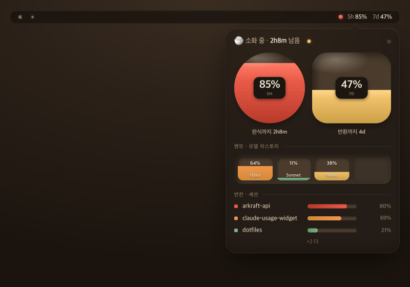

# 07. 한입 (Hanip)

> **한 줄 컨셉:** 마스코트 없이 **음식 그 자체가 캐릭터**가 되는 클레이모픽 한 상(床) 칵핏 — 사용량은 *먹히는 식사*고, 한도는 분량처럼 줄어들며, 익힘 정도(doneness) 색으로 위험을 말한다. 귀여움은 라벨 단어에만 두고 숫자는 dead-serious.



## 무드보드 / 톤

어두운 식당 안, 위에서 떨어지는 따뜻한 램프 광(downlight) 아래 놓인 매트한 클레이 식기 한 상. 윤기 나는 캔디 광택이 아니라 **웜 매트-클레이** — 손으로 빚은 포슬린/오트색 그릇과 테라코타-크림 톤의 두툼한 식기들. 음식은 캐릭터다: 밥그릇이 5h, 와이드 접시가 7d, 벤또 박스가 모델 히스토리, 반찬(side dish)들이 세션. 성격은 일러스트나 표정이 아니라 **물리와 형태**에서 나온다 — 부푼 클레이의 더블 이너섀도, 분량이 줄듯 채움 높이가 내려가는 한도, 비어갈수록 노출되는 그릇 안쪽 림의 광택.

톤 키워드: 갓 차려진 식사의 따뜻함, 진지한 다이닝(키즈 메뉴 아님), 촉각적인 매트 클레이, 자연스러운 *날것→익음→탐* 색 진행.

금지: 캔디-글로시 하이라이트, 채도 높은 파스텔 장난감색, 마스코트 얼굴/표정, 숫자를 그라디언트 위에 직접 얹는 것.

## 컬러 토큰

| role | light | dark |
|---|---|---|
| canvas (식탁/배경) | 포슬린-오트 `#F4EDE2` | 로스티드 에스프레소브라운 `#241C16` |
| surface (클레이 식기 베이스) | 테라코타-크림 `#E9D8C4` | 다크 클레이 `#332A22` |
| surface-rim (그릇 안쪽 노출 림) | 워밍 샌드 `#DCC8AE` | 엠버-리트 클레이 `#4A3B2C` |
| clay-shadow (이너섀도 다크) | `#C9B49B` @ 55% | `#160F0A` @ 60% |
| clay-highlight (이너섀도 라이트) | `#FFFAF1` @ 70% | `#5A4B3A` @ 35% |
| text-primary (매트칩 위 숫자) | 에스프레소 `#3A2E22` | 웜 오트 `#F1E7D7` |
| text-secondary (라벨 "소화 중") | 무디드 코코아 `#8A745C` | 토스티드 탠 `#B7A287` |
| chip-matte (숫자 깔리는 플랫 매트 칩) | `#FBF5EA` | `#1C1610` |

> **숫자는 절대 그라디언트 위에 직접 얹지 않는다.** 채워지는 음식 그라디언트 *위에 다시* 플랫 매트 칩(`chip-matte`)을 깔고, 그 칩 위에 `text-primary` 숫자를 올린다. 그라디언트가 아무리 움직여도 숫자 대비는 고정된다.

### 위험 4단계 매핑: 익힘 정도(doneness)

날것에서 타는 것까지의 자연스러운 조리 색 램프 — 학습 없이 직관적으로 "더 익을수록 위험".

| level | 의미 | light hex | dark hex | 비고 |
|---|---|---|---|---|
| **calm** | 페일 브로스 그린크림 (덜 익음/여유) | `#A7C4A0` | `#7FB089` | 차분한 채소-국물색 |
| **watch** | 허니/앰버 (데워지는 중) | `#E3B25A` | `#F0C06A` | |
| **warning** | 파프리카 오렌지 (잘 익음) | `#E08A3C` | `#F0954A` | |
| **critical** | 칠리레드 (탐/완식 임박) | `#D24B3A` | `#E85A47` | 미세 그레인 "지글(sizzle)" 텍스처 오버레이 |

> **색맹 이중화:** 앰버(`watch`)↔오렌지(`warning`)는 적록/색약에서 구분이 약하다. 그래서 **doneness 색은 단독 신호가 아니다** — 위험은 항상 **채움 높이**로도 표현된다(그릇이 비어갈수록 = 한도 소진). 그레이스케일·색맹 환경에서도 "얼마나 찼나"는 높이로 읽힌다. critical만 추가로 지글 텍스처가 붙어 색과 무관하게 식별된다.

## 타이포그래피

- **본문/라벨:** Hanken Grotesk (없으면 SF Rounded) — 라운드-but-타이트한 그로테스크. 둥글지만 헐겁지 않아 매트 클레이의 촉각성과 어울리면서 가독성을 잃지 않는다.
- **숫자:** 같은 패밀리의 **tabular figures + 한 단계 두꺼운 weight**(Semibold~Bold). 퍼센트가 갱신돼도 자릿수가 흔들리지 않고, 라벨보다 시각 무게가 무거워 "숫자가 주인공"이 된다.
- **역할 분리 — 귀여움의 격리:** 플레이풀함은 **라벨 단어**에만 산다("완식까지", "소화 중", "한 그릇 남음"). **숫자는 dead-serious** — 장식·아웃라인·그림자 없이 매트칩 위 플랫하게. 정확함이 귀여움에 잡아먹히지 않게 하는 핵심 장치.
- 메뉴바 숫자는 반드시 tabular(폭 고정) — `5h 05%  7d 50%`가 매초 떨려선 안 된다.

## 레이아웃 & 셰이프 언어

- **셰이프:** 코너 라운딩 큰(28–40% 반경) 부푼 클레이. 단, **모든 게이지엔 지름 cap이 있다** — 클레이는 *게이지*지 자유 일러스트가 아니다. 밥그릇은 고정 지름 원, 접시는 고정 높이의 와이드 라운드 렉트, 벤또는 고정 그리드. 채움만 움직이고 외곽은 안 변한다(SwiftUI에서 안정적).
- **이너섀도(부풂):** 각 식기에 더블 이너섀도 — 좌상단 `clay-highlight`, 우하단 `clay-shadow`. 위 램프광이라 하이라이트가 항상 상단. 외곽엔 얕은 드롭섀도 1겹(식탁 위에 놓인 느낌).
- **채움(음식):** 그릇/접시 내부를 doneness 그라디언트로 *아래에서 위로* 채운다. 채움 높이 = 사용률. 그 위 중앙에 매트칩+숫자.
- **그리드:** 한 상은 정렬된 식탁 — 5h 밥그릇과 7d 접시가 나란히, 아래 벤또 스트립, 그 아래 반찬 세션 리스트. 여백은 식탁보처럼 넉넉하게.

## 화면 목업

### 메뉴바

텍스트 우선, 매트, 반투명 배경에서도 읽히게. **유일하게 살아남은 플레이풀 요소 = 8pt 클레이 도트 1개** — 현재 가장 높은 위험 창의 doneness 색을 띤 작은 ember(critical일 때만 지글). 숫자는 tabular.

```
●  5h 05%  7d 50%
↑ 8pt clay dot (doneness 색, 작은 ember)
```

- 반투명 메뉴바 위 가독성: 도트는 채움색, 텍스트는 시스템 라벨색 따름. 아이콘 1개로 압축돼 좁은 메뉴바에서도 안 깨짐.

### 팝오버 (320pt)

```
┌───────────────────────────────────────────────┐
│  🍚 소화 중 · 2h13m 남음            ⚙       │  ← 상단 상태 (watch=허니)
│                                                 │
│   ╭─────────────╮      ╭───────────────────╮   │
│   │  5h 밥그릇   │      │   7d 와이드 접시   │   │
│   │ ░░░░░░░░░░░ │      │ ▓▓▓▓▓▓░░░░░░░░░░░ │   │  ← 채움=doneness 그라디언트
│   │ ░░░░░░░░░░░ │      │ ▓▓▓▓▓▓░░░░░░░░░░░ │   │     (아래→위)
│   │ ▓▓▓ ┌────┐ │      │ ▓▓▓▓▓▓┌──────┐  │   │
│   │ ▓▓▓ │ 05%│ │      │ ▓▓▓▓▓▓│  50% │  │   │  ← 매트칩 위 숫자
│   │ ▓▓▓ └────┘ │      │ ▓▓▓▓▓▓└──────┘  │   │     (tabular bold)
│   ╰─────────────╯      ╰───────────────────╯   │
│   완식까지 1h           반환까지 4d             │
│                                                 │
│  ── 벤또 (모델 히스토리) ──────────────────     │
│  ┌────┬────┬────┬────┐                          │
│  │Opus│Snnt│Hku │ ·  │  칸칸이 모델 색 분량     │
│  │▓▓▓ │▓░░ │▓▓░ │    │                          │
│  └────┴────┴────┴────┘                          │
│                                                 │
│  ── 반찬 (세션) ──────────────────────────     │
│  • arkraft-api      ctx 62%  ▓▓▓▓▓▓░░░░         │
│  • claude-widget    ctx 31%  ▓▓▓░░░░░░░         │
│  • dotfiles         ctx 08%  ▓░░░░░░░░░         │
└───────────────────────────────────────────────┘
```

- 5h 밥그릇(고정 지름 원)과 7d 와이드 접시(고정 높이 렉트)가 나란히. 각자 doneness 그라디언트로 % 높이까지 채워지고, 채움 위에 매트칩+tabular 숫자.
- 벤또 = 모델별 토큰 히스토리, 칸마다 모델 색 분량. 반찬 = 세션 리스트 + ctx 채움 바.
- 상단 한 줄 상태("소화 중 · 2h13m 남음")가 가장 가까운 리셋을 요약.

> **세로 공간 정직:** 320pt 폭에서 밥그릇+접시+벤또+반찬을 다 넣으면 세로가 길어진다. 반찬은 상위 N개만(나머지 "+3 더") 보이고, 그릇 지름은 cap이 있어 무한정 안 커진다. 세로가 압박되면 벤또를 1줄 스트립으로 축약한다.

### 위젯

- **small:** 히어로 클레이 밥그릇(5h) 1개 — 채움 + doneness + 큰 tabular 숫자(매트칩). 하단에 라벨 한 줄("소화 중"). 시그니처 빈-그릇 광택도 여기서 가장 강하게.
- **medium:** 밥그릇(5h) + 와이드 접시(7d) 나란히 + 하단 "2h13m 남음". 벤또/반찬은 생략(위젯은 글랜스용).

## 시그니처 무브

**빈 그릇 광택 (Empty-bowl gleam).** 한도가 비어갈수록(=음식 채움 높이가 내려갈수록) 노출되는 클레이 **안쪽 림**이 위 램프광을 더 받아 스페큘러 하이라이트가 강해진다. 거의 빈 그릇이 *번쩍* 한다. 소진을 숫자로 읽기 전에 **물리적·전주의적(pre-attentive) 신호**로 먼저 느끼게 하는 장치 — "어, 그릇이 비었네"가 "98%네"보다 빠르다. critical에선 지글 텍스처가 더해져 광택+텍스처 이중 경보.

## 먹방 정체성 반영 + "정확함 > 귀여움" 준수 방식

- **먹방(ADR-0009) 반영:** "완식"=한도 소진 → 빈 그릇 광택으로 물리화. "출연진=모델" → 벤또 박스 칸칸이 모델 색 분량. 사용량=먹히는 식사, 세션=반찬, 히스토리=벤또. 마스코트 없이 음식 형태 자체가 캐릭터라 ADR의 "정확함>귀여움"과 충돌 없이 컨셉을 살린다.
- **정확함 > 귀여움 준수:**
  - 숫자는 항상 doneness 그라디언트 *위에 다시 깐* 플랫 매트 칩 위에 tabular bold로 — 배경 색에 절대 안 묻힌다.
  - 위험은 색(doneness) **단독이 아니라 채움 높이로 이중화** → 색맹·그레이스케일에서도 정확.
  - 귀여움은 **라벨 단어에만 격리**, 숫자엔 장식 0.
  - 매트·에스프레소·식당 다운라이트 톤 유지로 "키즈 게임" 인상 차단(아래 리스크 참고).

## 장점 / 리스크

**장점**
- doneness 색 램프가 *학습 불필요* — 날것→익음→탐이 곧 여유→위험. 직관적.
- 빈 그릇 광택이 전주의적 소진 신호 → 숫자 안 읽어도 위급함 전달.
- 음식=데이터 매핑(밥그릇/접시/벤또/반찬)이 일관돼 외워지기 쉽고 먹방 컨셉과 정합.
- 매트 클레이라 반투명 메뉴바·다크 다이닝 양쪽에서 가독성 확보.

**리스크**
- 클레이 식기들이 세로 공간을 먹는다 → 320pt 팝오버에서 압박(축약 규칙으로 대응).
- 앰버↔오렌지 색맹 구분 약함 → **채움 높이 이중화로 반드시 보완**(색 단독 금지).
- 광택 클레이가 자칫 "키즈 게임/장난감"처럼 보일 위험 → 매트 마감·에스프레소 베이스·식당 다운라이트 유지, candy-glossy 하이라이트 금지로 톤 사수.
- 음식 메타포 과몰입 시 숫자가 가려질 위험 → 매트칩 규칙이 안전핀.

## 구현 난이도 (SwiftUI)

**중.** 핵심 게이지(밥그릇/접시 채움 + 매트칩 숫자)는 **하–중**: `Shape` + `clipShape`로 채움 높이, 더블 이너섀도는 inner shadow 모디파이어(또는 stroke blur 2겹)로 충분. 지름/높이 cap 고정이라 레이아웃 안정적. **중**으로 끌어올리는 건: 빈-그릇 광택(채움 높이에 반응하는 스페큘러 → 채움 fraction 바인딩한 angular/radial gradient 오버레이로 근사), critical 지글 텍스처(미세 noise overlay + 은은한 애니메이션), 벤또 다중 칸 모델색 분량. **상** 요소는 없음 — 모두 게이지/그라디언트/마스크로 환원 가능하고 커스텀 Metal 셰이더 불필요.

## 트렌드 레퍼런스

1. **클레이모피즘 2026 — 매트 3D & 더블 이너섀도.** 부푼 지오메트리(50%+ 라운딩), 좌상 하이라이트 + 우하 섀도의 더블 이너섀도, 매트 마감으로 "물리적 오브젝트로 보이면 뇌가 기능을 더 빨리 처리" — 한입의 식기 셰이프 언어 근거. (Timothy Graf, "Claymorphism vs. Glassmorphism: The 2026 Battle"; Bootcamp/Medium, "Glassmorphism vs Claymorphism vs Skeuomorphism: 2025 UI Design Guide")
2. **클레이모피즘 = 고대비·또렷한 레이어링.** 뉴모피즘의 모노톤 한계와 달리 명확한 레이어/대비로 컴포넌트 인식성↑ — 매트칩 위 숫자를 그라디언트와 레이어로 분리하는 근거. (hype4.academy, "Claymorphism in User Interfaces")
3. **그라디언트 게이지 — 채움/높이 비례 + 컬러 레인지.** bar gauge는 값에 비례한 채움과 색 범위(range)로 직관 전달, 3색 그라디언트는 조화가 핵심 — doneness 4단계 + 채움 높이 이중화의 직접 레퍼런스. (Grafana "Bar gauge" docs; Code Canel "Gradient Progress Bars")

Sources:
- [Claymorphism vs. Glassmorphism: The 2026 Battle for UI Dominance — Tim Graf](https://timgraf.com/ui/claymorphism-vs-glassmorphism-the-2026-battle-for-ui-dominance/)
- [Glassmorphism vs. Claymorphism vs. Skeuomorphism: 2025 UI Design Guide — Bootcamp/Medium](https://medium.com/design-bootcamp/glassmorphism-vs-claymorphism-vs-skeuomorphism-2025-ui-design-guide-e639ff73b389)
- [Claymorphism in User Interfaces — hype4.academy](https://hype4.academy/articles/design/claymorphism-in-user-interfaces)
- [Bar gauge — Grafana documentation](https://grafana.com/docs/grafana/latest/panels-visualizations/visualizations/bar-gauge/)
- [Gradient Progress Bars — Code Canel](https://codecanel.com/gradient-progress-bars/)
