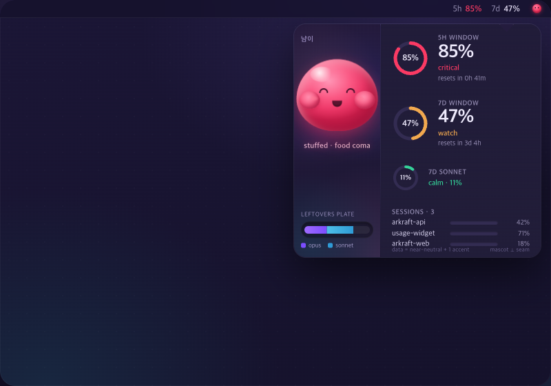

# 08. 냠이 (Nyam-i)

> **한 줄 컨셉:** 클레이모픽 그라디언트-메시 블롭 마스코트 "냠이"가 화면 코너의 *예약된 무대* 안에서만 살며, 식욕(=사용량)에 따라 날씬↔통통↔stuffed로 자세가 변해 위험을 *shape-first*로 알려주되, 숫자·게이지 영역은 절대 침범하지 않는 쿨-드리미 먹방 UI.



## 무드보드 / 톤

쿨하고 드리미한(cool & dreamy) 베이스 위에 떡/모찌 같은 말랑한 생명체. 동물이 아니라 **둥근 떡-모찌 블롭** — 얼굴은 최소한의 점/곡선, 몸은 소프트 그라디언트-메시 덩어리. 키워드: *squishy, glowing, calm night sky, edible cuteness*.

- 라이트: 라벤더-크림 캔버스 위 부드러운 메시 그라디언트(피치 → 민트 → 페리윙클)가 은은하게 흐르는 새벽빛.
- 다크: 딥 인디고-플럼 밤하늘 + 희미한 오로라 띠. 냠이는 **자가발광**해서 그 자체가 무드라이트가 된다(다크에서 가장 매력적).
- 마스코트는 멀티컬러로 풍부하게, **데이터 패널은 절제된 near-뉴트럴**. 이 대비가 톤의 핵심 — "말랑한 마스코트 무대 vs 크리스프한 데이터 다이얼".

## 컬러 토큰

캔버스/무대(마스코트)는 멀티컬러를 허용하지만, **데이터 위에 올라가는 위험 색은 단일 액센트 토큰 하나만** 사용한다.

| role | light | dark |
|---|---|---|
| `canvas` (배경) | `#F4F0FB` 라벤더-크림 | `#1A1730` 딥 인디고 |
| `stage.meshA` (피치) | `#FFD8C2` | `#3A2A4D` 플럼 |
| `stage.meshB` (민트) | `#C8F2E0` | `#1F2E4A` 미드나잇 |
| `stage.meshC` (페리윙클) | `#C9D2FF` | `#2A2358` 오로라 베이스 |
| `seam` (무대/데이터 분리선) | `#E5DEF2` | `#2C2748` |
| `data.surface` (다이얼/칩 바탕) | `#FAF8FF` near-화이트 | `#221E3A` |
| `data.ink` (숫자/라벨) | `#2C2740` near-잉크 | `#EDE9FB` |
| `data.muted` (보조 라벨) | `#8A839E` | `#9A92B8` |
| `data.accent` (현재 위험 1색) | calm/watch/warning/critical 중 현재값 | 동일 |

**위험 4단계 매핑:** calm/watch/warning/critical

| level | data.accent (라이트) | data.accent (다크) | 마스코트 무드 / 식욕 오라 |
|---|---|---|---|
| `calm` | `#22B07D` 민트-쿨 | `#34D399` | 민트-쿨 만족, 날씬·차분 |
| `watch` | `#E8973A` 웜 피치 | `#F2A94E` | 웜 피치, 통통해지기 시작 |
| `warning` | `#E2603F` 플러시드 코랄 | `#F0795A` | 플러시드 코랄, 볼 빵빵 |
| `critical` | `#E11D48` 클린 레드-액센트 | `#FB3A63` | 핫핑크/레드 "stuffed", food coma |

> **가독성 사활 규칙:** 마스코트의 critical 무드는 핫핑크여도 좋지만, **게이지·숫자 위 액센트는 항상 clean red-accent 뉴트럴**(`#E11D48`)로만 칠한다. 마스코트=멀티컬러, 데이터=모노크롬+1액센트. 두 색 시스템을 절대 섞지 않는다.

## 타이포그래피

라운드 그로테스크(rounded grotesque) 패밀리로 말랑한 톤을 잡되, **숫자는 살짝 더 지오메트릭하고 crisp한 tabular 스타일**로 대비를 준다 — squishy 마스코트 vs crisp 다이얼.

- 본문/라벨: SF Pro Rounded (또는 유사 rounded grotesque), Regular/Medium.
- 숫자(%·카운트다운): **tabular figures** 필수, Semibold. 폭이 흔들리지 않게 고정폭 숫자.
- 상태 단어("calm"/"stuffed" 등): 소문자 라운드, 약간 작게.
- 메뉴바: tabular 숫자 + 6~8pt 마이크로 글리프(아래 시그니처 참고).

## 레이아웃 & 셰이프 언어

두 가지 셰이프 언어가 공존하고, **입체감 위계로 구분**한다.

- **냠이 = 젤리 블롭**: 두꺼운 클레이, 가장 큰 inner/outer shadow, 가장 입체적. 무대 안에서만.
- **데이터 = 얇은벽 클레이 링/다이얼**: 더 가벼운 클레이(shallow shadow)라 마스코트보다 한 단계 평평 → 시각 위계상 마스코트가 항상 "가장 떠 보임".
- **규율: 마스코트는 1존, 데이터는 나머지, 둘은 겹치지 않는다.** 메시 그라디언트 seam이 둘을 분리하고, 마스코트의 bounding box는 seam을 절대 넘지 않는다.

## 화면 목업

### 메뉴바

작고 반투명한 막대 위 가독성 우선. tabular 숫자 + 초소형(6~8pt) 냠이 face 글리프 하나.

```
 5h 05%  7d 50%  ◡
```

- face 글리프 상태: `◡`(만족/calm) → `◔`(경계/watch·warning) → `◉`(stuffed/critical).
- 글리프가 노이즈로 느껴지면 설정에서 **단색 heat-dot** 한 점으로 대체(색만 위험 액센트).
- "진정 모드"에서는 냠이를 이 메뉴바 도트 하나로 축소(아래 시그니처).

### 팝오버

~320pt. **좌 35% = 냠이 전용 무대 / 우 65% = 순수 데이터 컬럼**. 메시 그라디언트 seam이 둘을 가르고, 마스코트는 seam을 넘지 않는다.

```
┌─────────────────────────────────────────────────┐
│  냠이 무대 (35%)   ┊   데이터 컬럼 (65%)          │
│  ~mesh gradient~   ┊                              │
│                    ┊   5h ─────────────           │
│      ╭───────╮     ┊   ╭───╮                      │
│     ( ◕   ◕ )      ┊   │ 05%│  calm              │
│      ╲  ⌣  ╱       ┊   ╰───╯  resets in 2h13m    │
│       ╰─────╯      ┊                              │
│   (슬림 = calm)    ┊   7d ─────────────           │
│                    ┊   ╭───╮                      │
│  leftovers plate:  ┊   │ 50%│  watch             │
│  ▤▤▤▤░░░░  (모델별) ┊   ╰───╯  resets in 3d 4h    │
│  opus ▤▤ sonnet ▤▤ ┊                              │
│                    ┊   sessions ──────────        │
│                    ┊   • repoA   ctx 42%          │
│                    ┊   • repoB   ctx 71%          │
│   ↑ seam: mesh     ┊   ↑ near-뉴트럴 + 1 액센트    │
└─────────────────────────────────────────────────┘
```

- **좌(무대):** 블롭 + 그 아래 "leftovers plate"(남은 음식 접시 = 모델 토큰 히스토리 스택바). 멀티컬러 OK.
- **우(데이터):** 5h/7d 얇은벽 클레이 다이얼 + 큰 tabular % + 상태 단어 + 리셋 카운트다운 + 세션 리스트(context fill). 전부 near-뉴트럴 + 현재 위험 1액센트.
- seam을 넘는 그 어떤 마스코트 픽셀도 없음 — 데이터 가독성 보장.

### 위젯

블롭이 히어로. **둥글기/포만감이 곧 게이지**. 두 % 숫자는 블롭 몸 밖 하단에 도킹(몸 위에 숫자 안 올림).

```
small                      medium
┌───────────────┐          ┌───────────────────────────┐
│   ~mesh~       │          │  ~mesh~        5h ╭──╮     │
│   ╭─────╮      │          │  ╭───────╮     │05%│ calm │
│  ( ◕ ◕ )       │          │ ( ◕   ◕ )      ╰──╯       │
│   ╲ ⌣ ╱        │          │  ╲  ⌣  ╱       7d ╭──╮     │
│    ╰───╯       │          │   ╰─────╯      │50%│ watch│
│  5h 05% 7d 50% │          │  plate ▤▤▤░░   ╰──╯       │
└───────────────┘          └───────────────────────────┘
```

- small: 블롭 히어로 + 하단 도킹 두 숫자.
- medium: 좌 블롭+plate / 우 두 클레이 다이얼 — 팝오버의 축소판(같은 무대/데이터 분리).

## 시그니처 무브

**자세로 위험을 표현한다 — 색·숫자보다 먼저.** 냠이의 실루엣만으로 across-the-room 위험 파악이 된다(shape-first = 접근성, 색맹·원거리에서도 읽힘).

- **식욕 = 실루엣:** 저사용 → 날씬, 소비할수록 통통 → stuffed, 소진 시 "food coma" 슬럼프(늘어짐).
- calm 슬림 → watch 통통 → warning 빵빵 → critical 볼 터질 듯 stuffed → 소진 시 늘어진 food coma.
- idle 시 잔잔한 breathing bounce만, **상태가 바뀔 때만** squish 트랜지션 1회 재생(아래 구현 참고).
- "진정 모드": 냠이를 메뉴바 heat-dot 하나로 접어 무대 자체를 숨김(마스코트 피로 가드).

## 먹방 정체성 반영 + "정확함 > 귀여움" 준수 방식

- **먹방 정체성(ADR-0009):** 사용량을 "먹는다"로 은유 — 냠이가 토큰을 먹고 통통해지고, 모델 히스토리는 "남은 음식 접시(leftovers plate)", 소진은 "food coma". 위험 상승 = 식욕 히트 오라.
- **"정확함 > 귀여움" 준수:**
  1. **예약 무대(reserved stage):** 마스코트는 정해진 1존 안에서만 존재. bounding box가 seam을 넘지 않음 → 숫자를 *물리적으로* 침범 불가.
  2. **단일 액센트 데이터:** 데이터 영역은 모노크롬 near-뉴트럴 + 위험 1액센트만. 마스코트의 멀티컬러 무드가 게이지로 새지 않음(critical 핫핑크 ≠ 게이지 색).
  3. **마스코트는 보조 채널:** 자세/오라는 "한눈 요약"일 뿐, 정확한 값은 항상 우측 tabular 숫자가 권위. 마스코트가 틀려 보일 일 없음(자세는 가속 신호, 숫자는 fact).

## 장점 / 리스크

**장점**
- shape-first 위험 인지(색 전에 실루엣) → 접근성·원거리 가독성.
- 먹방 컨셉을 가장 직관적·감정적으로 구현(통통해지는 냠이).
- 무대/데이터 물리 분리로 귀여움과 정확함을 동시에 확보.
- 다크모드 자가발광 블롭 = 차별화된 무드.

**리스크 (정직하게)**
- **"childish" 인상:** 클레이 블롭이 전문 도구로는 유치해 보일 수 있음 → 데이터 절제 팔레트 + crisp 숫자로 상쇄, **진정 모드**로 완전 탈출구 제공.
- **마스코트 crowding:** 좁은 320pt/위젯에서 무대가 데이터를 압박할 위험 → **예약 무대 35% 상한** + seam 불가침으로 차단.
- **애니 산만/배터리:** idle만 상시, 상태변화 시에만 반응 + 일시정지 가능으로 비용 관리.
- 세 가드레일: **① 예약 무대 ② 단일 액센트 데이터 ③ 진정 모드** — 이 셋이 모든 리스크의 방어선.

## 구현 난이도 (SwiftUI)

**중**. 정적 레이아웃(무대/seam/다이얼/tabular)은 **하**. 비용은 블롭에 집중.

- 블롭: `Canvas` + `MeshGradient`(iOS 18/macOS 15+) 또는 다단 `RadialGradient` 합성으로 자가발광. 자세 변화는 미리 정의된 4~5개 키 셰이프 사이 보간.
- 애니 저렴화 원칙: **idle = 가벼운 breathing/bounce만 상시**, squish/오라 전환은 **상태 변경 시 1회**만. `.animation` 일시정지(저전력·백그라운드) 지원.
- 위젯은 정적 스냅샷이라 애니 없음(블롭 셰이프만 현재 상태로 렌더) → 위젯 비용 사실상 0.
- 핵심 자산만 1회 제작하면 재사용되므로 런타임 난이도는 중 이하로 수렴.

## 트렌드 레퍼런스

1. **Duolingo × Rive — 마스코트 드리븐 UI / state-machine.** idle이 "살아있되 산만하지 않은" 상태 + 결과 기반 리액션 + state-machine 제어가 냠이의 "idle 상시 / 상태변화 시 반응" 모델과 정확히 일치. ([dev.to: Building Duolingo-Style AI Mascot Animations with Rive](https://dev.to/uianimation/building-duolingo-style-ai-mascot-animations-with-rive-2446))
2. **앱 마스코트 = 리텐션 표준(2026).** 캐릭터 드리븐 앱이 유틸-온리 대비 리텐션↑·이탈↓, 마스코트가 감정적 연결을 만든다는 흐름(Yazio·Finch 사례) — 냠이의 정당성. ([indieradar: Why Every Successful App Has a Mascot Now](https://indieradar.app/blog/app-mascot-design-guide-2026))
3. **Claymorphism + Mesh Gradient (2026 정의 트렌드).** blob-like 셰이프 + 두 inner shadow/한 outer shadow의 클레이 "puff" + vivid 파스텔 메시 그라디언트 = 냠이의 젤리 블롭/얇은벽 다이얼 위계와 무대 메시의 직접 근거. ([wearetenet: 15 UI/UX Design Trends of 2026](https://www.wearetenet.com/blog/ui-ux-design-trends), [learnui.design: Mesh Gradients deep dive](https://www.learnui.design/blog/mesh-gradients.html))
