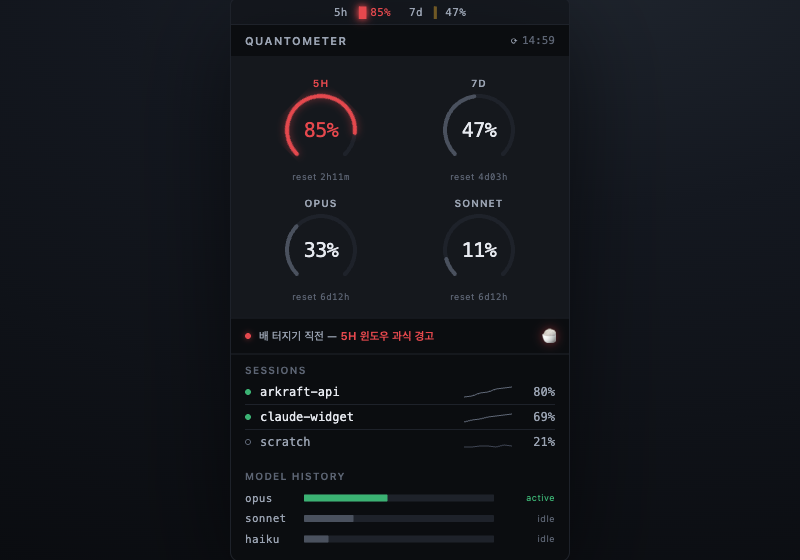

# 09. Quantometer (콴토미터)

> **한 줄 컨셉:** 차분하고 수술적인 SaaS 텔레메트리 패널 — Linear의 절제와 Grafana 게이지의 명료함을 합쳐, 모든 픽셀이 *보고*하고 장식은 없다. near-모노크롬 캔버스 위에서 **색은 신호일 뿐 스타일이 아니다.** 위험한 윈도우 하나만 채도가 살아나 즉시 읽힌다.



## 무드보드 / 톤

- **레퍼런스 정조:** 항공기 글래스 콕핏 / 옵저버빌리티 대시보드(Grafana, Datadog) / Linear의 탈색된 크롬 / 터미널 모니터링 TUI(`btop`, `htop`).
- **감정:** clinical, 신뢰 가능, "계측기처럼 정확". 귀엽지 않고 *침착하다*. 화면을 0.5초 흘끗 보면 "지금 안전한가/위험한가"가 색 하나로 끝난다.
- **반(反)무드:** 그라데이션 잔치, 네온 글로우 떡칠, 둥근 말랑 카드, 일러스트 마스코트. 이 컨셉은 그 반대다 — 헤어라인, 모노스페이스 숫자, 직각에 가까운 모서리.
- **핵심 원리(밀도 규율):** 평상시 패널은 거의 그레이스케일. 채움 칩·틱·바는 muted(30~40% 불투명). *가장 위험한 윈도우 하나*에만 풀채도 위험색이 들어가, 색의 희소성이 곧 glanceability가 된다.

## 컬러 토큰

크롬(배경/패널/헤어라인/텍스트)은 일부러 탈색했다. 색은 위험 신호에만 예약된다.

| role | light | dark |
|---|---|---|
| canvas (앱 배경) | `#FBFBFD` | `#0B0D10` |
| panel (카드 표면) | `#FFFFFF` | `#15181D` |
| hairline (1px 보더/구분선) | `#E3E6EC` | `#1E222A` |
| text-primary (figure, %) | `#11141A` | `#E6E9EF` |
| text-secondary (라벨) | `#5C6473` | `#9AA3B2` |
| text-tertiary (리셋·메타) | `#9AA3B2` | `#5C6473` |
| gauge-track (게이지 비활성 호) | `#E3E6EC` | `#1E222A` |
| accent-signal (활성 모델 틴트) | `#3BB273` | `#3BB273` |

> 라이트/다크 모두 텍스트는 3그레이 위계(primary/secondary/tertiary)로만 구성한다. 파랑·보라 같은 브랜드 액센트를 크롬에 쓰지 않는다 — Linear가 chrome 블루를 걷어낸 것과 같은 결정이다.

**위험 4단계 매핑:** `RiskLevel`과 1:1. 그레이 배경 덕에 단일 위험색 링이 즉시 읽힌다.

| level | hex | 잉크 톤 |
|---|---|---|
| calm | `#3BB273` | 쿨그린 |
| watch | `#E0A82E` | 앰버 |
| warning | `#E8731C` | 오렌지 |
| critical | `#E5484D` | 레드 |

## 타이포그래피

- **모든 figure는 모노스페이스:** `SF Mono`(폴백 `Berkeley Mono` → `Menlo`). `tabular` 폭 고정으로 숫자가 바뀌어도 좌우 지터가 없다 — 메뉴바·게이지·스파크라인 라벨 모두 폭이 안 흔들린다.
- **라벨/캡션:** `SF Pro Text` 11pt, ALL CAPS, letter-spacing 살짝(+0.4). `5H` `7D` `OPUS` `SONNET` 같은 윈도우 라벨.
- **타입 스케일:** `11 / 13 / 22`.
  - `22pt` — 게이지 정중앙 **%** (모노, 화면의 주인공).
  - `13pt` — 세션/모델 행의 figure.
  - `11pt` — 라벨·리셋 카운트다운·메타.
- 본문 문장은 거의 없다. 텍스트는 라벨이거나 숫자다.

## 레이아웃 & 셰이프 언어

- **12컬럼 그리드, 320pt 팝오버 기준.** 모든 요소가 컬럼에 스냅된다.
- **플랫 카드 + 1px 헤어라인.** 그림자 없음(`shadow: none`). 깊이는 보더와 배경 명도차로만 표현.
- **곡률 ≤ 6pt.** 게이지 링·바 글리프는 사실상 직각에 가깝다. 둥근맛 금지.
- **레이디얼 마이크로게이지:** 270° 오픈 아크, **2pt 스트로크**, 위가 트인 형태. 트랙은 `gauge-track`, 채움은 위험색. % 텍스트가 호의 정중앙.
- **스파크라인:** 1pt 헤어 라인, **그리드리스**, 축·라벨 없음. 세션 컨텍스트와 모델당 히스토리를 표현. 면적 채우기 없이 선만.
- **마이크로바 글리프(메뉴바용):** 6px 폭 블록 문자 램프(`▁▂▃▄▅▆▇█` 계열)로 % 구간을 한 글자로 압축, 모노라서 폭 안정.

## 화면 목업

### 메뉴바

작고 반투명 위 가독성을 위해 모노 폭 고정 + 위험색 글리프만 색을 입힌다. 평상시 글리프도 muted, **critical일 때만 그 마이크로바에 미세 글로우.**

```
5h ▕▎ 05%   7d ▕▊ 50%
```

- `5h` `7d` 라벨은 `text-secondary`, `▕▎`/`▕▊` 마이크로바 글리프는 해당 윈도우 위험색.
- 두 윈도우 중 더 위험한 쪽만 풀채도, 나머지는 30~40% 불투명.
- 모노스페이스라 `05%` → `48%`로 바뀌어도 폭 점프 없음(메뉴바 흔들림 방지).

### 팝오버   (320pt — 상단 2×2 게이지 클러스터)

```
┌──────────────────────────────────────────────┐
│  QUANTOMETER                         ⟳ 14:59  │  ← 헤어라인 헤더
├──────────────────────────────────────────────┤
│   ╭─────────╮          ╭─────────╮            │
│   │   5H    │          │   7D    │            │
│   │  ◜ 05% ◝│          │  ◜ 50% ◝│            │   2×2 게이지 클러스터
│   │  reset  │          │  reset  │            │   (270° 오픈아크 + 중앙%
│   │  2h11m  │          │  4d03h  │            │    + 9pt 리셋)
│   ╰─────────╯          ╰─────────╯            │
│                                                │
│   ╭─────────╮          ╭─────────╮            │
│   │  OPUS   │          │ SONNET  │            │
│   │  ◜ 78% ◝│  ◀ 풀채도│  ◜ 22% ◝│            │   ← OPUS = 최악 → critical
│   │  reset  │  (유일)  │  reset  │            │     나머지 3개는 muted 그레이
│   │  6d12h  │          │  6d12h  │            │
│   ╰─────────╯          ╰─────────╯            │
├──────────────────────────────────────────────┤
│  ● 아직 배고픔 — OPUS 윈도우 과식 경고 🍚      │  ← status 리본 (personality 1줄)
├──────────────────────────────────────────────┤
│  SESSIONS                                      │
│  ● arkraft-api      ▁▂▃▅▇▇  47%               │  ← 얇은 룰 + 1pt 스파크라인
│  ● claude-widget    ▁▁▂▂▃▃  31%               │
│  ○ scratch          ▁▁▁▂▂▁  12%               │
├──────────────────────────────────────────────┤
│  MODEL HISTORY                                 │
│  opus    ███████░░░░░░░░░░  ← 활성(틴트)        │  ← 슬림 스택 바
│  sonnet  ████░░░░░░░░░░░░░  (그레이 램프)       │
│  haiku   ██░░░░░░░░░░░░░░░                     │
└──────────────────────────────────────────────┘
```

- **단 하나의 풀채도 액센트:** 위 예시에서 OPUS(78%)가 가장 위험한 게이지 → critical `#E5484D` 풀채도. 나머지 게이지·바·스파크라인은 전부 muted 그레이스케일.
- status 리본의 글리프(🍚)와 마이크로카피가 *최악 게이지와 같은 위험색*으로 채워져, 색 신호와 personality가 한 점에서 만난다.

### 위젯

- **small:** 가장 위험한 윈도우 하나의 **큰 270° 링** + 중앙 % + 그 아래 리셋 카운트다운. 링 색 = 그 윈도우 위험색(나머지 정보는 생략, 단일 신호 극대화).

```
┌───────────────┐
│      OPUS     │
│    ◜  78% ◝   │
│   reset 6d12h │
└───────────────┘
```

- **medium:** **2×2 컴팩트 링**(4 윈도우) + 우측에 **3바 스파크스트립**(최근 추세). 액센트 룰 동일 — 최악 윈도우 하나만 풀채도.

```
┌──────────────────────────────────┐
│  5H ◜05%◝   7D ◜50%◝   ▁▂▃▅▇  5h │
│  OP ◜78%◝   SO ◜22%◝   ▁▁▂▃▅  7d │
│                        ▁▁▁▂▂  op │
└──────────────────────────────────┘
```

## 시그니처 무브

**싱글 액센트 룰 (Single Accent Rule).** 패널 전체가 그레이스케일로 깔린 상태에서, *가장 위험한 게이지/행 단 하나만* 풀채도 위험색을 받는다. 색이 희소하기 때문에 흘끗 보는 순간 "어디가 문제인지"가 색 하나로 확정된다 — Grafana의 center-glow 게이지가 텍스트 색을 바꾸는 대신 단일 신호를 강조하는 발상과 같은 계열이다. 평상시 모든 게 calm 그린이면 그조차 muted로 가라앉혀, 진짜 위험이 올라올 때만 채도가 "켜진다".

## 먹방 정체성 반영 + "정확함 > 귀여움" 준수 방식

그레이스케일 텔레메트리는 그대로 두면 clinical/soulless — 먹방 personality가 증발한다. 그래서 personality는 **퍼지지 않고 한 점에 응축**한다:

- **status 리본 마이크로카피 한 줄**에만 먹방 보이스를 허용한다. 예: 낮은 사용량 `● 아직 배고픔`, 높은 사용량 `● 과식 경고 — OPUS 윈도우`, 거의 소진 `● 배 터지기 직전`.
- **아이콘 글리프 딱 하나**(🍚 밥/식욕 글리프)를 리본에만 둔다. 이 글리프는 **최악 게이지와 같은 위험색으로 채워져**, "먹방 정체성"과 "정확한 위험 신호"가 동일한 픽셀에서 일치한다.
- 게이지·숫자·스파크라인 같은 *계측 영역*에는 personality를 일절 넣지 않는다 — 거기선 정확함이 절대 우선. 귀여움은 리본 1줄 + 글리프 1개라는 엄격한 예산 안에서만 산다.

이로써 ADR-0009의 "정확함 > 귀여움"을 위계로 강제한다: 정확함이 화면의 99%, 귀여움이 1%.

## 장점 / 리스크

**장점**
- 압도적 glanceability — 색 희소성 덕에 위험 인지가 0.5초.
- 메뉴바 가독성 최상(모노 폭 고정 → 반투명 위에서도 지터·흔들림 없음).
- 정보 밀도 높음(2×2 게이지 + 세션 + 모델 히스토리를 320pt에 무리 없이).
- 라이트/다크 둘 다 견고(크롬이 탈색돼 다크에서 특히 강함).

**리스크**
- 차갑다 — personality 예산이 너무 좁으면 "그냥 모니터링 툴"로 느껴질 수 있음(리본 보이스가 캐릭터를 떠받쳐야 함).
- 모든 게 calm일 때 화면이 단조로움(muted 그레이만 보임) → "잘 작동하나?" 의심 유발 가능. calm 그린을 완전히 죽이지 말고 아주 옅게 살려둘 필요.
- 270° 마이크로게이지가 작은 메뉴바/위젯 small에서 너무 가늘면(2pt) 망막 가독성 저하 — 위젯에선 스트로크 굵힘 필요.

## 구현 난이도   (SwiftUI — 상/중/하)

- **하:** 컬러 토큰·타이포(`Color` + `Font.system(.monospaced)`), 플랫 카드 + 헤어라인(`overlay(RoundedRectangle.stroke)`), 스택 바.
- **중:** 270° 오픈아크 게이지(`Path.addArc` + `trim(from:to:)` + 중앙 `Text` 오버레이), 스파크라인(`Path`로 1pt polyline). 2×2 클러스터는 `Grid`/`LazyVGrid`로 직결.
- **상:** 메뉴바 마이크로바 글리프(블록 문자 매핑 + critical 글로우는 `NSAttributedString`/`shadow`로) — 폭 안정 위해 모노 폰트 attribute 강제. critical 글로우는 메뉴바 `NSStatusItem` 제약상 미세 튜닝 필요.

**종합: 중.** 핵심 게이지/스파크라인은 순수 `Path`라 의존성 없이 그릴 수 있고, 가장 까다로운 건 메뉴바 글리프의 폭 안정 + 글로우 디테일뿐.

## 트렌드 레퍼런스   (2~3)

- **Linear — 탈색된 크롬 + 신호로서의 색.** Linear는 chrome 블루를 색 계산에서 걷어내 중립·timeless한 표면을 만들고, 색을 *기능 신호*로만 쓴다. 테마를 base/accent/contrast 3변수로만 정의하는 절제가 Quantometer의 "크롬은 탈색, 색은 위험 전용" 결정과 직결. ([How we redesigned the Linear UI](https://linear.app/now/how-we-redesigned-the-linear-ui), [A calmer interface](https://linear.app/now/behind-the-latest-design-refresh))
- **Grafana revamped gauge (2026).** 새 게이지는 Circular/Arc 스타일, 스파크라인 결합, 그리고 **center glow**(텍스트 색을 바꾸는 대신 현재 값 색을 텍스트 뒤 투명 글로우로) 옵션을 도입했다 — Quantometer의 270° 오픈아크 + 중앙 % + critical 글로우 발상의 직접 레퍼런스. ([Revamped gauge visualization](https://grafana.com/whats-new/2026-01-19-revamped-gauge-visualization/), [Gauge docs](https://grafana.com/docs/grafana/latest/visualizations/panels-visualizations/visualizations/gauge/))
- **터미널 모니터(`btop`/`htop`) 계열.** 모노스페이스 폭 고정 + 블록 문자 마이크로바 + 그리드리스 스파크라인이라는 "TUI 텔레메트리" 언어가 메뉴바 글리프와 세션 스파크라인의 모델.

Sources:
- [How we redesigned the Linear UI (part II) — Linear](https://linear.app/now/how-we-redesigned-the-linear-ui)
- [A calmer interface for a product in motion — Linear](https://linear.app/now/behind-the-latest-design-refresh)
- [Revamped gauge visualization — Grafana Labs](https://grafana.com/whats-new/2026-01-19-revamped-gauge-visualization/)
- [Gauge — Grafana documentation](https://grafana.com/docs/grafana/latest/visualizations/panels-visualizations/visualizations/gauge/)
