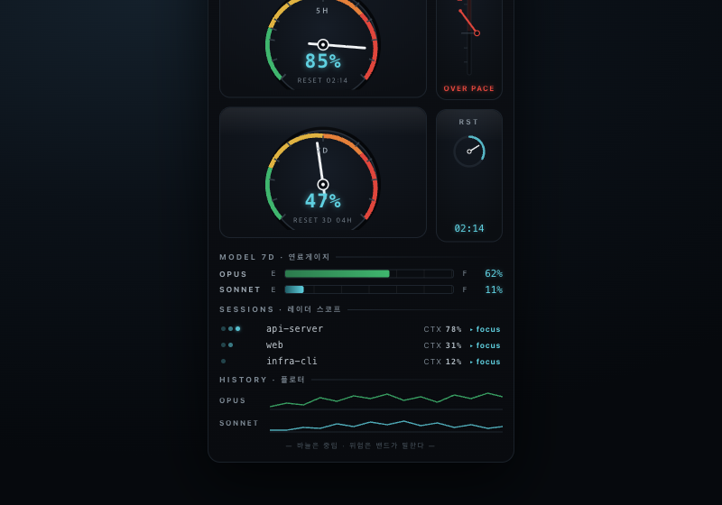

# 10. Cockpit (계기판)

> **한 줄 컨셉:** Claude 한도를 *항공기 계기 클러스터*로 읽는다 — 아날로그 바늘이 스윕 레드라인 호를 가로지르고, 너무 빨리 먹으면 전용 **연소율 VSI**(vertical-speed indicator) 바늘이 레드로 치솟는다. "지금 얼마나 남았나"가 아니라 "지금 얼마나 빨리 타고 있나"를 계기로 직독한다.



---

## 무드보드 / 톤

- **레퍼런스 이미지군:** 야간 글래스 칵핏(보잉/세스나 PFD)의 인광 readout, 1970s 아날로그 타코미터의 레드라인 호, Teenage Engineering OP-1 / Nothing Phone의 노출된 엔지니어링 그리드, Grafana 게이지의 threshold band, 다이브 워치 베젤 틱.
- **정서:** 차갑고 정밀한 야간 운항석. 따뜻함·귀여움이 아니라 *신뢰할 수 있는 도구*의 분위기. 화면을 보면 "내가 조종석에 앉아 계기를 읽는다"는 감각.
- **물성:** 브러시드 메탈 베젤 + 다이얼면 위 절제된 글래스 스페큘러(상단 1줄 하이라이트). 스큐어모피즘이지만 키치가 아니라 *계기 등급(instrument-grade)*. 텍스처는 최소한으로, 정보가 주인공.
- **금기:** 그라데이션 범벅, 이모지, 둥글둥글 마스코트, 무의미한 베벨/그림자 남발. 텍스처는 "있는 듯 없는 듯"이어야 정확함 룰을 안 깬다.

## 컬러 토큰

다크 네이티브가 **주(主)** — 야간 계기판이 이 컨셉의 정체성이다. 라이트는 "주간 계기 반전"으로만 보조 제공한다.

| role | light (주간 계기 반전) | dark (주 — 야간 운항석) |
|---|---|---|
| bezel (베젤/외곽 프레임) | `#D8D2C6` (브러시드 알루미늄) | `#0A0C0F` (무광 블랙 베젤) |
| dial-face (다이얼면) | `#F4F1EA` (웜 페이퍼) | `#101419` (딥 슬레이트) |
| tick / etch (에칭 틱·눈금) | `#8A8378` (차콜 에칭) | `#222A33` (희미한 에칭) |
| needle (바늘 — 중립) | `#2B2B2B` (차콜 바늘) | `#F2F4F6` (뉴트럴 화이트 바늘) |
| readout (LCD 숫자 — 인광) | `#1C5D66` (다크 시안 잉크) | `#5FD0E0` (인광 시안, 미세 글로우) |
| label (실크스크린 라벨) | `#6B6457` | `#7E8A95` (콘덴스드 캡스) |
| glass-specular (글래스 하이라이트) | `#FFFFFF @ 14%` | `#FFFFFF @ 8%` |

**위험 4단계 매핑 (레드라인 호 — 다이얼 외곽 스윕 밴드):**

| RiskLevel | 밴드 색 (hex) | 의미 |
|---|---|---|
| calm | `#3FB66E` (그린 밴드) | 안전 운항 구간 |
| watch | `#E0B341` (앰버 밴드) | 주의 — 밴드 진입 |
| warning | `#E5803A` (오렌지 밴드) | 경고 — 레드라인 접근 |
| critical | `#E0463C` (레드 레드라인) | 100% 근처 레드라인 |

> **핵심 색 결정:** *바늘은 색이 없다(중립 화이트/차콜).* 위험은 **바늘이 어느 밴드 위에 있느냐**로 읽는다 — 자동차 타코미터의 레드존과 동일한 인지 모델. 밴드는 **정적 레퍼런스 지오메트리**(항상 같은 각도에 그려진 호)라서, 메뉴바처럼 색이 뭉개지는 밀도에서도 *위치*가 의미를 보존한다. RiskScorer의 4레벨은 "바늘이 어느 호에 진입했나"의 임계각으로 그대로 매핑된다.

## 타이포그래피

- **숫자 (readout):** 7세그먼트/LCD 계열 — DSEG 같은 squared 페이스, 또는 fallback으로 **SF Mono** tabular. `tabular-figures` 강제로 자릿수가 흔들리지 않게. 인광 시안에 1px 블러 글로우 한 겹(절제).
- **보조 라벨:** 콘덴스드 그로테스크 **올캡스**(실크스크린 계기 라벨 느낌) — `5H`, `7D`, `OPUS`, `BURN`, `RESET`. 트래킹 넓게, 작게.
- **위계:** LCD 숫자(히어로) > 캡스 라벨(레퍼런스) > 시안 글로우는 "지금 읽어야 할 값" 하나에만. 글로우 남발 금지 — 계기는 조용해야 신뢰된다.

## 레이아웃 & 셰이프 언어

- **닫힌-원 아날로그 다이얼**: 5h / 7d 두 개의 **히어로 게이지**. 풀 베젤, 10%마다 에칭 틱, 외곽에 스윕 위험밴드, 중앙에 LCD %, 작은 리셋 서브다이얼.
- **선형 스트립 게이지**: 모델 7d 윈도우(Opus/Sonnet)는 원형이 아니라 **연료게이지 E↔F 스트립**. 풀계기를 두 다이얼로 한정하고 나머지는 플랫.
- **세로 VSI 거터**: 팝오버 우측에 세로 **연소율 VSI** — 중앙선 기준 위/아래 바늘.
- **세션 = 레이더 스코프 스트립**: 블립 점 + 컨텍스트 밝기(밝을수록 컨텍스트 꽉 참).
- **히스토리 = 플로터 트레이스**: 하단 얇은 라인 차트(계기 기록지 느낌).
- **그리드:** Teenage Engineering식 정렬된 베이스라인 그리드 — 모든 라벨이 격자에 스냅. "노출된 엔지니어링"이 질서 있게 보이도록.

## 화면 목업

### 메뉴바

작고 반투명 배경에서도 읽혀야 한다. 클락-파이 글리프(채움 = 사용률) + LCD 숫자 + 레드라인 색 시프트.

```
5h ◔ 05   7d ◑ 50
```

- `◔ ◑ ◕ ●` 파이 글리프 채움 = 사용률 단계(아날로그 다이얼의 초소형 프록시).
- 숫자는 LCD tabular. critical 진입 시 글리프/숫자만 레드(`#E0463C`)로 시프트 — 바늘 개념을 메뉴바 폭에 압축.
- 메뉴바에선 밴드 호를 못 그리므로 *색 시프트*가 위험 신호를 대신한다(밀도 fallback).

### 팝오버 (320pt — 아날로그 다이얼 클러스터)

```
┌──────────────────────────────────────────────┐
│  TOKENMUKBANG · COCKPIT          ⟳ 60s   ▲BURN│
│ ┌────────────────────────┐  ┌──────┐ ┌──────┐ │
│ │      ╭───── 5H ─────╮   │  │ BURN │ │      │ │
│ │    ╱  ·  ·  │  ·  ·  ╲ │  │      │ │   ▲  │ │  ← VSI 바늘
│ │   │ green→amber→RED  │ │  │ ═══╪═│ │ over │ │    중앙 위 = 과식
│ │   │   ╲    │↑   ╱     │ │  │   ▲  │ │ pace │ │    (레드 틴트)
│ │    ╲   ╲  bezel ╱    ╱ │  │ under│ │ ╪════│ │
│ │      ╰── [ 05% ]──╯    │  │ pace │ │  RST │ │
│ │        reset 02:14     │  └──────┘ └──────┘ │
│ └────────────────────────┘   세로 VSI 거터     │
│ ┌────────────────────────┐                     │
│ │      ╭───── 7D ─────╮   │                     │
│ │    ╱   green   amber ╲ │   ← 흰 바늘이        │
│ │   │  ╲      │       RED│     amber 밴드 위    │
│ │   │   ╲   ↑│          │     = watch          │
│ │    ╲    bezel        ╱ │                     │
│ │      ╰── [ 50% ]──╯    │                     │
│ │        reset 3d 04h    │                     │
│ └────────────────────────┘                     │
│ ─ MODEL 7D ─ 연료게이지 ────────────────────── │
│  OPUS    E [██████████░░░░░░] F   62%          │
│  SONNET  E [████░░░░░░░░░░░░] F   24%          │
│ ─ SESSIONS · 레이더 스코프 ─────────────────── │
│  ◦ api-server   ·•◦   ctx 78%  ▸focus         │
│  ◦ web          ·◦    ctx 31%  ▸focus         │
│ ─ HISTORY · 플로터 ──────────────────────────  │
│  opus  ╱╲__╱──╲___╱╲____  sonnet ___╱╲_╱──    │
└──────────────────────────────────────────────┘
```

- **상단 두 히어로 다이얼**(5h | 7d): 스윕 레드라인 호 + 중립 흰 바늘 + 중앙 LCD % + 리셋 서브다이얼.
- **우측 세로 VSI 거터**: `BURN` 다이얼 — 바늘이 중앙선 위면 *시간예산보다 빨리 소비*(레드 틴트), 아래면 under-pace(그린). 옆 `RST` 서브다이얼은 리셋 카운트.
- **아래 두 스트립 연료게이지**: Opus/Sonnet 7d (E↔F).
- **세션 레이더 스코프**: 블립 + 컨텍스트 밝기 + click-to-focus(`▸focus`).
- **푸터 플로터**: 모델 토큰 히스토리 트레이스.

### 위젯

- **small:** 다이얼 1개(기본 5h) — 풀 베젤, 레드라인 호, 흰 바늘, 중앙 LCD %. 리셋은 미니 캡션.
- **medium:** 두 다이얼(5h + 7d) + 세로 VSI 거터. 스트립/세션/히스토리는 생략(공간·리프레시 비용).

## 시그니처 무브

**버닝레이트 VSI 바늘 (연소율 수직속도계).** *얼마나 빨리 먹는지*만 전담하는 별도 아날로그 계기. 한도가 리필되는 속도보다 빨리 과식하면 바늘이 중앙선 위로 치솟으며 레드 틴트가 든다. RiskScorer의 **pacing 항을 문자 그대로 시각화** — 절대 사용률(다이얼 바늘 위치)과 *소비 속도*(VSI)를 물리적으로 분리해서 보여준다. 항공기 VSI가 고도가 아니라 *고도 변화율*을 읽는 것과 동일. 경쟁 제품 어디에도 없는 요소이고, "먹방(얼마나 빨리 먹어치우나)"을 직접 극화한다.

## 먹방 정체성 반영 + "정확함 > 귀여움" 준수 방식

- **먹방 = 연소율.** "먹방"의 본질은 *속도와 양*이다. 이 컨셉은 그걸 마스코트나 음식 일러스트가 아니라 **VSI 연소율 계기**로 번역한다(ADR-0009의 컨셉을 계기로 재해석). 빨리 먹으면 바늘이 치솟는 것 자체가 먹방의 드라마다.
- **정확함 우선:** 모든 시각 요소가 데이터에 1:1로 묶인다 — 바늘 각도 = 사용률, 밴드 진입 = RiskLevel, VSI 변위 = pacing 항. 장식적 요소(글래스/메탈)는 정보를 가리지 않는 배경 cap으로 제한.
- **귀여움 배제:** 색은 안전장비 팔레트(앰버/레드라인), 폰트는 계기 라벨, 바늘은 무채색. 감정이 아니라 *판독*을 요구하는 인터페이스.

## 장점 / 리스크

**장점**
- VSI라는 **독점적 시그니처** — pacing을 가진 RiskScorer와 완벽히 들어맞고 경쟁 제품에 없다.
- 위험을 *바늘 위치*로 읽는 모델은 학습된 직관(타코미터/연료계)이라 설명이 거의 필요 없다.
- 다크 야간 계기판은 메뉴바 앱의 항시 표시 맥락과 잘 맞고 브랜드가 강하게 선다.

**리스크**
- **320pt 클러스터의 클러터가 이 컨셉 최대 위험** — 다이얼·VSI·스트립·스코프·플로터가 한 화면에 쌓이면 "busy but slow"가 된다. 아날로그 다이얼은 *바보다 정보밀도가 낮다*(같은 면적에 숫자 한 줄이 더 많은 정보를 준다).
- **casual 사용자에겐 과함:** "지금 몇 %인지"만 알고 싶은 사람에게 계기 클러스터는 인지 부하.
- **스큐어모피즘 키치/정확함 룰 이탈 위험:** 글래스/메탈/글로우가 조금만 과하면 키치가 되고 "정확함>귀여움" 룰을 깬다.

> **완화 — ruthless tiering(가차없는 계층화) 명시:**
> 1. **풀 아날로그 계기는 딱 3개만** — 5h 다이얼, 7d 다이얼, VSI. 그 외 전부 플랫 스트립/라인.
> 2. **글래스/메탈 텍스처는 그라디언트 1겹으로 cap** — 다이얼면당 상단 스페큘러 1줄, 베젤 1톤. 그 이상 금지.
> 3. **위젯은 강제 다이어트** — small=다이얼1, medium=다이얼2+VSI. 스트립/스코프/플로터는 팝오버 전용.
> 4. **메뉴바는 글리프+LCD로 환원** — 계기 텍스처 0, 색 시프트만 위험 신호.
> 5. **글로우는 "지금 읽을 값" 하나에만.** 다중 글로우는 계기를 싸구려로 만든다.

## 구현 난이도 (SwiftUI — 상/중/하)

**전체: 상.** 단, tiering으로 핵심만 진짜 계기로 만들면 관리 가능.

| 요소 | 난이도 | 비고 |
|---|---|---|
| 아날로그 다이얼(베젤·틱·바늘·스윕밴드) | **상** | `Canvas`/`Path` + `trim`으로 호, `rotationEffect`로 바늘. 2개로 한정. |
| 스윕 레드라인 호(4밴드) | 중 | 정적 지오메트리 + `AngularGradient` 또는 세그먼트 stroke. |
| **VSI 연소율 계기** | **상** | 시그니처 — 중앙선 기준 양방향 바늘 + 틴트. 별도 커스텀 뷰. |
| 스트립 연료게이지 | 하 | `Capsule` + 채움. 플랫. |
| 레이더 스코프 / 플로터 | 중 | `Canvas` 라인. 위젯 제외라 부담↓. |
| 글래스/메탈 텍스처 | 하 | 그라디언트 1겹 cap 규칙으로 의도적 제한. |
| LCD 숫자 | 하 | 폰트 + tabular. DSEG 번들 or SF Mono. |
| 위젯(small/medium) | 중 | 다이얼 재사용, 리프레시 비용 고려해 요소 축소. |

## 트렌드 레퍼런스

1. **Grafana 게이지 threshold band** — 게이지 값 밴드 *바깥*에 임계 밴드를 별도로 그려, 바늘/값과 무관하게 "어느 구간에 들어왔나"를 정적 레퍼런스로 보여주는 패턴. 본 컨셉의 "바늘은 중립, 밴드가 의미"를 그대로 차용. ([Grafana — Gauge](https://grafana.com/docs/grafana/latest/visualizations/panels-visualizations/visualizations/gauge/), [Configure thresholds](https://grafana.com/docs/grafana/latest/panels-visualizations/configure-thresholds/))
2. **Teenage Engineering — 제약을 미학으로** — 노출된 나사·모노스페이스·5색(오렌지=안전장비 유래=중요·엔지니어드)·각 모드가 화면을 통째로 점유하는 그리드. 본 컨셉의 "계기 등급 스큐어모피즘 + 안전장비 팔레트 + 정렬 그리드"의 톤 기준. ([Constraints as Aesthetic](https://blakecrosley.com/guides/design/teenage-engineering))
3. **Nothing OS — 투명성·sci-fi 노스탤지어** — TE의 디자인 가이드에서 출발한 도트매트릭스/스트립다운 미학. 야간 계기판의 "절제된 글래스 스페큘러 + 인광 readout"이 키치로 넘어가지 않는 선의 레퍼런스. ([Nothing × Teenage Engineering UI](https://nothing.community/d/1129-teenage-engineering-based-ui-for-nothing-os))
