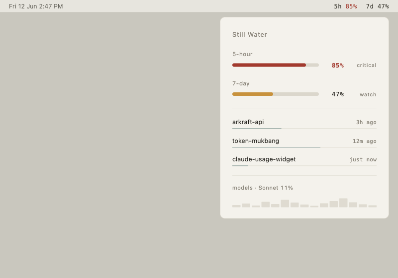

# 11. Still Water (잔잔한 물)

> **한 줄 컨셉:** 평소엔 거의 시스템 텍스트처럼 사라지는 고요한 표면 — 정말 중요한 순간에만 방 전체가 탈색되고 *한 잉크 하나*가 조용히 데워져 다가온다.



---

## 무드보드 / 톤

물결 하나 없는 새벽 호수, 손에 잡히는 따뜻한 종이, 잘 마른 점토(matte clay). 광택·유리·네온이 아니라 **표면(surface)** 의 질감이다. 평온할 땐 모니터링이 *존재를 주장하지 않는다* — 메뉴바 한 줄은 macOS 시스템 텍스트와 거의 구분되지 않고, 위젯은 조용한 세린(serene) 뉴트럴 타일로 책상 위에 가라앉아 있다.

핵심 정서는 **calm tech**: 정보는 항상 거기 있지만 주의(attention)를 빼앗지 않는다. 사용자가 코드를 쓰는 동안 위젯은 *배경*이다. 그러다 5h/7d 윈도가 위험에 가까워지면, 화면은 요소를 *추가*해 시끄러워지는 게 아니라 — **나머지를 더 조용하게(탈색) + 단 하나의 채움을 데움** — 으로 신호를 보낸다. across-the-room에서 색의 *온도* 만으로 "지금 괜찮은가/뜨거운가"가 읽힌다.

표면은 의도적으로 **elevated 뉴트럴**(플랫한 순백/순회색이 아님): 웜 오프화이트와 소프트 그래파이트. 그림자도, 그라디언트도, 카드 겹침도 없다. 구조는 오직 **여백 + 헤어라인**으로만 만든다.

## 컬러 토큰

"한 잉크가 모든 의미를 진다"가 시스템의 척추다. calm 상태에서 화면은 전부 뉴트럴이고, 유일한 채도는 뮤트 틸-슬레이트 `#5B7B7A`("괜찮음" 채움) 하나뿐이다. 위험이 올라가도 **새 색을 추가하지 않는다** — 그 *한 잉크*의 hue를 데우고(warm), 동시에 주변 뉴트럴을 더 탈색한다.

| role | light | dark |
|---|---|---|
| ground (배경 표면) | `#F4F2EC` | `#1A1916` |
| ink (본문 텍스트) | `#23211C` | `#E8E4DA` |
| hairline (구분선/게이지 트랙) | `#DBD7CC` | `#2C2A25` |
| muted (보조 텍스트·리셋·상태 단어) | `#8A857A` | `#9A9488` |
| accent · calm (괜찮음 채움) | `#5B7B7A` | `#6B8B8A` |
| accent · watch | `#C8923D` | `#D8A24D` |
| accent · warning | `#B85A3A` (terracotta) | `#C86A4A` |
| accent · critical | `#A23A2E` | `#B24A3E` |

다크 모드의 액센트는 ground 위에서 광량을 유지하기 위해 라이트 대비 **약 +10% 명도**로 올린다. 액센트 hue는 한 계열(teal→amber→terracotta→oxide red)로 *온도 축을 따라* 미끄러지듯 이동한다 — 색상환을 가로지르지 않고, 같은 잉크가 차가움에서 뜨거움으로 데워지는 느낌.

**위험 4단계 매핑:**

| level | hue (light) | 의미 |
|---|---|---|
| **calm** | `#5B7B7A` teal-slate | 여유 있음. 화면 전체 순수 뉴트럴 + 채움만 이 색. |
| **watch** | `#C8923D` amber | 주의 진입. 잉크가 살짝 데워짐. |
| **warning** | `#B85A3A` terracotta | 경고. 데움 + 주변 탈색 시작. |
| **critical** | `#A23A2E` deep oxide red | 임박. 방이 가장 탈색되고 잉크가 가장 뜨겁다. |

> **정직성 장치:** 위험은 hue 단독으로 신호하지 않는다(색각 이상·흑백 스크린샷 대비). 항상 (1) 채움 *길이*, (2) 상태 *단어*("calm/watch/warning/critical"), (3) hue 온도 — 세 채널이 함께 움직인다. 색을 못 봐도 길이와 단어로 위험을 읽을 수 있다.

## 타이포그래피

- **숫자·게이지 값·메뉴바 = 모노스페이스** (SF Mono, 없으면 Berkeley Mono 톤). 데이터는 모노로 — 자릿수가 흔들리지 않아 "tabular" 안정감을 주고, 메뉴바에서 시스템 텍스트와 톤이 붙는다(mono-for-data 트렌드).
- **레이블·이름·산문 = SF Pro Text/Display.** 넉넉한 트래킹과 leading으로 숨 쉬는 여백.
- **볼드는 단 하나** — 화면에서 가장 중요한 *라이브 숫자 하나*(예: critical에 가까운 윈도의 %)에만. 나머지는 전부 regular. 볼드를 아끼는 것이 "조용함"의 핵심 무기다.
- 상태 단어는 muted 컬러 + 작은 size + 약간 넓은 트래킹의 소문자(`calm`)로, 라벨처럼 가라앉힌다.

## 레이아웃 & 셰이프 언어

- **플랫.** 그림자/그라디언트/글래스/카드 없음. 깊이(z축) 대신 **여백 + 1px 헤어라인**으로만 영역을 나눈다.
- **게이지 = 얇은 가로 캡슐**(링/도넛 아님). 트랙은 hairline, 채움은 accent. 높이는 모노 숫자의 x-height 정도로 슬림하게. 가로 캡슐은 "수위(water level)" 은유와 맞고, 작은 팝오버 폭에서도 비교가 쉽다.
- **70% 여백 원칙.** 팝오버 내부는 콘텐츠보다 빈 공간이 더 많아야 한다. 정보 밀도가 아니라 *고요함*이 첫인상이어야 한다.
- 모서리 라운드는 작게(캡슐만 fully rounded), 나머지는 거의 직각에 가까운 소프트 코너.

## 화면 목업

### 메뉴바

calm일 때는 **순수 모노크롬** — 거의 시스템 텍스트:

```
5h 5%   7d 50%
```

(ink-뉴트럴 모노. 아이콘 없음, 색 없음.)

watch 이상으로 진입하면 *해당 윈도의 % 글리프만* 웜 액센트로 물든다(나머지는 그대로 뉴트럴):

```
5h 5%   7d 82%        ← "82%"만 amber/terracotta로
```

calm에서 거의 보이지 않다가, 뜨거워질 때만 눈에 들어오는 한 점. 메뉴바는 좁고 반투명 위에서도 모노+높은 명암비 ink로 가독성을 확보한다.

### 팝오버   (320pt, 70% 여백)

```
┌────────────────────────────────────────┐
│                                        │
│   Still Water                          │
│                                        │
│                                        │
│   5-hour                               │
│   ▭▭▭▭▭▭▭▭▭▭▭▭▭▭▭▭▭▭▭▭▭▭   5%    calm  │
│                                        │
│   7-day                                │
│   ▰▰▰▰▰▰▰▰▰▰▰▰▰▰▰▰▱▱▱▱▱▱  82%  warning │
│                                        │
│   ──────────────────────────────────   │
│                                        │
│   arkraft-api          ▁▁▁▁▁   3h ago  │
│   ─────────                            │
│   token-mukbang        ▁▁▁▁▁▁  12m ago │
│   ───────────────                      │
│                                        │
│   ──────────────────────────────────   │
│                                        │
│   models   ▁▂▁▃▂▅▃▂▁▂▄▆▃▂▁            │
│                                        │
└────────────────────────────────────────┘
```

- 타이틀 "Still Water"는 SF Pro, muted에 가깝게.
- 게이지 2개(5h/7d): 슬림 캡슐, 우측에 모노 값 + 한 단어 상태. warning 행만 채움이 terracotta로 데워지고 그 외엔 calm teal.
- 헤어라인 아래 **세션 1줄씩**: 이름 + 그 아래 *1px 컨텍스트 밑줄*(밑줄 길이 = 컨텍스트 윈도 채움 비율) + 우측 리셋/마지막 활동.
- 맨 아래 **저대비 스파크바**(모델 토큰 히스토리) — muted/hairline 톤으로 거의 속삭이듯.

### 위젯

가장 고요한 표면. small은 캡슐 1개 + 큰 모노 값 + 리셋만:

```
small                        medium
┌──────────────┐   ┌──────────────────────────┐
│              │   │  5h            7d         │
│   7d         │   │  5%            82%        │
│   82%        │   │  ▭▭▭▭▭▭▭▭▭   ▰▰▰▰▰▰▱▱     │
│  ▰▰▰▰▰▰▱▱    │   │                           │
│   warning    │   │  resets 1h 40m   warning  │
│  resets 1h40 │   │                           │
└──────────────┘   └──────────────────────────┘
```

calm이면 **세린 뉴트럴 타일**(채움만 teal, 거의 회색처럼 보일 정도). 페이스가 핫이면 그 *단일 채움*이 데워져서 — 책상 건너편에서 *색 온도*만으로 상태가 읽힌다(across-the-room 온도 읽기). 위젯은 텍스트·캡슐 1개로 정보를 최소화하되 모노 값은 크게.

## 시그니처 무브

**"방이 탈색되고 한 잉크가 데워진다."**

경보 = 클러터 추가가 아니다. 위험이 오르면 (1) 주변 뉴트럴을 한층 더 탈색해 *조용하게* 만들고, (2) 단 하나의 채움/글리프만 온도를 올린다. 그래서 그 따뜻한 한 요소가 unmissable이 된다 — 시끄러워서가 아니라, *나머지가 더 조용해져서*.

> **옵션 — heartbeat 없는 "weather":** 사용량 추세에 따라 헤어라인이 아주 천천히(분 단위) 드리프트하는 미세 모션. 평소엔 인지되지 않지만, 며칠을 두고 보면 "수위"가 변한 것처럼 느껴진다. (성능·산만함 우려 시 기본 off.)

## 먹방 정체성 반영 + "정확함 > 귀여움" 준수 방식

먹방 컨셉(ADR-0009)은 **시각이 아니라 카피/톤에만** 얹는다 — 표면은 끝까지 고요해야 하므로 일러스트·이모지·캐릭터를 쓰지 않는다. 대신:

- 상태/리셋 카피에 절제된 "포만(satiety)" 은유: 7d 채움 옆 보조 라벨에 *"배부름 82%"* 같은 한 줄(작게, muted). 색·게이지는 정확한 수치로, 농담은 텍스트 한 줄로 분리.
- "정확함 > 귀여움" 준수: 의미를 지는 건 항상 **수치 + 길이 + 상태 단어**다. 귀여움은 절대 데이터 채널을 대체하지 않고, 모노 숫자·정직한 게이지 길이 위에 *얇게* 얹히는 톤일 뿐이다. 귀여움이 가독성·정확성과 충돌하면 귀여움을 버린다.

## 장점 / 리스크

**장점**
- *사용 중*에 가장 강하다: 작업을 방해하지 않고 배경으로 가라앉았다가, 진짜 중요할 때만 온도로 끌어당긴다 — calm tech의 정석.
- 메뉴바 가독성 최상(거의 시스템 텍스트, 모노+고명암비).
- 단일 잉크 시스템이라 구현·유지가 단순하고 색 정책이 일관된다.
- 위험 신호가 hue·길이·단어 3중이라 접근성/정직성이 높다.

**리스크**
- **side-by-side 비교 약점:** 다른 화려한 컨셉과 스크린샷을 나란히 두면 "boring/미완성"으로 보일 수 있다. calm tech는 *정지 이미지*가 아니라 *사용 시간* 속에서만 이긴다 — 심사 시 "30분 켜두고 watch→critical 전이"를 데모로 보여줘야 한다.
- **먹방 브랜드와의 긴장:** 비주얼이 조용해서 먹방의 펀(fun)이 약해 보일 수 있다 — 카피/톤으로만 보전하므로 브랜드 임팩트가 옅어질 위험.
- **스크린샷 그리드 약점:** 썸네일 그리드에서 calm 타일은 거의 빈 회색으로 보인다. 마케팅 샷은 watch/warning 상태로 찍어 온도 대비를 살려야 한다.

## 구현 난이도   (SwiftUI — 상/중/하)

**하 ~ 중.** SwiftUI로 매우 실현 가능.

- 게이지 = `Capsule()` 트랙 + 클리핑된 채움 `Capsule().frame(width:)` — **하**. 링/도넛보다 훨씬 쉽다.
- 단일 액센트 + 토큰 테이블은 `Color(hex:)` 상수와 RiskLevel→accent 매핑 함수 하나면 끝 — **하**. (`App/Shared/`의 hex→Color 글루 재사용, ADR-0001/0006 위반 없음.)
- 메뉴바 모노 텍스트, 팝오버 헤어라인/스파크바, 위젯 캡슐 — 전부 표준 SwiftUI **하 ~ 중**.
- "weather" 헤어라인 드리프트(옵션)만 `TimelineView`/애니메이션이라 **중**. 기본 off면 무시 가능.
- 위젯은 정적 스냅샷만 읽으므로(ADR-0003) 모션 없이 정지 렌더 — 난이도 낮음.

## 트렌드 레퍼런스   (calm tech · 단일 액센트 · mono-for-data)

1. **Calm UX / Elevated 뉴트럴 (2026):** 밝은 순백을 버리고 warm sand·muted clay·soft charcoal로 가는 흐름, 그리고 "주의를 빼앗지 않는 calm 인터페이스"가 2026 핵심 트렌드로 꼽힌다. Still Water의 `#F4F2EC`/`#1A1916` elevated 뉴트럴 그라운드와 직결. ([envato — calm interfaces](https://elements.envato.com/learn/ux-ui-design-trends), [updivision — 2026 color trends](https://updivision.com/blog/post/ui-color-trends-to-watch-in-2026))
2. **모노크롬 + 단일 액센트 (Vercel / Notion 패턴):** Vercel은 흑백 모노크롬 + 단일 액센트로 브랜드를 세웠고, Notion은 모노크롬 베이스 + 간헐적 적응형 액센트를 쓴다. Still Water의 "한 잉크가 모든 의미" 정책과 정확히 같은 계보. ([recursion — 2026 UI color trends](https://www.recursion.agency/blog/ui-color-trends-2026))
3. **Calm Technology 원칙 (Amber Case):** "정보를 환경/작업에서 사용자를 끌어내지 않고 ambient하게 전달한다"는 원칙 — 평소 사라지고 필요할 때만 온도로 신호하는 Still Water의 시그니처 무브의 이론적 토대. ([calmtech.com](https://calmtech.com/))

데이터=모노, 산문=산세리프(mono-for-data)는 2026 대시보드에서 warm/neutral 표면 위 가독성을 높이는 방식으로 권장된다. ([muzli — 2026 dashboard examples](https://muz.li/blog/best-dashboard-design-examples-inspirations-for-2026/))
