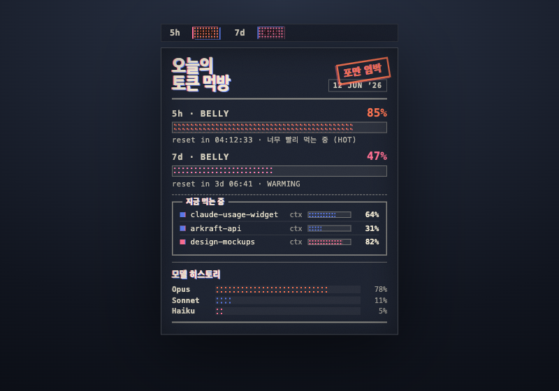
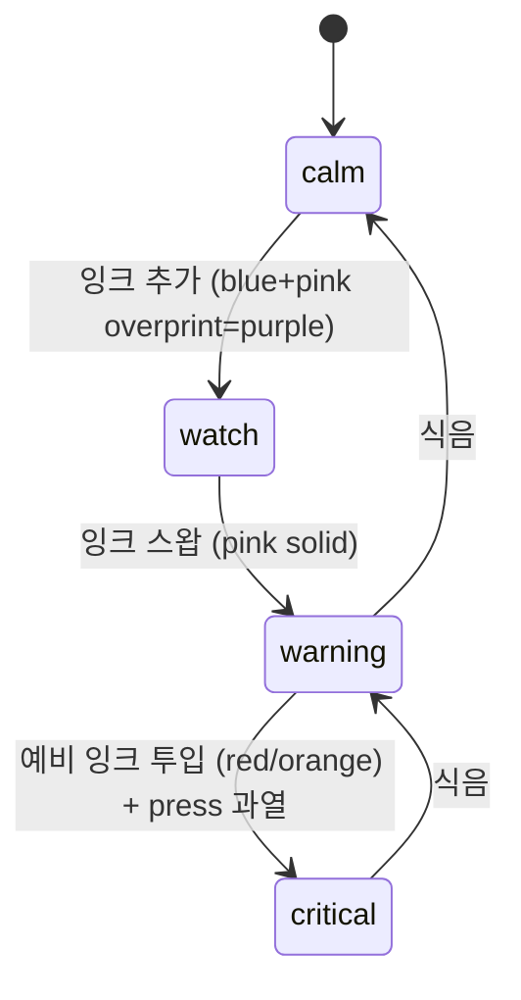

# 12. Riso Mukbang (리소 먹방)

> **한 줄 컨셉:** 토큰이 얼마나 배고픈지를 인쇄한 주머니 zine — 듀오톤 잉크와 하프톤 belly, 매력적으로 어긋난 misregistration으로 "사람이 만든" 질감을 입히되, *숫자는 dead 정확*. 위험이 오를수록 **프린트 런에 잉크가 추가·스왑**돼 미학 자체가 심각도를 인코딩한다.



## 무드보드 / 톤

리소그래프는 무한 hue를 섞는 매체가 아니라 **스팟컬러 매체**다 — 2~3개의 named 잉크를 종이에 한 레이어씩 올린다. 그 제약이 곧 디자인 시스템이다. 우리는 그 물성을 그대로 차용한다:

- **종이(paper)**: 웜 크림 stock(light) / 딥 잉크네이비 stock(dark). 모든 게 그 위에 *인쇄*된다.
- **상설 잉크 2색**: 플루오 핑크 + 리소 블루. 두 잉크가 겹치는 곳(overprint)에 머디 퍼플이 공짜로 생긴다 — 정통 리소의 "3번째 톤".
- **예비 잉크(spot run)**: 리소 레드/오렌지. 평소엔 안 쓴다. critical에서만 "프린트 런에 잉크를 추가"하듯 등장 → event-like 신호.
- **질감 3종**: 페이퍼-그레인, 잉크-노이즈, ~1px **misregistration**(핑크가 블루에서 살짝 어긋남). 정통 리소가 종이를 매번 조금씩 다르게 무는 데서 오는 "진짜 기계의 흔적".
- **보이스**: 청키한 zine 표지 + 클리니컬한 스펙시트. 헤더는 인쇄소처럼 거칠고, 데이터는 검사 기기처럼 차갑다.

다크 모드는 단순 반전이 아니라 **"검은 종이에 인쇄"**다. 잉크네이비 stock 위에서 플루오 잉크가 *더* 글로우한다 — 리소가 다크 stock에서 실제로 보이는 모습이라 다크가 오히려 *더* 온브랜드다.

## 컬러 토큰

| role | light | dark |
|---|---|---|
| `paper` (베이스/배경) | `#F1E9D2` 웜 크림 | `#1C2230` 잉크네이비 |
| `ink.blue` (calm 잉크) | `#3A5FCD` 리소 블루 | `#5A7BF0` (stock 위 글로우 보정) |
| `ink.pink` (warning 잉크/플루오) | `#FF4F7B` 플루오 핑크 | `#FF6E92` (글로우 보정) |
| `ink.purple` (overprint, watch) | `#6B3FA0`-ish (blue×pink 멀티플라이) | 블루+핑크 overprint 합성 |
| `ink.spare` (critical 예비) | `#FF5A36` 리소 레드/오렌지 | `#FF7350` (글로우 보정) |
| `ink.text` (본문 잉크) | `#1C2230` (paper-dark를 잉크로) | `#F1E9D2` (paper-light를 잉크로) |
| `grain` (그레인/노이즈 오버레이) | `#1C2230` @ ~6% | `#F1E9D2` @ ~5% |
| `rule` (룰드 라인/디바이더) | `#1C2230` @ ~40% | `#F1E9D2` @ ~35% |

> overprint 퍼플은 *별도 hex로 고정하지 않고* 블루·핑크 두 채움을 멀티플라이 blend로 겹쳐 **합성**한다 — 그래야 misregistration이 어긋날 때 가장자리에서 진짜 잉크처럼 분리된다. 위 `ink.purple` 값은 fallback/문서용 근사치.

**위험 4단계 매핑** (그라디언트가 아니라 *잉크 스왑*):

- **calm** → `ink.blue #3A5FCD` 단색 하프톤 채움. 1잉크 프린트 런.
- **watch** → `ink.blue` + `ink.pink` overprint = 퍼플 하프톤. 잉크 한 장 *추가됨*.
- **warning** → `ink.pink #FF4F7B` 솔리드 잉크 하프톤. 핑크가 화면을 장악.
- **critical** → `ink.spare #FF5A36` 예비 레드/오렌지. "press 과열"로 misregistration이 더 심하게 벌어지고 그레인이 거칠어진다.

가독성은 잉크 고대비로 1차 확보하고, 상태는 **색뿐 아니라** (a) 하프톤 도트 밀도, (b) 스탬프 단어("FRESH"/"WARMING"/"HOT"/"BURNT")로도 carry한다 — 색맹·반투명 메뉴바에서도 상태가 전달된다.

## 타이포그래피

두 보이스를 **타입으로 대립**시킨 게 "정확함 > 귀여움"의 타이포그래피 논제다:

- **헤더 / 타이틀 — 그로테스크 콘덴스드 디스플레이**: 헤비, 살짝 squished, zine 표지 voice. "오늘의 토큰 먹방", "포만 임박" 같은 청키한 인쇄 타이틀. 여기엔 그레인·misregistration이 묻어도 된다(분위기 담당). 후보: *Archivo Expanded/Condensed Black*, *Anton*, 시스템 폴백 `.systemFont(weight: .black)` + horizontal squeeze.
- **데이터 / 숫자 — 클린 모노스페이스**: 스펙시트 voice. 크리스프, **그레인 밖**, 절대 어긋나지 않음. `5h 5%`, `7d 50%`, 토큰 수, 리셋 카운트다운은 전부 여기. SF Mono / 시스템 monospaced. 이게 "정확함" 쪽 — 텍스처가 숫자를 절대 침범하지 못하게 강제하는 장치.

청키한 인쇄 타이틀 ↔ 클리니컬 모노 데이터의 대비가 곧 제품 가치(귀엽지만 정확)를 한 화면에서 증명한다.

## 레이아웃 & 셰이프 언어

zine 페이지를 그대로 옮긴다:

- **강한 베이스라인 그리드** + **룰드 라인**(`rule` 토큰)으로 섹션을 가른다.
- **사각 코너**(라운드 X) — 인쇄물의 재단선 느낌.
- 박스 **"패널"**: 세션·히스토리를 룰로 둘러싼 panel로 묶는다(잡지의 사이드바처럼).
- 게이지 = **하프톤 채움 바**: 솔리드 X, 도트 패턴이 "인쇄된 배처럼" 차오른다.
- 의도적 **~1px misregistration**: 핑크 채움/스탬프가 블루 레이어에서 살짝 어긋나 더블엣지를 만든다. critical에서 어긋남 폭이 커진다.
- **그레인 오버레이**: 페이퍼-그레인 + 잉크-노이즈를 1타일 텍스처로 저불투명 깔되, **모노 데이터 레이어 위에는 덮지 않는다**.

## 화면 목업

### 메뉴바

콘덴스드 모노로 `5h 5%  7d 50%`. 라이브 %는 작은 **하프톤 칩** 안에 들어간다 — calm이면 블루 칩, warning이면 핑크 칩, 칩 가장자리는 미세하게 어긋난 더블엣지(리소 사인). 메뉴바는 작고 반투명 위에 얹히므로 **숫자는 그레인 밖 크리스프**로 두고, 칩에만 도트/어긋남을 준다.

```
┌───────────────────────────┐
│ 5h 5%·│ 7d 50%·│   ← 모노, 칩은 하프톤+더블엣지
└───────────────────────────┘
   blue    blue       (calm=blue, watch=purple, warning=pink, critical=red/orange)
```

### 팝오버  (320pt — 한 장짜리 zine 표지처럼)

```
┌──────────────────────────────────────────────┐
│  ░▒▓ 오늘의 토큰 먹방 ▓▒░          [12 JUN]    │  ← 콘덴스드 블랙, 그레인 묻음
│  ════════════════════════════════════════════ │  ← rule
│                                                │
│  5h  ▓▓▓▓▓·░░░░░░░░░░░░░░░░░░░░░   5%          │  ← 하프톤 연료바 + 모노 %
│      reset in 04:12:33                         │  ← 모노, crisp
│                                                │
│  7d  ▓▓▓▓▓▓▓▓▓▓▓▓▓▓·░░░░░░░░░░░  50%          │  ← 메뉴판처럼 두 줄
│      reset in 3d 06:41                         │
│  ────────────────────────────────────────────  │  ← rule divider
│                                                │
│  ┌─ 지금 먹는 중 ─────────────────────────┐    │  ← 패널 박스
│  │ ● my-repo        ctx ▓▓▓▓▓▓░░░  64%   │    │  ← 모노 데이터
│  │ ● other-proj     ctx ▓▓░░░░░░░  18%   │    │
│  └────────────────────────────────────────┘    │
│  ────────────────────────────────────────────  │
│                                                │
│  모델 히스토리                                  │
│  Opus   ▓▓▓▓▓▓▓▓·                              │  ← 하프톤 스택 차트,
│  Sonnet ▓▓▓·                                   │     엣지 살짝 어긋남
│  Haiku  ▓·                                      │
│  ════════════════════════════════════════════ │  ← rule, 하단 재단선
└──────────────────────────────────────────────┘
```

표지 voice("오늘의 토큰 먹방") + 메뉴판처럼 늘어선 두 하프톤 연료바 + 모노 스펙라인 + "지금 먹는 중" 세션 패널 + 하단 모델 히스토리 하프톤 스택. 디바이더는 전부 룰드 라인, 채움만 하프톤 도트.

### 위젯

**"뒷표지"** 컨셉. small/medium 공통으로 거대한 하프톤 **belly 게이지**(배가 차오르는 도트 채움) + 콘덴스드 숫자. critical일 때만 예비 레드/오렌지 잉크가 추가되고 **"포만 임박"** 스탬프가 어긋나게 찍힌다.

```
small (뒷표지)              medium (펼친 뒷표지)
┌───────────────┐          ┌───────────────────────────────┐
│  TOKEN BELLY  │          │  TOKEN BELLY        7d 50%·    │
│  ▓▓▓▓▓▓▓░░░░  │          │  5h ▓▓▓░░░░░░░  5%             │
│   50%   7d    │          │  ▓▓▓▓▓▓▓▓▓▓▓▓▓▓▓░░░░░░░░░░░    │
│  reset 3d 06h │          │     belly · reset 3d 06:41    │
└───────────────┘          └───────────────────────────────┘
critical 시:  ████ 예비 레드/오렌지 + ╱포만 임박╱ 스탬프(어긋남↑)
```

## 시그니처 무브

**위험 = 프린트 런이 바뀐다.** calm은 잉크 1색(블루) 단순 인쇄. 위험이 오를수록 시스템이 잉크를 *추가·스왑*한다:



calm(1잉크 블루) → watch(퍼플 overprint) → warning(플루오 핑크) → critical(예비 레드/오렌지). 동시에 **"press 과열"** 메타포로 misregistration 폭과 그레인 거칠기가 단계마다 증가한다. 색·도트밀도·어긋남·스탬프가 함께 움직여, **미학 자체가 심각도를 인코딩**한다 — 어떤 단일 채널(색)에 의존하지 않는다.

## 먹방 정체성 반영 + "정확함 > 귀여움" 준수 방식

- **먹방(ADR-0009)**: 게이지는 "belly가 차오르는" 하프톤 채움, 팝오버는 "오늘의 토큰 먹방" 메뉴판, 위젯은 "포만 임박" 스탬프. 토큰을 *먹는* 서사가 zine 전반에 깔린다.
- **정확함 > 귀여움**: 귀여움(그레인·misregistration·스탬프)은 **헤더/채움/배경 레이어에만** 산다. 모든 **숫자·%·카운트다운·토큰 수는 클린 모노로, 그레인·misregistration 밖**에 강제 배치된다. 텍스처가 데이터 픽셀을 절대 건드리지 못하게 레이어를 분리하는 게 이 컨셉의 핵심 규율이다. 분위기는 어긋나도, 데이터는 dead 정확.

## 장점 / 리스크

**장점**
- 시장에서 **가장 차별화**됨 — 2026 리소/네오프린트 anti-AI 트렌드와 정확히 정렬. "사람이 만든" 시그널.
- 위험 인코딩이 **다채널**(색+도트+어긋남+스탬프) → 반투명 메뉴바·색맹에서도 견고.
- 먹방 컨셉과 물성(belly가 인쇄로 차오름)이 자연스럽게 맞물림.

**리스크**
- **텍스처 ↔ 정확함 긴장**이 상시 존재 — 레이어 분리를 엄격히 안 지키면 숫자 가독성이 무너진다(완화: 모노=그레인 밖 강제).
- 위젯 60s tick에서 그레인/하프톤 재렌더 시 **성능** 우려(완화: 텍스처 1회 렌더 후 캐싱, 채움값만 애니).
- 메뉴바가 작고 반투명 → 칩 도트가 과하면 뭉갬(완화: 칩에만 도트, 숫자는 크리스프).

## 구현 난이도  (SwiftUI)

**상(전체에서 최고난도)** — 단, 캐싱으로 런타임 비용은 낮춘다.

- **하프톤 도트 패턴** — *중*: `Canvas`로 도트 그리드 채움, 채움 비율만큼 클립. 패턴 타일은 1회 생성 후 캐싱.
- **overprint(퍼플) 합성** — *중*: blue/pink 두 채움을 `.blendMode(.multiply)`로 겹침. 어긋날 때 가장자리 분리는 두 레이어 offset으로.
- **misregistration** — *하*: 잉크 레이어에 `.offset(x:y:)` ~1px, 단계별로 폭 증가.
- **페이퍼-그레인 + 잉크-노이즈** — *상→캐싱 후 하*: 노이즈 텍스처를 **1타일로 1회 렌더해 이미지 캐싱**, 저불투명 오버레이로 타일링. 매 tick 재생성 금지.
- **콘덴스드 디스플레이 + 모노 분리** — *하*: 두 폰트 스택, 데이터 레이어를 그레인 ZStack 위로.
- **위험 잉크 스왑 애니** — *중*: 색·도트밀도·offset을 상태 전이에 `withAnimation`, **채움값만** 애니(텍스처는 정적 캐시).

핵심 성능 원칙: **텍스처(그레인·하프톤 타일)는 1회 렌더 후 캐싱하고, 60s tick마다 변하는 채움 비율/색/offset만 갱신**한다.

## 트렌드 레퍼런스

1. **Neo-Print / "The Dot" (2026)** — 잉크 블리드·misregistration·하프톤 도트를 전면에 내세운 gritty industrial 트렌드. 본 컨셉의 하프톤 belly·룰드 zine 레이아웃의 직접 근거. [Graphic Design Trends 2026: The Rise of Halftone & Neo-Print — artcoastdesign.com](https://artcoastdesign.com/blog/halftone-textures-neo-print-trend-2026)

2. **Risograph anti-AI 부활 (2026)** — AI 완벽주의에 대한 의도적 거부로서 visible grain·slight misregistration·ink texture가 "사람이 만든" 시그널이 됨. "정확하지만 손맛" 포지셔닝의 트렌드 정합성. [Best Risograph Effect Plugins and Tools for Digital Design in 2026 — illustration.app](https://www.illustration.app/blog/best-risograph-effect-plugins-and-tools-for-digital-design-in-2026)

3. **Misregistration as feature (스팟컬러 레이어링)** — 리소는 매번 종이를 조금씩 다르게 물어 어긋남이 생기고, 이를 결함이 아닌 **진본성의 증거**로 받아들이는 zine/독립출판 관행. 위험 단계별 "press 과열" 어긋남의 근거. [Risograph Printing Quirks — splitarrowprints.com](https://splitarrowprints.com/learn/risograph-printing-quirks-an-intro-into-risograph-imperfections-and-their-causes/)

Sources:
- [Graphic Design Trends 2026: Halftone & Neo-Print — artcoastdesign.com](https://artcoastdesign.com/blog/halftone-textures-neo-print-trend-2026)
- [Best Risograph Effect Plugins and Tools for Digital Design in 2026 — illustration.app](https://www.illustration.app/blog/best-risograph-effect-plugins-and-tools-for-digital-design-in-2026)
- [Risograph Printing Quirks — splitarrowprints.com](https://splitarrowprints.com/learn/risograph-printing-quirks-an-intro-into-risograph-imperfections-and-their-causes/)
