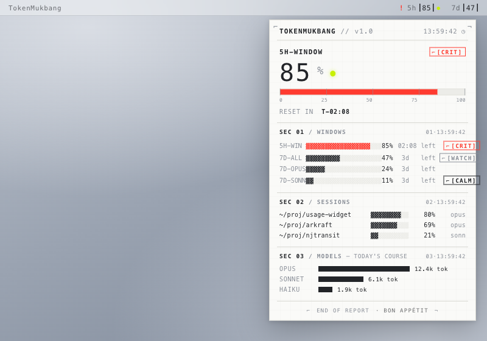

# TokenMukbang 디자인 컨셉 카탈로그 (12종)

> **TL;DR:** 다음 비주얼 방향을 정하기 위해 6개 리서치 에이전트가 2025–26 트렌드로 도출한 **12개의 서로 다른 컨셉**을, 컨셉당 담당 디자이너가 보고서로 정리했다. 아래 표로 비교 → 후보 2~3개로 좁힌 뒤, 각 보고서를 읽고 결정한다. 모든 컨셉은 SwiftUI 네이티브 실현 가능하며 ADR-0009(먹방 시점·"정확함>귀여움")를 지킨다.

각 컨셉의 결정적 차이는 **시그니처 무브**(그 컨셉만의 한 방)에 있다. "먹방 적합"은 먹방 정체성을 얼마나 자연스럽게 안고 가는지, "구현"은 SwiftUI 난이도다.

> 각 목업은 HTML/CSS로 컨셉을 재현해 스크린샷한 것(`mockups/*.html` → `img/*.png`). 실제 SwiftUI 픽셀이 아니라 **방향 비교용 시안**이다. 샘플 데이터는 공통: 5h 85%(critical) · 7d 47%(watch) · Sonnet 11%(calm) + 세션 3 + 모델 히스토리.

## 갤러리

| | | |
|:---:|:---:|:---:|
|  **01 Grotesk Gauge** |  **02 Spec Sheet** |  **03 유리국밥** |
|  **04 Lens** |  **05 Phosphor** |  **06 OP-1 Console** |
|  **07 한입** |  **08 냠이** |  **09 Quantometer** |
|  **10 Cockpit** |  **11 Still Water** |  **12 Riso Mukbang** |

## 비교 표

| # | 컨셉 | 한 줄 | 시그니처 무브 | 먹방 적합 | 구현 | 보고서 |
|---|------|-------|---------------|:---:|:---:|---|
| 01 | **Grotesk Gauge** | 주머니 속 스위스 연차보고서 | 리더 닷 `name ···· 50%` + 빨강은 예외에만 | 중 | 하(쉬움) | [📄](01-grotesk-gauge.md) |
| 02 | **Spec Sheet** | 항공 텔레메트리 블루프린트 | 이름 붙은 상태칩 `[WARN]` + 코너 크롭(색 아닌 글자로 상태) | 하 | 중 | [📄](02-spec-sheet.md) |
| 03 | **유리국밥 Glass Gukbap** | 김 서린 유리 아래 국물이 빛난다 | 국물 메니스커스(글자 밑 글로우가 위험에 데워짐) | 상 | 상(어려움) | [📄](03-glass-gukbap.md) |
| 04 | **Lens 렌즈** | 차가운 계기 유리, 위험만 확대 | 선택적 확대(걱정할 그 숫자만 렌즈가 볼록) | 중 | 상 | [📄](04-lens.md) |
| 05 | **Phosphor 인광** | 앰버 CRT `htop` | 화면 전체가 위험색으로 발광(앰버→레드 플리커) | 상 | 중 | [📄](05-phosphor.md) |
| 06 | **OP-1 Token Console** | Teenage Engineering 페이스플레이트 | 라벨 모듈 + 세그먼트 LED + 부품번호 | 중 | 중 | [📄](06-op1-console.md) |
| 07 | **한입 Hanip** | 마스코트 없이 음식이 캐릭터(클레이 밥상) | 빈 그릇 광택(소진될수록 그릇이 번쩍) | 상 | 상 | [📄](07-hanip.md) |
| 08 | **냠이 Nyam-i** | 클레이 블롭 마스코트가 식욕으로 반응 | 자세로 위험 표현(날씬↔빵빵↔식곤증) | 최상 | 상 | [📄](08-nyami.md) |
| 09 | **Quantometer** | 그레이스케일 SaaS 텔레메트리 | 싱글 액센트 룰(가장 위험한 하나만 풀컬러) | 하 | 중 | [📄](09-quantometer.md) |
| 10 | **Cockpit 계기판** | 라이브 항공 계기 클러스터 | 버닝레이트 VSI 바늘(얼마나 빨리 먹나) | 상 | 상 | [📄](10-cockpit.md) |
| 11 | **Still Water** | 사라질 만큼 고요하다 위험할 때만 다가옴 | 방이 탈색되고 한 잉크만 데워짐 | 중 | 하(쉬움) | [📄](11-still-water.md) |
| 12 | **Riso Mukbang** | 리소그래프 zine, 하프톤 belly | 위험 = 인쇄 잉크가 늘어남(예비 레드 등장) | 최상 | 최상 | [📄](12-riso-mukbang.md) |

## 미학 가족별 묶음

| 가족 | 컨셉 | 성격 |
|---|---|---|
| 🅐 스위스/에디토리얼 | 01 Grotesk Gauge · 02 Spec Sheet | 타이포가 곧 차트. 페이퍼 ledger vs 블루프린트 |
| 🅑 글래스/스페이셜 | 03 유리국밥 · 04 Lens | Tahoe Liquid Glass. 국물 발광 vs 선택적 굴절 |
| 🅒 레트로테크 | 05 Phosphor · 06 OP-1 Console | 모노·하드웨어. CRT 발광 vs 페이스플레이트 |
| 🅓 플레이풀/먹방 | 07 한입 · 08 냠이 | 클레이. 음식=캐릭터 vs 마스코트 블롭 |
| 🅔 인스트루먼트 | 09 Quantometer · 10 Cockpit | 데이터뷰. 절제 SaaS vs 아날로그 계기 |
| 🅕 캄/와일드카드 | 11 Still Water · 12 Riso Mukbang | 고요한 미니멀 vs 인쇄 zine |

## 고르는 가이드

- **가장 먹방답고 공유하고 싶어질** → 12 Riso Mukbang · 08 냠이 · 03 유리국밥
- **가장 프로툴답고 안전(먹방은 카피에만)** → 09 Quantometer · 11 Still Water · 01 Grotesk Gauge
- **가장 독창적 정보전달(한 방)** → 04 Lens(선택적 확대) · 10 Cockpit(연소율 VSI)
- **구현 쉽게 빨리** → 01 Grotesk Gauge · 11 Still Water · 09 Quantometer
- **"정확함 > 귀여움" 위반 위험 주의** → 07 한입 · 08 냠이 · 12 Riso(텍스처/마스코트가 숫자를 침범하지 않게 가드레일 필수)

## 다음 단계

후보를 2~3개로 좁히면, 그 컨셉들을 **실제 헤드리스 렌더(SwiftUI ImageRenderer)로 목업**해 메뉴바·팝오버를 라이트/다크로 비교한다. 채택 시 `docs/design/DESIGN_SYSTEM.md`를 그 방향으로 개정하고(현 "Liquid Vitals" supersede 여부 판단), 필요하면 새 ADR로 결정을 남긴다.
