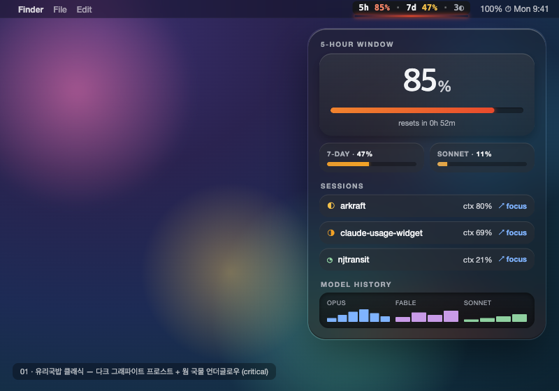
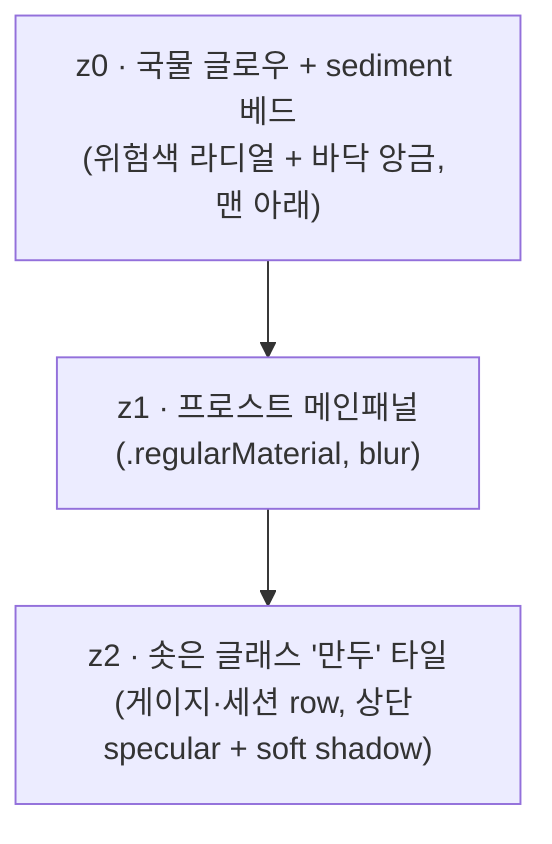

# 01. 유리국밥 · 클래식 (Gukbap Classic)

> **한 줄 컨셉:** 원조 유리국밥의 정본 — 다크 그래파이트 프로스트 글래스 한 그릇에, 위험은 *유리 아래에서 데워지는 국물의 발광*으로만 차오른다. 베이스를 버리지 않고 **더 폴리시드하게 다듬은 안전한 기본형**: 글래스 림 렌징, 솟은 글래스 타일 세션, 가라앉은 sediment 모델 히스토리, 절제된 스팀.



## 무드보드 / 톤

- **김 서린 뚝배기 뚜껑**: 차가운 유리 너머로 안쪽의 뜨거운 국물이 흐릿하게 번진다. 유리는 정적·뉴트럴, *그 아래*가 살아있다 — 베이스 DNA를 그대로 계승.
- **Apple Liquid Glass / visionOS material**: 반투명 + vibrancy + specular highlight로 깊이. 단 2025~26 가독성 walk-back을 의식해 — 유리는 장식, **숫자는 항상 불투명 스크림 위**.
- **온도(temperature)로서의 위험**: calm은 미지근한 잔열, critical은 낮게 끓는 엠버레드. 색이 시끄러운 게 아니라 *데워진다.*
- **클래식의 정제 포인트**: 베이스의 거친 가장자리를 정돈한다 — 외곽 **렌즈 림**을 또렷한 2px 굴절 엣지로, 타일을 진짜 "솟은 만두"처럼 specular+shadow로, 모델 히스토리를 그릇 바닥에 가라앉은 **sediment(앙금)** 띠로, 스팀은 윗변 1~2 가닥으로 절제.
- 키워드: frosted, submerged glow, meniscus, specular rim, graphite glass, low simmer, polished, sediment.

## 컬러 토큰

유리/프로스트는 **쿨 뉴트럴**(채도 ≈0)로 고정 — 위험색이 화면에서 유일하게 채도를 갖는 요소가 되도록. 라이트=화이트스모크 프로스트(~91%L), 다크=그래파이트 글래스(~13%L). **다크 권장**(국물 발광이 가장 선명).

| role | light | dark |
|---|---|---|
| frost.panel (z1 메인패널 베이스) | `#E8EAED` (~91%L) | `#1E2024` (~13%L) |
| frost.tile (z2 솟은 글래스 타일) | `#F4F5F7` (~96%L, 스페큘러 상단) | `#2A2D33` (~18%L) |
| scrim.number (숫자 밑 스크림 플레이트) | `#DADCE0` (~87%L) | `#15171A` (~9%L) |
| ink.primary (히어로 %·숫자) | `#1A1C1F` | `#F2F3F5` |
| ink.secondary (라벨·캡션) | `#5B606A` | `#A7ACB5` |
| edge.lens (외곽 림 굴절 엣지 2px) | `#FFFFFF` @ 70% | `#FFFFFF` @ 22% |
| hairline (타일 구분선) | `#00000014` | `#FFFFFF1A` |
| sediment (z0 바닥 앙금 — 모델 히스토리 베드) | `#C9CCD2` @ 35% | `#0E0F12` @ 55% |
| glow.broth (z0 국물 플레이트 — 위험색 주입) | *위험 4단계, 아래 표* | *동일, 채도·alpha↑* |

`glow.broth`는 단일 색이 아니라 **위험 레벨이 주입하는 라디얼 글로우의 hue**다. z0 플레이트에만 칠하고 z1/z2는 프로스트 그대로 — 글로우가 *유리를 통과해 비쳐* 보인다.

**위험 4단계 매핑** (`RiskLevel` calm/watch/warning/critical — z0 국물 플레이트 라디얼 글로우 중심색. 라벨/텍스트 색이 아니라 *발광색*이다.)

| level | light glow | dark glow | 번짐 범위 |
|---|---|---|---|
| **calm** | `#E8A33D` @ 14% (희미한 웜앰버) | `#F0A93C` @ 22% | 게이지 밑 작은 라디얼만 |
| **watch** | `#E89B2E` @ 22% (허니) | `#F2A226` @ 32% | 게이지 + 타일 하단 |
| **warning** | `#E5742A` @ 34% (파프리카 오렌지) | `#F07A22` @ 46% | 팝오버 **바닥 전체**를 데움 |
| **critical** | `#D8472E` @ 44% (엠버레드, 낮게 맥동) | `#E84A2C` @ 58% | 패널 **가장자리까지** 번짐 + edge.lens 워밍 |

> **불변식:** luminance-pinned 라벨색은 그대로. 글로우는 **콘텐츠 뒤(z0)에만** 깔리고 텍스트 자체는 절대 칠하지 않는다. 위험은 "글자가 빨개짐"이 아니라 "그릇이 데워짐"으로 읽힌다.

## 타이포그래피

- **숫자/히어로 %**: `SF Pro Rounded` — 둥근 글래스 타일·국밥의 따뜻함과 합. 히어로 % `.largeTitle` semibold, tabular figures(자리 흔들림 방지).
- **라벨/상태/캡션**: `SF Pro Text` — 라운드는 숫자에만 한정해 위계를 만든다. 라벨 `.caption` medium, `ink.secondary`, 트래킹 +0.4(섹션 라벨은 대문자 +tracking으로 "메뉴판" 느낌).
- **메뉴바**: `SF Pro` `.system(size:13, weight:.medium)` **monospaced-digit** 강제 — 폭이 흔들리면 거슬린다.
- 모든 숫자는 **scrim.number 플레이트 위** — 프로스트/글로우가 아무리 번져도 숫자 대비는 스크림이 보장.

## 레이아웃 & 셰이프 언어

**3겹 글래스 평면 (z-stack):**



- **z0 국물 플레이트**: 패널 bounds를 채우는 `RadialGradient`. 중심은 게이지 아래쪽, 위험 레벨이 색·alpha·반경을 결정. blur로 부드럽게.
- **z0 sediment 베드(클래식 신규)**: 그릇 바닥(모델 히스토리 영역)에 가라앉은 어두운 앙금 띠 — 히스토리 sparkline이 그 위에 "가라앉아" 보인다.
- **z1 프로스트 메인패널**: `.regularMaterial`(다크=regular). 국물이 *통과해 비치되* 형태는 흐려지는 정도.
- **z2 글래스 "만두" 타일**: 게이지·세션 row 각 항목이 살짝 솟은 타일. 상단 가는 specular highlight(`edge.lens` 1px), 아래 soft drop shadow. 떠 있는 만두.
- **코너**: 연속 곡률(`.continuous`) — 패널 26, 타일 18. 뚝배기의 둥근 입.
- **엣지 렌징(클래식 강화)**: 팝오버 **외곽 림에만** 2px 굴절 밝은 엣지(`edge.lens`) — 베이스보다 또렷하게, 진짜 유리 모서리 굴절처럼 상단 밝고 하단 어둡게 비대칭.
- **간격**: 16pt 패널 패딩, 타일 간 8pt, 타일 내부 12pt.

## 화면 목업

### 메뉴바

작고, 반투명 벽지 위에서도 읽혀야 한다. 텍스트는 **불투명 스크림 캡슐** 위, 그 밑 3px만 반투명 메니스커스 글로우.

```
┌──────────────────────────┐
│  5h 85%  ·  7d 47%  3◐    │  ← 텍스트: 불투명 scrim 캡슐 위 (항상 가독)
│ ▁▁▁▁▁▁▁▁▁▁▁▁▁▁▁▁▁▁▁▁▁▁▁▁ │  ← 국물 메니스커스: 3px 글로우 라인 (반투명, 위험색)
└──────────────────────────┘
```

- `5h 85% · 7d 47%` 두 윈도우를 함께 노출(클래식은 max 한 개로 줄이지 않고 둘 다), `3◐` = 활성 세션 수.
- 밑 3px **국물 메니스커스** = 가장 임박한 위험 레벨 색. 85% critical → 엠버레드.

### 팝오버 (320pt)

```
╔══════════════════════════════════════════╗  ← edge.lens 굴절 림 (2px, 상단 밝음)
║                                          ║
║   5-HOUR WINDOW                          ║
║   ┌────────────────────────────────────┐ ║  ← z2 타일 (specular 상단)
║   │           ████████  85%            │ ║  ← 히어로 %: SF Rounded, scrim 위
║   │   ▇▇▇▇▇▇▇▇▇▇▇▇▇░░  resets 0h 52m   │ ║     게이지 밑 critical 글로우 차오름
║   └────────────────────────────────────┘ ║
║                                          ║
║   7-DAY · 47%          SONNET 7D · 11%   ║
║   ▓▓▓▓▓▓▓░░░░░░░░░     ▓▓░░░░░░░░░░░░░    ║  ← watch(허니)      calm(잔열)
║                                          ║
║   ── SESSIONS ──────────────────────────  ║
║   ┌────────────────────────────────────┐ ║  ← z2 타일
║   │ ◐ arkraft           ctx 80%  ↗ focus│ ║
║   └────────────────────────────────────┘ ║
║   ┌────────────────────────────────────┐ ║
║   │ ◑ claude-usage-widget ctx 69% ↗focus│ ║
║   └────────────────────────────────────┘ ║
║   ┌────────────────────────────────────┐ ║
║   │ ◔ njtransit         ctx 21%  ↗ focus│ ║
║   └────────────────────────────────────┘ ║
║                                          ║
║   ── MODEL HISTORY ─────────────────────  ║  ← sediment 베드 위 (가라앉음)
║   opus  ▁▃▅▇▆▄  fable ▂▄▃▅  sonnet ▁▁▂▃  ║
║                                          ║
║░░░░░░░░░░░░░░░░░░░░░░░░░░░░░░░░░░░░░░░░░░░░║  ← z0 국물 글로우: critical →
╚══════════════════════════════════════════╝     바닥부터 엠버레드로 차오름
```

- 히어로 %·게이지가 솟은 타일에. 세션 row 3개도 타일 스택. 모델 히스토리는 sediment 베드 위.
- 가장 임박한 위험(5h 85% critical)이 z0 글로우를 **바닥에서 위로** 차올리듯 패널을 물들인다(텍스트는 스크림이 막아 안 칠해짐).

### 위젯

**위에서 내려다본 그릇** — 프로스트 디스크, 중심에서 국물 발광, % 림 주변 스팀라이트 아크(절제: 위 2가닥만).

```
small (위에서 본 그릇)        medium (그릇 + 사이드)
┌──────────────┐            ┌────────────────────────────┐
│   ⌣  ⌣       │            │   ⌣ ⌣        5H   85% ▓▓▓▓ │
│  ╭──────╮    │            │  ╭──────╮    7D   47% ▓▓▓░ │
│ │  85%   │   │            │ │  85%   │  SON  11% ▓░░░ │
│  ╰──────╯    │            │  ╰──────╯   sessions: 3    │
│  resets 0h52 │            │              resets 0h52m  │
└──────────────┘            └────────────────────────────┘
  ⌣ = 스팀라이트 아크 (림 위쪽 2가닥, 위험색)
  중심 85% = 국물 글로우 위 히어로 %
```

- 위젯은 **정적** — App이 쓴 스냅샷을 읽기만(ADR-0003). 맥동·애니메이션 없이 *현재* 위험색 한 프레임만. 스팀 아크는 정지 이미지.

## 시그니처 무브

**국물 메니스커스 (Broth Meniscus)** — 메뉴바 텍스트 바로 밑 **3px 글로우 라인**. 위험이 오를수록 웜앰버 → 허니 → 파프리카 → 엠버레드로 *데워진다.* 텍스트는 불투명 스크림 캡슐 위, **메니스커스만 반투명** — 벽지 위에 국물이 살짝 찰랑이는 느낌. 메뉴바에서 픽셀 3개로 "지금 그릇이 얼마나 끓는지"를 전한다.

팝오버에선 같은 언어가 z0 국물 플레이트로 확장 — "바닥부터 차오르는 글로우". 메뉴바 메니스커스와 팝오버 글로우는 같은 은유의 small/large 버전. **클래식 추가**: 그 글로우가 그릇 바닥의 **sediment 앙금**에 닿아 모델 히스토리를 "국물에 가라앉은 기록"으로 만든다.

## 먹방 정체성 반영 + "정확함 > 귀여움" 준수 방식

- **먹방(ADR-0009) 반영**: "데이터 한 그릇", 국물=상태, 만두 타일, 그릇 위젯, sediment 앙금, 스팀라이트 — 음식 은유가 *구조·빛에 녹아* 있되 일러스트·캐릭터·이모지 떡칠이 아니다. 귀여운 그림 0개.
- **"정확함 > 귀여움" 준수**:
  - 숫자는 **언제나 불투명 스크림 위**, tabular/monospaced digit — 글로우가 번져도 값의 가독·정렬 불변.
  - 위험은 *글로우(콘텐츠 뒤)* 로만, 텍스트 색은 luminance-pinned 유지 → 위험 신호가 데이터를 가리지 않는다.
  - 애니메이션은 critical "낮은 맥동" 하나로 절제, 위젯은 완전 정적. 분위기를 위해 정보를 흐리지 않는다.
  - 게이지·%·리셋시각·ctx% 등 **수치가 1순위 위계**, 유리/글로우/sediment는 배경.

## 장점 / 리스크

**장점**
- 위험을 hue가 아닌 **명도·온도·번짐**으로 인코딩 → 색각 이상·반투명 벽지에서도 "데워짐"이 읽힌다.
- Apple Liquid Glass와 자연 정렬 → native macOS 이질감 0.
- 메니스커스 시그니처가 메뉴바 극소 공간에서도 강한 정체성.
- "가장 안전한 기본형" — 베이스에 충실해 리스크가 가장 낮고 정본으로 삼기 좋다.
- 텍스트/글로우 레이어 분리로 "예쁨"과 "정확함"이 충돌 없이 공존.

**리스크 (정직하게)**
- **글로우 비용**: z0 라디얼 + z1 material blur 다겹 합성은 GPU 부담. 60s 갱신·다중 위젯에서 점검 필요(blur 반경 캡, 정적 캐싱).
- **위젯 정적 처리**: WidgetKit 실시간 맥동 불가 → "끓는 국물" 동적 매력이 위젯에선 약해진다(한 프레임 타협).
- **차별성 약함**: 가장 보수적인 변주라 "왜 클래식이어야 하나"의 설득력은 변주들 대비 약하다 — 정본의 숙명. sediment·렌즈 림 polish로 보완.
- **벽지 위 메니스커스 오독**: 반투명 메니스커스가 화려한 벽지와 겹쳐 위험색 왜곡 가능 → 뒤에 옅은 뉴트럴 스크림 1px로 hue 보존.

## 구현 난이도 (SwiftUI 상/중/하)

- **하**: z1 프로스트 패널(`.regularMaterial`), 연속 코너, 스크림 캡슐, tabular digit, sediment 베드(단순 어두운 그라데이션 띠) — 표준 SwiftUI.
- **중**: z0 위험 라디얼 글로우(`RadialGradient` + `.blur`), z2 specular 타일(linear highlight + shadow), 메뉴바 메니스커스(3px 글로우 바). 레이어 합성·alpha 튜닝이 핵심.
- **상**: 외곽 edge.lens 굴절 림(2px 비대칭 그라데이션 stroke), critical 저속 맥동(`TimelineView`), 글로우 합성 성능 최적화(blur 캐싱). 위젯은 정적 근사로 난이도↓.

> 종합 **중** — Liquid Glass 자체는 material로 거의 무료, 난이도는 "글로우 레이어 합성 + 성능"에 몰린다. 클래식은 신규 위험 패턴이 없어(sediment는 정적 띠) 변주 중 가장 낮은 난이도.

## 트렌드 레퍼런스

1. **Apple — "Apple introduces a delightful and elegant new software design" (Newsroom, 2025)** — https://www.apple.com/newsroom/2025/06/apple-introduces-a-delightful-and-elegant-new-software-design/ — Liquid Glass 공식 발표(iOS 26 / macOS Tahoe / visionOS 26). "반투명 유리 + 깊이" 토대.
2. **Apple HIG — "Materials"** — https://developer.apple.com/design/human-interface-guidelines/materials — blur·vibrancy·specular highlight로 *유리 아래 구조*를 드러내는 material 스펙. z-stack/specular 타일 직접 근거.
3. **9to5Mac — "iOS 26.1 beta 4 adds new setting to tone down Liquid Glass transparency" (2025-10)** — https://9to5mac.com/2025/10/20/ios-26-1-beta-4-adds-new-setting-to-tone-down-liquid-glass-transparency/ — 가독성 불만 후 "Tinted"(불투명↑) 옵션 = 2026 walk-back. **"숫자는 불투명 스크림 위" 룰의 근거.**

## 베이스 대비 차별점 (원본 03 유리국밥과 무엇이 다른가)

클래식은 베이스를 *대체*하지 않고 **정제(polish)** 한다 — 변주 핵심은 "거친 정본을 깔끔한 정본으로".

| 축 | 원본 03 유리국밥 | 01 클래식 (정제판) |
|---|---|---|
| 메뉴바 정보 | `42% · 3◐` (max 윈도우 1개) | `5h 85% · 7d 47% · 3◐` (두 윈도우 동시) |
| 외곽 렌즈 림 | 2px 균일 굴절 엣지 | 2px **비대칭** 굴절(상단 밝고 하단 어둡게 — 진짜 유리 모서리) |
| z2 타일 | 솟은 만두 타일 | 동일하되 specular+shadow를 **또렷하게** polish |
| 모델 히스토리 | 평범한 sparkline 줄 | **sediment 앙금 베드** 위에 "가라앉은" sparkline (신규 z0 요소) |
| 스팀라이트 | 위젯 림에 다수 아크 | **위 2가닥만** 절제 |
| 코너 반경 | 패널 28 / 타일 22 | 패널 26 / 타일 18 (살짝 더 타이트·정돈된 인상) |
| 포지셔닝 | 12종 중 하나 | **정본/기본형** — 가장 안전, 리스크 최저, 다른 변주의 기준점 |

핵심: 베이스 DNA(국물 발광·프로스트·스크림 가독)는 100% 보존하고, **외곽 림·타일·히스토리 베드를 한 단계 더 다듬어** "원조의 완성형"을 만든다. 새 위험 메타포를 추가하지 않는 것이 의도 — 클래식은 "기준선"이어야 한다.
