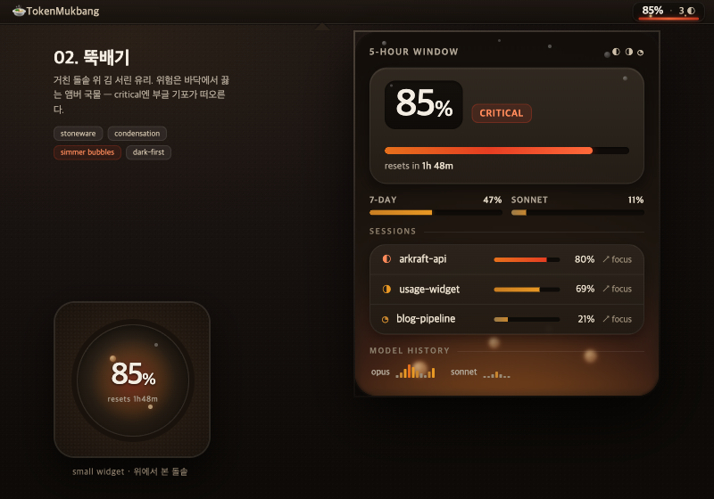
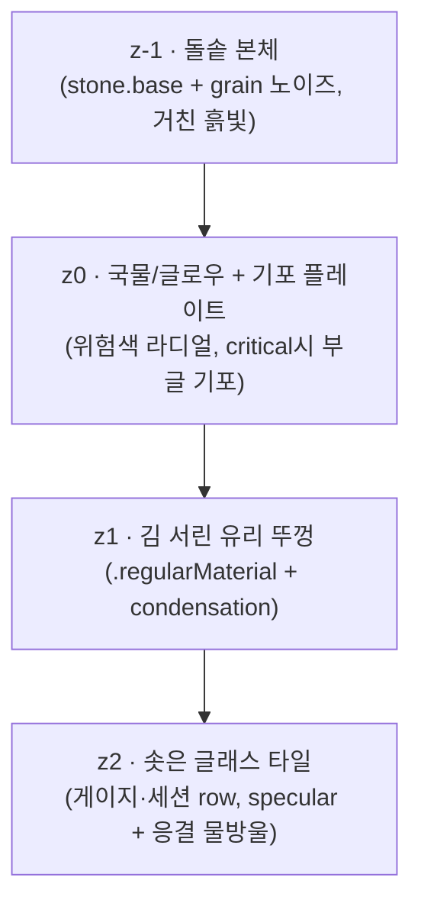

# 02. 뚝배기 (Ttukbaegi)

> **한 줄 컨셉:** 유리 아래가 매끈한 그릇이 아니라 **거친 돌솥**이다 — 흙빛 돌 표면 위에 김 서린 유리 뚜껑, 그 위엔 응결 물방울이 맺힌다. 위험은 돌솥 바닥에서 데워지는 **앰버 국물의 발광**으로 읽히고, critical에서는 그 국물 안에서 **부글부글 끓는 기포**가 떠오른다. 차갑고 뉴트럴한 유리국밥을 *어둡고 러스틱하게* 끓여낸 변주.



## 무드보드 / 톤

- **돌솥/뚝배기 그 자체**: 베이스(유리국밥)는 유리 *아래*가 매끈한 뉴트럴 평면이었다. 뚝배기는 그 아래를 **거친 돌·구운 흙**으로 바꾼다. 클레이 브라운, 무광 석재, 미세한 grain 노이즈. 차가운 그래파이트 대신 데워진 흙.
- **김 서린 두꺼운 유리 뚜껑**: 베이스의 프로스트보다 한 단계 더 **텍스처드** — 김 서림/응결(condensation frosting)이 표면에 불균질하게 번진다. 유리 위에 **응결 물방울**(작은 radial 점들)이 맺혀 흘러내릴 듯하다.
- **데워지는 국물(broth)**: calm은 흙빛에 잠긴 잔열, critical은 돌솥 바닥이 낮게 끓는 앰버레드 + **솟아오르는 기포**. 위험은 색의 시끄러움이 아니라 *그릇이 달궈지고 끓는* 온도로 읽힌다.
- **러스틱 · 코지 · earthy · 다크 우선**: 명도 전체를 낮추고 흙빛 채도를 살짝 얹는다. "정갈한 식당"이 아니라 "투박한 돌솥 한 그릇".
- 키워드: stoneware, clay, condensation, simmer, rising bubbles, ember broth, matte grain, dark-first.

## 컬러 토큰

베이스는 유리/프로스트를 **쿨 뉴트럴**(채도 0)로 고정했지만, 뚝배기는 돌·유리 모두 **웜 뉴트럴(흙빛)** 으로 옮긴다 — 채도를 아주 낮게(클레이 4~10%) 깔아 "구운 흙"의 온도를 준다. 그래도 위험색이 **가장 채도 높은 요소**라는 위계는 유지(위험만 진짜 saturated amber/red). 다크 우선이므로 dark를 기준 컬럼으로 설계하고 light는 "밝은 점토" 폴백.

| role | light (밝은 점토) | dark (구운 돌, 기준) |
|---|---|---|
| stone.base (z0 돌솥 본체 — 거친 흙빛 바닥) | `#D9CFC4` (~85%L, 웜 클레이) | `#1A1613` (~9%L, 다크 클레이브라운) |
| stone.grain (석재 grain 노이즈 오버레이) | `#00000010` | `#FFFFFF0A` |
| frost.panel (z1 김 서린 유리 뚜껑) | `#E7E0D7` (~89%L) | `#262019` (~14%L, 웜 그래파이트) |
| frost.tile (z2 솟은 글래스 타일) | `#F2EEE7` (~94%L) | `#322A21` (~19%L) |
| condense.drop (유리 위 응결 물방울 하이라이트) | `#FFFFFF` @ 55% | `#FFFFFF` @ 18% |
| scrim.number (숫자 밑 불투명 스크림, 1px↓) | `#CFC6BA` (~82%L) | `#14100C` (~6%L) |
| ink.primary (히어로 %·숫자) | `#211C16` | `#F3EDE3` |
| ink.secondary (라벨·캡션) | `#6B6154` | `#B0A595` |
| edge.lens (외곽 림 굴절 엣지 2px) | `#FFFFFF` @ 60% | `#FFE9C9` @ 20% (웜 림) |
| hairline (타일 구분선) | `#00000016` | `#FFFFFF14` |
| glow.broth (z0 국물 — 위험색 주입 라디얼) | *위험 4단계, 아래 표* | *동일, 채도·alpha↑* |
| bubble.rim (critical 기포 외곽선) | — | `#FFD9A0` @ 70% (앰버 하이라이트) |

`glow.broth`는 돌솥 **바닥(z0)** 에서 데워지는 라디얼 글로우의 hue다. 돌과 유리는 흙빛 그대로, 글로우가 *유리를 통과해 비쳐* 올라온다. 베이스보다 **번짐 중심을 더 아래(돌솥 바닥)** 에 두어 "바닥부터 끓는" 느낌을 강화.

**위험 4단계 매핑:** (`RiskLevel` calm/watch/warning/critical — z0 국물 라디얼 글로우 중심색. 라벨/텍스트 색이 아니라 *발광색*. 베이스보다 흙빛 배경에 묻히지 않게 채도·alpha를 살짝 더 올린다.)

| level | light glow | dark glow | 번짐 / 거동 |
|---|---|---|---|
| **calm** | `#C8862F` @ 16% (흙앰버) | `#E0922F` @ 24% | 돌솥 바닥 작은 라디얼만, 거의 잔열 |
| **watch** | `#C97E22` @ 24% (허니브라운) | `#E89824` @ 34% | 바닥 + 게이지 하단까지 데움 |
| **warning** | `#C5621F` @ 36% (테라코타) | `#E6701C` @ 48% | 팝오버 **바닥 절반**을 데움, 글로우 위로 차오름 |
| **critical** | `#C0381F` @ 46% (엠버레드, 낮게 맥동) | `#E63E22` @ 60% | 바닥 전체 + **부글 기포 상승**(시그니처) + edge.lens 워밍 |

> **불변식 유지(베이스 계승):** luminance-pinned 라벨색은 그대로 — 텍스트는 절대 위험색으로 칠하지 않는다. 글로우·기포는 **콘텐츠 뒤(z0)에만**. 위험은 "글자가 빨개짐"이 아니라 "돌솥이 끓어오름"으로 읽힌다.

## 타이포그래피

- **숫자/히어로 %**: `SF Pro Rounded` — 둥근 돌솥 입·국밥의 따뜻함과 합이 맞고 작은 크기에서도 읽힌다. 히어로 % `.largeTitle` semibold, tabular figures.
- **라벨/상태/캡션**: `SF Pro Text` — 라운드는 숫자에만 한정해 위계를 만든다. 라벨 `.caption` medium, `ink.secondary`.
- **메뉴바**: `SF Pro` `.system(size:13, weight:.medium)` monospaced-digit — 폭 흔들림 방지.
- 모든 숫자는 **scrim.number(흙빛 어두운 불투명 스크림) 위**에 올린다 — 글로우/응결이 아무리 번져도 숫자 대비 불변(가독성 룰, 베이스 계승). 다크 우선이라 스크림은 거의 검은 흙빛(`#14100C`).

## 레이아웃 & 셰이프 언어

**4겹 스택 (z-stack)** — 베이스의 3겹에 **돌솥 본체(z-1)** 를 추가:



- **z-1 돌솥 본체**: 패널 전체를 채우는 거친 흙빛 베이스 + 미세 grain 노이즈(`stone.grain` 오버레이). 무광. 베이스(유리국밥)엔 없던 신규 레이어 — 유리 *아래*를 매끈함→거침으로 바꾸는 핵심.
- **z0 국물 + 기포 플레이트**: 돌솥 바닥에서 데워지는 `RadialGradient`. critical일 때 그 안에서 작은 원(기포)들이 아래→위로 떠오르며 사라짐.
- **z1 김 서린 유리 뚜껑**: `.regularMaterial`(다크=regular) + **응결 텍스처** — 베이스 프로스트보다 불균질하게 번진 김 서림. 위에 `condense.drop` 물방울 점.
- **z2 글래스 "건더기" 타일**: 게이지·세션 row·히스토리 각 항목이 살짝 솟은 타일. 상단 specular 1px(`edge.lens`), 아래 soft shadow, **표면에 작은 응결 물방울 2~3개**.
- **코너**: 연속 곡률(`.continuous`) — 패널 26, 타일 20. 베이스(28/22)보다 살짝 **덜 둥글게** → 투박한 돌솥 입.
- **엣지 렌징**: 외곽 림에만 2px 굴절, **웜 톤(`#FFE9C9`)** — 베이스의 화이트 림을 데운 버전.
- **간격**: 16pt 패널 패딩, 타일 간 8pt, 타일 내부 12pt.

## 화면 목업

### 메뉴바

작고, 어떤 벽지 위에서도 읽혀야 한다. 텍스트는 **불투명 흙빛 스크림 캡슐** 위, 그 밑 3px만 반투명 국물 메니스커스. critical이면 메니스커스 위로 **작은 기포 점 1~2개**가 깜빡인다.

```
┌─────────────────────┐
│  ▓ 85%  ·  3 ◐       │   ← 텍스트: 불투명 흙빛 scrim 캡슐 위 (항상 가독)
│ ░ °  ░░░░  ° ░░░░░░░ │   ← 메니스커스 3px(위험색) + ° = critical 기포 점
└─────────────────────┘
```

- `85%` = 가장 임박한 윈도우(5h/7d 중 max — 샘플은 5h 85% critical), `3 ◐` = 활성 세션 수.
- 밑 3px **국물 메니스커스** = 위험색. calm=흙앰버 잔열, warning=테라코타, critical=엠버레드 + 떠오르는 기포 점.

### 팝오버 (320pt)

```
╔══════════════════════════════════════════╗   ← edge.lens 웜 굴절 림 (2px)
║ ·°       ·            °        ·     ·°   ║   ← 유리 뚜껑 위 응결 물방울(°·)
║   5-HOUR WINDOW                  ◐ ◑ ◐   ║
║   ┌────────────────────────────────────┐ ║   ← z2 타일 (specular + 응결)
║   │  ·                          °       │ ║
║   │            ███████  85%            │ ║   ← 히어로 %: SF Rounded, 흙빛 scrim 위
║   │   ▇▇▇▇▆▅▄▃ resets in 1h 48m        │ ║
║   └────────────────────────────────────┘ ║
║                                          ║
║   7-DAY · 47%        SONNET · 11%        ║
║   ▓▓▓▓▓▓░░░░░░░     ▓▓░░░░░░░░░░░░░     ║   ← 47% watch / 11% calm
║                                          ║
║   ── SESSIONS ──────────────────────────  ║
║   ┌────────────────────────────────────┐ ║   ← z2 타일 스택
║   │ ◐ arkraft-api      ctx 80%  ↗ focus│ ║
║   │ ◑ usage-widget     ctx 69%  ↗ focus│ ║
║   │ ◔ blog-pipeline    ctx 21%  ↗ focus│ ║
║   └────────────────────────────────────┘ ║
║                                          ║
║   ── MODEL HISTORY ─────────────────────  ║
║   opus    ▁▃▅▇▆▄▂▁▃▅   sonnet  ▁▁▂▃▂▁▁   ║
║  ° (  ○  )  ( ○ )  bubbles rising  ( ○ ) ║   ← critical: z0 국물에서 기포 상승
║▓▓▓▓▓▓▓▓▓▓▓▓▓▓▓▓▓▓▓▓▓▓▓▓▓▓▓▓▓▓▓▓▓▓▓▓▓▓▓▓▓▓║   ← z0 국물: 5h=critical →
╚══════════════════════════════════════════╝     바닥 전체가 엠버레드로 끓음
```

- 히어로 %·게이지가 솟은 타일에. 세션 3개·히스토리도 타일.
- 5h가 critical(85%)이므로 z0 국물이 **바닥에서 위로** 차오르며 패널을 엠버레드로 물들이고, 그 안에서 **기포가 떠오른다**(텍스트는 흙빛 스크림이 막아 안 칠해짐).

### 위젯

**위에서 내려다본 돌솥** — 거친 돌 림, 그 안 김 서린 유리 디스크, 중심에서 국물 발광, critical이면 국물 위 작은 기포. 응결 물방울이 유리 위에.

```
small (위에서 본 돌솥)        medium (돌솥 + 사이드)
┌──────────────┐            ┌────────────────────────────┐
│ ▒▒▒▒▒▒▒▒▒▒▒▒ │            │ ▒▒ 돌 림 ▒▒    5H   85% ▓▓▓▓ │
│ ▒ ╭──────╮ ▒ │            │ ▒ ╭──────╮ ▒  7D   47% ▓▓░░ │
│ ▒│ ° ○  · │▒ │            │ ▒│ ° ○ ·  │▒ SON  11% ▓░░░ │
│ ▒│ ◜85%◝  │▒ │            │ ▒│ ◜85%◝  │▒ sessions: 3   │
│ ▒│  ○  °  │▒ │            │ ▒╰──────╯ ▒  resets 1h48m  │
│ ▒ ╰──────╯ ▒ │            │ ▒▒ stone ▒▒                │
│  resets 1h48 │            └────────────────────────────┘
└──────────────┘
  ▒ = 거친 돌 림 (grain)   ○ = 국물 기포(critical, 정지)   ° = 응결 물방울
  중심 ◜85%◝ = 국물 글로우 위 히어로 %
```

- 위젯은 **정적** — App이 쓴 스냅샷을 읽기만(ADR-0003). 맥동·기포 상승 없이 *현재* 위험색 + 기포 한 프레임만(정지 이미지로 타협).

## 시그니처 무브

**부글 기포 (Rising Simmer Bubbles)** — critical일 때 z0 국물 글로우 안에서 **작은 원(기포)들이 바닥→위로 떠오르며 페이드아웃**한다(라이브 펄스). 돌솥이 "끓는" 그 순간을 빛의 점으로 직역. `TimelineView`로 2~4개 기포가 각자 다른 속도로 올라가다 메니스커스 근처에서 사라진다. 메뉴바에선 같은 언어가 메니스커스 위 **깜빡이는 기포 점 1~2개**로 축소된다.

> **부수 시그니처 — 응결 물방울 (Condensation Drops):** 김 서린 유리 뚜껑/타일 위에 맺힌 작은 물방울들(정적 radial 하이라이트). "방금 뜨거운 걸 덮었다"는 온도감을 준다. 베이스의 매끈한 프로스트와 가장 눈에 띄는 질감 차이.

베이스 대비: 유리국밥의 시그니처는 "메니스커스 글로우"(정적 빛). 뚝배기는 그 위에 **끓는 기포(동적)** + **응결 물방울(질감)** 을 얹어, 같은 "바닥부터 데워짐" 은유를 *살아 끓는* 쪽으로 민다.

## 먹방 정체성 반영 + "정확함 > 귀여움" 준수 방식

- **먹방(ADR-0009) 반영**: "데이터 한 그릇"을 **돌솥 한 그릇**으로 — 돌솥 본체·끓는 국물·떠오르는 기포·건더기 타일·응결·위에서 본 돌솥 위젯. 음식 은유가 *구조와 질감에 녹아* 있고 일러스트·캐릭터·이모지 떡칠이 아니다. 기포조차 빛의 점일 뿐 그림이 아니다(귀여운 캐릭터 0개).
- **"정확함 > 귀여움" 준수**:
  - 숫자는 **언제나 불투명 흙빛 스크림 위**, tabular/monospaced digit — 국물·기포·응결이 아무리 번져도 값의 가독·정렬 불변.
  - 위험은 *글로우+기포(콘텐츠 뒤 z0)* 로만, 텍스트 색은 luminance-pinned 유지 → 위험 신호가 데이터를 가리지 않는다.
  - 기포는 critical **한 단계에서만** 등장(과용 금지), 진폭·개수 절제, 위젯은 완전 정적. "끓는 분위기"가 정보를 흐리지 않게.
  - 게이지·%·리셋시각·ctx%가 **1순위 위계**, 돌·유리·국물·기포는 그 뒤 배경.

## 장점 / 리스크

**장점**
- 베이스의 위험 인코딩(명도·온도·번짐)을 계승하면서 **"끓는 기포"라는 동적 신호**를 더해 critical을 한눈에 구분 — 색각 이상에서도 "움직임 + 데워짐"으로 읽힌다.
- 흙빛/돌 질감이 **다크 모드와 강하게 어울려** native macOS 다크에서 깊이감 있고 코지하다.
- 응결 물방울 + grain이 베이스의 매끈한 프로스트와 명확히 차별화되는 **촉각적 정체성**.
- 텍스트/글로우/기포 레이어 분리로 "끓는 따뜻함"과 "정확함"이 충돌 없이 공존.

**리스크 (정직하게)**
- **합성 비용 증가**: 베이스 대비 z-1 돌 grain + 응결 물방울 + critical 기포 애니메이션이 추가돼 GPU·CPU 부담이 더 크다. grain/응결은 **정적 이미지로 캐싱**, 기포는 critical에서만 `TimelineView`로 제한 필수.
- **흙빛 ↔ 위험색 대비 약화**: 배경이 웜 뉴트럴(흙빛)이라 calm/watch의 앰버 글로우가 배경에 묻힐 수 있음 → 위험 글로우 채도·alpha를 베이스보다 올려(표 반영) 분리 확보.
- **earthy/cozy ↔ 정확함 긴장**: 베이스보다 더 따뜻·러스틱해 "감성적"으로 읽힐 위험이 더 크다 → calm 글로우 alpha를 낮게, 기포를 critical에 한정, 숫자 위계를 강하게 유지해 상쇄.
- **위젯 정적 한계 심화**: 베이스도 위젯이 정적이지만, 뚝배기의 핵심 매력(끓는 기포)이 동적이라 위젯에서 손실이 더 크다 → 기포 "정지 한 프레임"으로 타협, small에선 생략 가능.
- **응결/grain 과하면 노이즈**: 질감이 과하면 시끄러워 숫자 가독을 해친다 → grain alpha ≤10%, 응결 물방울 개수·크기 절제.

## 구현 난이도 (SwiftUI 상/중/하)

- **하**: z1 유리 패널(`.regularMaterial`), 연속 코너, 흙빛 스크림 캡슐, tabular digit, 흙빛 토큰 — 표준 SwiftUI.
- **중**: z-1 돌 grain(정적 노이즈 이미지/`Canvas` 오버레이), z0 위험 라디얼 글로우(`RadialGradient`+`.blur`), 응결 물방울(작은 radial `Circle` 하이라이트 배치), 메뉴바 메니스커스. 레이어 합성·흙빛 alpha 튜닝이 핵심.
- **상**: critical **부글 기포 애니메이션**(`TimelineView` + 시간 기반 y-offset/opacity로 2~4개 상승·페이드), 웜 edge.lens 굴절 림(2px 그라데이션 stroke), 글로우+grain+응결 다겹 합성 성능 최적화(정적 레이어 캐싱). 위젯은 동적 불가 → 정적 근사.

> 종합 **중상** — 베이스(중)보다 기포 애니메이션·돌 질감·응결 레이어가 추가돼 한 단계 위. 난이도는 "기포 라이브 펄스 + 다겹 텍스처 합성 성능"에 몰려 있다.

## 트렌드 레퍼런스

1. **Apple — "Apple introduces a delightful and elegant new software design" (Newsroom, 2025)** — https://www.apple.com/newsroom/2025/06/apple-introduces-a-delightful-and-elegant-new-software-design/ — Liquid Glass 발표. 뚝배기의 유리 뚜껑(z1) 토대이되, 그 *아래*를 매끈함이 아닌 돌로 바꾼 게 변주.
2. **Apple HIG — "Materials"** — https://developer.apple.com/design/human-interface-guidelines/materials — blur·vibrancy·specular로 유리 아래 구조를 드러내는 스펙. z-stack·specular 타일·응결 하이라이트 설계 근거.
3. **Apple HIG — "Materials / Vibrancy" + SwiftUI `Canvas`/`TimelineView`** — https://developer.apple.com/documentation/swiftui/timelineview — critical 부글 기포의 라이브 펄스를 위젯-제약(정적) 안에서 앱에만 적용하는 근거. 시간 기반 렌더링으로 기포 상승.
4. **9to5Mac — "iOS 26.1 beta 4 adds new setting to tone down Liquid Glass transparency" (2025-10)** — https://9to5mac.com/2025/10/20/ios-26-1-beta-4-adds-new-setting-to-tone-down-liquid-glass-transparency/ — 가독성 walk-back. **"숫자는 불투명 흙빛 스크림 위" 룰의 근거** — 돌·유리·기포는 멋, 가독성은 타협 안 함.

## 베이스 대비 차별점

| 축 | 베이스 (03 유리국밥) | 02 뚝배기 (이 변주) |
|---|---|---|
| 유리 아래 | 매끈한 뉴트럴 평면 | **거친 돌솥 본체(z-1) + grain** |
| 컬러 뉴트럴 | 쿨 뉴트럴(채도 0, 그래파이트) | **웜 뉴트럴(흙빛, 클레이 브라운/앰버)** |
| 명도 기준 | light/dark 동등 | **다크 우선**(어둡고 깊게) |
| 유리 질감 | 균질 프로스트 | **응결/김 서림(불균질) + 물방울 점** |
| 위험 시그니처 | 메니스커스 글로우(정적 빛) | 메니스커스 + **critical 부글 기포(동적)** |
| 코너 | 28/22 (둥근 입) | 26/20 (**투박한 입**) |
| edge.lens | 화이트 림 | **웜 앰버 림** |
| 톤 | cool·calm·정갈 | **earthy·cozy·러스틱** |
| z 레이어 | 3겹 | **4겹**(돌솥 본체 추가) |
| 구현 난이도 | 중 | **중상**(기포 애니메이션·질감 추가) |

핵심 한 줄: **"차갑게 가라앉은 유리국밥"을 "어둡게 끓는 돌솥"으로** — 같은 "바닥부터 데워지는 국물" 은유를, 흙빛 질감과 살아 끓는 기포로 *더 뜨겁고 투박하게* 밀어붙인 변주.
