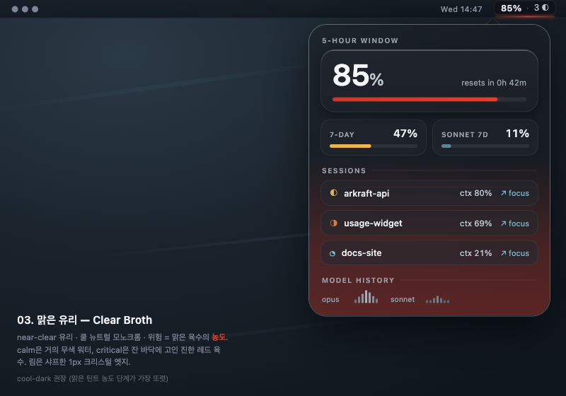
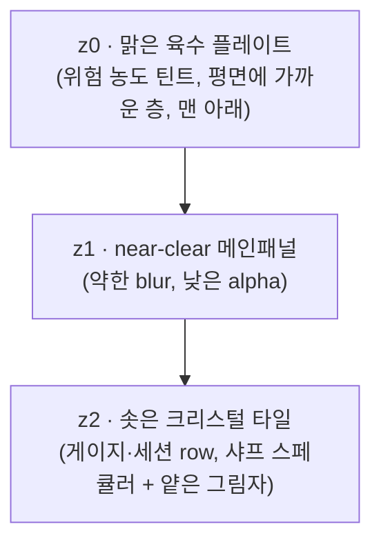

# 03. 맑은 유리 (Clear Broth)

> **한 줄 컨셉:** 김 서린 뚝배기가 아니라 **얼음잔에 담긴 맑은 곰탕(consommé)** — near-clear 유리 너머로 거의 투명한 육수가 비치고, 위험은 *색*이 아니라 **국물의 농도(짙어짐)** 로 읽힌다. calm은 물처럼 무색에 가깝고, critical은 진하게 졸여진 레드 육수가 잔 바닥에 고인다. 차갑고, airy하고, 정제됐다.




## 무드보드 / 톤

- **맑은 consommé / 얼음잔의 육수**: 따뜻한 국밥의 김이 아니라, *차게 식혀 맑게 거른* 육수. 불투명한 프로스트를 걷어내고 **near-clear 유리**(약한 blur)만 남긴다. 유리는 거의 보이지 않고, 그 안에 든 *맑은 액체의 농도*가 정보다.
- **Apple Liquid Glass의 "clear" 변종**: visionOS의 vibrancy를 최소 프로스팅으로 — blur는 살짝, specular rim은 **더 샤프하게**. 유리감은 두꺼운 우윳빛이 아니라 *얇고 단단한 크리스털 엣지*에서 온다.
- **near-모노크롬 + 단 하나의 따뜻함**: 팔레트 전체가 쿨 뉴트럴(채도≈0). 유일하게 채도를 갖는 것이 **국물 틴트**다. 평상시엔 그 틴트조차 거의 무색 → 화면이 물처럼 맑다. 위험이 오를 때만 액체가 진해진다.
- **농도 = 위험**: 베이스(유리국밥)는 "데워짐(온도/glow)"으로 위험을 읽었다면, 맑은 유리는 **"졸아듦(농도/opacity/색 짙어짐)"** 으로 읽는다. 끓는 게 아니라 *진해지는* 육수.
- 키워드: clear broth, consommé, near-clear glass, sharp crystal rim, cool neutral, distilled, airy, low-tint → deep-tint, meniscus line.

## 컬러 토큰

유리/배경은 **쿨 뉴트럴**(채도 0)로 고정 — 국물 틴트가 화면에서 *유일하게* 채도를 갖는 요소가 되도록. 베이스보다 한 단계 더 **밝고 맑게**: 라이트는 near-white 크리스털(~96%L), 다크는 쿨 잉크(~14%L, 그러나 그래파이트보다 푸르고 투명감 있게). near-clear가 컨셉이므로 패널 자체 alpha를 낮춰 배경이 더 비친다.

| role | light | dark |
|---|---|---|
| glass.panel (z1 메인패널, near-clear) | `#F7F9FB` @ 64% (~97%L, 약한 blur) | `#191C21` @ 58% (~12%L, 쿨 블루-그레이) |
| glass.tile (z2 솟은 크리스털 타일) | `#FFFFFF` @ 72% (~99%L, 샤프 스페큘러 상단) | `#23272E` @ 66% (~16%L) |
| scrim.number (숫자 밑 스크림, 불투명) | `#FFFFFF` (불투명) | `#10131A` (불투명, ~7%L) |
| ink.primary (히어로 %·숫자) | `#161A1F` | `#F4F6F9` |
| ink.secondary (라벨·캡션) | `#5E6671` | `#9CA4B0` |
| edge.lens (외곽 림 굴절 엣지, **샤프 1px**) | `#FFFFFF` @ 90% | `#FFFFFF` @ 30% |
| hairline (타일 구분선) | `#0000000F` | `#FFFFFF14` |
| broth.tint (z0 맑은 육수 플레이트 — 위험색 주입) | *위험 4단계로 가변, 아래 표* | *동일, 농도·alpha↑* |

`broth.tint`는 베이스의 "glow(라디얼 발광)"가 아니라 **맑은 액체의 농도/색 짙어짐**이다. z0 플레이트에 *얇고 평평한* 틴트로 깔리고(라디얼보다 리니어/평면에 가깝게, 잔 바닥에 고인 액체처럼), z1/z2는 near-clear 유리 그대로 — 틴트가 *유리를 통과해 비쳐* 보인다. calm에선 거의 무색이라 화면이 투명한 물처럼 보이는 게 핵심.

**위험 4단계 매핑:** (`RiskLevel` calm/watch/warning/critical — z0 맑은 육수 플레이트의 *농도/색*. 라벨·텍스트 색이 아니라 *액체색*이다. 베이스 대비 hue는 더 쿨하게 시작해 critical에서만 깊은 레드로 졸아든다.)

| level | light tint | dark tint | 농도/번짐 |
|---|---|---|---|
| **calm** | `#7FB4C9` @ 6% (거의 무색, 아주 옅은 쿨 워터블루) | `#86BDD4` @ 9% | 잔 **바닥 아주 얕게** — 물에 가까움 |
| **watch** | `#E6B24E` @ 14% (옅은 앰버, 맑게 우러남) | `#F0BA50` @ 20% | 게이지 밑 + 바닥 얕은 층 |
| **warning** | `#E07A38` @ 24% (호박빛 육수, 진해지기 시작) | `#EE8236` @ 34% | 잔 **하단 1/3 채움** |
| **critical** | `#C73A2C` @ 40% (진하게 졸여진 레드 육수) | `#DC4030` @ 52% | 잔 **하단 절반 이상** + edge.lens 살짝 워밍 |

> **불변식 유지:** luminance-pinned 라벨색(어떤 배경에서도 대비 확보)은 그대로. 틴트는 **콘텐츠 뒤(z0)에만** 깔리고 텍스트는 절대 칠하지 않는다. 위험은 "글자가 빨개짐"이 아니라 "국물이 진해짐"으로 읽힌다. calm tint alpha를 ≤6%로 눌러 평상시엔 화면이 거의 무색 크리스털이 되게 한다(맑음이 컨셉의 정체성).

## 타이포그래피

- **숫자/히어로 %**: `SF Pro` **Display** (Rounded 아님) — 맑은 유리의 정제·샤프함과 합이 맞는다. 베이스가 둥근 SF Rounded로 "따뜻함"을 줬다면, 맑은 유리는 라운드를 빼 *차갑고 정확한* 인상으로. 히어로 % `.largeTitle` semibold, tabular figures.
- **라벨/상태/캡션**: `SF Pro Text` `.caption` medium, `ink.secondary`. 자간을 살짝 넓혀(tracking +0.3) airy하게.
- **메뉴바**: `SF Pro` `.system(size:13, weight:.medium)` monospaced-digit — 폭 흔들림 방지.
- 모든 숫자는 **불투명 scrim 플레이트 위**. near-clear 유리는 배경이 많이 비치므로 스크림 대비 보장이 베이스보다 더 중요하다(투명할수록 글자 가독을 스크림이 끌어올림).

## 레이아웃 & 셰이프 언어

**3겹 near-clear 평면 (z-stack):** 베이스와 동일한 z 구조지만 **유리가 거의 투명**하고 **림이 더 샤프**하다.



- **z0 맑은 육수 플레이트**: 패널 bounds를 채우되 베이스의 라디얼 glow가 아니라 **바닥에 고인 액체 층** — 하단에서 위로 옅어지는 vertical/linear 틴트. 위험 레벨이 *색·alpha·채움 높이*를 결정. 살짝만 blur.
- **z1 near-clear 메인패널**: 약한 blur(`.ultraThinMaterial`보다 더 옅게, alpha 낮춤). 배경이 많이 비쳐 *맑다*. 베이스의 `.regularMaterial`보다 한참 투명.
- **z2 크리스털 타일**: 게이지·세션 row·히스토리가 살짝 솟은 타일. 상단 specular는 **샤프한 1px 하이라이트**(베이스의 부드러운 highlight 대비 더 또렷), 아래 아주 얕은 그림자. 떠 있는 *얼음 조각*처럼.
- **코너**: 연속 곡률(`.continuous`) — 패널 26, 타일 20. 베이스(28/22)보다 *살짝 더 타이트* → 정제된 인상.
- **엣지 렌징**: 팝오버 외곽 림에 **샤프한 1px** 굴절 밝은 엣지(`edge.lens`, 90% white). 베이스의 2px 부드러운 림보다 얇고 단단한 크리스털 엣지.
- **간격**: 16pt 패널 패딩, 타일 간 8pt, 타일 내부 12pt. airy하게 라벨 tracking 약간 넓힘.

## 화면 목업

### 메뉴바

작고 맑게. 텍스트는 불투명 scrim 캡슐 위, 그 밑 2px **맑은 육수 메니스커스 라인**(베이스 3px보다 얇고 샤프).

```
┌─────────────────────┐
│  ▏ 85%  ·  3 ◐       │   ← 텍스트: 불투명 scrim 캡슐 위 (항상 가독)
│ ───────────────────  │   ← 메니스커스: 2px 라인 (위험 농도색, 샤프)
└─────────────────────┘
```

- `85%` = 가장 임박한 윈도우(5h/7d 중 max), `3 ◐` = 활성 세션 수.
- 밑 2px **육수 메니스커스** = 위험 농도색. calm=거의 무색 워터, watch=옅은 앰버, warning=호박, critical=진한 레드. 진해질수록 라인 선명·불투명도↑.

### 팝오버 (320pt)

```
╔══════════════════════════════════════════╗   ← edge.lens 샤프 1px 크리스털 림
║                                          ║
║   5-HOUR WINDOW                          ║
║   ┌────────────────────────────────────┐ ║   ← z2 크리스털 타일 (샤프 스페큘러)
║   │            ███████  85%            │ ║   ← 히어로 %: SF Display, scrim 위
║   │   ▁▂▃▄▅▆▇█▇▆▅ resets in 0h 42m    │ ║   ← critical
║   └────────────────────────────────────┘ ║
║                                          ║
║   7-DAY · 47%        SONNET 7D · 11%     ║
║   ▓▓▓▓▓▓░░░░░░░░     ▓▓░░░░░░░░░░░░░░     ║
║    (watch 옅은앰버)    (calm 거의무색)     ║
║                                          ║
║   ── SESSIONS ──────────────────────────  ║
║   ┌────────────────────────────────────┐ ║   ← z2 크리스털 타일
║   │ ◐ arkraft-api      ctx 80%  ↗ focus│ ║
║   └────────────────────────────────────┘ ║
║   ┌────────────────────────────────────┐ ║
║   │ ◑ usage-widget     ctx 69%  ↗ focus│ ║
║   └────────────────────────────────────┘ ║
║   ┌────────────────────────────────────┐ ║
║   │ ◔ docs-site        ctx 21%  ↗ focus│ ║
║   └────────────────────────────────────┘ ║
║                                          ║
║   ── MODEL HISTORY ─────────────────────  ║
║   opus    ▁▃▅▇▆▄▂▁▃▅   sonnet  ▁▁▂▃▂▁▁   ║
║                                          ║
║▓▓▓▓▓▓▓▓▓▓▓▓▓▓▓▓▓▓▓▓▓▓▓▓▓▓▓▓▓▓▓▓▓▓▓▓▓▓▓▓▓▓║   ← z0 맑은 육수: 5h가 critical →
║░░░░░░░░░░░░░░░░░░░░░░░░░░░░░░░░░░░░░░░░░░░░║     바닥 절반이 진한 레드 육수로 고임
╚══════════════════════════════════════════╝
```

- 히어로 %·게이지가 솟은 크리스털 타일에. 세션 3개·히스토리도 타일 스택.
- 위험이 warning/critical이면 z0 육수가 **바닥에 진하게 고이듯** 채워 올라온다(라디얼 발광이 아니라 *평평한 액체 층*). 텍스트는 scrim이 막아 안 칠해짐.

### 위젯

**위에서 내려다본 맑은 잔** — near-clear 디스크, 바닥에 위험 농도 육수가 고임, % 림은 샤프한 크리스털 아크.

```
small (위에서 본 잔)          medium (잔 + 사이드)
┌──────────────┐            ┌────────────────────────────┐
│   ╭──────╮   │            │   ╭──────╮    5H   85% ▓▓▓▓ │
│  ╱      ╲  │            │  ╱      ╲   7D   47% ▓▓▓░ │
│ │  ◜85%◝  │ │            │ │  ◜85%◝  │  SON  11% ▓░░░ │
│  ╲ ▒▒▒▒ ╱  │            │  ╲ ▒▒▒▒ ╱   sessions: 3   │
│   ╰──────╯   │            │   ╰──────╯    resets 0h42m │
│  resets 0h42 │            │                            │
└──────────────┘            └────────────────────────────┘
  ▒▒ = 바닥에 고인 위험 농도 육수 (잔 아래쪽, 평면 층)
  중심 ◜85%◝ = 맑은 유리 위 히어로 %, 림은 샤프 크리스털 아크
```

- 위젯은 **정적** — App이 쓴 스냅샷을 읽기만(ADR-0003). 맥동 없이 *현재* 위험 농도 한 프레임만. 육수 층은 정지 이미지.

## 시그니처 무브

**육수 메니스커스 (Clear Broth Meniscus) — "졸아드는 라인"** — 메뉴바 텍스트 바로 밑 **2px 샤프 라인**. 위험이 오를수록 *색이 짙어지고 라인이 또렷·불투명해진다*: 거의 무색 워터 → 옅은 앰버 → 호박 → 진한 레드. 베이스(유리국밥)가 "데워지는 glow"였다면 맑은 유리는 **"졸아드는 농도"** — 같은 메타포의 *차가운/정제된* 버전. 평상시엔 라인이 거의 안 보일 만큼 맑아서, 위험이 올라올 때 *라인이 진해지며 나타나는* 대비가 신호다.

부가: 팝오버에선 같은 언어가 z0 맑은 육수 플레이트로 확장되어 "바닥에 고이는 진한 육수"가 된다 — 메뉴바 메니스커스 라인과 팝오버 바닥 층이 같은 메타포의 small/large 버전.

## 먹방 정체성 반영 + "정확함 > 귀여움" 준수 방식

- **먹방(ADR-0009) 반영**: "맑은 육수 한 잔", 농도=상태, 크리스털 타일, 위에서 본 잔 위젯, 메니스커스 — 음식 은유가 *형태·투명도·농도*에 녹아 있되 일러스트·캐릭터·이모지 떡칠이 아니다. 따뜻한 국밥이 아니라 *맑게 거른 consommé*라는 점에서 베이스보다 더 절제·고급. 은유는 빛·농도로만(귀여운 그림 0개).
- **"정확함 > 귀여움" 준수**:
  - 숫자는 **언제나 불투명 scrim 위**, tabular/monospaced digit — near-clear 유리로 배경이 비쳐도 값의 가독·정렬은 불변.
  - 위험은 *틴트(콘텐츠 뒤 z0)* 로만 표현, 텍스트는 luminance-pinned 유지 → 위험 신호가 데이터를 가리지 않는다.
  - near-모노크롬 팔레트라 화면에 *유일하게 채도를 가진 것이 국물*이다 → 위험 변화가 시각적으로 가장 두드러진다(정확한 신호 전달).
  - 애니메이션 절제(critical에서만 아주 느린 농도 맥동 옵션), 위젯은 완전 정적. 맑음·정제 인상을 위해 정보를 흐리지 않는다.

## 장점 / 리스크

**장점**
- 위험을 hue가 아닌 **농도/명도/불투명도**로 인코딩 → 색각 이상·반투명 벽지에서도 "진해짐"이 읽힌다.
- near-clear + near-모노크롬이라 **프리미엄·airy·정제** 인상이 강하고, 평상시 화면이 극도로 깨끗하다(calm≈무색).
- Apple Liquid Glass의 clear 변종과 정렬되어 native macOS에 이질감 없으면서, 베이스 대비 *더 가볍고 모던*.
- 메니스커스 "졸아드는 라인"이 메뉴바 극소 공간에서도 강한 정체성을 준다.

**리스크 (정직하게)**
- **near-clear ↔ 가독성 긴장**: 유리 alpha를 낮춰 배경이 많이 비치면 화려한 벽지 위에서 타일/숫자가 묻힐 수 있음 → scrim 불투명도를 베이스보다 더 올리고, z2 타일에 최소 배경 alpha(라이트 72%/다크 66%) 하한을 둠.
- **calm 거의 무색 ↔ 신호 약함**: calm tint ≤6%면 평상시 "위험 채널이 살아있나"가 안 보일 수 있음 → 메뉴바 메니스커스에 아주 옅은 워터블루를 *항상* 1px 깔아 "채널이 살아있음"을 표시(0이 아니라 6%).
- **틴트 농도 단계 변별**: 평면 액체 층은 라디얼 glow보다 단계 변별이 약할 수 있음 → 채움 *높이*(calm 바닥 얕게 → critical 절반)를 색과 함께 가변해 이중 인코딩.
- **다크모드 투명감**: 다크에서 near-clear는 자칫 탁해 보임 → 다크 패널을 그래파이트가 아니라 *쿨 블루-그레이*로 잡아 투명감 유지.

## 구현 난이도 (SwiftUI — 상/중/하)

- **하**: z1 near-clear 패널(`.ultraThinMaterial` + alpha 낮춤), 연속 코너, 불투명 scrim 캡슐, tabular digit — 표준 SwiftUI.
- **중**: z0 위험 농도 틴트(하단→상단 `LinearGradient` + 약한 blur, 채움 높이 가변), z2 샤프 스페큘러 타일(1px linear highlight + 얕은 shadow), 메뉴바 메니스커스(2px 라인, alpha/색 가변). 핵심은 *틴트 농도·채움 높이*의 위험 단계 매핑.
- **상**: 외곽 edge.lens 샤프 굴절 림(1px 그라데이션 stroke로 근사), critical 저속 농도 맥동(`TimelineView`), near-clear 합성에서 scrim 대비 보장(배경 가변에도 글자 가독). 위젯은 정적 근사라 난이도↓.

> 종합 **중** — clear glass는 material alpha만 낮추면 거의 무료. 난이도는 "맑음을 유지하면서 scrim 가독성 보장 + 농도 단계 변별"에 몰려 있다(베이스의 "glow 합성 성능"보다 *가독성 튜닝* 쪽).

## 트렌드 레퍼런스

1. **Apple — "Apple introduces a delightful and elegant new software design" (Newsroom, 2025)** — https://www.apple.com/newsroom/2025/06/apple-introduces-a-delightful-and-elegant-new-software-design/ — Liquid Glass 공식 발표. 본 컨셉은 그중 **"Clear" 변종**(최소 프로스팅·near-transparent)에 기댄다.
2. **Apple HIG — "Materials"** — https://developer.apple.com/design/human-interface-guidelines/materials — `ultraThin` 등 가장 얇은 material + vibrancy로 *유리 너머 배경이 비치는* 깊이. near-clear 패널·샤프 스페큘러의 직접 근거.
3. **9to5Mac — "iOS 26.1 beta 4 adds new setting to tone down Liquid Glass transparency" (2025-10)** — https://9to5mac.com/2025/10/20/ios-26-1-beta-4-adds-new-setting-to-tone-down-liquid-glass-transparency/ — 투명도 가독성 walk-back. near-clear를 쓰되 **숫자는 불투명 scrim 위** 룰을 베이스보다 *더 강하게* 적용하는 근거.

## 베이스(유리국밥) 대비 차별점

| 축 | 베이스 03 유리국밥 (Glass Gukbap) | 변주 G3 맑은 유리 (Clear Broth) |
|---|---|---|
| 국물 성격 | 따뜻한 국밥, 김 서린 뚝배기 | 차게 거른 맑은 consommé, 얼음잔 |
| 위험 인코딩 | **온도/glow**(데워짐, 라디얼 발광) | **농도/opacity**(졸아듦, 평면 액체 층) |
| 유리 | 프로스트(`.regularMaterial`, 우윳빛) | **near-clear**(`.ultraThin`+alpha↓, 배경 비침) |
| 림 렌징 | 2px 부드러운 굴절 | **1px 샤프 크리스털** 엣지 |
| 팔레트 출발점 | 웜앰버 잔열(calm부터 따뜻) | **거의 무색 워터블루**(calm≈투명) |
| 타이포 히어로 | SF Pro **Rounded**(따뜻) | SF Pro **Display**(정제·샤프) |
| 메니스커스 | 3px 글로우(데워짐) | **2px 라인**(졸아듦, 진해짐) |
| 인상 | cozy·따뜻·아늑 | **premium·airy·정제·맑음** |
| z0 채움 | 바닥에서 위로 *번지는 발광* | 바닥에 *고이는 액체 층*(높이 가변) |
| 코너 | 패널 28 / 타일 22 | 패널 26 / 타일 20 (살짝 타이트) |

핵심 차별: **"데워지는 따뜻한 국물"을 "졸아드는 맑은 육수"로 뒤집었다.** 같은 그릇-메타포·같은 z-stack·같은 "텍스트는 scrim 위" 불변식을 공유하되, *온도→농도 / 프로스트→near-clear / 웜→쿨 / 라운드→샤프* 로 전 축을 차갑고 정제된 방향으로 이동시킨다.
