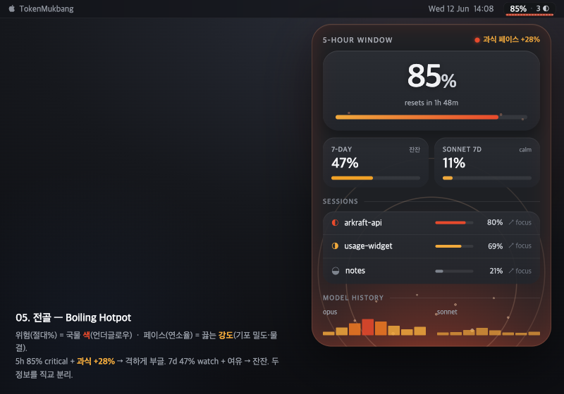
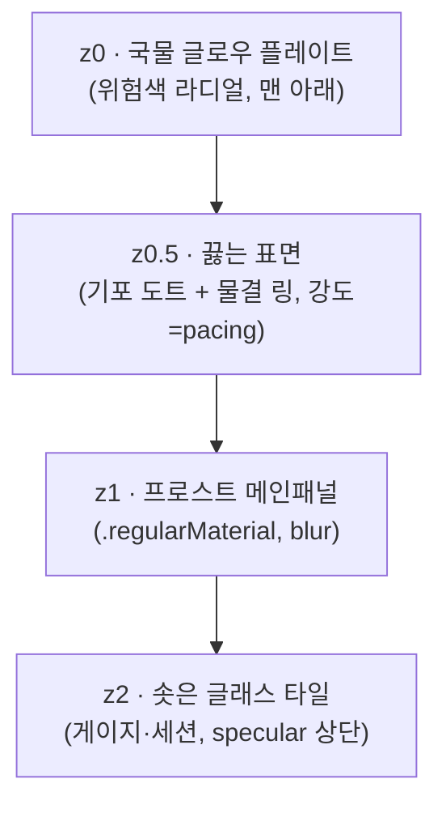

# 05. 전골 (Jeongol)

> **한 줄 컨셉:** 유리 뚜껑 아래에서 국물이 *살아서 끓는다* — 위험(절대 %)은 국물 **색**(언더글로우)으로, 페이스(연소율/pacing)는 끓는 **강도**(기포 밀도·물결)로 분리 인코딩한다. 빨리 먹으면(시간예산보다 빨리 한도 소비) 표면이 격하게 부글거리고, 여유로우면 잔잔히 김만 오른다. 따뜻하고 활기차되, 숫자는 언제나 불투명 스크림 위에서 흔들리지 않는다.



베이스(03 유리국밥)에서 갈라져 나온 변주. 유리국밥이 "차갑게 가라앉은 유리 + 바닥에서 차오르는 정적 글로우"였다면, 전골은 그 국물을 **끓인다** — 그리고 그 끓는 강도에 `RiskScorer`의 *pacing 항*을 직접 매핑한다.

## 무드보드 / 톤

- **불판 위 전골 냄비**: 보글보글 끓어오르는 국물 표면. 기포가 솟아 터지고, 가장자리부터 물결이 인다. 정적인 국밥과 달리 전골은 *지금 이 순간 살아 움직인다*. 활기·온기·"먹는 중"의 생동감.
- **두 개의 독립 채널**: 색(온도)과 운동(끓음)을 분리. 색 = "얼마나 위험한가"(절대 잔량), 끓음 = "얼마나 빨리 가고 있나"(페이스). 둘이 직교(orthogonal)해서 — *느긋하게 위험*(빨갛지만 잔잔)과 *과속하지만 아직 여유*(맑지만 격하게 부글)를 한눈에 구분한다.
- **Apple Liquid Glass / visionOS material**: 베이스와 동일하게 반투명 유리 + vibrancy + specular. 끓는 표면은 유리 *아래*에서 일렁이고, 숫자는 그 위 불투명 스크림에 고정.
- **2026 가독성 walk-back 의식**: 끓음이 아무리 격해도 숫자는 절대 흔들리지 않는다. 운동은 배경(z0)에만, 텍스트는 스크림 위(z2).
- 키워드: rolling boil, simmer, surface bubbles, ripple rings, broth glow, steam wisp, graphite glass, live pot.

## 컬러 토큰

유리/프로스트는 **쿨 뉴트럴**(채도≈0)로 고정 — 위험색이 유일한 채도 요소. 라이트는 화이트스모크 프로스트(~91%L), 다크는 그래파이트 글래스(~13%L). **다크 우선.**

| role | light | dark |
|---|---|---|
| frost.panel (z1 메인패널 베이스) | `#E8EAED` (~91%L) | `#1E2024` (~13%L) |
| frost.tile (z2 솟은 글래스 타일) | `#F4F5F7` (~96%L, specular 상단) | `#2A2D33` (~18%L) |
| scrim.number (숫자 밑 스크림) | `#DADCE0` (~87%L) | `#15171A` (~9%L) |
| ink.primary (히어로 %·숫자) | `#1A1C1F` | `#F2F3F5` |
| ink.secondary (라벨·캡션) | `#5B606A` | `#A7ACB5` |
| edge.lens (외곽 림 굴절 엣지 2px) | `#FFFFFF` @ 70% | `#FFFFFF` @ 22% |
| hairline (타일 구분선) | `#00000014` | `#FFFFFF1A` |
| bubble.highlight (기포 specular 점) | `#FFFFFF` @ 60% | `#FFFFFF` @ 40% |
| glow.broth (z0 국물 — 위험색, 아래 표) | *가변* | *가변, 채도·alpha↑* |

### 위험 4단계 = 국물 색 (절대 잔량 채널)

`RiskLevel` (calm/watch/warning/critical) → z0 국물 플레이트 라디얼 글로우 **중심색**. 텍스트 색이 아니라 *국물 발광색*이다. 베이스와 동일한 온도 램프(미지근한 잔열 → 낮게 끓는 엠버레드).

| level | light glow | dark glow | 번짐 범위 |
|---|---|---|---|
| **calm** | `#E8A33D` @ 14% (희미한 웜앰버) | `#F0A93C` @ 24% | 게이지 밑 작은 라디얼 |
| **watch** | `#E89B2E` @ 22% (허니) | `#F2A226` @ 34% | 게이지 + 타일 하단 |
| **warning** | `#E5742A` @ 34% (파프리카 오렌지) | `#F07A22` @ 48% | 팝오버 **바닥 전체** 데움 |
| **critical** | `#D8472E` @ 44% (엠버레드) | `#E84A2C` @ 60% | 패널 **가장자리까지** + edge.lens 워밍 |

### 페이스(끓는 강도) = 별도 채널 (pacing)

색과 **독립**. `RiskScorer`가 utilization 위에 얹는 *pacing 가중*(시간예산 대비 연소 속도)을 끓는 강도로 표현. 색은 그대로 두고, 표면 운동만 바꾼다.

| 페이스 등급 (pacing) | 의미 | 끓는 강도 (시각 파라미터) |
|---|---|---|
| **slack (−)** | 시간예산보다 느리게 소비 (여유) | 기포 거의 없음, 물결 0. 잔잔한 표면 + 김 1줄 |
| **on-pace (0)** | 예산 페이스대로 | 작은 기포 드문드문, 옅은 물결 1링 |
| **brisk (+)** | 예산보다 빠름 (살짝 과식) | 기포 밀도↑, 물결 2~3링, 표면 일렁임 |
| **gorging (++)** | 예산보다 크게 빠름 (과식, "+28%") | 기포 빽빽·크게, 물결 격하게 퍼짐, surface boil |

> **핵심 분리:** *색은 "얼마나 남았나(위험)"*, *끓음은 "얼마나 빨리 가나(페이스)"*. 둘은 따로 움직인다. 예: 7d 47%는 watch(허니색)지만 페이스가 느려 **잔잔**. 5h 85%는 critical(엠버레드)인데 과식 페이스라 **격하게 부글**. 한 화면에서 "위험하고 + 과속 중"과 "위험하지만 + 천천히"가 구별된다 — 이게 베이스(03)엔 없던 차원이다.

> **불변식:** luminance-pinned 라벨/숫자 색은 그대로. 글로우·끓음은 **콘텐츠 뒤(z0)에만**, 텍스트는 절대 칠하지·흔들지 않는다. 위험은 "그릇이 데워짐", 페이스는 "그릇이 끓어오름"으로 읽힌다.

## 타이포그래피

- **숫자/히어로 %**: `SF Pro Rounded` — 둥근 글래스 타일·전골의 따뜻함과 합. 히어로 % `.largeTitle` semibold, **tabular figures**(끓어도 자리 안 흔들림).
- **라벨/상태/캡션**: `SF Pro Text` `.caption` medium, `ink.secondary`. 라운드는 숫자에만.
- **페이스 인디케이터 한 줄**: `SF Pro Text` `.caption2` medium, monospaced digit. "과식 페이스 +28%" / "여유 페이스 −12%" 형식. 부호(+/−)와 % 정렬 고정.
- **메뉴바**: `SF Pro` `.system(size:13, weight:.medium)` monospaced-digit (폭 안 흔들리게).
- 모든 숫자는 **scrim.number 플레이트 위** — 끓음·글로우가 번져도 대비·정렬 불변.

## 레이아웃 & 셰이프 언어

**4겹 z-stack** (베이스 3겹 + 끓는 표면 1겹):



- **z0 국물 글로우**: 패널 bounds `RadialGradient`. 중심=게이지 아래, 위험 레벨이 색·alpha·반경 결정. (= 절대 잔량 채널)
- **z0.5 끓는 표면**: z0 위·z1(유리) 아래에 깔리는 **기포 도트 + 동심 물결 링** 레이어. 도트 밀도·크기·물결 개수 = pacing. 유리(z1)가 위에서 흐려 줘서 "유리 너머 끓는 국물"이 된다. (= 페이스 채널)
- **z1 프로스트 패널**: `.regularMaterial`. 국물·기포가 *통과해 비치되* 흐려진다.
- **z2 글래스 타일**: 게이지·세션 row·히스토리 각 항목이 솟은 타일. 상단 specular 1px, 아래 soft shadow.
- **코너**: 연속 곡률 패널 28pt / 타일 22pt.
- **엣지 렌징**: 팝오버 외곽 림에만 2px(`edge.lens`). critical+과식이면 림도 살짝 데움.
- **간격**: 16pt 패널 패딩, 타일 간 8pt, 타일 내부 12pt.

## 화면 목업

### 메뉴바 (~26px)

텍스트는 **불투명 스크림 캡슐** 위. 그 밑 3px 메니스커스 = 위험색(온도). 메니스커스 위에 흩뿌린 **기포 점 밀도 = 페이스**.

```
┌─────────────────────────┐
│  ▓ 85%  ·  3 ◐          │   ← 텍스트: 불투명 scrim 캡슐 위 (항상 가독)
│ ∘°∘°∘∘°∘°∘∘°∘∘°∘°∘∘°∘°∘  │   ← 메니스커스 3px: 색=위험(엠버레드), 기포 점 밀도=페이스(과식→빽빽)
└─────────────────────────┘
```

- `85%` = 가장 임박한 윈도우(5h/7d 중 max), `3 ◐` = 활성 세션.
- 메니스커스 **색** = 위험(calm 웜→critical 레드), 그 위 **기포 점 밀도** = 페이스(잔잔→빽빽). 픽셀 3개로 "끓는 그릇 + 얼마나 급한지" 둘 다 전달.

### 팝오버 (320pt)

```
╔════════════════════════════════════════════╗   ← edge.lens 굴절 림 (critical+과식이면 데움)
║                                            ║
║   5-HOUR WINDOW          ░ 과식 페이스 +28% ║   ← 페이스 한 줄 (우측, monospaced)
║   ┌──────────────────────────────────────┐ ║   ← z2 타일 (specular 상단)
║   │             ███████  85%             │ ║   ← 히어로 %: SF Rounded, scrim 위
║   │  °∘°∘°∘°∘ resets in 1h 48m  °∘°∘°∘°  │ ║   ← critical: 격한 기포 (과식 페이스)
║   └──────────────────────────────────────┘ ║
║                                            ║
║   7-DAY · 47% ░잔잔     SONNET 7D · 11%    ║   ← watch+여유: 잔잔 / calm
║   ▓▓▓▓▓░░░░░░░░░         ▓░░░░░░░░░░░░       ║
║                                            ║
║   ── SESSIONS ────────────────────────────  ║
║   ┌──────────────────────────────────────┐ ║
║   │ ◐ arkraft-api        ctx 80%  ↗ focus│ ║
║   │ ◑ usage-widget       ctx 69%  ↗ focus│ ║
║   │ ◒ notes              ctx 21%  ↗ focus│ ║
║   └──────────────────────────────────────┘ ║
║                                            ║
║   ── MODEL HISTORY ───────────────────────  ║
║   opus    ▁▃▅▇▆▄▂▁▃▅   sonnet  ▁▁▂▃▂▁▁     ║
║                                            ║
║°∘°∘°∘°∘°∘°∘°∘°∘°∘°∘°∘°∘°∘°∘°∘°∘°∘°∘°∘°∘°∘°║   ← z0 국물(critical 레드) + z0.5 격한 기포
╚════════════════════════════════════════════╝     (5h 과식이 전체 톤을 끌어올림)
```

- 5h 타일: critical 레드 글로우 + 과식 페이스 → 표면이 격하게 부글(°∘ 빽빽). 페이스 한 줄 "과식 페이스 +28%".
- 7d 47%: watch 허니색이되 페이스 느림 → "잔잔" 라벨, 표면 거의 멈춤.
- Sonnet 11%: calm, 잔열만.

### 위젯

**위에서 내려다본 전골 냄비** — 프로스트 디스크, 중심 국물 발광(위험색), 표면에 기포 점 분포(페이스). App이 쓴 스냅샷 한 프레임만(ADR-0003, 정적).

```
small (위에서 본 냄비)         medium (냄비 + 사이드)
┌──────────────┐            ┌────────────────────────────┐
│   ╭──────╮   │            │   ╭──────╮    5H   85% ▓▓▓▓ │
│  ╱ °∘°∘° ╲  │            │  ╱ °∘°∘° ╲   7D   47% ▓▓░░ │
│ │  ◜85%◝  │ │            │ │  ◜85%◝  │  SON  11% ▓░░░ │
│  ╲ ∘°∘°∘ ╱  │            │  ╲ ∘°∘°∘ ╱   pace +28% 과식 │
│   ╰──────╯   │            │   ╰──────╯    resets 1h48m │
│  resets 1h48 │            │                            │
└──────────────┘            └────────────────────────────┘
  °∘ = 기포 점 (밀도=페이스, 과식이면 빽빽)
  중심 ◜85%◝ = 국물 글로우(위험색) 위 히어로 %
```

- 위젯은 **정적** — 맥동·애니메이션 없이 *현재* 위험색 + *현재* 기포 밀도 한 프레임. 끓는 운동은 점 분포(밀도)로 정지 표현.

## 시그니처 무브

**끓는 강도 = 연소율 (Boiling Pace)** — 전골의 핵심. z0.5 끓는 표면의 **기포 밀도·크기 + 동심 물결 링 개수**가 `RiskScorer`의 *pacing 항*에 직접 매핑된다.

- **여유**(slack): 표면 정지, 김 1줄. "천천히 먹는 중."
- **과식**(gorging, "+28%"): 표면 surface-boil — 기포 빽빽·크게, 물결 격하게. "급하게 먹는 중, 이 속도면 금방 동난다."

색(위험)과 **직교**한다는 게 베이스와의 결정적 차이다. 유리국밥(03)은 위험을 색·번짐 *하나*로만 인코딩했다 — 같은 critical이면 항상 같은 모습. 전골은 거기에 **운동 축**을 더해, "critical인데 천천히"(빨갛지만 잔잔)와 "아직 watch인데 과속"(허니색인데 격하게 부글)을 **시각적으로 분리**한다. 메뉴바(기포 점 밀도) → 위젯(점 분포) → 팝오버(전면 끓음)로 small/large 일관.

## 먹방 정체성 + "정확함 > 귀여움" 준수

- **먹방(ADR-0009)**: "전골 한 냄비", 끓는 국물=상태, *끓는 속도=먹는 속도(연소율)*, 냄비 위젯, 김. 음식 은유가 **구조·운동에 녹아** 있되 캐릭터·이모지 떡칠 0. "급하게 먹으면 빨리 끓어 동난다"는 mukbang 직관이 pacing 인코딩 그 자체다.
- **"정확함 > 귀여움"**:
  - 숫자는 **언제나 불투명 스크림 위**, tabular/monospaced — 끓음·글로우가 번져도 값·정렬 불변.
  - 위험·페이스는 *콘텐츠 뒤(z0/z0.5)* 로만. 텍스트는 luminance-pinned, 절대 칠하거나 흔들지 않음.
  - 페이스를 **분위기뿐 아니라 숫자로도** 명시("+28%") — 끓음은 감성, 숫자는 사실. 둘 다 준다.
  - 끓는 운동은 critical+과식에서만 격하고, calm/여유에선 거의 정지. 위젯은 완전 정적. 분위기를 위해 정보를 흐리지 않는다.

## 장점 / 리스크

**장점**
- **2채널 분리**: 위험(색)과 페이스(끓음)를 직교 인코딩 → 베이스가 못 하던 "느긋한 위험 vs 급한 여유"를 한눈에. pacing이 `RiskScorer`에 *이미 있는데* 베이스는 색에 섞어 버렸다 — 전골은 그걸 **독립 표현**해 정보량을 늘린다.
- 색각 이상에서도 **운동(밀도)**이 두 번째 단서 → 색만으로 못 읽어도 "빽빽함"으로 페이스 전달.
- 활기·온기가 "지금 살아 움직이는 데이터"라는 정체성을 강하게 줌. mukbang과 합이 최고.
- Apple Liquid Glass와 자연 정렬, native 이질감 없음.

**리스크 (정직하게)**
- **운동 비용**: z0.5 끓는 표면(애니메이션 기포·물결) + z1 blur 합성은 베이스보다 GPU 부담↑. 팝오버는 `TimelineView` 저프레임(~8fps)으로 절제, 60s 갱신·다중 위젯에선 정적 점-분포로 강등 필요.
- **위젯 정적 한계**: 끓는 운동의 매력이 위젯에선 "점 밀도"로만 표현(WidgetKit 동적 불가). 핵심 동적 시그니처가 위젯에서 약해짐.
- **운동 ↔ 정확함 긴장**: 격한 끓음이 "시끄럽다/산만"으로 읽힐 위험. calm/여유에선 **반드시 거의 정지**시켜(밀도 0~1) 평상시 조용하게. 끓음은 과식 신호일 때만 의미 있다.
- **2채널 오독**: 색·운동 두 축을 동시에 읽어야 해 학습 곡선↑. 페이스 한 줄("+28%") 텍스트로 보강해 운동 은유를 못 읽어도 사실은 전달.

## 구현 난이도 (SwiftUI — 상/중/하)

- **하**: z1 프로스트 패널(`.regularMaterial`), 연속 코너, 스크림 캡슐, tabular/monospaced digit, 페이스 한 줄 텍스트 — 표준 SwiftUI.
- **중**: z0 위험 라디얼 글로우(`RadialGradient`+`.blur`), z2 specular 타일, 메뉴바 메니스커스+기포 점, 위젯 정적 점-분포. pacing→밀도 매핑 함수.
- **상**: z0.5 **끓는 표면 애니메이션**(기포 phase 오프셋·물결 링 확산을 `TimelineView`+`Canvas`로, pacing이 frequency/amplitude 구동), 성능 캡(저fps·blur 캐싱), critical+과식 림 워밍. 위젯은 정적 근사로 난이도↓.

> 종합 **중상** — 베이스(중)보다 한 단계 위. 추가 난이도는 전적으로 "z0.5 끓는 표면 + pacing 구동 + 성능"에 몰려 있다. 끓음을 정적 점-분포로 타협하면 **중**까지 내려간다.

## 트렌드 레퍼런스

1. **Apple — "Apple introduces a delightful and elegant new software design" (Newsroom, 2025)** — https://www.apple.com/newsroom/2025/06/apple-introduces-a-delightful-and-elegant-new-software-design/ — Liquid Glass 공식 발표. 반투명 유리+깊이 토대(베이스 공유).
2. **Apple HIG — "Materials"** — https://developer.apple.com/design/human-interface-guidelines/materials — blur·vibrancy·specular로 유리 아래 구조를 드러내는 스펙. z-stack 설계 근거.
3. **Apple Developer — "Add rich graphics to your SwiftUI app" / `Canvas` & `TimelineView`** — https://developer.apple.com/documentation/swiftui/canvas — z0.5 끓는 표면(기포·물결)을 저프레임 `Canvas`로 그리는 직접 근거. pacing 구동 애니메이션의 구현 토대.
4. **9to5Mac — "iOS 26.1 beta 4 adds new setting to tone down Liquid Glass transparency" (2025-10)** — https://9to5mac.com/2025/10/20/ios-26-1-beta-4-adds-new-setting-to-tone-down-liquid-glass-transparency/ — 가독성 walk-back = "숫자는 불투명 스크림 위, 끓음은 배경에만" 룰의 근거.

## 베이스(03 유리국밥) 대비 차별점

| | 03 유리국밥 (베이스) | 05 전골 (이 변주) |
|---|---|---|
| 위험 인코딩 | 색·번짐 **1채널** | 색(온도) = 위험 — **유지** |
| 페이스 인코딩 | 없음 (위험에 섞임) | **끓는 강도 = 별도 채널** (신규) |
| 표면 | 정적 글로우 | **끓는 운동**(기포·물결, pacing 구동) |
| z-stack | 3겹 | **4겹**(z0.5 끓는 표면 추가) |
| 시그니처 | 국물 메니스커스(색) | **끓는 강도=연소율**(색+운동 분리) |
| 정보량 | 위험 1축 | **위험·페이스 2축**(직교) |
| 톤 | 차분·가라앉음 | **활기·생동**(살아 끓음) |
| 난이도 | 중 | 중상 (끓는 표면 +1단계) |

핵심: 전골은 베이스의 "데워지는 그릇"을 **"끓는 그릇"**으로 만들어, `RiskScorer`에 이미 있지만 베이스가 색에 묻어 버린 *pacing 항*을 독립 시각 채널로 끌어낸다. 같은 critical도 "천천히 vs 과속"이 구별되는 게 전부다.
