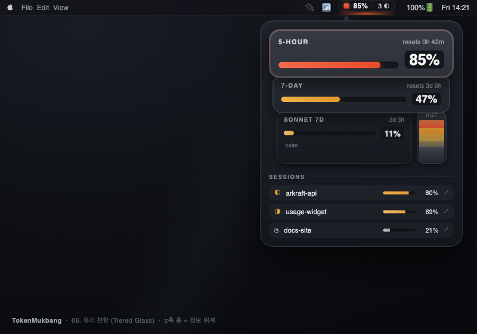
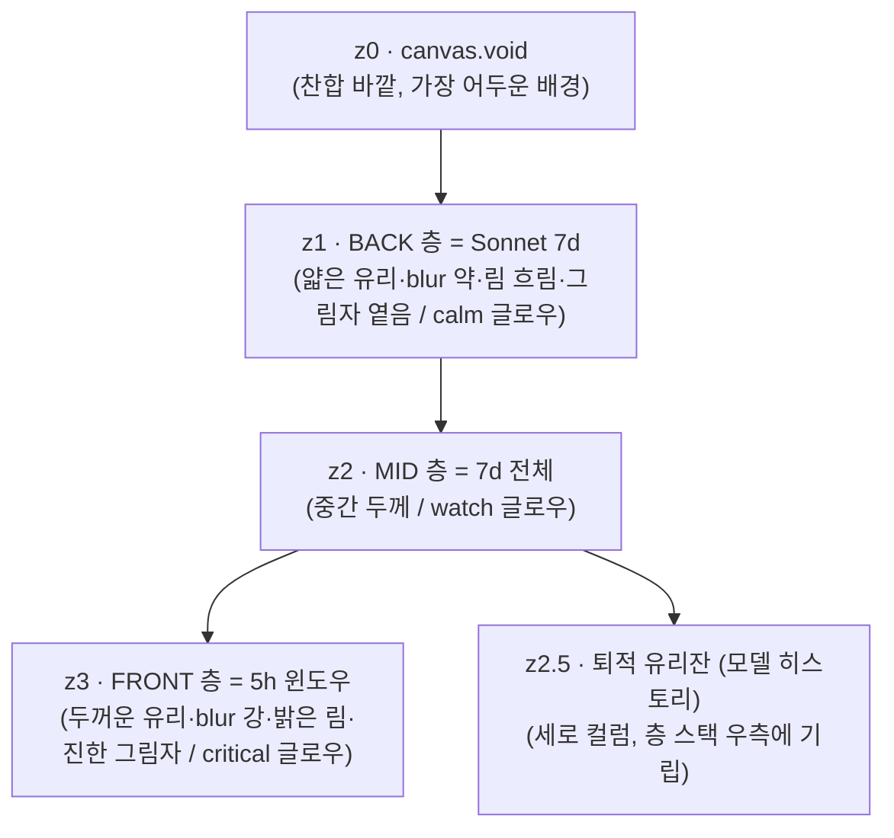

# 06. 유리 찬합 (Tiered Glass)

> **한 줄 컨셉:** 한 그릇이 아니라 **겹겹이 쌓인 반투명 유리 층(찬합)** — 각 사용량 창(5h/7d/Sonnet)이 자기 유리 층이 되어 z축으로 포개진다. 앞층은 밝고 두껍게 떠 있고 뒷층은 어둡고 얇게 가라앉으며, **깊이(depth) 그 자체가 정보 위계**다. 위험은 층마다 자기 국물 글로우로 유리 바닥을 데우고, 모델 히스토리는 키 큰 유리잔 속 **퇴적층(sediment)** 으로 쌓인다.



## 베이스 대비 차별점 (먼저)

베이스 **03 유리국밥**은 "한 그릇 + 바닥에서 차오르는 단일 국물 글로우 + z0/z1/z2 평면 3겹"이었다. 06은 그 유리·국물 DNA를 **층층 구조(tier)** 로 재배치한다:

- **한 그릇 → 여러 층의 찬합.** 03은 한 패널 안에 항목들이 평면으로 놓였다. 06은 *각 사용량 창이 물리적으로 독립된 유리 층*이고, 이 층들이 z축으로 약간씩 오프셋되어 포개진다. 정보 위계 = 물리적 깊이.
- **단일 z0 글로우 → 층별 국물 글로우.** 03은 패널 바닥 하나가 데워졌다. 06은 *층마다 자기 국물 플레이트*를 가져, 5h가 critical 레드로 끓는 동안 그 아래 7d 층은 허니, Sonnet 층은 잔잔한 웜으로 — **층을 통과해 내려다보면 각 층의 온도가 동시에 보인다.**
- **막대 히스토리 → 퇴적층 유리잔.** 03의 모델 히스토리는 가로 sparkline이었다. 06은 *세로로 선 키 큰 유리잔* 안에 토큰 사용량이 모래처럼 가라앉은 퇴적 단면 — 시간이 위에서 아래로 쌓인 지층.
- **깊이의 역할 격상.** 03에서 z-stack은 "예쁜 떠 있음"이었지만, 06에서 깊이는 **읽는 순서**다. 가장 앞·밝은·두꺼운 층 = 가장 임박한 위험. visionOS식 z축 레이어링을 정보 설계 도구로 승격.

## 무드보드 / 톤

- **찬합(layered tiffin) / 포개진 유리 트레이**: 반찬을 층층이 담아 포개는 찬합처럼, 각 데이터 창이 독립된 유리 칸이 되어 쌓인다. 열어 내려다보면 모든 층이 한눈에.
- **visionOS 윈도우 z-스택 / Liquid Glass material**: 반투명 + vibrancy + 층마다 다른 specular·shadow로 "어느 게 앞이고 뒤인지"를 빛으로 말한다. 앞층은 두꺼운 유리(blur 강, 밝은 림, 진한 그림자), 뒷층은 얇은 유리(blur 약, 흐린 림, 옅은 그림자).
- **온도(temperature)로서의 위험 — 층마다 독립**: 03의 "데워지는 국물" 은유를 유지하되, *각 층이 자기 온도*를 갖는다. 한 층이 끓어도 옆/아래 층은 차분할 수 있어, 위험이 "어느 창에서" 오는지가 깊이에서 즉시 읽힌다.
- **퇴적(sediment)**: 모델 토큰 히스토리는 유리잔 바닥에 가라앉은 침전물. 최근이 위, 과거가 아래. 켜켜이 쌓인 지층 단면.
- 키워드: tiffin, stacked glass trays, parallax depth, per-tier broth, frosted z-layers, sediment column, specular rim hierarchy.

## 컬러 토큰

유리/프로스트는 **쿨 뉴트럴**(채도 ~0)로 고정 — 위험색만 채도를 갖게. **다크 우선**으로 설계하고 라이트는 대응. 핵심 변주: 층마다 base 명도가 다르다 — **앞층(z3) 밝고 / 뒷층(z1) 어둡게**, 이 명도 사다리가 깊이를 만든다.

| role | light | dark (우선) |
|---|---|---|
| glass.tier.front (z3 앞층, 두꺼운 유리) | `#F4F5F7` (~96%L) | `#30343C` (~21%L) |
| glass.tier.mid (z2 중간층) | `#E9EBEF` (~92%L) | `#262A31` (~17%L) |
| glass.tier.back (z1 뒷층, 얇은 유리) | `#DEE1E6` (~88%L) | `#1C1F25` (~12%L) |
| canvas.void (z0 찬합 바깥 배경) | `#CFD3DA` (~84%L) | `#0E1014` (~6%L) |
| scrim.number (숫자 밑 불투명 스크림) | `#FBFCFD` | `#14161A` (~9%L) |
| ink.primary (히어로 %·숫자) | `#16181B` | `#F3F4F6` |
| ink.secondary (라벨·캡션) | `#5B606A` | `#A2A8B2` |
| edge.lens.front (앞층 림 2px, 굴절) | `#FFFFFF` @ 75% | `#FFFFFF` @ 30% |
| edge.lens.back (뒷층 림 1px, 흐림) | `#FFFFFF` @ 40% | `#FFFFFF` @ 12% |
| sediment.glass (히스토리 유리잔 벽) | `#E4E7EC` @ 60% | `#2C313A` @ 60% |
| hairline (층 내부 구분선) | `#00000012` | `#FFFFFF14` |
| glow.broth (층별 국물 — 위험색 주입) | *위험 4단계, 아래* | *동일, 채도·alpha↑* |

`glow.broth`는 **각 층의 바닥 플레이트**에 칠하는 라디얼 글로우다. 층의 유리(z의 front/mid/back)를 *통과해* 비치되, 글로우 강도는 층 명도와 무관하게 그 층의 위험 레벨이 결정한다.

**위험 4단계 매핑:** (`RiskLevel` calm/watch/warning/critical — *각 층 바닥* 국물 플레이트의 라디얼 글로우 중심색. 텍스트색이 아니라 발광색.)

| level | light glow | dark glow (우선) | 번짐 범위 |
|---|---|---|---|
| **calm** | `#E8A33D` @ 12% | `#F0A93C` @ 20% | 그 층 게이지 밑 작은 라디얼만 |
| **watch** | `#E89B2E` @ 20% | `#F2A226` @ 30% | 그 층 바닥 하단부 |
| **warning** | `#E5742A` @ 32% | `#F07A22` @ 44% | 그 층 **바닥 전체**를 데움 |
| **critical** | `#D8472E` @ 42% | `#E84A2C` @ 56% | 그 층 바닥 + **그 층 림(edge.lens) 워밍**, 저속 맥동 |

> **불변식 유지(03 계승):** luminance-pinned 라벨색은 그대로. 글로우는 **콘텐츠 뒤(층 바닥)에만** 깔리고 텍스트는 절대 칠하지 않는다. 06의 추가 규칙: 위험 글로우는 **그 층 안에만 갇힌다** — 한 층이 critical이어도 다른 층으로 번지지 않아, "어느 창이 위험한가"가 깊이에서 명확히 분리된다.

## 타이포그래피

- **숫자/히어로 %**: `SF Pro Rounded`, `.title2`~`.largeTitle` semibold, tabular figures. 앞층(z3) 히어로 %는 가장 크게 — 깊이와 타입 스케일이 같은 방향(앞=크고 임박).
- **라벨/상태/캡션**: `SF Pro Text` `.caption` medium, `ink.secondary`. 뒷층 라벨은 한 단계 작게(`.caption2`) — 깊이를 폰트 크기로도 보강.
- **메뉴바**: `SF Pro` `.system(size:13, weight:.medium)` monospaced-digit. 폭 흔들림 방지.
- 모든 숫자는 **scrim.number 플레이트 위**. 층 글로우·프로스트가 번져도 값의 대비·정렬 불변(가독성 룰).

## 레이아웃 & 셰이프 언어

**z축 층 위계 (Tier Stack) — 06의 심장:**



**깊이를 만드는 4개 레버(층마다 차등):**

| 레버 | 앞층(z3, 임박) | 뒷층(z1, 여유) |
|---|---|---|
| **오프셋** | 위로 ~14pt 솟고 좌로 약간 | 아래·뒤로 깔림 |
| **유리 두께(blur)** | 두껍게 (강 blur, `.regularMaterial`) | 얇게 (약 blur, `.thinMaterial`) |
| **specular 림** | `edge.lens.front` 2px 또렷 | `edge.lens.back` 1px 흐림 |
| **그림자** | 진한 soft shadow (y+10, blur 24) | 옅은 shadow (y+4, blur 10) |

- **층 카드**: 각 사용량 창 = 하나의 글래스 카드. 연속 곡률(`.continuous`) 코너 **24pt**. 카드끼리 ~14pt씩 z·y 오프셋되어 *부분적으로 겹쳐* 포개진다(찬합처럼). 겹친 부분은 앞층 그림자가 뒷층에 드리워 깊이를 확정.
- **층별 국물 바닥**: 각 카드 안 맨 아래 `RadialGradient`(그 층 위험색). 카드 클립 안에 갇힘.
- **퇴적 유리잔**: 층 스택 우측에 *세로로 선* 키 큰 유리 실린더. 안에 모델별(opus/sonnet) 토큰량이 색 띠로 가라앉음 — 위=최근, 아래=과거. `sediment.glass` 반투명 벽 + 안쪽 침전 그라데이션.
- **간격**: 카드 외부 패딩 16pt, 카드 내부 12pt, 층 오프셋 14pt.

## 화면 목업

### 메뉴바

작고, 어떤 벽지 위에서도 읽혀야 한다. **포개진 미니 층** 은유를 두 줄의 미세 메니스커스로 압축 — 앞층(5h) 메니스커스가 위, 그 밑에 한 톤 흐린 뒷층 라인.

```
┌─────────────────────┐
│  ▓ 85%  ·  3 ◐       │   ← 텍스트: 불투명 scrim 캡슐 (항상 가독)
│ ▔▔▔▔▔▔▔▔▔▔▔▔▔▔▔▔▔▔▔ │   ← 앞층(5h) 메니스커스 2px : critical 레드
│ ░░░░░░░░░░░░░░░░░░░░ │   ← 뒷층(7d) 메니스커스 1px : watch 허니 (흐림)
└─────────────────────┘
```

- `85%` = 가장 임박한 윈도우(여기선 5h), `3 ◐` = 활성 세션 수.
- 두 줄 메니스커스 = **앞층/뒷층 위험을 깊이로 압축**. 진한 위 라인 = 앞층 5h, 흐린 아래 라인 = 뒷층 7d. 메뉴바 픽셀 몇 개로 "층층 찬합"을 암시.

### 팝오버 (320pt 폭)

```
╔════════════════════════════════════════════╗
║                                            ║
║   ▛▀▀▀▀▀▀▀▀▀▀▀▀▀▀▀▀▀▀▀▀▀▀▀▀▀▀▀▀▀▀▀▀▀▀▀▜  ║ ← z3 FRONT (두꺼운 유리, 림 2px 또렷)
║   ▌ 5-HOUR              resets 0h 42m  ▐  ║   solid shadow, 위로 14pt 솟음
║   ▌   ██████████████████░░░  85%      ▐  ║ ← 히어로 %: SF Rounded, scrim 위
║   ▌▒▒▒▒▒▒▒▒▒▒▒▒▒▒▒▒▒▒▒▒▒▒▒▒▒▒▒▒▒▒▒▒▒▒▒▐  ║ ← 이 층 바닥: critical 레드 글로우 (맥동)
║   ▙▄▄▄▄▄▄▄▄▄▄▄▄▄▄▄▄▄▄▄▄▄▄▄▄▄▄▄▄▄▄▄▄▄▄▄▟  ║
║   ┌──────────────────────────────────┐    ║ ← z2 MID (중간 유리, 살짝 뒤·아래)
║   │ 7-DAY            resets 3d 5h     │ ▕  ║
║   │   ████████░░░░░░░░░░░  47%        │ ▕  ║
║   │ ░░░░░░░░░░░░░░░░░░░░░░░░░░░░░░░░░ │ ▕  ║ ← 이 층 바닥: watch 허니 글로우
║   └──────────────────────────────────┘    ║
║   ┌─────────────────────────────┐  ╭───╮  ║ ← z1 BACK (얇은 유리, 림 흐림) │ 퇴적 유리잔
║   │ SONNET 7D       resets 3d5h │  │▓▓▓│  ║   │ opus  (위=최근)
║   │   ██░░░░░░░░░░░░░░░  11%     │  │▓▒░│  ║   │ sonnet
║   │ ·calm· (글로우 거의 없음)    │  │▒░░│  ║   │ ░ 과거 (아래로 가라앉음)
║   └─────────────────────────────┘  ╰───╯  ║   ↑ sediment column (세로)
║                                            ║
║   ── SESSIONS ──────────────────────────   ║
║   ◐ arkraft-api      ctx 80%   ↗ focus     ║   ← 세션 row (얇은 글래스 슬랩)
║   ◑ usage-widget     ctx 69%   ↗ focus     ║
║   ◔ docs-site        ctx 21%   ↗ focus     ║
║                                            ║
╚════════════════════════════════════════════╝
  • 앞층(5h 85% critical)이 가장 밝고·두껍고·앞으로 솟음 → 시선 1순위
  • 뒷층(Sonnet 11% calm)은 가장 어둡고·얇고·뒤로 깔림 → 여유로움이 깊이로 읽힘
  • 각 층 바닥 글로우는 그 층 안에만 갇혀 번지지 않음 (위험 출처 = 깊이)
```

- 세 사용량 창이 **포개진 유리 층**으로 쌓인다. 위험·임박할수록 앞·밝게·두껍게.
- 퇴적 유리잔이 층 스택 우측에 세로로 기립 — opus/sonnet 토큰이 색 띠로 가라앉음.
- 세션은 가장 얇은 글래스 슬랩 row로 맨 아래(보조 정보 = 가장 뒤·평평).

### 위젯

**위에서 내려다본 찬합** — 포개진 유리 칸들이 살짝씩 어긋나 쌓인 단면. 각 칸이 자기 % + 자기 온도.

```
small (찬합 내려다보기)        medium (찬합 + 퇴적잔)
┌──────────────┐            ┌────────────────────────────┐
│ ╔══════════╗ │            │ ╔══════════╗   ▕▓▏ opus    │
│ ║ 5H  85%▓▓║ │            │ ║ 5H  85%▓▓║   ▕▓▏ sonnet  │
│ ╟──────────╢ │            │ ╟──────────╢   ▕▒▏          │
│ ║ 7D  47%▓░║ │            │ ║ 7D  47%▓░║   ▕░▏ 퇴적     │
│ ╟──────────╢ │            │ ╟──────────╢              │
│ ║ SO  11%░░║ │            │ ║ SO  11%░░║   sess: 3      │
│ ╚══════════╝ │            │ ╚══════════╝   reset 0h42m │
└──────────────┘            └────────────────────────────┘
  포개진 3칸 = 3개 사용량 창, 위 칸일수록 앞·밝음(임박)
  각 칸 우하단 글로우 = 그 칸 위험 온도 (정적 한 프레임)
```

- 위젯은 **정적** — App이 쓴 스냅샷을 읽기만(ADR-0003). 맥동 없이 *현재* 각 층 위험색 한 프레임. 깊이는 그림자·명도로 정지 표현.

## 시그니처 무브

**층층 국물 (Tiered Broth / Depth-as-Hierarchy)** — 사용량 창들이 *물리적으로 포개진 유리 층*이 되고, **각 층이 자기 국물 온도로 독립적으로 데워진다.** 앞·밝은·두꺼운 층 = 임박, 뒤·어두운·얇은 층 = 여유. 내려다보면 모든 창의 위험이 **깊이의 단면**으로 동시에 읽힌다 — "5h는 끓고(앞·레드), 7d는 데워지고(중·허니), Sonnet은 차분(뒤·잔열)". 03의 "바닥에서 차오르는 글로우"가 06에선 "층마다 갇힌 글로우 + z축 위계"로 진화. 메뉴바에선 2줄 메니스커스(앞/뒤 층)로, 위젯에선 포개진 칸으로 같은 은유의 축소판.

## 먹방 정체성 반영 + "정확함 > 귀여움" 준수 방식

- **먹방(ADR-0009) 반영**: "찬합(데이터를 층층이 담은 그릇)", 층마다 국물, 퇴적 유리잔(지층처럼 쌓인 토큰) — 음식·그릇 은유가 *구조에 녹아* 있되 일러스트·캐릭터·이모지 떡칠이 아니다. 은유는 형태·깊이·빛으로만(귀여운 그림 0개).
- **"정확함 > 귀여움" 준수**:
  - 숫자는 **언제나 불투명 scrim 위**, tabular/monospaced digit — 층 글로우·blur가 번져도 값 가독·정렬 불변.
  - 위험은 *층 바닥 글로우(콘텐츠 뒤)* + *깊이 위계*로만 표현, 텍스트색은 luminance-pinned → 위험 신호가 데이터를 가리지 않음.
  - **깊이가 장식이 아니라 정보**: 앞/뒤 = 임박/여유, 크기/명도/blur가 위험 위계와 같은 방향. "예쁜 z-stack"이 곧 "읽는 순서"가 되도록 정렬.
  - 글로우는 **각 층에 갇혀** 다른 창으로 번지지 않음 → 위험 출처가 모호해지지 않음(정확성).
  - 애니메이션은 critical 층 한 곳의 저속 맥동만, 위젯은 완전 정적.

## 장점 / 리스크

**장점**
- **정보 위계 = 물리 깊이**: 어느 창이 임박한지가 "앞·밝음·두꺼움"으로 즉시 읽힘 — 텍스트를 읽기 전에 깊이로 먼저 파악.
- 층마다 갇힌 국물 글로우 → 위험 **출처(어느 창)** 가 색+깊이로 동시에 명확. 03의 단일 글로우보다 다창(multi-window) 상태 표현력↑.
- visionOS z-스택과 정렬, native macOS Liquid Glass에 자연스러움.
- 퇴적 유리잔이 모델 히스토리에 강한 정체성(가로 sparkline보다 "쌓임"이 직관적).

**리스크 (정직하게)**
- **합성 비용 급증**: 03은 글로우 레이어 다겹이 문제였는데, 06은 *층마다* material blur + 그림자 + 글로우 → GPU 부담 03보다↑. 층 3개로 캡, blur 반경 제한, 정적 캐싱 필수. 60s 갱신·위젯에서 특히 점검.
- **겹침이 가독 침범 위험**: 층이 부분적으로 겹치면 뒷층 라벨/숫자가 앞층 그림자·림에 가릴 수 있음 → 겹치는 영역엔 텍스트 배치 금지, 숫자는 항상 그 층의 안전 영역(scrim) 안에.
- **깊이 오독**: "앞 = 임박"이 학습 안 되면 그냥 예쁜 카드 더미로 보일 수 있음 → 명도/크기/blur 차등을 충분히 크게(미묘하면 위계가 안 읽힘), 라벨에 resets 시각 명시로 보강.
- **작은 팝오버에 층 3개 + 퇴적잔 = 밀집**: 320pt 폭에 깊이 표현은 답답할 수 있음 → 뒷층은 높이를 줄여(요약형) 압축, 세션은 가장 평평한 row로.

## 구현 난이도 (SwiftUI — 상/중/하)

- **하**: 각 층 글래스 카드(`.regularMaterial`/`.thinMaterial` 차등), 연속 코너, scrim 캡슐, tabular digit, 층별 그림자(`.shadow` y/blur 차등) — 표준 SwiftUI `ZStack` + offset.
- **중**: 층 z오프셋·부분 겹침 정렬(`ZStack` + `.offset` + `.zIndex`), 층별 국물 글로우(`RadialGradient` + `.blur`, 카드 클립 내 갇힘), specular 림 차등(front 2px/back 1px gradient stroke), 메뉴바 2줄 메니스커스.
- **상**: 퇴적 유리잔(세로 실린더 클립 + 내부 침전 그라데이션 + 유리 벽 반투명), critical 층 저속 맥동(`TimelineView`), 다층 blur+shadow+glow 합성 성능 최적화(층 정적 캐싱), 위젯의 정적 깊이 근사.

> 종합 **중상** — 03(중)보다 한 단계 위. material/카드는 거의 무료지만, *층마다* 글로우·그림자·blur를 거는 합성 비용과 퇴적 유리잔이 난이도를 끌어올린다. 깊이 자체는 `ZStack`+offset+shadow로 직관적.

## 트렌드 레퍼런스

1. **Apple — "Apple introduces a delightful and elegant new software design" (Newsroom, 2025)** — https://www.apple.com/newsroom/2025/06/apple-introduces-a-delightful-and-elegant-new-software-design/ — Liquid Glass 공식 발표(iOS 26 / macOS Tahoe / visionOS 26). 반투명 유리 + 깊이의 토대.
2. **Apple HIG — "Materials"** — https://developer.apple.com/design/human-interface-guidelines/materials — blur·vibrancy·specular로 *유리 아래/사이 구조*를 드러내는 스펙. 층별 material 두께 차등·specular 림 위계의 직접 근거.
3. **Apple HIG — "visionOS — Spatial layout / Depth"** — https://developer.apple.com/design/human-interface-guidelines/designing-for-visionos — z축 레이어링으로 위계를 만드는 spatial 원칙. 06의 "깊이 = 정보 위계" 핵심 근거.
4. **9to5Mac — "iOS 26.1 beta 4 adds new setting to tone down Liquid Glass transparency" (2025-10)** — https://9to5mac.com/2025/10/20/ios-26-1-beta-4-adds-new-setting-to-tone-down-liquid-glass-transparency/ — 가독성 walk-back. "숫자는 불투명 scrim 위 + 겹침 영역 텍스트 금지" 룰의 근거 — 유리를 멋으로 쓰되 가독성은 타협 안 함.
